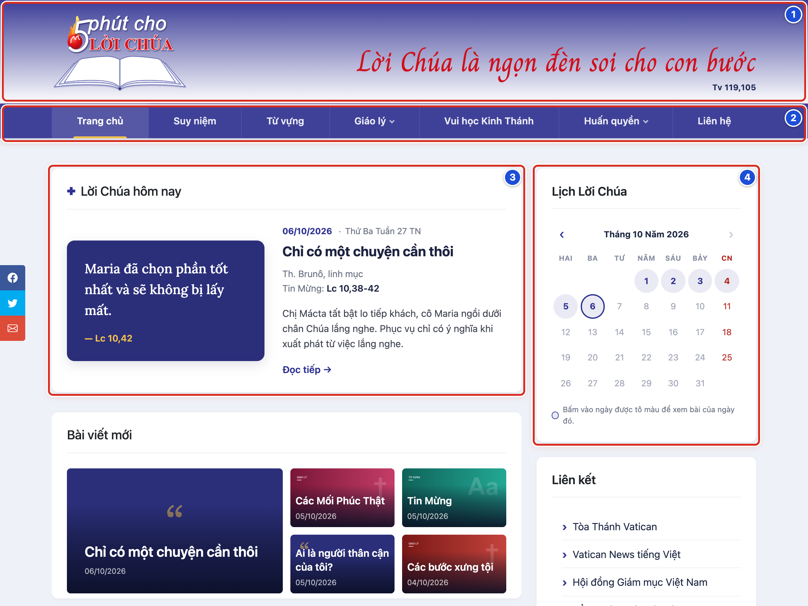
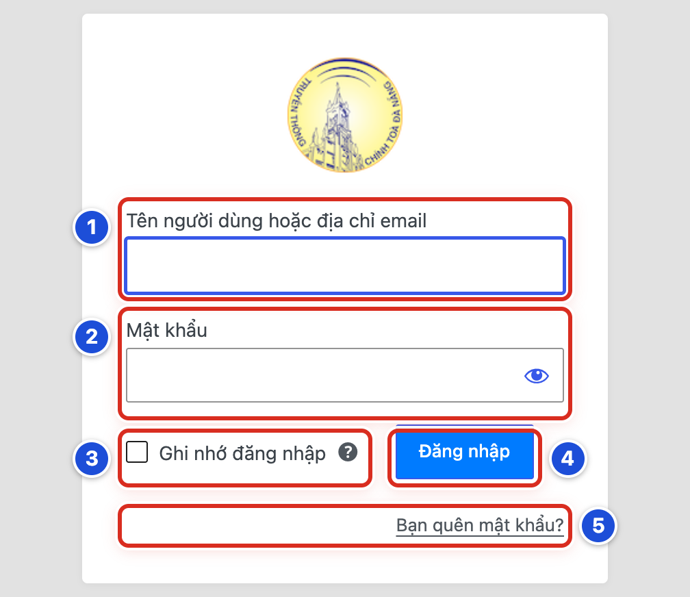
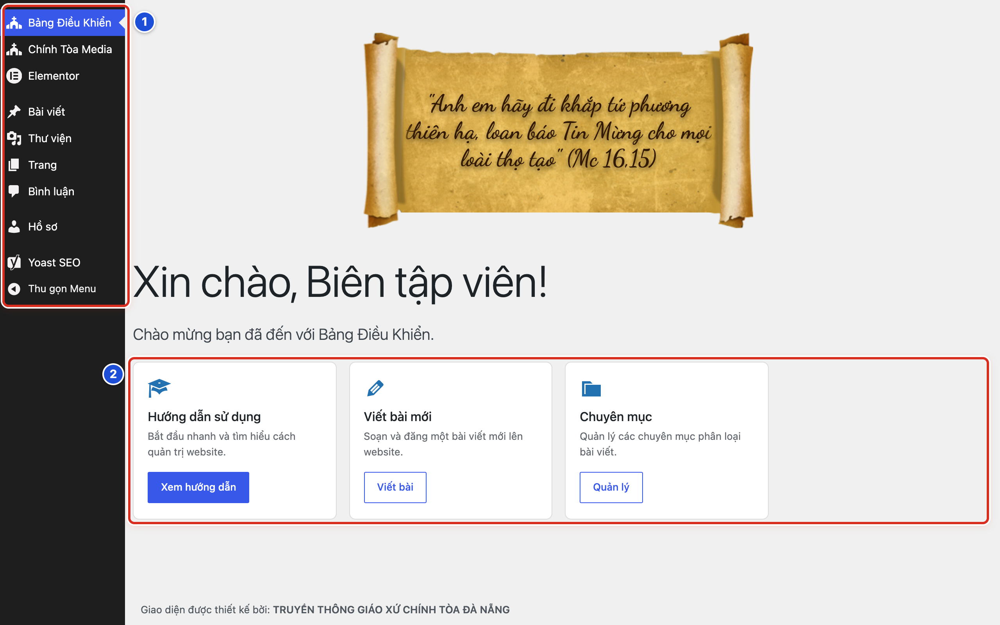
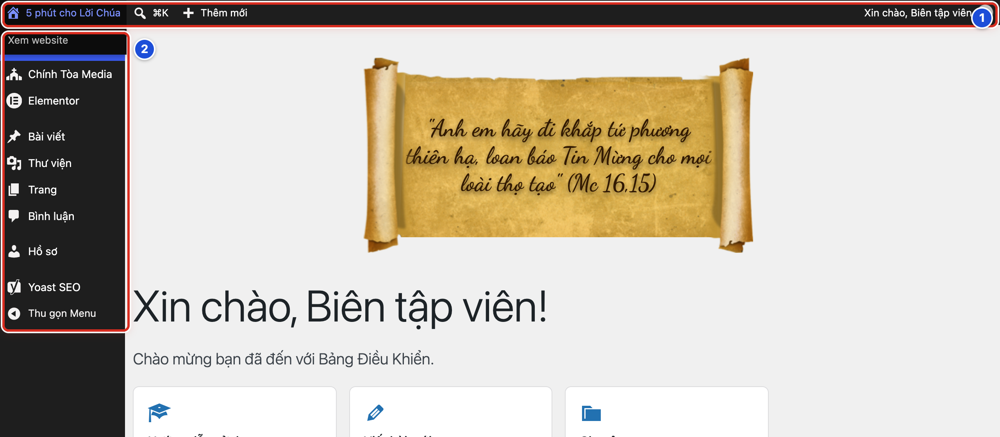
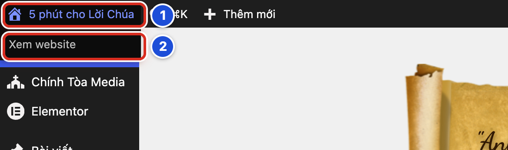

# Phần 1 Bắt đầu sử dụng

## Chương 1 Hiểu website và trang quản trị

### Bài 01.01 Website và trang quản trị khác nhau thế nào

**Nhãn:** Bắt buộc học · 🟢 An toàn

#### Mục đích

Website có hai phần. **Ngoài website** là trang mọi người đọc. **Trang quản trị** là nơi bạn đăng nhập để viết bài, đổi ảnh, sửa nội dung. Bài này giúp bạn nhận ra mình đang ở phần nào.

#### Trước khi bắt đầu

- Biết địa chỉ website của giáo xứ (ví dụ `tenwebsite.com`).
- Mở trình duyệt (Chrome, Edge, Cốc Cốc, Safari…), gõ địa chỉ website rồi bấm phím **Enter**.
- Không cần đăng nhập để xem website.

#### Các bước thực hiện

1. **Bước 1:** Nhìn phần trên cùng: đây là **Đầu trang (Header)**, có logo và câu khẩu hiệu.
2. **Bước 2:** Nhìn ngay bên dưới: đây là **thanh menu**, gồm Trang chủ, Suy niệm, Từ vựng, Giáo lý…
3. **Bước 3:** Nhìn khung lớn bên trái: đây là khối **Lời Chúa hôm nay**, hiện bài của ngày hôm nay.
4. **Bước 4:** Nhìn cột nhỏ bên phải, gọi là **thanh bên**: ở đây có **Lịch Lời Chúa** và các ô nhỏ khác.
5. **Bước 5:** Để vào trang quản trị, bấm vào thanh địa chỉ, thêm `/wp-admin` vào cuối địa chỉ website rồi bấm **Enter**.

#### Ảnh minh họa

*Hình 01.01 Trang chủ ngoài website: số 1 Đầu trang, số 2 thanh menu, số 3 khối Lời Chúa hôm nay, số 4 Lịch Lời Chúa ở thanh bên.*

#### Kết quả

Bạn sẽ thấy trang chủ giống Hình 01.01. Sau Bước 5, bạn sẽ thấy màn hình đăng nhập (Bài 01.02). Nếu đã đăng nhập từ trước, bạn sẽ thấy ngay **Bảng Điều Khiển** (Bài 01.04).

#### Lưu ý

- Mọi thay đổi đều làm ở trang quản trị. Ngoài website chỉ để xem và kiểm tra.
- Khi bạn đang đăng nhập, ngoài website có thêm một **thanh màu đen** trên cùng. Bạn đọc bình thường không thấy thanh này.
- Sửa gì trong trang quản trị cũng phải bấm nút lưu (**Lưu nháp**, **Xuất bản**, **Lưu thay đổi**…) thì website mới đổi.

#### Không nên làm

- Không gửi địa chỉ `/wp-admin` kèm tên đăng nhập và mật khẩu cho người không có nhiệm vụ.
- Không chụp màn hình trang quản trị có tên đăng nhập hay mật khẩu rồi đăng lên nhóm chat chung.

#### Nếu gặp lỗi

- Gõ `/wp-admin` mà hiện trang “không tìm thấy” → kiểm tra lại địa chỉ website: không thừa dấu cách, không gõ sai chữ, có dấu `/` trước `wp-admin`.
- Trình duyệt hiện cảnh báo “kết nối không an toàn” hoặc tự chuyển sang một địa chỉ lạ → đóng tab, không nhập mật khẩu, nhờ Quản lý gửi lại đúng địa chỉ.
- Website không mở được (trang trắng hoặc báo lỗi) → thử tải lại một lần bằng phím **F5**; vẫn lỗi thì báo người phụ trách kỹ thuật.

### Bài 01.02 Mở trang đăng nhập

**Nhãn:** Bắt buộc học · 🟢 An toàn

#### Mục đích

Mở đúng màn hình đăng nhập của website giáo xứ, để chuẩn bị vào trang quản trị.

#### Trước khi bắt đầu

- Biết địa chỉ website.
- Máy tính hoặc điện thoại đã có mạng.
- Quản lý đã cấp cho bạn tài khoản riêng (tên đăng nhập và mật khẩu).

#### Các bước thực hiện

1. **Bước 1:** Mở trình duyệt.
2. **Bước 2:** Bấm vào thanh địa chỉ ở trên cùng trình duyệt.
3. **Bước 3:** Gõ địa chỉ website rồi thêm `/wp-admin` vào cuối, ví dụ `tenwebsite.com/wp-admin`.
4. **Bước 4:** Bấm phím **Enter**.
5. **Bước 5:** Kiểm tra màn hình vừa mở có logo giáo xứ, ô **Tên người dùng hoặc địa chỉ email** (số 1) và ô **Mật khẩu** (số 2).
6. **Bước 6:** Nếu bạn dùng máy riêng, lưu trang này vào **dấu trang** (bookmark) của trình duyệt để lần sau mở nhanh.

#### Ảnh minh họa

*Hình 01.02 Màn hình đăng nhập: số 1 Tên người dùng hoặc địa chỉ email, số 2 Mật khẩu, số 3 Ghi nhớ đăng nhập, số 4 nút Đăng nhập, số 5 Bạn quên mật khẩu?.*

#### Kết quả

Bạn sẽ thấy màn hình đăng nhập giống Hình 01.02, với hai ô trống và nút xanh **Đăng nhập**.

#### Lưu ý

- Địa chỉ trên thanh trình duyệt phải đúng từng chữ. Một trang trông giống hệt nhưng địa chỉ khác có thể là trang giả mạo.
- Cách đăng nhập (gõ tên, mật khẩu) xem ở Bài 01.03.

#### Không nên làm

- Không bấm vào đường dẫn đăng nhập gửi qua tin nhắn lạ hoặc email lạ. Hãy tự gõ địa chỉ.
- Không lưu dấu trang đăng nhập trên máy dùng chung (máy văn phòng giáo xứ nhiều người dùng).

#### Nếu gặp lỗi

- Màn hình đăng nhập không có logo giáo xứ, hoặc địa chỉ trên thanh trình duyệt khác địa chỉ Quản lý đã gửi → dừng lại, không gõ mật khẩu, hỏi Quản lý.
- Trang cứ tải mãi không xong → kiểm tra mạng (mở thử một trang khác), rồi bấm **F5** để tải lại.
- Gõ `/wp-admin` nhưng trình duyệt tự mở **Bảng Điều Khiển** luôn → bạn đã đăng nhập từ trước; không cần đăng nhập lại.

### Bài 01.03 Đăng nhập an toàn

**Nhãn:** Bắt buộc học · 🟢 An toàn

#### Mục đích

Đăng nhập bằng tài khoản của chính bạn, không để lộ mật khẩu cho người khác.

#### Trước khi bắt đầu

- Đã mở màn hình đăng nhập (Bài 01.02).
- Có tên người dùng (hoặc email) và mật khẩu Quản lý cấp riêng cho bạn.

#### Các bước thực hiện

1. **Bước 1:** Bấm vào ô **Tên người dùng hoặc địa chỉ email** (số 1) và gõ tên đăng nhập hoặc email của bạn.
2. **Bước 2:** Bấm vào ô **Mật khẩu** (số 2) và gõ mật khẩu. Muốn xem lại chữ vừa gõ, bấm hình con mắt ở cuối ô.
3. **Bước 3:** Chỉ tích vào ô **Ghi nhớ đăng nhập** (số 3) khi đang dùng máy riêng của bạn. Máy dùng chung thì để trống.
4. **Bước 4:** Bấm nút **Đăng nhập** (số 4).
5. **Bước 5:** Chờ trang mới mở xong.

#### Ảnh minh họa

Xem Hình 01.02 ở Bài 01.02. Số trên ảnh trùng với số bước: số 3 là ô **Ghi nhớ đăng nhập**, số 4 là nút **Đăng nhập**. Quên mật khẩu thì bấm **Bạn quên mật khẩu?** (số 5).

#### Kết quả

Bạn sẽ thấy **Bảng Điều Khiển** với dòng chữ lớn “Xin chào, <tên của bạn>!”. Góc phải thanh đen trên cùng cũng hiện “Xin chào, <tên của bạn>”.

#### Lưu ý

- Mỗi người một tài khoản riêng. Nhờ vậy website ghi lại đúng ai đã viết, ai đã sửa bài.
- **Ghi nhớ đăng nhập** giúp lần sau không phải gõ lại. Trên máy dùng chung, người sau bạn cũng sẽ vào được tài khoản của bạn.

#### Không nên làm

- Không gửi mật khẩu qua Zalo, Messenger hay nhóm chat.
- Không mượn hoặc cho mượn tài khoản, nhất là tài khoản Quản lý.
- Không bấm “Lưu mật khẩu” khi trình duyệt hỏi trên máy dùng chung.

#### Nếu gặp lỗi

- Hiện thông báo đỏ báo sai mật khẩu → kiểm tra phím **Caps Lock** (chữ hoa) và bộ gõ tiếng Việt (Unikey, EVKey) đang tắt; gõ lại chậm rãi.
- Báo sai tên người dùng → thử gõ địa chỉ email thay cho tên, hoặc ngược lại.
- Sai nhiều lần vẫn không vào được → bấm **Bạn quên mật khẩu?** và làm theo Bài 21.04, hoặc nhờ Quản lý đặt lại mật khẩu.
- Bấm **Đăng nhập** xong lại quay về đúng màn hình đăng nhập → tải lại trang bằng **F5** rồi đăng nhập lại một lần; vẫn bị thì báo người phụ trách kỹ thuật (Bài 24.06).

### Bài 01.04 Làm quen với Bảng Điều Khiển

**Nhãn:** Bắt buộc học · 🟢 An toàn

#### Mục đích

**Bảng Điều Khiển** là màn hình đầu tiên sau khi đăng nhập. Bài này giúp bạn biết từ đây đi đến các việc thường làm.

#### Trước khi bắt đầu

Đã đăng nhập bằng tài khoản Biên tập viên (Bài 01.03).

#### Các bước thực hiện

1. **Bước 1:** Nhìn **menu bên trái** (số 1). Biên tập viên thấy: **Bảng Điều Khiển**, **Chính Tòa Media**, **Elementor**, **Bài viết**, **Thư viện**, **Trang**, **Bình luận**, **Hồ sơ**, **Yoast SEO** và **Thu gọn Menu**.
2. **Bước 2:** Nhìn **các thẻ lối tắt** ở giữa màn hình (số 2): **Hướng dẫn sử dụng**, **Viết bài mới**, **Chuyên mục**.
3. **Bước 3:** Bấm nút **Viết bài** trong thẻ **Viết bài mới** để mở ngay trang viết bài.
4. **Bước 4:** Bấm **Bảng Điều Khiển** ở đầu menu trái để quay về màn hình này.

#### Ảnh minh họa

*Hình 01.04 Bảng Điều Khiển của Biên tập viên: số 1 menu bên trái, số 2 các thẻ lối tắt.*

#### Kết quả

Bạn sẽ thấy dòng “Xin chào, <tên của bạn>!”, menu bên trái và ba thẻ lối tắt. Bạn biết bấm vào đâu để viết bài, xem hướng dẫn hoặc quản lý chuyên mục.

#### Lưu ý

- Thẻ **Hướng dẫn sử dụng** (nút **Xem hướng dẫn**) mở bản hướng dẫn tóm tắt có sẵn trong trang quản trị. Sổ tay này là bản đầy đủ.
- Thẻ **Chuyên mục** (nút **Quản lý**) mở danh sách danh mục. Danh mục và chuyên mục là một (xem Chương 7).
- Tài khoản Quản lý thấy nhiều mục và nhiều thẻ hơn. Đó là cài đặt cố ý, không phải lỗi.

#### Không nên làm

- Không bấm **Elementor** ở menu trái. Đây là công cụ dành cho người làm kỹ thuật.
- Không bấm thử các mục lạ chỉ để “xem có gì”. Chưa chắc thì hỏi Quản lý.

#### Nếu gặp lỗi

- Menu trái chỉ còn các biểu tượng, không thấy chữ → bấm **Thu gọn Menu** ở cuối menu để mở rộng lại.
- Không thấy mục **Bài viết** hoặc **Thư viện** → tài khoản có thể chưa đúng vai trò; chụp màn hình gửi Quản lý kiểm tra.
- Màn hình hiện tên người khác ở dòng “Xin chào” → bạn đang dùng nhầm tài khoản; đăng xuất (Bài 01.07) rồi đăng nhập lại bằng tài khoản của bạn.

### Bài 01.05 Nhận biết menu bên trái và thanh công cụ phía trên

**Nhãn:** Bắt buộc học · 🟢 An toàn

#### Mục đích

Trang quản trị có hai chỗ để đi lại: **thanh công cụ màu đen** ở trên cùng và **menu bên trái**. Biết hai chỗ này, bạn không bị “lạc”.

#### Trước khi bắt đầu

Đã đăng nhập và đang ở bất kỳ màn hình nào trong trang quản trị.

#### Các bước thực hiện

1. **Bước 1:** Nhìn **thanh màu đen** trên cùng (số 1). Bên trái có tên website (ví dụ “5 phút cho Lời Chúa”) và nút **+ Thêm mới**. Góc phải có “Xin chào, <tên của bạn>”.
2. **Bước 2:** Nhìn **menu bên trái** (số 2). Mỗi dòng là một khu vực làm việc.
3. **Bước 3:** Bấm **Bài viết** ở menu trái. Mục này đổi sang nền xanh và hiện các mục con bên dưới: **Tất cả bài viết**, **Thêm Bài Viết**, **Danh mục**, **Thẻ**.
4. **Bước 4:** Rê chuột (di chuột, không bấm) vào **+ Thêm mới** trên thanh đen. Một danh sách nhỏ hiện ra để tạo nhanh bài viết hoặc trang mới.
5. **Bước 5:** Rê chuột vào tên website trên thanh đen. Mục **Xem website** hiện ra (dùng ở Bài 01.06).

#### Ảnh minh họa

*Hình 01.05 Số 1 thanh công cụ màu đen phía trên, số 2 menu bên trái (đang rê chuột vào tên website nên hiện mục Xem website).*

#### Kết quả

Bạn sẽ thấy mục đang mở trong menu trái có nền xanh. Bạn biết dùng menu trái để chuyển khu vực, và dùng thanh đen để xem website, tạo nhanh nội dung hoặc đăng xuất.

#### Lưu ý

- Nhìn mục có nền xanh ở menu trái để biết mình đang ở khu vực nào.
- Biểu tượng kính lúp và chữ **⌘K** trên thanh đen là ô tìm nhanh. Bạn không cần dùng ô này.
- Thanh đen vẫn hiện khi bạn xem website lúc đang đăng nhập. Bạn đọc bình thường không thấy nó.

#### Không nên làm

- Không mở cùng một bài viết ở hai tab trình duyệt. Lần lưu sau có thể đè mất nội dung của lần lưu trước.
- Không dùng nút “quay lại” của trình duyệt khi đang viết bài chưa lưu. Hãy bấm **Lưu nháp** trước.

#### Nếu gặp lỗi

- Menu trái thu nhỏ chỉ còn biểu tượng → bấm biểu tượng mũi tên tròn ở cuối menu (**Thu gọn Menu**) để hiện lại chữ.
- Trên điện thoại không thấy menu trái → bấm nút ba gạch ở góc trái thanh đen để mở menu.
- Rê chuột vào **+ Thêm mới** nhưng danh sách không hiện → bấm thẳng vào chữ **+ Thêm mới**; trang viết bài mới sẽ mở.

### Bài 01.06 Mở website để kiểm tra thay đổi

**Nhãn:** Bắt buộc học · 🟢 An toàn

#### Mục đích

Sau khi lưu hoặc đăng bài, bạn mở website để xem bạn đọc sẽ thấy gì.

#### Trước khi bắt đầu

- Đã đăng nhập.
- Đã bấm nút lưu cho nội dung cần kiểm tra (**Xuất bản** hoặc **Lưu thay đổi**).

#### Các bước thực hiện

1. **Bước 1:** Rê chuột vào **tên website** ở góc trái thanh đen (số 1).
2. **Bước 2:** Bấm **Xem website** (số 2) trong danh sách nhỏ hiện ra.
3. **Bước 3:** Bấm phím **F5** để tải lại trang, cho chắc là bạn đang xem bản mới nhất.
4. **Bước 4:** Kiểm tra tiêu đề, ảnh, nội dung và khối trên trang chủ có bài vừa đăng.
5. **Bước 5:** Để quay lại trang quản trị, rê chuột vào tên website trên thanh đen rồi bấm **Trang quản trị**.

#### Ảnh minh họa

*Hình 01.06 Số 1 tên website trên thanh đen, số 2 mục Xem website.*

#### Kết quả

Bạn sẽ thấy trang chủ ngoài website, với thanh đen nhỏ trên cùng (chỉ bạn thấy vì đang đăng nhập).

#### Lưu ý

- Muốn mở website ở **tab mới** để vẫn giữ trang quản trị: giữ phím **Ctrl** (máy Mac: phím **Cmd**) rồi bấm **Xem website**.
- Để xem riêng một bài vừa sửa, dùng nút **Xem bài viết** trong trang viết bài (Bài 05.09).
- Muốn xem đúng như bạn đọc (không có thanh đen), mở **cửa sổ ẩn danh** của trình duyệt (Chrome: phím **Ctrl + Shift + N**) và gõ địa chỉ website.

#### Không nên làm

- Không kết luận “bài bị mất” khi chưa tải lại trang.
- Không chỉnh nội dung ngay trên trang website. Mọi thay đổi phải làm trong trang quản trị.

#### Nếu gặp lỗi

- Đã lưu nhưng website vẫn hiện nội dung cũ → bấm **F5**; vẫn cũ thì mở bằng cửa sổ ẩn danh. Vẫn chưa đổi, xem Bài 23.01.
- Bấm **Xem website** nhưng trang quản trị biến mất → website đã mở trong cùng tab; làm Bước 5 để quay lại.
- Trên trang chủ không thấy bài mới → kiểm tra bài đã xuất bản chưa và có đúng danh mục không (Bài 05.03).

### Bài 01.07 Đăng xuất khi làm xong

**Nhãn:** Bắt buộc học · 🟢 An toàn

#### Mục đích

Kết thúc phiên làm việc, để người khác dùng máy sau bạn không vào được tài khoản của bạn.

#### Trước khi bắt đầu

Đã lưu xong mọi bài đang viết (bấm **Lưu nháp** hoặc **Lưu thay đổi**).

#### Các bước thực hiện

1. **Bước 1:** Rê chuột vào dòng “Xin chào, <tên của bạn>” ở góc phải thanh đen (số 1).
2. **Bước 2:** Bấm **Đăng xuất** (số 2) ở cuối danh sách hiện ra.
3. **Bước 3:** Chờ màn hình đăng nhập hiện lại.
4. **Bước 4:** Nếu là máy dùng chung, đóng luôn cửa sổ trình duyệt.

#### Ảnh minh họa

*Hình 01.07 Số 1 dòng “Xin chào, …” ở góc phải thanh đen, số 2 mục Đăng xuất.*

#### Kết quả

Bạn sẽ thấy màn hình đăng nhập với dòng thông báo **Bạn đã đăng xuất thành công.**

#### Lưu ý

- Chỉ đóng trình duyệt chưa chắc đã đăng xuất. Nhiều trình duyệt mở lại là vẫn còn đăng nhập.
- Trên máy riêng có khóa màn hình, bạn có thể không đăng xuất mỗi ngày. Trên máy dùng chung, luôn đăng xuất.

#### Không nên làm

- Không rời máy dùng chung khi trang quản trị còn mở.
- Không đăng xuất khi bài đang viết dở chưa lưu. Bấm **Lưu nháp** trước.

#### Nếu gặp lỗi

- Rê chuột vào “Xin chào…” nhưng danh sách không hiện → bấm thẳng vào chữ “Xin chào…”, rồi tìm **Đăng xuất**.
- Đã đăng xuất nhưng mở lại website vẫn thấy thanh đen → bấm **F5** để tải lại; vẫn còn thì báo người phụ trách kỹ thuật.
- Trên điện thoại không thấy chữ “Xin chào” → bấm hình đại diện tròn ở góc phải thanh đen để mở danh sách có **Đăng xuất**.
