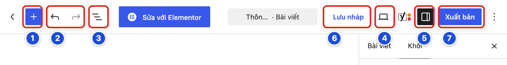
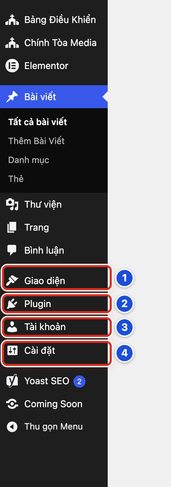

# Phần 1 Bắt đầu sử dụng

## Chương 2 Làm việc an toàn

### Bài 02.01 Phân biệt Lưu nháp, Xem và Xuất bản

**Nhãn:** Bắt buộc học · 🟢 An toàn

#### Mục đích

Ba nút **Lưu nháp**, **Xem** và **Xuất bản** nằm cạnh nhau nhưng làm ba việc rất khác. Hiểu rõ chúng giúp bạn không lỡ tay đăng bài chưa xong.

#### Trước khi bắt đầu

Mở một bài chưa đăng: vào **Bài viết → Thêm Bài Viết**, gõ thử một tiêu đề. Đây là **bản nháp** của bạn, chưa ai thấy.

#### Các bước thực hiện

1. **Bước 1:** Bấm **Lưu nháp** (số 6). Bài được lưu lại nhưng **chưa** hiện ra ngoài website.
2. **Bước 2:** Bấm **Xem** (hình màn hình, số 4) rồi chọn **Xem trước ở tab mới**. Một tab mới mở ra cho bạn xem thử bài. Chỉ bạn xem được bản này.
3. **Bước 3:** Đóng tab xem thử để quay về trang viết bài.
4. **Bước 4:** Chỉ bấm nút xanh **Xuất bản** (số 7) khi bài đã xong và được phép đăng. Bảng **Bạn sẵn sàng xuất bản chưa?** hiện ra ở bên phải.
5. **Bước 5:** Khi đang tập, bấm **Hủy** trong bảng đó. Bài vẫn là bản nháp. Khi đăng thật, bấm **Xuất bản** lần thứ hai (xem Bài 05.08).

#### Ảnh minh họa

*Hình 02.01 Ba nút cần phân biệt trên thanh công cụ: số 6 Lưu nháp, số 4 Xem, số 7 Xuất bản.*

#### Kết quả

Bạn sẽ thấy bài trong danh sách **Bài viết** có chữ “— Bản nháp” cạnh tên. Bạn phân biệt được:

| Nút | Bạn đọc thấy bài không? | Dùng khi |
|---|---|---|
| **Lưu nháp** | Không | Đang viết, muốn giữ lại |
| **Xem** | Không (chỉ bạn xem) | Muốn xem thử bài trông thế nào |
| **Xuất bản** | Có, sau khi bấm lần 2 | Bài đã xong, được phép đăng |

#### Lưu ý

- Bài **đã đăng** thì nút **Lưu nháp** biến mất, nút xanh đổi thành **Lưu thay đổi**. Bấm **Lưu thay đổi** là website đổi ngay (Bài 05.09).
- Nếu bạn chọn một ngày giờ trong tương lai, nút xanh đổi thành **Lên lịch** (Bài 05.10).
- WordPress có tự động lưu, nhưng bạn vẫn nên bấm **Lưu nháp** thường xuyên.

#### Không nên làm

- Không dùng **Xuất bản** như một nút “lưu”. Bấm **Xuất bản** lần 2 là bài lên website ngay.
- Không bấm nút xanh **Sửa với Elementor** ở giữa thanh công cụ.

#### Nếu gặp lỗi

- Không thấy nút **Lưu nháp** → bài này đã được đăng hoặc đã hẹn giờ. Xem dòng **Trạng thái** ở cột phải trước khi sửa tiếp.
- Lỡ bấm **Xuất bản** và bảng xác nhận đang mở → bấm **Hủy**; bài chưa được đăng.
- Lỡ đăng bài chưa xong → báo ngay Quản lý; đừng tự xóa bài. Có thể sửa rồi bấm **Lưu thay đổi**.

### Bài 02.02 Những khu vực Biên tập viên có thể sử dụng

**Nhãn:** Bắt buộc học · 🟢 An toàn

#### Mục đích

Biết rõ những khu vực Biên tập viên được dùng hằng ngày, để làm việc tự tin và đúng phạm vi.

#### Trước khi bắt đầu

Đăng nhập bằng tài khoản Biên tập viên của bạn. Nhìn menu bên trái.

#### Các bước thực hiện

1. **Bước 1:** Dùng **Bài viết** để viết, sửa, đăng bài và sắp bài vào danh mục (Chương 3 đến Chương 6).
2. **Bước 2:** Dùng **Bài viết → Danh mục** để xem và thêm danh mục khi đã thống nhất với Quản lý (Chương 7).
3. **Bước 3:** Dùng **Thư viện** để tải ảnh lên và sửa thông tin ảnh (Chương 10).
4. **Bước 4:** Dùng **Trang** để sửa các trang như **Liên hệ**. Cẩn thận với trang **Trang chủ** (Chương 11).
5. **Bước 5:** Dùng **Hồ sơ** để sửa tên hiển thị và đổi mật khẩu của chính bạn (Chương 21).
6. **Bước 6:** Dùng **Chính Tòa Media** để mở trang **Hướng dẫn sử dụng** tóm tắt khi cần tra nhanh.

#### Ảnh minh họa

Bài này không cần ảnh minh họa. Các mục trên đều nằm trong menu bên trái, xem Hình 01.04, số 1.

#### Kết quả

Bạn sẽ biết mỗi việc thường làm nằm ở mục nào trong menu trái, và tự làm được mà không cần hỏi.

#### Lưu ý

- Biên tập viên sửa được bài của **mọi người**, không chỉ bài của mình. Hãy chỉ sửa bài được giao.
- **Bình luận** là nơi xem bình luận của bạn đọc. Chỉ duyệt hoặc xóa bình luận khi giáo xứ đã giao việc này cho bạn.
- **Yoast SEO** có ở menu trái nhưng không bắt buộc dùng (xem Phụ lục B).

#### Không nên làm

- Không bấm **Elementor** ở menu trái và nút **Sửa với Elementor** trong trang viết bài (xem Phụ lục C).
- Không thử xóa bài thật để “xem có được không”. Muốn tập, hãy dùng bản nháp của chính bạn.

#### Nếu gặp lỗi

- Không thấy một mục nêu trong bài này → chụp màn hình menu trái gửi Quản lý kiểm tra vai trò tài khoản.
- Mở một mục thì hiện thông báo “không có quyền” → đó là khu vực dành cho Quản lý; quay lại **Bảng Điều Khiển** (Bài 02.03).
- Thấy bài của người khác đang mở dở hoặc có khóa → không sửa; hỏi người viết bài đó trước.

### Bài 02.03 Những khu vực cần hỏi Quản lý trước khi thay đổi

**Nhãn:** Bắt buộc học · 🟡 Cẩn thận

#### Mục đích

Một số khu vực ảnh hưởng đến **toàn bộ website**: màu sắc, đầu trang, menu, trang chủ, tài khoản. Bài này giúp bạn nhận ra chúng và biết phải hỏi Quản lý.

#### Trước khi bắt đầu

Chỉ cần đọc. Tài khoản Biên tập viên **không thấy** các mục này trong menu trái. Hình 02.03 chụp từ tài khoản Quản lý để bạn nhận biết.

#### Các bước thực hiện

1. **Bước 1:** Nhận biết mục **Giao diện** (số 1): nơi chỉnh menu, widget (ô nhỏ ở thanh bên) và giao diện website.
2. **Bước 2:** Nhận biết mục **Plugin** (số 2): nơi cài và bật tắt các phần mở rộng của website.
3. **Bước 3:** Nhận biết mục **Tài khoản** (số 3): nơi tạo tài khoản và đổi vai trò người dùng.
4. **Bước 4:** Nhận biết mục **Cài đặt** (số 4): nơi đặt tên website, múi giờ, trang chủ, đường dẫn.
5. **Bước 5:** Khi cần đổi gì thuộc các khu vực trên, hoặc trong **Chính Tòa Media → Thiết lập giao diện**, hãy nhắn Quản lý: cần đổi gì, ở đâu, vì sao.

#### Ảnh minh họa

*Hình 02.03 Menu trái của tài khoản Quản lý: số 1 Giao diện, số 2 Plugin, số 3 Tài khoản, số 4 Cài đặt — các khu vực Biên tập viên không thấy.*

#### Kết quả

Bạn sẽ nhận ra các khu vực dành cho Quản lý. Khi cần thay đổi ở đó, bạn gửi yêu cầu rõ ràng thay vì tự làm.

#### Lưu ý

- Nếu bạn được giao thêm tài khoản Quản lý, mỗi lần chỉ đổi **một** thứ. Trước khi đổi, chụp màn hình giá trị cũ (Bài 13.03).
- Đổi **Trang chủ**, menu hoặc màu sắc có thể làm mọi bạn đọc thấy khác ngay lập tức.

#### Không nên làm

- Không xin mật khẩu Quản lý của người khác để “làm nhanh cho xong”.
- Không đề nghị nâng tài khoản của mình lên Quản lý chỉ để mở một mục bị chặn.

#### Nếu gặp lỗi

- Bấm một lối tắt mà hiện thông báo “không có quyền” → quay lại **Bảng Điều Khiển**; gửi Quản lý nội dung thông báo và việc bạn đang cần làm.
- Thấy menu trái của mình có **Giao diện** hoặc **Cài đặt** → bạn đang dùng tài khoản Quản lý; kiểm tra lại dòng “Xin chào” và hỏi Quản lý trước khi làm tiếp.
- Đã lỡ đổi một thiết lập chung → dừng lại, ghi ra đã đổi gì, lúc nào, rồi báo Quản lý ngay.

### Bài 02.04 Những khu vực không tự thay đổi

**Nhãn:** Bắt buộc học · 🔴 Không tự thay đổi

#### Mục đích

Có những thao tác có thể làm website ngừng chạy hoặc mất dữ liệu. Bài này liệt kê để bạn **dừng lại đúng lúc**.

#### Trước khi bắt đầu

Không có bài thực hành. Chỉ đọc để nhận biết “vùng đỏ”.

#### Các bước thực hiện

1. **Bước 1:** Dừng lại nếu thấy mình sắp cài, xóa hoặc cập nhật **Plugin** hay giao diện (Hình 02.03, số 2).
2. **Bước 2:** Dừng lại nếu thấy chữ **Sửa tệp tin giao diện** hoặc **Sửa tệp tin Plugin**. Đây là nơi sửa mã của website.
3. **Bước 3:** Dừng lại nếu đang ở **Cài đặt** và định đổi **Cấu trúc đường dẫn** (Hình 02.03, số 4).
4. **Bước 4:** Dừng lại nếu định đổi vai trò hoặc xóa một tài khoản trong **Tài khoản** (Hình 02.03, số 3).
5. **Bước 5:** Dừng lại nếu định bấm **Xóa vĩnh viễn** hoặc **Dọn sạch thùng rác** (Bài 06.05).
6. **Bước 6:** Gửi yêu cầu cho Quản lý hoặc người phụ trách kỹ thuật, kèm ảnh chụp màn hình.

#### Ảnh minh họa

Xem Hình 02.03 ở Bài 02.03: số 2 **Plugin**, số 3 **Tài khoản**, số 4 **Cài đặt** đều thuộc vùng đỏ khi chưa có kế hoạch.

#### Kết quả

Bạn sẽ biết những chỗ phải dừng tay, và chuyển việc cho đúng người.

#### Lưu ý

- Có những nút bấm được nhưng vẫn không an toàn để tự thử, nhất là khi dùng tài khoản Quản lý.
- Trong **Chính Tòa Media → Thiết lập giao diện**, tab **Nâng cao** chứa mã kỹ thuật của website. Xóa nhầm là vỡ giao diện (Bài 16.05).

#### Không nên làm

- Không chép mã từ Internet dán vào website.
- Không làm theo hướng dẫn “sửa lỗi” gửi qua tin nhắn lạ.
- Không tự khôi phục bản sao lưu để “thử xem có hết lỗi không”.

#### Nếu gặp lỗi

- Lỡ bấm vào một khu vực đỏ nhưng chưa lưu gì → bấm **Bảng Điều Khiển** ở menu trái để rời đi; không bấm nút lưu nào.
- Lỡ đổi hoặc xóa gì đó ở khu vực đỏ → không bấm thêm; chụp màn hình, ghi giờ và thao tác cuối cùng, báo kỹ thuật ngay (Bài 24.07).
- Website hiện trang trắng hoặc báo lỗi sau một thay đổi → không thử sửa tiếp; báo người phụ trách kỹ thuật kèm thời điểm xảy ra.
