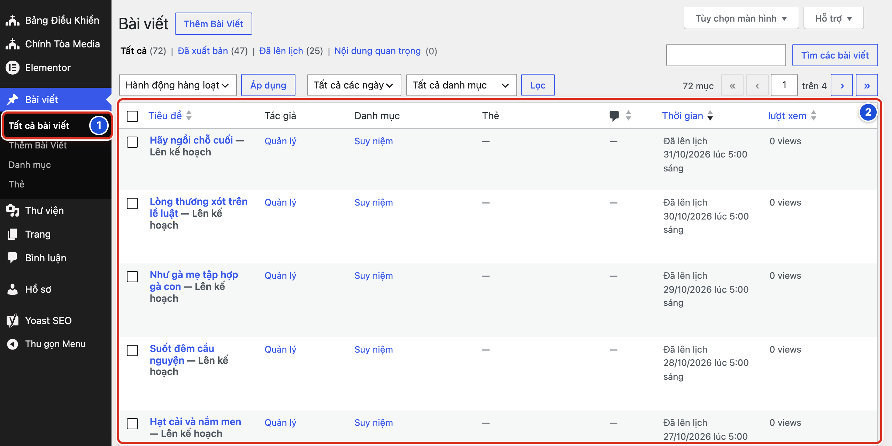
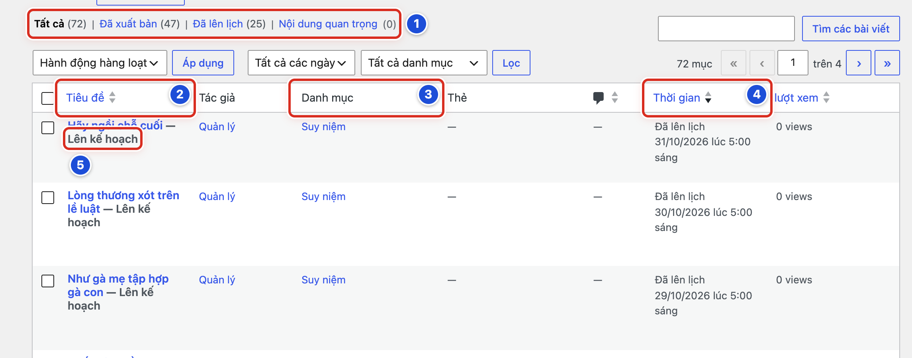
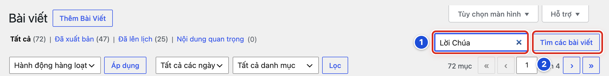
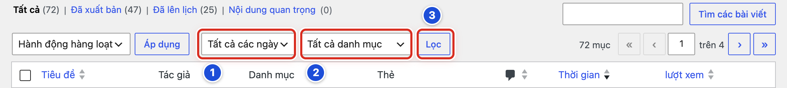
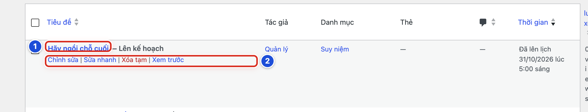

# Phần 2 Quản lý bài viết

## Chương 3 Tìm và kiểm tra bài viết

### Bài 03.01 Mở danh sách bài viết

**Nhãn:** Bắt buộc học · 🟢 An toàn

#### Mục đích

Mở nơi chứa **tất cả bài viết** của website. Từ đây bạn tìm, mở, sửa hoặc xóa bài.

#### Trước khi bắt đầu

Đã đăng nhập bằng tài khoản Biên tập viên.

#### Các bước thực hiện

1. **Bước 1:** Ở menu bên trái, bấm **Bài viết**, rồi bấm **Tất cả bài viết** (số 1).
2. **Bước 2:** Nhìn bảng danh sách bài (số 2). Mỗi hàng là một bài.
3. **Bước 3:** Bấm nút **›** ở góc phải trên bảng để xem trang tiếp theo.

#### Ảnh minh họa

*Hình 03.01 Số 1 mục Tất cả bài viết ở menu trái, số 2 bảng danh sách bài.*

#### Kết quả

Bạn sẽ thấy trang có tiêu đề **Bài viết**, nút **Thêm Bài Viết** bên cạnh, và bảng liệt kê các bài. Bài mới nhất hoặc hẹn giờ xa nhất nằm trên cùng.

#### Lưu ý

- Danh sách gồm bài của mọi người và mọi trạng thái: đã đăng, hẹn giờ, bản nháp.
- Góc phải trên bảng ghi tổng số bài (ví dụ “72 mục”) và số trang (ví dụ “1 trên 4”).
- Mở danh sách chỉ để xem, không làm thay đổi gì.

#### Không nên làm

- Không tích vào các ô vuông đầu hàng khi chỉ muốn mở một bài. Các ô này dùng cho thao tác hàng loạt.
- Không dùng ô **Hành động hàng loạt** khi chưa được hướng dẫn.

#### Nếu gặp lỗi

- Danh sách trống hoặc ít bài hơn bình thường → bấm chữ **Tất cả** ở dòng trên bảng để bỏ bộ lọc.
- Đang ở trang 2, 3… mà muốn về đầu → bấm nút **«** ở góc phải trên bảng.
- Không thấy **Tất cả bài viết** ở menu trái → bấm vào chữ **Bài viết** để mở các mục con.

### Bài 03.02 Hiểu các cột và trạng thái trong danh sách

**Nhãn:** Bắt buộc học · 🟢 An toàn

#### Mục đích

Đọc đúng thông tin của từng bài (đã đăng chưa, thuộc danh mục nào, ngày nào) trước khi mở, sửa hay xóa.

#### Trước khi bắt đầu

Đang ở danh sách **Bài viết** (Bài 03.01).

#### Các bước thực hiện

1. **Bước 1:** Nhìn dòng lọc trạng thái trên bảng (số 1): **Tất cả**, **Đã xuất bản**, **Đã lên lịch**… Số trong ngoặc là số bài. Bấm một chữ để chỉ xem bài ở trạng thái đó.
2. **Bước 2:** Đọc cột **Tiêu đề** (số 2): tên bài, màu xanh, bấm vào để mở bài.
3. **Bước 3:** Đọc cột **Danh mục** (số 3): bài thuộc danh mục nào, ví dụ **Suy niệm**.
4. **Bước 4:** Đọc cột **Thời gian** (số 4): dòng trên cho biết trạng thái, dòng dưới là ngày giờ.
5. **Bước 5:** Để ý chữ nhỏ ngay sau tên bài (số 5). “— Lên kế hoạch” nghĩa là bài đã hẹn giờ, chưa hiện trên website.

#### Ảnh minh họa

*Hình 03.02 Số 1 dòng lọc trạng thái, số 2 cột Tiêu đề, số 3 cột Danh mục, số 4 cột Thời gian, số 5 nhãn “Lên kế hoạch”.*

#### Kết quả

Bạn sẽ đọc được trạng thái của từng bài. Ví dụ: bài *Hãy ngồi chỗ cuối* có “— Lên kế hoạch”, cột **Thời gian** ghi “Đã lên lịch 31/10/2026 lúc 5:00 sáng”.

| Bạn thấy | Nghĩa là |
|---|---|
| Đã xuất bản | Bài đang hiện trên website |
| Đã lên lịch / — Lên kế hoạch | Bài sẽ tự đăng vào giờ hẹn |
| — Bản nháp / Lần sửa gần nhất | Bài đang viết, chưa ai thấy |

#### Lưu ý

- Các cột khác: **Tác giả** (người viết), **Thẻ**, hình bong bóng (số bình luận), **lượt xem** (ví dụ “0 views”).
- **Nội dung quan trọng** ở dòng lọc do Yoast SEO thêm vào. Bạn không cần dùng.
- Bấm vào chữ **Tiêu đề** hoặc **Thời gian** ở đầu cột để sắp xếp lại danh sách.
- Dòng lọc có thêm **Bản nháp** khi có bài nháp, và **Thùng rác** khi có bài bị xóa tạm.

#### Không nên làm

- Không chỉ dựa vào tên bài khi có hai bài trùng tên. Xem thêm cột **Thời gian** và **Danh mục**.
- Không sửa bài “— Lên kế hoạch” của người khác khi chưa hỏi. Đó thường là bài Lời Chúa đã chuẩn bị sẵn.

#### Nếu gặp lỗi

- Thiếu một cột (ví dụ không thấy **Danh mục**) → bấm **Tùy chọn màn hình** ở góc phải trên, tích lại ô của cột đó.
- Bấm **Đã lên lịch** rồi không thấy bài đã đăng → đó là bộ lọc; bấm **Tất cả** để xem lại toàn bộ.
- Thời gian bài hẹn giờ có vẻ sai giờ → mở bài và kiểm tra mục **Xuất bản** ở cột phải (Bài 05.10).

### Bài 03.03 Tìm kiếm bài viết theo tên

**Nhãn:** Bắt buộc học · 🟢 An toàn

#### Mục đích

Tìm nhanh một bài trong danh sách dài, thay vì lật từng trang.

#### Trước khi bắt đầu

- Đang ở danh sách **Bài viết**.
- Nhớ vài chữ có trong tên bài hoặc trong nội dung bài.

#### Các bước thực hiện

1. **Bước 1:** Bấm vào ô tìm kiếm ở góc phải trên bảng (số 1) và gõ vài chữ, ví dụ “Lời Chúa”.
2. **Bước 2:** Bấm nút **Tìm các bài viết** (số 2), hoặc bấm phím **Enter**.
3. **Bước 3:** Đọc kết quả. Kiểm tra đúng bài bằng cột **Danh mục** và **Thời gian**.
4. **Bước 4:** Tìm xong, bấm dấu **×** trong ô tìm kiếm để xóa chữ, rồi bấm **Tìm các bài viết** để xem lại toàn bộ.

#### Ảnh minh họa

*Hình 03.03 Số 1 ô tìm kiếm (đã gõ “Lời Chúa”), số 2 nút Tìm các bài viết.*

#### Kết quả

Bạn sẽ thấy dòng **Kết quả tìm kiếm cho:** kèm chữ bạn đã gõ, và bảng chỉ còn các bài có chữ đó.

#### Lưu ý

- Gõ 2–3 chữ đặc trưng thường dễ ra kết quả hơn gõ nguyên cả tên bài.
- Website tìm cả trong tên bài và trong nội dung bài, nên có thể ra thêm bài không đúng ý.
- Gõ tiếng Việt có dấu cho đúng chính tả.

#### Không nên làm

- Không viết bài mới chỉ vì tìm chưa ra bài cũ. Thử tìm lại với chữ khác trước.
- Không tìm khi đang lọc theo **Đã lên lịch** hoặc một danh mục, trừ khi bạn cố ý.

#### Nếu gặp lỗi

- Không ra kết quả nào → thử chữ ngắn hơn, kiểm tra dấu tiếng Việt, và bỏ các bộ lọc tháng, danh mục đang chọn.
- Ra quá nhiều bài → thêm một chữ nữa cho cụ thể, hoặc kết hợp lọc theo danh mục (Bài 03.04).
- Bài đã chuyển vào Thùng rác sẽ không hiện khi tìm ở **Tất cả** → bấm **Thùng rác** ở dòng lọc rồi tìm lại (Bài 06.03).

### Bài 03.04 Lọc bài viết theo tháng và danh mục

**Nhãn:** Nên biết · 🟢 An toàn

#### Mục đích

Thu hẹp danh sách, ví dụ chỉ xem các bài **Suy niệm** của tháng 10, để rà soát hoặc tìm bài nhanh.

#### Trước khi bắt đầu

Đang ở danh sách **Bài viết**. Biết tháng và danh mục cần xem.

#### Các bước thực hiện

1. **Bước 1:** Bấm ô **Tất cả các ngày** (số 1) và chọn tháng cần xem, ví dụ tháng 10 năm 2026.
2. **Bước 2:** Bấm ô **Tất cả danh mục** (số 2) và chọn danh mục, ví dụ **Suy niệm**.
3. **Bước 3:** Bấm nút **Lọc** (số 3).
4. **Bước 4:** Xem xong, chọn lại **Tất cả các ngày** và **Tất cả danh mục**, rồi bấm **Lọc** lần nữa.

#### Ảnh minh họa

*Hình 03.04 Số 1 ô Tất cả các ngày, số 2 ô Tất cả danh mục, số 3 nút Lọc.*

#### Kết quả

Bạn sẽ thấy bảng chỉ còn các bài thuộc tháng và danh mục đã chọn. Số “… mục” ở góc phải giảm xuống.

#### Lưu ý

- Có thể chỉ lọc theo tháng, hoặc chỉ theo danh mục. Ô nào không cần thì để nguyên.
- Lọc và tìm kiếm có thể dùng cùng lúc. Kết quả sẽ hẹp hơn.
- Bài hẹn giờ cũng được tính theo tháng của ngày hẹn.

#### Không nên làm

- Không kết luận “bài bị mất” khi bộ lọc vẫn đang chọn một tháng hay một danh mục.
- Không nhầm nút **Lọc** với nút **Áp dụng** bên trái. **Áp dụng** dùng cho thao tác hàng loạt.

#### Nếu gặp lỗi

- Bấm **Lọc** mà bảng trống → tháng đó không có bài thuộc danh mục đã chọn; đổi lại một trong hai ô.
- Chọn xong nhưng danh sách không đổi → bạn chưa bấm **Lọc**; bấm nút **Lọc** (số 3).
- Lỡ bấm **Áp dụng** thay vì **Lọc** → nếu ô **Hành động hàng loạt** chưa chọn gì và chưa tích bài nào thì không có gì thay đổi; bấm **Lọc** lại.

### Bài 03.05 Mở một bài viết để chỉnh sửa

**Nhãn:** Bắt buộc học · 🟢 An toàn

#### Mục đích

Mở đúng bài cần sửa trong trang viết bài, mà chưa thay đổi gì.

#### Trước khi bắt đầu

Đã tìm thấy bài trong danh sách (Bài 03.03 hoặc Bài 03.04).

#### Các bước thực hiện

1. **Bước 1:** Rê chuột vào tên bài (số 1).
2. **Bước 2:** Một dòng chữ nhỏ hiện ngay dưới tên bài (số 2): **Chỉnh sửa | Sửa nhanh | Xóa tạm | Xem**. Bấm **Chỉnh sửa**. Cũng có thể bấm thẳng vào tên bài.
3. **Bước 3:** Chờ trang viết bài mở xong. Kiểm tra tên bài ở giữa thanh trên cùng có đúng bài cần sửa.
4. **Bước 4:** Mở cột phải (nút **Cài đặt**, Bài 04.09) và xem dòng **Trạng thái** trước khi sửa.

#### Ảnh minh họa

*Hình 03.05 Số 1 tên bài (bấm để mở), số 2 dòng thao tác Chỉnh sửa | Sửa nhanh | Xóa tạm | Xem trước.*

#### Kết quả

Bạn sẽ thấy trang viết bài với tên và nội dung của bài đã chọn. Chưa có gì bị thay đổi cho đến khi bạn bấm nút lưu.

#### Lưu ý

- Bài đã đăng có chữ **Xem** ở cuối dòng thao tác. Bài chưa đăng (nháp, hẹn giờ) có chữ **Xem trước**.
- Bài đã đăng: sửa xong bấm **Lưu thay đổi** là website đổi ngay (Bài 05.09).
- **Sửa nhanh** chỉ sửa tên, danh mục, trạng thái… không sửa được nội dung (Bài 06.01).

#### Không nên làm

- Không bấm **Xóa tạm** (chữ đỏ) khi chỉ muốn mở bài.
- Không mở cùng một bài ở hai tab trình duyệt.

#### Nếu gặp lỗi

- Rê chuột mà không thấy dòng thao tác → rê đúng vào tên bài màu xanh; trên điện thoại, bấm thẳng vào tên bài để mở.
- Mở bài thì WordPress báo có người khác đang sửa bài này → bấm quay lại danh sách; hỏi người đó trước khi tiếp quản, để không ghi đè lên nhau.
- Lỡ bấm **Xóa tạm** → ngay trên đầu danh sách có liên kết **Hoàn tác**; bấm vào để lấy lại bài (Bài 06.02).
