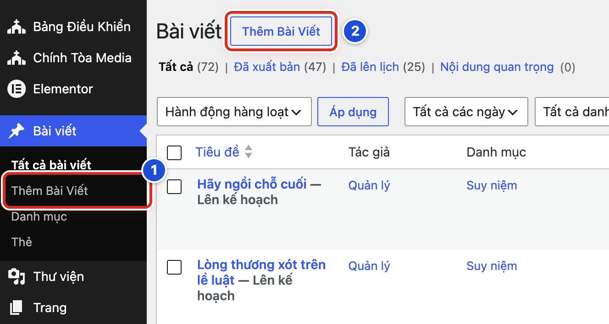
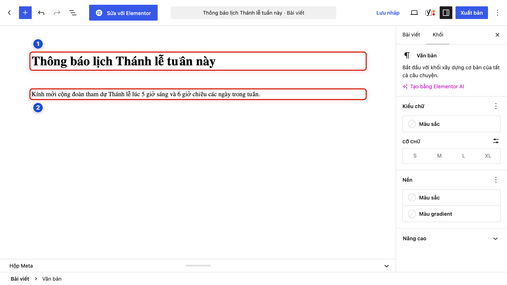
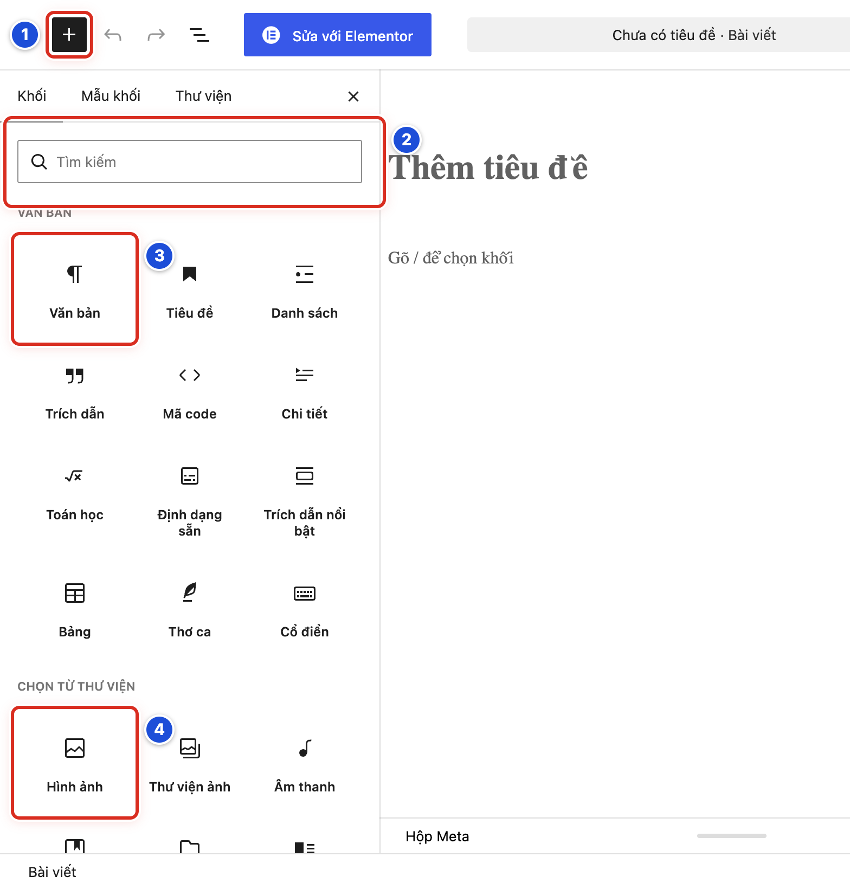
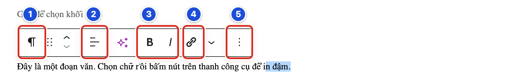
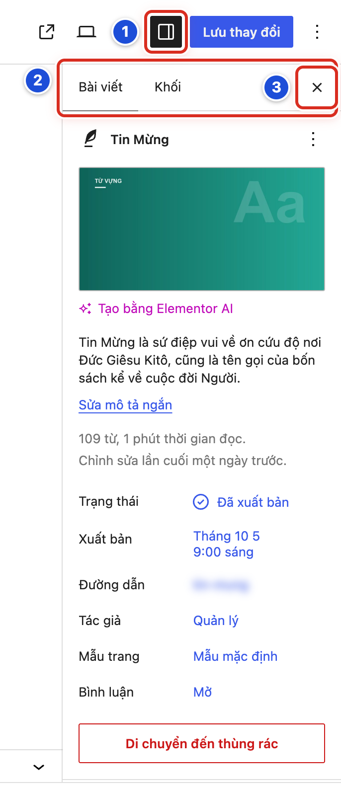

# Phần 2 Quản lý bài viết

## Chương 4 Soạn nội dung bằng Gutenberg

### Bài 04.01 Tạo một bài viết mới và lưu bản nháp

**Nhãn:** Bắt buộc học · 🟢 An toàn

#### Mục đích

Mở trang viết bài mới và lưu lại thành **bản nháp** (bài đang viết, chưa ai thấy). Trang viết bài này có tên là **Gutenberg**, trình soạn bài của WordPress.

#### Trước khi bắt đầu

- Đã đăng nhập bằng tài khoản Biên tập viên.
- Nghĩ sẵn một tên bài, ví dụ “Thông báo lịch Thánh lễ tuần này”.

#### Các bước thực hiện

1. **Bước 1:** Ở menu bên trái, bấm **Bài viết → Thêm Bài Viết** (số 1). Nếu đang ở danh sách bài viết, bạn cũng có thể bấm nút **Thêm Bài Viết** cạnh chữ **Bài viết** (số 2).
2. **Bước 2:** Nếu hiện hộp **Chào mừng bạn đến với trình chỉnh sửa**, bấm dấu **×** ở góc hộp để đóng.
3. **Bước 3:** Bấm vào dòng chữ mờ **Thêm tiêu đề** và gõ tên bài.
4. **Bước 4:** Bấm **Lưu nháp** ở góc phải trên cùng.
5. **Bước 5:** Chờ chữ **Lưu nháp** đổi thành **Đã lưu** trong giây lát.

#### Ảnh minh họa

*Hình 04.01 Hai cách mở trang viết bài: số 1 mục Thêm Bài Viết ở menu trái, số 2 nút Thêm Bài Viết ở đầu danh sách.*

#### Kết quả

Bạn sẽ thấy trang viết bài với tên bài vừa gõ. Mở lại **Bài viết → Tất cả bài viết**, bạn sẽ thấy bài nằm trên đầu danh sách với chữ “— Bản nháp”.

#### Lưu ý

- Bản nháp không hiện ra ngoài website. Bạn có thể tập viết thoải mái bằng bản nháp của mình.
- WordPress có tự động lưu, nhưng bạn vẫn nên bấm **Lưu nháp** sau mỗi đoạn quan trọng.
- Thẻ **Viết bài mới** trên **Bảng Điều Khiển** (nút **Viết bài**) cũng mở đúng trang này.

#### Không nên làm

- Không bấm **Xuất bản** để “lưu tạm”. Bấm hai lần là bài lên website.
- Không bấm nút xanh **Sửa với Elementor** ở thanh trên.

#### Nếu gặp lỗi

- Bấm **Lưu nháp** mà chữ quay mãi hoặc báo mất kết nối → chép (Ctrl + C) phần đang viết sang Notepad hoặc Word, kiểm tra mạng, rồi tải lại trang.
- Rời trang thì trình duyệt hỏi có muốn rời đi không → chọn ở lại trang, rồi bấm **Lưu nháp** trước khi đi.
- Không thấy nút **Lưu nháp** → bạn đang mở một bài đã đăng chứ không phải bài mới; làm lại Bước 1.

### Bài 04.02 Nhập tiêu đề và nội dung

**Nhãn:** Bắt buộc học · 🟢 An toàn

#### Mục đích

Gõ tên bài và nội dung bài vào đúng chỗ.

#### Trước khi bắt đầu

Đang mở một bản nháp trong trang viết bài (Bài 04.01).

#### Các bước thực hiện

1. **Bước 1:** Bấm vào dòng chữ mờ **Thêm tiêu đề** và gõ tên bài (số 1). Tên bài nên ngắn, nói đúng nội dung.
2. **Bước 2:** Bấm phím **Enter** để xuống phần nội dung, rồi gõ đoạn đầu tiên (số 2).
3. **Bước 3:** Gõ hết một đoạn thì bấm **Enter** để sang đoạn mới.
4. **Bước 4:** Bấm **Lưu nháp** sau khi viết xong mỗi phần.

#### Ảnh minh họa

*Hình 04.02 Số 1 tên bài đã gõ, số 2 đoạn nội dung đầu tiên.*

#### Kết quả

Bạn sẽ thấy tên bài chữ lớn ở trên, các đoạn văn tách riêng bên dưới. Mỗi đoạn là một **khối** (một ô nội dung riêng, xem Bài 04.03).

#### Lưu ý

- Dòng trống có chữ mờ “Gõ / để chọn khối” là chỗ để gõ tiếp.
- Dán chữ từ Word hoặc Zalo dễ bị lệch định dạng. Nên dán vào Notepad trước, rồi chép lại vào bài (xem thêm Bài 23.07).
- Khi bạn bấm vào một đoạn (lúc cột phải đang mở), cột phải chuyển sang tab **Khối** và ghi **Văn bản**. Đó là tên của khối đoạn văn.

#### Không nên làm

- Không gõ cả bài vào ô tên bài.
- Không bấm **Enter** nhiều lần để tạo khoảng trống lớn. Mỗi lần **Enter** tạo thêm một khối trống.

#### Nếu gặp lỗi

- Bấm **Enter** ở ô tên bài mà không xuống được → bấm thẳng chuột vào vùng trắng bên dưới tên bài.
- Lỡ tạo nhiều khối trống → bấm vào khối trống rồi bấm phím **Backspace** (xóa lùi) để xóa từng khối.
- Chữ dán vào có màu lạ, cỡ chữ lạ → bấm **Hoàn tác** (Bài 04.08), rồi dán lại qua Notepad.

### Bài 04.03 Hiểu thanh công cụ và nút thêm khối

**Nhãn:** Bắt buộc học · 🟢 An toàn

#### Mục đích

Biết các nút trên thanh trên cùng của trang viết bài, và cách chèn một **khối** mới. Khối là một ô nội dung: một đoạn văn, một tiêu đề nhỏ, một ảnh, một danh sách…

#### Trước khi bắt đầu

Đang mở một bản nháp trong trang viết bài.

#### Các bước thực hiện

1. **Bước 1:** Tìm nút xanh **+** ở góc trái (Hình 04.03a, số 1). Nút này mở **thư viện khối**.
2. **Bước 2:** Tìm hai mũi tên cong **Hoàn tác** và **Làm lại** (số 2). Chúng giúp quay lại thao tác vừa làm.
3. **Bước 3:** Tìm nút ba gạch **Tổng quan nội dung** (số 3). Nút này hiện dàn ý của bài.
4. **Bước 4:** Tìm nút hình màn hình **Xem** (số 4). Nút này để xem thử bài.
5. **Bước 5:** Tìm nút ô vuông chia đôi **Cài đặt** (số 5). Nút này mở hoặc đóng cột phải.
6. **Bước 6:** Tìm nút **Lưu nháp** (số 6). Nút này lưu bài mà chưa đăng.
7. **Bước 7:** Tìm nút xanh **Xuất bản** (số 7). Nút này đăng bài lên website. Khi đang tập, không bấm.
8. **Bước 8:** Bấm vào dòng trống nơi muốn thêm nội dung.
9. **Bước 9:** Bấm nút **+** (Hình 04.03b, số 1). Thư viện khối mở ra bên trái.
10. **Bước 10:** Gõ tên khối vào ô **Tìm kiếm** (Hình 04.03b, số 2), ví dụ “hình ảnh”.
11. **Bước 11:** Bấm vào khối cần dùng, ví dụ **Văn bản** (số 3) hoặc **Hình ảnh** (số 4).
12. **Bước 12:** Bấm dấu **×** ở góc thư viện khối để đóng, nếu thư viện chưa tự đóng.

#### Ảnh minh họa

*Hình 04.03a Thanh công cụ: số 1 nút +, số 2 Hoàn tác và Làm lại, số 3 Tổng quan nội dung, số 4 Xem, số 5 Cài đặt, số 6 Lưu nháp, số 7 Xuất bản.*

*Hình 04.03b Thư viện khối: số 1 nút + đang mở, số 2 ô Tìm kiếm, số 3 khối Văn bản, số 4 khối Hình ảnh.*

#### Kết quả

Bạn sẽ gọi đúng tên các nút trên thanh trên cùng. Sau Bước 11, bạn sẽ thấy khối vừa chọn xuất hiện trong bài, sẵn sàng để gõ hoặc chọn ảnh.

#### Lưu ý

- Thư viện khối có ba tab: **Khối**, **Mẫu khối**, **Thư viện**. Bạn chỉ cần tab **Khối**.
- Khối hay dùng: **Văn bản** (đoạn văn), **Tiêu đề** (tiêu đề nhỏ), **Danh sách**, **Trích dẫn**, **Hình ảnh**.
- Cách nhanh: ở dòng trống, gõ dấu `/` rồi gõ tên khối, ví dụ `/hình`, rồi bấm **Enter**.
- Mũi tên **<** ở góc trái trên cùng đưa bạn ra khỏi trang viết bài. Nhớ lưu trước khi bấm.

#### Không nên làm

- Không bấm nút xanh **Sửa với Elementor** nằm giữa thanh công cụ. Nút này đổi cách soạn của cả bài (xem Phụ lục C).
- Không chèn khối lạ chỉ vì thấy hình đẹp. Chỉ dùng các khối nêu trong sổ tay.

#### Nếu gặp lỗi

- Thanh công cụ ít nút hơn hình → cửa sổ trình duyệt đang hẹp; phóng to cửa sổ hoặc kéo rộng màn hình.
- Lỡ bấm **Sửa với Elementor** → không sửa gì trong màn hình mới mở; bấm nút quay lại của trình duyệt và báo Quản lý.
- Gõ tên khối không ra kết quả → gõ ngắn hơn và có dấu, ví dụ “ảnh” thay cho “hình ảnh minh họa”.

### Bài 04.04 Viết đoạn văn và tạo tiêu đề nhỏ

**Nhãn:** Bắt buộc học · 🟢 An toàn

#### Mục đích

Chia bài dài thành các phần có **tiêu đề nhỏ**, để bạn đọc dễ theo dõi.

#### Trước khi bắt đầu

Đang mở bản nháp. Bài đã có vài đoạn văn (khối **Văn bản**).

#### Các bước thực hiện

1. **Bước 1:** Gõ tên phần trên một dòng riêng, ví dụ “Giờ lễ ngày thường”.
2. **Bước 2:** Bấm vào dòng đó. Một thanh công cụ nhỏ hiện ra ngay phía trên dòng.
3. **Bước 3:** Bấm biểu tượng **¶** ở đầu thanh công cụ nhỏ (số 1, tên **Văn bản**).
4. **Bước 4:** Trong danh sách **Chuyển thành** hiện ra, bấm **Tiêu đề**.
5. **Bước 5:** Bấm nút chữ **H2** trên thanh công cụ (tên **Thay đổi cấp độ**). Chọn **H2** cho phần lớn, **H3** cho phần nhỏ nằm trong phần lớn.
6. **Bước 6:** Bấm **Lưu nháp**.

#### Ảnh minh họa

*Hình 04.04 Thanh công cụ của khối Văn bản: số 1 Văn bản (đổi loại khối), số 2 Căn lề văn bản, số 3 Đậm và Nghiêng, số 4 Liên kết, số 5 Tùy chọn.*

#### Kết quả

Bạn sẽ thấy dòng vừa đổi hiện chữ to và đậm hơn đoạn văn thường. Bấm **Tổng quan nội dung** (Hình 04.03a, số 3), bạn sẽ thấy tiêu đề nhỏ này trong dàn ý bài.

#### Lưu ý

- Tên bài đã là tiêu đề lớn nhất. Trong nội dung, bắt đầu từ **H2**.
- Cách khác: bấm **+** và chọn khối **Tiêu đề** trong thư viện khối (Hình 04.03b).
- Muốn đổi tiêu đề nhỏ về đoạn văn thường: bấm biểu tượng đầu thanh công cụ, chọn **Văn bản**.

#### Không nên làm

- Không chọn **H4**, **H5** chỉ để có chữ nhỏ hơn. Cấp tiêu đề thể hiện bố cục bài, không phải cỡ chữ.
- Không dùng **H1** trong nội dung bài.
- Không tô đậm cả đoạn để giả làm tiêu đề. Hãy dùng khối **Tiêu đề**.

#### Nếu gặp lỗi

- Bấm vào dòng mà không thấy thanh công cụ nhỏ → thanh này tạm ẩn khi bạn đang gõ; di chuột một chút là nó hiện lại.
- Không thấy **Tiêu đề** trong danh sách **Chuyển thành** → chọn dòng chỉ có chữ thường (không phải ảnh, không phải danh sách) rồi thử lại.
- Lỡ đổi cả một đoạn dài thành tiêu đề → bấm **Hoàn tác** (Hình 04.03a, số 2).

### Bài 04.05 Tạo danh sách có dấu chấm hoặc đánh số

**Nhãn:** Nên biết · 🟢 An toàn

#### Mục đích

Trình bày các ý ngắn thành **danh sách**: có dấu chấm đầu dòng, hoặc đánh số 1, 2, 3 khi có thứ tự.

#### Trước khi bắt đầu

Đang mở bản nháp. Chuẩn bị các ý cần liệt kê, ví dụ giờ lễ từng ngày.

#### Các bước thực hiện

1. **Bước 1:** Bấm vào dòng trống nơi muốn đặt danh sách.
2. **Bước 2:** Bấm nút **+** (Hình 04.03a, số 1).
3. **Bước 3:** Gõ “danh sách” vào ô **Tìm kiếm** (Hình 04.03b, số 2).
4. **Bước 4:** Bấm khối **Danh sách** (trong Hình 04.03b, nằm cùng hàng với khối **Văn bản** và **Tiêu đề**).
5. **Bước 5:** Gõ ý đầu tiên, rồi bấm **Enter** để sang ý tiếp theo.
6. **Bước 6:** Gõ xong ý cuối, bấm **Enter** thêm một lần ở dòng trống để thoát khỏi danh sách.
7. **Bước 7:** Muốn đánh số 1, 2, 3: bấm vào danh sách, rồi bấm nút **Có thứ tự** trên thanh công cụ nhỏ. Muốn trở lại dấu chấm: bấm **Không có thứ tự**.
8. **Bước 8:** Bấm **Lưu nháp**.

#### Ảnh minh họa

Xem Hình 04.03b ở Bài 04.03: khối **Danh sách** nằm ở hàng đầu tiên của thư viện khối, bên phải khối **Tiêu đề**.

#### Kết quả

Bạn sẽ thấy các ý xếp thành hàng, mỗi ý có dấu chấm đầu dòng (hoặc số thứ tự nếu chọn **Có thứ tự**).

#### Lưu ý

- Cách nhanh: ở đầu một dòng trống, gõ dấu `-` rồi một dấu cách để có danh sách dấu chấm. Gõ `1.` rồi một dấu cách để có danh sách đánh số.
- Muốn một ý lùi vào thành ý con: bấm nút **Đẩy sang phải** trên thanh công cụ. Bấm **Đẩy sang trái** để trả về.
- Dùng đánh số khi thứ tự quan trọng (các bước). Dùng dấu chấm khi các ý ngang nhau.

#### Không nên làm

- Không tự gõ số “1.”, “2.” ở đầu mỗi đoạn văn thường. Khi thêm hoặc bớt ý, số sẽ bị sai.
- Không lồng nhiều tầng ý con. Danh sách dài hai tầng là đủ.

#### Nếu gặp lỗi

- Bấm **Enter** mà danh sách cứ dài thêm → bấm **Enter** thêm lần nữa ở dòng trống cuối cùng để thoát.
- Không thấy nút **Có thứ tự** → bấm vào giữa một ý trong danh sách để thanh công cụ nhỏ hiện ra.
- Lỡ biến cả đoạn văn thành danh sách → bấm **Hoàn tác** (Hình 04.03a, số 2).

### Bài 04.06 In đậm in nghiêng và căn chỉnh nội dung

**Nhãn:** Nên biết · 🟢 An toàn

#### Mục đích

Làm nổi bật vài chữ quan trọng, và căn chỉnh đoạn văn khi thật cần.

#### Trước khi bắt đầu

Đang mở bản nháp có sẵn đoạn văn.

#### Các bước thực hiện

1. **Bước 1:** Bôi đen (kéo chuột chọn) các chữ cần nhấn mạnh.
2. **Bước 2:** Bấm nút **B** (**Đậm**, Hình 04.04 số 3) để in đậm. Hoặc bấm phím **Ctrl + B** (máy Mac: **Cmd + B**).
3. **Bước 3:** Muốn in nghiêng, bấm nút **I** (**Nghiêng**, số 3). Hoặc bấm **Ctrl + I** (máy Mac: **Cmd + I**).
4. **Bước 4:** Muốn căn cả đoạn, bấm vào đoạn đó rồi bấm nút **Căn lề văn bản** (số 2).
5. **Bước 5:** Chọn **Căn trái**, **Căn giữa** hoặc **Căn phải**.
6. **Bước 6:** Bấm **Lưu nháp**.

#### Ảnh minh họa

Xem Hình 04.04 ở Bài 04.04: số 2 là nút **Căn lề văn bản**, số 3 là hai nút **Đậm** và **Nghiêng**.

#### Kết quả

Bạn sẽ thấy chữ đã chọn in đậm hoặc in nghiêng ngay trong trang viết bài. Đoạn được căn sẽ nằm giữa hoặc lệch phải theo lựa chọn.

#### Lưu ý

- Muốn bỏ in đậm: bôi đen lại các chữ đó, bấm **Đậm** thêm lần nữa.
- Phần lớn đoạn văn tiếng Việt nên để căn trái. Căn giữa chỉ hợp với câu ngắn, ví dụ câu Lời Chúa.
- In nghiêng hợp với trích dẫn Kinh Thánh hoặc tên sách.

#### Không nên làm

- Không in đậm cả đoạn dài. Bạn đọc sẽ không biết đâu là ý chính.
- Không căn giữa cả bài. Trên điện thoại, đoạn căn giữa rất khó đọc.

#### Nếu gặp lỗi

- Bấm **Đậm** mà chữ không đổi → bạn chưa bôi đen chữ; bôi đen lại rồi bấm.
- Không thấy nút **Căn lề văn bản** → bạn đang chọn khối ảnh hoặc danh sách; bấm vào một đoạn văn thường.
- Lỡ in đậm nhầm nhiều chỗ → bấm **Hoàn tác** (Bài 04.08) cho đến khi trở lại như cũ.

### Bài 04.07 Thêm sửa và gỡ liên kết

**Nhãn:** Nên biết · 🟢 An toàn

#### Mục đích

Gắn **liên kết** vào một cụm chữ, để bạn đọc bấm vào là mở trang khác. Ví dụ: chữ “Vatican News tiếng Việt” dẫn tới website Vatican News.

#### Trước khi bắt đầu

- Đang mở bản nháp.
- Đã có địa chỉ trang cần dẫn tới và đã mở thử thấy đúng.

#### Các bước thực hiện

1. **Bước 1:** Bôi đen cụm chữ cần gắn liên kết.
2. **Bước 2:** Bấm nút hình mắt xích **Liên kết** (Hình 04.04 số 4). Hoặc bấm **Ctrl + K** (máy Mac: **Cmd + K**).
3. **Bước 3:** Dán địa chỉ trang vào ô **Tìm kiếm hoặc nhập URL**.
4. **Bước 4:** Bấm phím **Enter**.
5. **Bước 5:** Muốn sửa: bấm vào cụm chữ đã có liên kết. Một hộp nhỏ hiện ra.
6. **Bước 6:** Trong hộp nhỏ đó, bấm **Sửa liên kết** để đổi địa chỉ, hoặc **Bỏ liên kết** để gỡ liên kết.
7. **Bước 7:** Bấm **Lưu nháp**.

#### Ảnh minh họa

Xem Hình 04.04 ở Bài 04.04, số 4: nút hình mắt xích **Liên kết** trên thanh công cụ của khối.

#### Kết quả

Bạn sẽ thấy cụm chữ đổi màu và có gạch chân. Khi xem thử bài (Bài 05.06), bấm vào cụm chữ là mở đúng trang.

#### Lưu ý

- Địa chỉ ra website khác nên bắt đầu bằng `https://`.
- Có thể gõ vài chữ của tên bài vào ô **Tìm kiếm hoặc nhập URL** để tìm và dẫn tới một bài khác trên chính website.
- **Bỏ liên kết** chỉ gỡ liên kết, chữ vẫn còn nguyên.

#### Không nên làm

- Không dùng chữ chung chung như “bấm vào đây”. Hãy gắn liên kết vào tên trang hoặc tên tài liệu.
- Không dán liên kết từ tin nhắn lạ khi chưa tự mở thử.

#### Nếu gặp lỗi

- Bấm vào liên kết thì ra trang lỗi → kiểm tra địa chỉ có thừa dấu cách hoặc thiếu chữ ở đầu, cuối; sửa bằng **Sửa liên kết**.
- Quên bôi đen chữ trước khi bấm **Liên kết**, nên địa chỉ hiện thành một dòng chữ mới trong bài → bấm **Hoàn tác**, bôi đen đúng cụm chữ rồi làm lại.
- Cả đoạn văn bị gắn liên kết → bấm vào đoạn, bấm **Bỏ liên kết**, rồi bôi đen đúng cụm chữ và làm lại.

### Bài 04.08 Hoàn tác thao tác vừa làm

**Nhãn:** Nên biết · 🟢 An toàn

#### Mục đích

Quay lại ngay khi lỡ xóa chữ, lỡ đổi khối hay lỡ định dạng sai.

#### Trước khi bắt đầu

Bạn vẫn đang ở trang viết bài, chưa tải lại trang.

#### Các bước thực hiện

1. **Bước 1:** Bấm mũi tên cong sang trái **Hoàn tác** (Hình 04.03a, số 2). Hoặc bấm **Ctrl + Z** (máy Mac: **Cmd + Z**).
2. **Bước 2:** Nhìn lại chỗ vừa sửa. Chưa đúng thì bấm **Hoàn tác** thêm lần nữa.
3. **Bước 3:** Lỡ quay lại quá xa, bấm mũi tên cong sang phải **Làm lại** (cùng số 2). Hoặc bấm **Ctrl + Shift + Z** (máy Mac: **Cmd + Shift + Z**).
4. **Bước 4:** Khi nội dung đã đúng, bấm **Lưu nháp** (hoặc **Lưu thay đổi** nếu bài đã đăng).

#### Ảnh minh họa

Xem Hình 04.03a ở Bài 04.03, số 2: hai mũi tên cong **Hoàn tác** và **Làm lại**.

#### Kết quả

Bạn sẽ thấy nội dung trở lại như trước thao tác lỡ tay, không phải gõ lại.

#### Lưu ý

- Hoàn tác chỉ nhớ các thao tác trong lần mở trang này. Tải lại hoặc đóng trang là mất.
- Muốn lấy lại nội dung đã lưu từ hôm trước, dùng **Lịch sử sửa** (Bài 06.04).
- Mũi tên **Làm lại** bị mờ khi chưa có gì để làm lại. Đó là bình thường.

#### Không nên làm

- Không bấm nút quay lại của trình duyệt để “hoàn tác”. Nút đó rời khỏi trang viết bài.
- Không tải lại trang khi đang cần hoàn tác.

#### Nếu gặp lỗi

- Mũi tên **Hoàn tác** bị mờ → không còn thao tác nào để quay lại; xem **Lịch sử sửa** theo Bài 06.04.
- Bấm **Ctrl + Z** không có tác dụng → bấm chuột vào vùng nội dung trước, rồi bấm lại; hoặc dùng nút trên thanh công cụ.
- Đã lỡ bấm **Lưu thay đổi** với nội dung sai → vẫn bấm **Hoàn tác** được nếu chưa rời trang; sửa xong bấm **Lưu thay đổi** lần nữa.

### Bài 04.09 Mở và đóng bảng cài đặt bên phải

**Nhãn:** Bắt buộc học · 🟢 An toàn

#### Mục đích

Cột bên phải chứa các cài đặt của bài: ảnh đại diện, danh mục, ngày đăng… Bài này giúp bạn mở, chuyển tab và đóng cột này.

#### Trước khi bắt đầu

Đang mở một bài trong trang viết bài.

#### Các bước thực hiện

1. **Bước 1:** Bấm nút ô vuông chia đôi **Cài đặt** ở góc phải trên (số 1). Cột phải mở ra; bấm lần nữa là đóng.
2. **Bước 2:** Bấm tab **Bài viết** (số 2) để xem cài đặt của cả bài.
3. **Bước 3:** Bấm tab **Khối** (số 2) để xem cài đặt của khối đang chọn trong bài.
4. **Bước 4:** Bấm dấu **×** (**Đóng cài đặt**, số 3) để đóng cột phải, cho vùng viết rộng hơn.

#### Ảnh minh họa

*Hình 04.09 Số 1 nút Cài đặt (mở hoặc đóng cột phải), số 2 tab Bài viết và tab Khối, số 3 nút Đóng cài đặt.*

#### Kết quả

Bạn sẽ thấy cột phải mở ra. Ở tab **Bài viết**, từ trên xuống: **Đặt ảnh đại diện**, mô tả ngắn, **Trạng thái**, **Xuất bản**, **Đường dẫn**, **Tác giả**, **Mẫu trang**, **Bình luận**, nút đỏ **Di chuyển đến thùng rác**. Kéo xuống thêm có các bảng **Danh mục**, **Thẻ** và hộp **Phân loại bài viết**.

#### Lưu ý

- Bấm vào tên một bảng (ví dụ **Danh mục**) để mở hoặc thu gọn bảng đó.
- Tab **Khối** thay đổi theo khối bạn đang bấm vào: đoạn văn, ảnh, danh sách…
- Hộp **Phân loại bài viết** dùng cho bài Lời Chúa và bài Video (Chương 19).

#### Không nên làm

- Không bấm nút đỏ **Di chuyển đến thùng rác** khi chỉ muốn đóng cột phải.
- Không đổi **Đường dẫn**, **Tác giả**, **Mẫu trang** khi chưa được hướng dẫn.

#### Nếu gặp lỗi

- Cột phải biến mất → bấm lại nút **Cài đặt** (số 1).
- Mở cột phải nhưng không thấy **Danh mục** → bạn đang ở tab **Khối**; bấm tab **Bài viết** rồi kéo xuống.
- Tab **Khối** ghi **Không có khối nào được chọn.** → bấm vào một đoạn trong bài trước.
