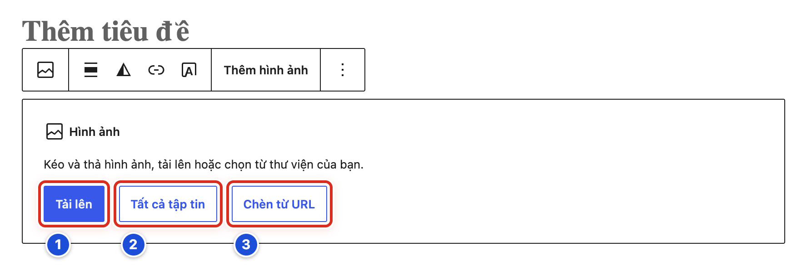
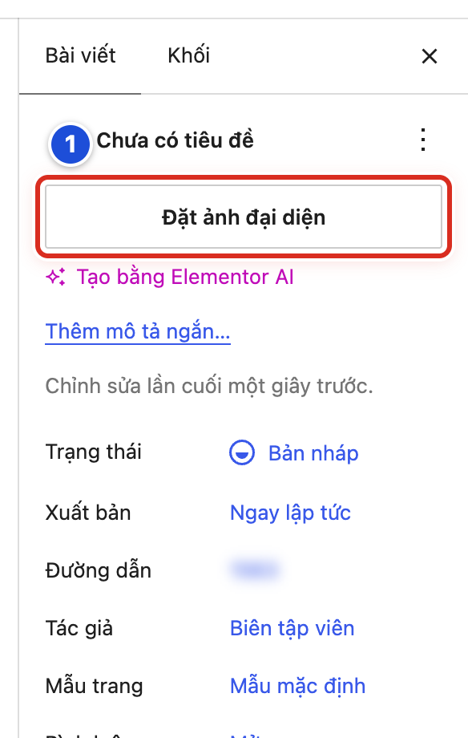
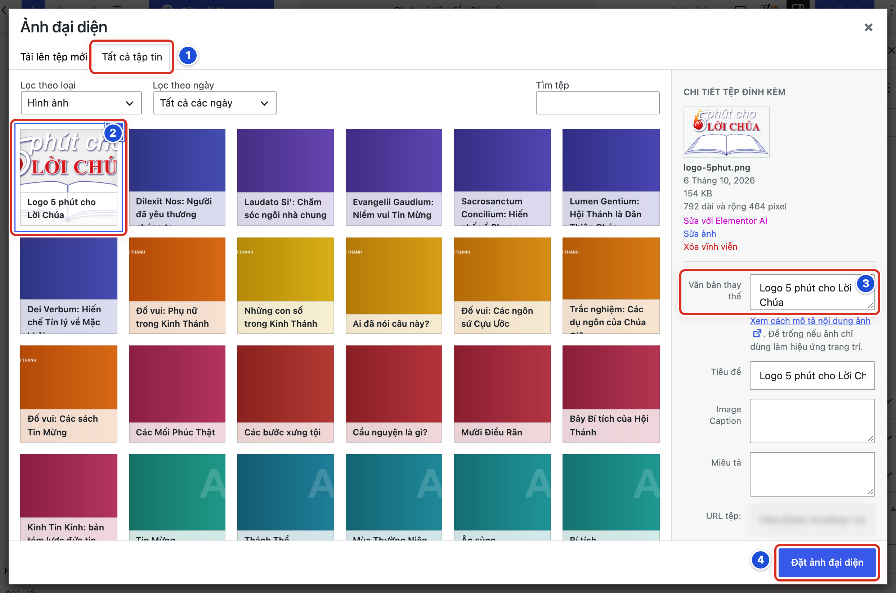
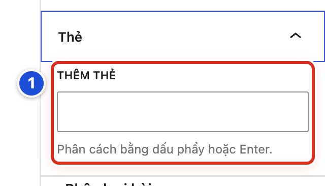
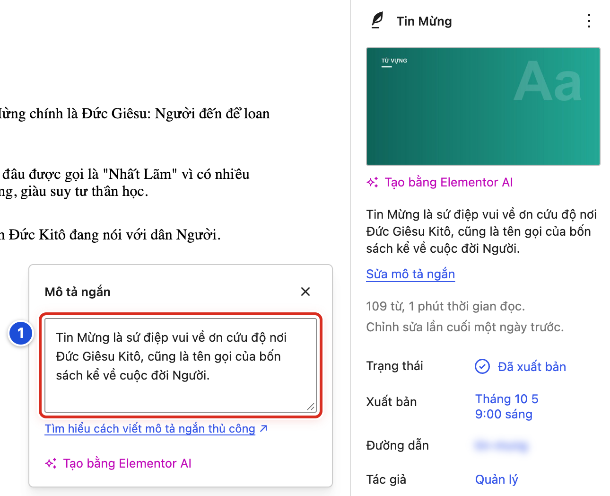
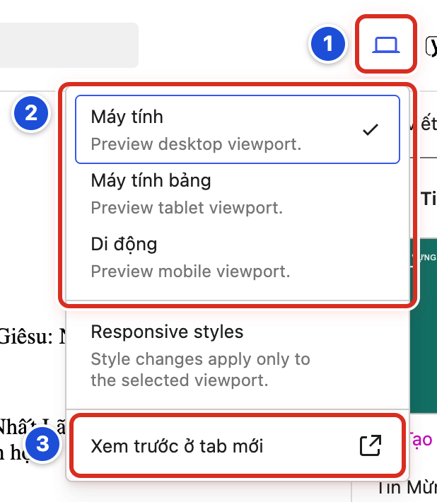
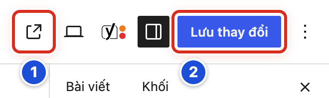
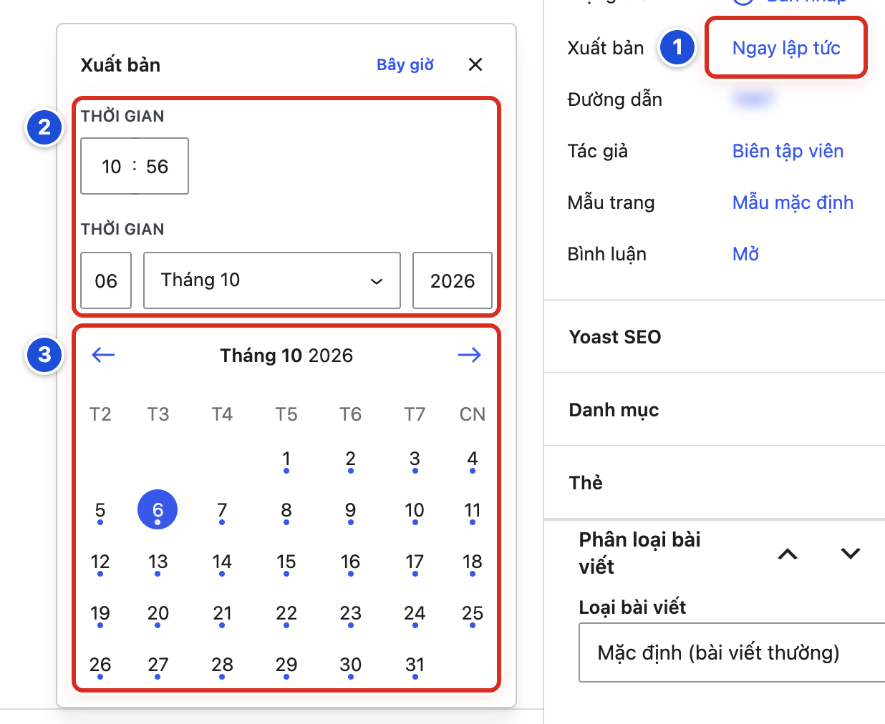

# Phần 2 Quản lý bài viết

## Chương 5 Hoàn thiện bài viết

### Bài 05.01 Chèn ảnh vào nội dung

**Nhãn:** Bắt buộc học · 🟢 An toàn

#### Mục đích

Đặt một tấm ảnh vào giữa bài, đúng chỗ cần minh họa, kèm lời mô tả ảnh.

#### Trước khi bắt đầu

- Đang mở bản nháp.
- Ảnh đã chuẩn bị đúng cỡ, đặt tên dễ hiểu và được phép sử dụng (Chương 9).
- Chèn sẵn một khối **Hình ảnh**: bấm vào dòng trống nơi muốn đặt ảnh, bấm nút **+** (Hình 04.03a, số 1), rồi bấm khối **Hình ảnh** (Hình 04.03b, số 4).

#### Các bước thực hiện

1. **Bước 1:** Ảnh nằm trong máy tính của bạn: bấm **Tải lên** (số 1), chọn ảnh trong máy, rồi bấm **Mở** (Open).
2. **Bước 2:** Ảnh đã có trên website: bấm **Tất cả tập tin** (số 2), bấm vào ảnh cần dùng, rồi bấm nút **Chọn** ở góc dưới bên phải.
3. **Bước 3:** Không dùng **Chèn từ URL** (số 3). Ảnh lấy từ website khác có thể mất bất cứ lúc nào.
4. **Bước 4:** Mở cột phải (nút **Cài đặt**), tab **Khối**. Gõ một câu tả ảnh vào ô **Mô tả SEO**, ví dụ “Cộng đoàn dự Thánh lễ Chúa Nhật”.
5. **Bước 5:** Muốn ghi chú dưới ảnh (ví dụ nguồn ảnh): bấm vào ảnh, bấm nút **Thêm chú thích dưới ảnh** trên thanh công cụ nhỏ, rồi gõ chú thích.
6. **Bước 6:** Bấm **Lưu nháp**.

#### Ảnh minh họa

*Hình 05.01 Khối Hình ảnh trống: số 1 Tải lên, số 2 Tất cả tập tin, số 3 Chèn từ URL.*

#### Kết quả

Bạn sẽ thấy ảnh hiện ngay trong bài, đúng chỗ đã chọn. Ảnh mới tải lên cũng được lưu vào **Thư viện** để lần sau dùng lại.

#### Lưu ý

- **Mô tả SEO** (còn gọi là văn bản thay thế) giúp người khiếm thị và Google hiểu ảnh. Viết ngắn, tả đúng nội dung ảnh.
- Trong hộp chọn ảnh của **Tất cả tập tin**, ô này có tên **Văn bản thay thế**. Hai tên là một.
- Muốn đổi sang ảnh khác: bấm vào ảnh, bấm **Thay thế** trên thanh công cụ nhỏ (xem thêm Bài 10.07).

#### Không nên làm

- Không chép ảnh từ website khác khi chưa rõ bản quyền.
- Không dùng ảnh quá nhỏ rồi kéo cho to. Ảnh sẽ mờ.
- Không bấm **Xóa vĩnh viễn** trong hộp chọn ảnh. Nút đó xóa hẳn ảnh khỏi Thư viện.

#### Nếu gặp lỗi

- Bấm **Tải lên** mà ảnh không lên, hoặc báo lỗi → kiểm tra ảnh là tệp JPG hoặc PNG và không quá nặng; xem Bài 23.06.
- Không thấy ô **Mô tả SEO** → bấm vào ảnh trong bài trước, rồi mở tab **Khối** ở cột phải.
- Lỡ chèn sai ảnh → bấm vào ảnh, bấm **Thay thế** để chọn lại; hoặc bấm **Hoàn tác** (Bài 04.08).

### Bài 05.02 Chọn ảnh đại diện

**Nhãn:** Bắt buộc học · 🟢 An toàn

#### Mục đích

**Ảnh đại diện** là ảnh hiện trên thẻ bài ở trang chủ, trang chuyên mục và ở đầu bài. Bài này hướng dẫn chọn ảnh đó.

#### Trước khi bắt đầu

- Đang mở bài viết. Cột phải đang mở ở tab **Bài viết** (Bài 04.09).
- Nên dùng ảnh ngang (rộng hơn cao), ví dụ tỉ lệ 16:9.

#### Các bước thực hiện

1. **Bước 1:** Ở đầu tab **Bài viết**, bấm nút **Đặt ảnh đại diện** (Hình 05.02a, số 1). Hộp **Ảnh đại diện** mở ra.
2. **Bước 2:** Bấm tab **Tất cả tập tin** (Hình 05.02b, số 1) để chọn ảnh đã có. Muốn lấy ảnh từ máy, bấm tab **Tải lên tệp mới** bên cạnh.
3. **Bước 3:** Bấm vào ảnh muốn dùng (số 2). Ảnh được chọn có khung xanh và dấu tích.
4. **Bước 4:** Gõ một câu tả ảnh vào ô **Văn bản thay thế** (số 3).
5. **Bước 5:** Bấm nút **Đặt ảnh đại diện** ở góc dưới bên phải (số 4).
6. **Bước 6:** Bấm **Lưu nháp** (bài chưa đăng) hoặc **Lưu thay đổi** (bài đã đăng).

#### Ảnh minh họa

*Hình 05.02a Số 1 nút Đặt ảnh đại diện ở cột phải.*

*Hình 05.02b Hộp Ảnh đại diện: số 1 tab Tất cả tập tin, số 2 ảnh đã chọn, số 3 ô Văn bản thay thế, số 4 nút Đặt ảnh đại diện.*

#### Kết quả

Bạn sẽ thấy ảnh thu nhỏ hiện ở đầu tab **Bài viết**, thay cho nút **Đặt ảnh đại diện**.

#### Lưu ý

- Muốn đổi hoặc bỏ ảnh: đưa chuột vào ảnh thu nhỏ ở cột phải, hai nút **Thay thế** và **Xóa bỏ** hiện ra. **Xóa bỏ** chỉ gỡ ảnh khỏi bài, ảnh vẫn còn trong Thư viện.
- Bài **Lời Chúa (câu ghi nhớ)** không cần ảnh đại diện. Khi không có ảnh, website tự hiện câu Lời Chúa ở chỗ ảnh (Chương 19).
- Các bài cùng danh mục nên dùng ảnh cùng tỉ lệ, để trang chủ trông đều nhau.

#### Không nên làm

- Không bấm **Xóa vĩnh viễn** ở cột bên phải của hộp **Ảnh đại diện**. Nút đó xóa hẳn ảnh khỏi website, kể cả ở các bài khác đang dùng.
- Không bấm **Tạo bằng Elementor AI** hoặc **Sửa với Elementor AI**.
- Không chọn ảnh dọc làm ảnh đại diện. Ảnh sẽ bị cắt mất phần trên, phần dưới.

#### Nếu gặp lỗi

- Bấm **Đặt ảnh đại diện** (số 4) nhưng nút bị mờ → bạn chưa bấm chọn ảnh nào; làm lại Bước 3.
- Không tìm thấy ảnh trong **Tất cả tập tin** → gõ tên ảnh vào ô **Tìm tệp** ở góc phải trên hộp.
- Đã chọn ảnh nhưng ngoài website không hiện → kiểm tra đã bấm **Lưu thay đổi** chưa, rồi xem Bài 23.04.

### Bài 05.03 Chọn đúng danh mục

**Nhãn:** Bắt buộc học · 🟢 An toàn

#### Mục đích

**Danh mục** (chuyên mục — nhóm bài cùng chủ đề) quyết định bài hiện ở đâu: ở khối nào trên trang chủ và ở trang chuyên mục nào. Chọn đúng danh mục để bài hiện đúng chỗ.

#### Trước khi bắt đầu

- Đang mở bài viết. Cột phải đang mở ở tab **Bài viết**.
- Biết bài thuộc nhóm nào. Website có các danh mục: **Suy niệm**, **Từ vựng**, **Giáo lý**, **Vui học Kinh Thánh**, **Huấn quyền**.

#### Các bước thực hiện

1. **Bước 1:** Kéo cột phải xuống, bấm vào chữ **Danh mục** (số 1) để mở bảng.
2. **Bước 2:** Tích vào ô của danh mục đúng (số 2), ví dụ **Giáo lý**. Thường chỉ tích một ô.
3. **Bước 3:** Nếu có ô bị tích nhầm, bấm vào ô đó để bỏ tích.
4. **Bước 4:** Chỉ bấm **Thêm Danh Mục** (số 3) khi đã thống nhất với Quản lý cần một danh mục mới.
5. **Bước 5:** Bấm **Lưu nháp** hoặc **Lưu thay đổi**.

#### Ảnh minh họa

*Hình 05.03 Số 1 bảng Danh mục, số 2 các ô tích danh mục, số 3 liên kết Thêm Danh Mục.*

#### Kết quả

Bạn sẽ thấy dấu tích ở đúng danh mục. Trong danh sách bài viết, cột **Danh mục** của bài ghi đúng tên đó.

#### Lưu ý

- Trong trang quản trị gọi là **Danh mục**, giao diện website gọi là **Chuyên mục**. Hai tên là một.
- Không tích ô nào thì khi lưu, WordPress tự xếp bài vào **Suy niệm** (danh mục mặc định).
- Mỗi khối trang chủ lấy bài từ một danh mục. Ví dụ khối **Giáo lý** chỉ hiện bài thuộc danh mục **Giáo lý**.

#### Không nên làm

- Không tạo danh mục mới chỉ vì khác chữ hoa, chữ thường, hoặc gõ sai chính tả. Tìm kỹ danh mục có sẵn trước.
- Không tích nhiều danh mục cho một bài nếu không thật cần. Bài sẽ hiện lặp lại ở nhiều khối.

#### Nếu gặp lỗi

- Không thấy bảng **Danh mục** → bạn đang ở tab **Khối**; bấm tab **Bài viết** rồi kéo xuống.
- Bài đăng rồi mà không hiện ở khối mong muốn → kiểm tra đúng danh mục chưa; sửa rồi bấm **Lưu thay đổi** (Bài 23.03).
- Lỡ bấm **Thêm Danh Mục** và tạo nhầm một danh mục → báo Quản lý để xóa; đừng tự xóa danh mục (Bài 07.07).

### Bài 05.04 Thêm thẻ khi thực sự cần

**Nhãn:** Nên biết · 🟢 An toàn

#### Mục đích

**Thẻ** là từ khóa nhỏ gắn cho bài, ví dụ “Mùa Vọng”, “Thánh Giuse”. Thẻ giúp gom các bài cùng một đề tài nhỏ, khác với danh mục là nhóm lớn.

#### Trước khi bắt đầu

- Đang mở bài viết. Cột phải đang mở ở tab **Bài viết**.
- Kéo xuống dưới bảng **Danh mục**, bấm vào chữ **Thẻ** để mở bảng.
- Biết các thẻ giáo xứ đã thống nhất dùng.

#### Các bước thực hiện

1. **Bước 1:** Bấm vào ô dưới chữ **THÊM THẺ** (số 1) và gõ tên thẻ, ví dụ “Mùa Vọng”.
2. **Bước 2:** Nếu có gợi ý hiện ra bên dưới, bấm vào thẻ có sẵn trong gợi ý.
3. **Bước 3:** Nếu không có gợi ý, bấm phím **Enter** (hoặc gõ dấu phẩy) để tạo thẻ.
4. **Bước 4:** Muốn gỡ một thẻ, bấm dấu **×** cạnh tên thẻ đó.
5. **Bước 5:** Bấm **Lưu nháp** hoặc **Lưu thay đổi**.

#### Ảnh minh họa

*Hình 05.04 Số 1 ô nhập thẻ trong bảng Thẻ (dòng gợi ý: phân cách bằng dấu phẩy hoặc Enter).*

#### Kết quả

Bạn sẽ thấy tên thẻ hiện thành một ô nhỏ có dấu **×** trong bảng **Thẻ**. Cột **Thẻ** trong danh sách bài viết cũng ghi tên thẻ này.

#### Lưu ý

- Thẻ không bắt buộc. Phần lớn bài chỉ cần danh mục.
- Một thẻ chỉ dùng cho một bài thì không giúp gì cho bạn đọc.
- Gõ nhiều thẻ một lần: ngăn cách bằng dấu phẩy.

#### Không nên làm

- Không biến mọi từ khóa trong bài thành thẻ.
- Không tạo hai thẻ cùng nghĩa, ví dụ “Mùa Vọng” và “mua vong”.

#### Nếu gặp lỗi

- Gõ tên thẻ xong nhưng chữ không biến thành ô nhỏ có dấu **×** → bấm phím **Enter** ngay sau khi gõ.
- Lỡ tạo thẻ sai chính tả → bấm **×** để gỡ khỏi bài, gõ lại cho đúng; báo Quản lý nếu cần xóa hẳn thẻ sai.
- Không thấy bảng **Thẻ** → kéo cột phải xuống dưới bảng **Danh mục**.

### Bài 05.05 Viết mô tả ngắn cho bài viết

**Nhãn:** Nên biết · 🟢 An toàn

#### Mục đích

**Mô tả ngắn** là 1–2 câu tóm tắt bài. Câu này hiện dưới tên bài trên trang chủ và trang chuyên mục, giúp bạn đọc biết bài nói gì.

#### Trước khi bắt đầu

- Đã viết xong ý chính của bài.
- Cột phải đang mở ở tab **Bài viết**.

#### Các bước thực hiện

1. **Bước 1:** Ở tab **Bài viết**, ngay dưới ảnh đại diện, bấm **Thêm mô tả ngắn…** (bài đã có mô tả thì bấm **Sửa mô tả ngắn**). Hộp **Mô tả ngắn** mở ra.
2. **Bước 2:** Gõ 1–2 câu vào ô (số 1). Ví dụ: “Tin Mừng là sứ điệp vui về ơn cứu độ nơi Đức Giêsu Kitô.”
3. **Bước 3:** Bấm dấu **×** ở góc hộp (hoặc bấm ra ngoài) để đóng.
4. **Bước 4:** Bấm **Lưu nháp** hoặc **Lưu thay đổi**.

#### Ảnh minh họa

*Hình 05.05 Hộp Mô tả ngắn mở ra sau Bước 1: số 1 ô gõ mô tả ngắn.*

#### Kết quả

Bạn sẽ thấy câu mô tả hiện ở cột phải, bên trên liên kết **Sửa mô tả ngắn**.

#### Lưu ý

- Viết câu tóm tắt, không chép lại nguyên tên bài.
- Bỏ trống thì website có thể tự lấy đoạn đầu của bài, và câu có thể bị cắt giữa chừng.
- Liên kết **Tìm hiểu cách viết mô tả ngắn thủ công** mở trang hướng dẫn tiếng Anh. Bạn không cần bấm.

#### Không nên làm

- Không dán đường link dài hoặc nhiều từ khóa vào mô tả ngắn.
- Không bấm **Tạo bằng Elementor AI** để viết thay.

#### Nếu gặp lỗi

- Không thấy **Thêm mô tả ngắn…** → mở cột phải bằng nút **Cài đặt**, chọn tab **Bài viết**.
- Đã gõ nhưng trang chủ vẫn hiện câu cũ → kiểm tra đã bấm **Lưu thay đổi** chưa, rồi tải lại trang chủ (F5).
- Hộp **Mô tả ngắn** che mất nội dung → bấm dấu **×** để đóng; chữ đã gõ vẫn được giữ.

### Bài 05.06 Xem trước trên máy tính bảng và điện thoại

**Nhãn:** Bắt buộc học · 🟢 An toàn

#### Mục đích

Nhiều bạn đọc xem website bằng điện thoại. Bài này giúp bạn xem thử bài trên màn hình nhỏ trước khi đăng.

#### Trước khi bắt đầu

Bài đã có nội dung chính và đã bấm **Lưu nháp**.

#### Các bước thực hiện

1. **Bước 1:** Bấm nút hình màn hình **Xem** ở thanh trên (số 1). Một danh sách nhỏ mở ra.
2. **Bước 2:** Bấm **Máy tính bảng** (số 2). Vùng soạn bài thu hẹp lại bằng cỡ máy tính bảng.
3. **Bước 3:** Bấm lại **Xem**, rồi bấm **Di động** (số 2). Vùng soạn bài thu hẹp bằng cỡ điện thoại.
4. **Bước 4:** Bấm lại **Xem**, rồi bấm **Xem trước ở tab mới** (số 3). Bài mở ở một tab mới, đầy đủ đầu trang và thanh bên như ngoài website.
5. **Bước 5:** Xem xong, đóng tab xem trước. Quay lại trang viết bài, bấm **Xem** → **Máy tính** (số 2) để trở về như cũ.

#### Ảnh minh họa

*Hình 05.06 Số 1 nút Xem, số 2 Máy tính / Máy tính bảng / Di động, số 3 Xem trước ở tab mới.*

#### Kết quả

Bạn sẽ thấy bài ở khổ hẹp như trên điện thoại. Ảnh, bảng hay dòng chữ nào tràn ra ngoài, bạn sẽ nhận ra ngay để sửa.

#### Lưu ý

- Chỉ bạn xem được bản xem trước. Bạn đọc chưa thấy gì cho đến khi bài được đăng.
- Mục **Responsive styles** (chữ tiếng Anh) trong danh sách là cho người làm kỹ thuật. Bạn không cần bấm.
- Nếu có điện thoại, hãy mở thử bài thật sau khi đăng (Bài 05.08).

#### Không nên làm

- Không dùng nhiều dấu cách hay dòng trống để “căn cho đẹp” trên máy tính. Trên điện thoại sẽ lệch.
- Không chèn bảng quá nhiều cột. Trên điện thoại, bảng sẽ tràn ra ngoài.

#### Nếu gặp lỗi

- Bấm **Xem trước ở tab mới** mà không thấy tab mới → trình duyệt đang chặn cửa sổ bật lên; cho phép website mở cửa sổ mới rồi bấm lại.
- Tab xem trước hiện nội dung cũ → quay lại, bấm **Lưu nháp**, rồi bấm **Xem trước ở tab mới** lần nữa.
- Vùng soạn bài cứ hẹp mãi → bấm **Xem** → **Máy tính** để trở lại cỡ bình thường.

### Bài 05.07 Kiểm tra trước khi đăng

**Nhãn:** Bắt buộc học · 🟢 An toàn

#### Mục đích

Rà lại bài lần cuối, tránh đăng bài sai chính tả, sai danh mục hay thiếu ảnh.

#### Trước khi bắt đầu

- Bài đã viết xong và đã bấm **Lưu nháp**.
- Nếu giáo xứ yêu cầu duyệt bài, người phụ trách đã đồng ý cho đăng.

#### Các bước thực hiện

1. **Bước 1:** Đọc lại tên bài: đúng chính tả, đúng dấu, không quá dài.
2. **Bước 2:** Đọc lại nội dung: tên riêng, ngày tháng, trích dẫn Kinh Thánh (ví dụ *Lc 10,38-42*).
3. **Bước 3:** Mở bảng **Danh mục** ở cột phải, kiểm tra đã tích đúng một danh mục (Bài 05.03).
4. **Bước 4:** Kiểm tra ảnh đại diện đã có (bài thường), hoặc các ô Lời Chúa đã điền (bài Lời Chúa, Chương 19).
5. **Bước 5:** Kiểm tra mô tả ngắn đã có và đúng ý (Bài 05.05).
6. **Bước 6:** Bấm **Xem trước ở tab mới**, bấm thử từng liên kết trong bài.
7. **Bước 7:** Xem thử ở khổ **Di động** (Bài 05.06).
8. **Bước 8:** Xem dòng **Xuất bản** ở cột phải: **Ngay lập tức** nghĩa là đăng ngay; một ngày giờ khác nghĩa là hẹn giờ (Bài 05.10).

#### Ảnh minh họa

Bài này không cần ảnh minh họa. Bảng kiểm tra rút gọn có ở Phụ lục A.03.

#### Kết quả

Bạn sẽ có một bài đã được rà soát đủ tám điểm, sẵn sàng để bấm **Xuất bản** (Bài 05.08).

#### Lưu ý

- Bài **Lời Chúa (câu ghi nhớ)** cần thêm: **Câu Lời Chúa**, **Trích dẫn**, **Ngày phụng vụ**, **Lễ / kính thánh**, **Đoạn Tin Mừng** (Chương 19).
- Nhờ một người khác đọc lại giúp thường phát hiện được lỗi bạn bỏ sót.

#### Không nên làm

- Không bỏ qua bước xem trước chỉ vì trang viết bài không báo lỗi gì.
- Không đăng bài khi còn chữ tạm như “sửa sau”, “xxx”.

#### Nếu gặp lỗi

- Phát hiện lỗi khi đang rà → sửa ngay, bấm **Lưu nháp**, rồi rà lại từ bước có lỗi.
- Chưa có ảnh phù hợp → giữ bài ở dạng bản nháp, chưa đăng; báo người phụ trách.
- Không chắc danh mục nào đúng → hỏi Quản lý trước khi đăng; đừng tích đại.

### Bài 05.08 Xuất bản bài và kiểm tra ngoài website

**Nhãn:** Bắt buộc học · 🟡 Cẩn thận

#### Mục đích

Đăng bài lên website cho mọi người đọc, rồi kiểm tra bài hiện đúng.

#### Trước khi bắt đầu

- Đã làm xong Bài 05.07.
- Được phép đăng bài.

#### Các bước thực hiện

1. **Bước 1:** Bấm nút xanh **Xuất bản** ở góc phải trên cùng (Hình 04.03a, số 7).
2. **Bước 2:** Cột phải hiện bảng **Bạn sẵn sàng xuất bản chưa?**. Đọc lại các dòng, nhất là **Xuất bản:** *Ngay lập tức*.
3. **Bước 3:** Bấm nút **Xuất bản** ở đầu bảng (bấm lần thứ hai). Chưa muốn đăng thì bấm **Hủy**.
4. **Bước 4:** Chờ bảng báo bài **đã công bố**, rồi bấm **Xem bài viết**.
5. **Bước 5:** Trên trang bài, kiểm tra tên bài, ảnh đại diện, nội dung và liên kết.
6. **Bước 6:** Mở trang chủ, bấm **F5**, kiểm tra bài hiện ở khối của danh mục đã chọn.

#### Ảnh minh họa

Xem Hình 04.03a ở Bài 04.03, số 7: nút xanh **Xuất bản**. Nút này phải bấm hai lần: lần đầu mở bảng hỏi, lần hai mới đăng.

#### Kết quả

Bạn sẽ thấy bài trên website. Trong danh sách bài viết, cột **Thời gian** của bài ghi **Đã xuất bản**. Trong trang viết bài, nút xanh đổi thành **Lưu thay đổi**.

#### Lưu ý

- Sau khi đăng, bấm **Lưu thay đổi** là website đổi ngay. Không còn bước hỏi lại (Bài 05.09).
- Nếu đã chọn ngày giờ trong tương lai, nút xanh là **Lên lịch** chứ không phải **Xuất bản** (Bài 05.10).
- Muốn xem như bạn đọc (không có thanh đen), mở bài trong cửa sổ ẩn danh của trình duyệt.

#### Không nên làm

- Không bấm nút liên tục khi WordPress đang xử lý (chữ **Đang xuất bản...**). Chờ xong.
- Không bỏ tích ô **Luôn hiển thị hộp thoại kiểm tra trước khi công bố.** ở cuối bảng. Bảng này giúp bạn tránh đăng nhầm.

#### Nếu gặp lỗi

- Bấm **Xuất bản** lần hai mà báo lỗi → chụp màn hình thông báo, giữ nguyên tab, báo Quản lý; không viết lại một bài giống hệt.
- Đăng xong nhưng trang chủ chưa thấy bài → bấm **F5**, kiểm tra danh mục, rồi xem Bài 23.01.
- Lỡ đăng bài chưa hoàn chỉnh → sửa ngay rồi bấm **Lưu thay đổi**; nếu cần gỡ bài, báo Quản lý.

### Bài 05.09 Cập nhật bài đã đăng

**Nhãn:** Bắt buộc học · 🟡 Cẩn thận

#### Mục đích

Sửa một bài **đã đăng**, ví dụ sửa lỗi chính tả hay đổi giờ lễ, và kiểm tra bài mới trên website.

#### Trước khi bắt đầu

- Biết chính xác bài nào cần sửa và sửa chỗ nào.
- Sửa nhiều (thay đoạn lớn, đổi ảnh chính) thì hỏi người phụ trách trước.

#### Các bước thực hiện

1. **Bước 1:** Mở bài từ danh sách bài viết (Bài 03.05).
2. **Bước 2:** Mở cột phải, kiểm tra dòng **Trạng thái** ghi **Đã xuất bản**.
3. **Bước 3:** Sửa đúng chỗ cần sửa.
4. **Bước 4:** Nếu sửa ảnh hay bố cục, bấm **Xem** → **Xem trước ở tab mới** để xem thử trước.
5. **Bước 5:** Bấm nút xanh **Lưu thay đổi** (số 2).
6. **Bước 6:** Bấm nút **Xem bài viết** (hình ô vuông có mũi tên, số 1). Bài mở ở tab mới.
7. **Bước 7:** Trên tab mới, bấm **F5** và kiểm tra nội dung đã đổi.

#### Ảnh minh họa

*Hình 05.09 Thanh trên của bài đã đăng: số 1 nút Xem bài viết, số 2 nút Lưu thay đổi.*

#### Kết quả

Bạn sẽ thấy thông báo **Bài viết đã được cập nhật.** ở góc dưới. Ngoài website, bài hiện nội dung mới.

#### Lưu ý

- Bấm **Lưu thay đổi** là bạn đọc thấy ngay. Không có bảng hỏi lại như khi xuất bản lần đầu.
- Nút **Lưu thay đổi** bị mờ khi bạn chưa sửa gì. Đó là bình thường.
- Lỡ lưu sai, xem **Lịch sử sửa** (Bài 06.04) để lấy lại bản trước.

#### Không nên làm

- Không đổi **Đường dẫn** của bài đã đăng. Các liên kết đã chia sẻ (Facebook, Zalo) sẽ hỏng.
- Không đổi **Trạng thái** sang **Bản nháp** để “sửa cho kín”. Bài sẽ biến mất khỏi website.
- Không thay toàn bộ nội dung một bài cũ bằng một chủ đề mới. Hãy viết bài mới.

#### Nếu gặp lỗi

- Bấm **Lưu thay đổi** không được vì nút mờ → bạn chưa thay đổi gì; kiểm tra đã sửa đúng bài chưa.
- Lưu rồi nhưng website vẫn hiện bản cũ → bấm **F5**; vẫn cũ thì mở bằng cửa sổ ẩn danh; xem Bài 23.01.
- Lưu xong mới thấy sửa sai → bấm **Hoàn tác** nếu chưa rời trang (Bài 04.08), rồi bấm **Lưu thay đổi** lần nữa.

### Bài 05.10 Hẹn giờ đăng bài theo giờ Việt Nam

**Nhãn:** Nên biết · 🟡 Cẩn thận

#### Mục đích

Cho bài **tự đăng** vào một ngày giờ định trước, ví dụ bài Lời Chúa của ngày mai đăng lúc 5:00 sáng.

#### Trước khi bắt đầu

- Bài đã viết xong, đã kiểm tra theo Bài 05.07.
- Cột phải đang mở ở tab **Bài viết**.
- Giờ hẹn tính theo giờ của website (giờ Việt Nam), không phụ thuộc giờ trên máy bạn.

#### Các bước thực hiện

1. **Bước 1:** Bấm vào chữ xanh cạnh **Xuất bản** (số 1; lúc đầu ghi **Ngay lập tức**). Hộp **Xuất bản** mở ra.
2. **Bước 2:** Ở hàng **THỜI GIAN** đầu tiên (số 2), gõ giờ và phút, ví dụ `05` và `00`.
3. **Bước 3:** Bấm chọn ngày trên lịch (số 3). Bấm mũi tên **→** để sang tháng sau.
4. **Bước 4:** Bấm dấu **×** ở góc hộp **Xuất bản** để đóng.
5. **Bước 5:** Nút xanh trên cùng đổi thành **Lên lịch**. Bấm **Lên lịch**.
6. **Bước 6:** Bảng **Bạn đã sẵn sàng để lên lịch chưa?** hiện ra. Bấm **Lên lịch** lần nữa.

#### Ảnh minh họa

*Hình 05.10 Số 1 chữ cạnh Xuất bản (bấm để mở lịch), số 2 ô giờ và ngày, số 3 lịch chọn ngày.*

#### Kết quả

Bạn sẽ thấy dòng **Trạng thái** ghi **Đã lên lịch**. Trong danh sách bài viết, tên bài có chữ “— Lên kế hoạch”, cột **Thời gian** ghi “Đã lên lịch” kèm ngày giờ. Đúng giờ hẹn, bài tự lên website.

#### Lưu ý

- Ô giờ tính theo kiểu 24 giờ: `05:00` là 5 giờ sáng, `17:00` là 5 giờ chiều.
- Hàng **THỜI GIAN** thứ hai (ngày, tháng, năm) đổi theo ngày bạn bấm trên lịch.
- Muốn đổi giờ hẹn: mở bài, bấm vào ngày giờ cạnh **Xuất bản**, chọn lại, rồi bấm **Lưu thay đổi**.
- Nút **Bây giờ** trong hộp **Xuất bản** đưa thời gian về lúc hiện tại.
- Bài Lời Chúa hằng ngày nên hẹn đúng ngày phụng vụ, vì khối **Lời Chúa hôm nay** lấy bài theo ngày đăng (Bài 19.06).

#### Không nên làm

- Không chọn ngày trong quá khứ khi muốn hẹn giờ. Bài sẽ đăng ngay với ngày cũ.
- Không dựa vào đồng hồ trên máy bạn nếu máy đang để múi giờ khác.

#### Nếu gặp lỗi

- Chọn ngày xong mà nút vẫn ghi **Xuất bản** → ngày giờ bạn chọn chưa ở tương lai; kiểm tra lại giờ, phút và năm.
- Quá giờ hẹn mà bài chưa lên → xem Bài 23.02; báo kỹ thuật nếu danh sách bài ghi **Lịch trình bị bỏ lỡ**.
- Lỡ chọn sai ngày và đã bấm **Lên lịch** → mở lại bài, sửa ngày giờ cạnh **Xuất bản**, bấm **Lưu thay đổi**.
