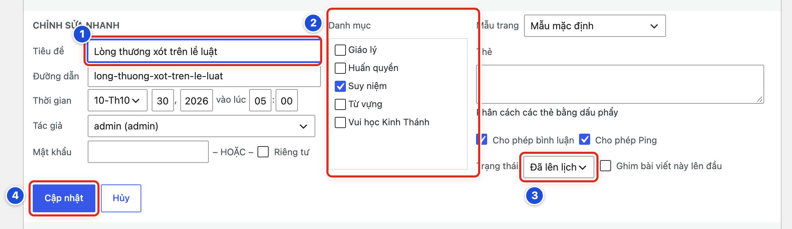

# Phần 2 Quản lý bài viết

## Chương 6 Sửa và khôi phục

### Bài 06.01 Sửa nhanh tiêu đề trạng thái hoặc danh mục

**Nhãn:** Nên biết · 🟡 Cẩn thận

#### Mục đích

**Sửa nhanh** cho phép đổi tên bài, danh mục hoặc trạng thái ngay trong danh sách, không cần mở trang viết bài.

#### Trước khi bắt đầu

- Mở **Bài viết → Tất cả bài viết** và tìm đúng bài (Bài 03.03).
- Rê chuột vào tên bài, bấm **Sửa nhanh** (Hình 03.05, số 2). Khung **CHỈNH SỬA NHANH** mở ra ngay trong danh sách.

#### Các bước thực hiện

1. **Bước 1:** Sửa tên bài trong ô **Tiêu đề** (số 1), nếu cần.
2. **Bước 2:** Tích hoặc bỏ tích danh mục trong khung **Danh mục** (số 2), nếu cần.
3. **Bước 3:** Chọn lại **Trạng thái** (số 3), nếu cần. Ví dụ chuyển **Bản nháp** thành **Chờ duyệt**.
4. **Bước 4:** Bấm nút **Cập nhật** (số 4).

#### Ảnh minh họa

*Hình 06.01 Khung Chỉnh sửa nhanh: số 1 ô Tiêu đề, số 2 khung Danh mục, số 3 ô Trạng thái, số 4 nút Cập nhật.*

#### Kết quả

Bạn sẽ thấy khung đóng lại. Hàng của bài trong danh sách hiện ngay tên, danh mục hoặc trạng thái mới. Nội dung bài không bị đổi.

#### Lưu ý

- Sửa nhanh không sửa được nội dung bài. Muốn sửa nội dung, bấm **Chỉnh sửa** (Bài 03.05).
- Khung còn các ô **Đường dẫn**, **Thời gian**, **Tác giả**, **Mật khẩu**, **Thẻ**… Chỉ sửa ô bạn cần.
- Bấm **Hủy** để đóng khung mà không lưu gì.

#### Không nên làm

- Không đổi **Trạng thái** của bài đã đăng sang **Bản nháp**. Bài sẽ biến mất khỏi website ngay.
- Không đổi **Thời gian** của bài Lời Chúa đã hẹn giờ. Bài sẽ hiện sai ngày trên khối **Lời Chúa hôm nay**.
- Không sửa **Đường dẫn**, không tích **Riêng tư**, không tích **Ghim bài viết này lên đầu** khi chưa được hướng dẫn.

#### Nếu gặp lỗi

- Mở nhầm khung Sửa nhanh của bài khác → bấm **Hủy**; không bấm **Cập nhật**.
- Đã bấm **Cập nhật** với lựa chọn sai → mở lại **Sửa nhanh** của bài đó, chọn lại như cũ, bấm **Cập nhật** lần nữa.
- Bấm **Cập nhật** mà khung không đóng, chữ quay mãi → chờ vài giây; vẫn không được thì tải lại trang (F5) và kiểm tra hàng của bài.

### Bài 06.02 Chuyển bài viết vào Thùng rác

**Nhãn:** Nên biết · 🟡 Cẩn thận

#### Mục đích

Gỡ một bài khỏi website bằng cách **xóa tạm**. Bài chưa mất hẳn mà nằm trong **Thùng rác**, còn lấy lại được.

#### Trước khi bắt đầu

- Chắc chắn bài này cần gỡ, và đã được người phụ trách đồng ý.
- Khi tập, chỉ dùng bản nháp do chính bạn tạo.
- Mở **Bài viết → Tất cả bài viết** và tìm đúng bài.

#### Các bước thực hiện

1. **Bước 1:** Kiểm tra lại tên bài, cột **Danh mục** và cột **Thời gian** cho chắc là đúng bài.
2. **Bước 2:** Rê chuột vào tên bài (Hình 03.05, số 1).
3. **Bước 3:** Bấm chữ đỏ **Xóa tạm** trong dòng thao tác (Hình 03.05, số 2).
4. **Bước 4:** Đọc thông báo trên đầu danh sách: **Đã chuyển 1 bài viết vào Thùng rác.**, kèm liên kết **Hoàn tác**.
5. **Bước 5:** Nhìn dòng lọc trạng thái: có thêm chữ **Thùng rác** với số bài bên cạnh.

#### Ảnh minh họa

Xem Hình 03.05 ở Bài 03.05: số 2 là dòng thao tác, trong đó **Xóa tạm** là chữ màu đỏ.

#### Kết quả

Bạn sẽ thấy bài biến khỏi danh sách **Tất cả** và nằm trong **Thùng rác**. Nếu bài đã đăng, bạn đọc không còn thấy bài trên website.

#### Lưu ý

- Cách khác: trong trang viết bài, mở cột phải tab **Bài viết**, bấm nút đỏ **Di chuyển đến thùng rác** ở cuối (xem Hình 04.09). WordPress hỏi lại; bấm **Di chuyển đến thùng rác** lần nữa để đồng ý.
- Lỡ xóa tạm nhầm: bấm ngay **Hoàn tác** trong thông báo, hoặc khôi phục theo Bài 06.03.
- WordPress thường tự xóa hẳn các bài nằm trong Thùng rác quá 30 ngày.

#### Không nên làm

- Không xóa tạm bài thật chỉ để tập.
- Không tích nhiều bài rồi chọn **Bỏ vào thùng rác** trong ô **Hành động hàng loạt** khi chưa kiểm tra từng bài.
- Không bấm **Xóa vĩnh viễn** trong Thùng rác (Bài 06.05).

#### Nếu gặp lỗi

- Không thấy chữ **Xóa tạm** khi rê chuột → rê đúng vào tên bài màu xanh, không phải các cột khác.
- Xóa tạm nhầm bài và thông báo **Hoàn tác** đã mất → làm theo Bài 06.03.
- Bài đã xóa tạm nhưng vẫn thấy trên website → bấm **F5** để tải lại trang; vẫn còn thì báo người phụ trách kỹ thuật.

### Bài 06.03 Khôi phục bài viết từ Thùng rác

**Nhãn:** Nên biết · 🟢 An toàn

#### Mục đích

Lấy lại một bài đã bị xóa tạm, khi bài vẫn còn trong **Thùng rác**.

#### Trước khi bắt đầu

- Bài chưa bị **xóa vĩnh viễn**.
- Đăng nhập bằng tài khoản Biên tập viên.

#### Các bước thực hiện

1. **Bước 1:** Mở **Bài viết → Tất cả bài viết**.
2. **Bước 2:** Ở dòng lọc trạng thái trên bảng, bấm **Thùng rác**.
3. **Bước 3:** Tìm bài cần lấy lại, rê chuột vào tên bài.
4. **Bước 4:** Bấm **Khôi phục lại** trong dòng thao tác hiện ra.
5. **Bước 5:** Bấm **Tất cả** ở dòng lọc, tìm bài vừa lấy lại. Bài lúc này ở dạng **Bản nháp**.
6. **Bước 6:** Nếu bài trước đó đã đăng: mở bài, kiểm tra ngày ở dòng **Xuất bản**, rồi bấm **Xuất bản** lại (Bài 05.08).

#### Ảnh minh họa

Bài này không cần ảnh minh họa. Dòng lọc trạng thái giống Hình 03.02, số 1; chữ **Thùng rác** chỉ hiện khi có bài bị xóa tạm.

#### Kết quả

Bạn sẽ thấy thông báo **1 bài viết đã được phục hồi từ thùng rác.** kèm liên kết **Sửa bài viết** để mở bài ngay. Bài trở lại danh sách **Tất cả** với chữ “— Bản nháp”. Sau Bước 6, bài hiện lại trên website.

#### Lưu ý

- Bài lấy lại từ Thùng rác luôn về dạng **Bản nháp**, kể cả khi trước đó đã đăng hoặc đã hẹn giờ. Bạn cần đăng lại.
- Nội dung, danh mục, ảnh đại diện vẫn được giữ như lúc xóa tạm.
- Bài Lời Chúa đã hẹn giờ: khi đăng lại, kiểm tra ngày giờ cạnh **Xuất bản**; nếu là ngày tương lai, nút sẽ là **Lên lịch** (Bài 05.10).

#### Không nên làm

- Không bấm **Xóa vĩnh viễn** đứng cạnh **Khôi phục lại**.
- Không bấm nút **Dọn sạch thùng rác** ở trên bảng.
- Không khôi phục hàng loạt nhiều bài khi chưa biết từng bài là gì.

#### Nếu gặp lỗi

- Không thấy chữ **Thùng rác** ở dòng lọc → Thùng rác đang trống; bài có thể đã bị xóa vĩnh viễn. Dừng lại và báo người phụ trách kỹ thuật.
- Thùng rác nhiều bài, khó tìm → gõ vài chữ của tên bài vào ô tìm kiếm, bấm **Tìm các bài viết**.
- Đã khôi phục nhưng website chưa thấy bài → bài đang là bản nháp; làm tiếp Bước 6.

### Bài 06.04 Xem và khôi phục phiên bản nội dung cũ

**Nhãn:** Nên biết · 🟡 Cẩn thận

#### Mục đích

Mỗi lần bạn lưu, WordPress giữ lại một bản cũ của bài. Bài này giúp bạn xem các bản cũ và lấy lại bản đúng khi lỡ sửa sai.

#### Trước khi bắt đầu

- Mở bài cần xem trong trang viết bài (Bài 03.05).
- Bài đã được lưu ít nhất hai lần. Bài mới lưu một lần thì chưa có bản cũ để xem.
- Nếu đang có thay đổi chưa lưu, bấm lưu trước hoặc bấm **Hoàn tác** để bỏ.

#### Các bước thực hiện

1. **Bước 1:** Mở cột phải bằng nút **Cài đặt**, chọn tab **Bài viết**.
2. **Bước 2:** Tìm dòng **Lịch sử sửa**, nằm ngay dưới dòng **Bình luận** và phía trên nút đỏ **Di chuyển đến thùng rác**. Bên cạnh là một con số, ví dụ **5**: bài có 5 bản đã lưu.
3. **Bước 3:** Bấm vào con số đó. Trang viết bài chuyển sang chế độ xem lịch sử, giữa thanh trên cùng có một thanh trượt.
4. **Bước 4:** Kéo thanh trượt sang trái hoặc phải để chọn bản theo thời gian lưu.
5. **Bước 5:** Bấm biểu tượng con mắt (**Hiển thị những thay đổi**) để thấy chỗ đã thêm, chỗ đã xóa so với bản trước.
6. **Bước 6:** Không muốn lấy bản nào: bấm **Thoát** để quay về trang viết bài.
7. **Bước 7:** Đã chọn đúng bản cần lấy lại: bấm nút xanh **Khôi phục lại**.
8. **Bước 8:** Đọc lại toàn bài, rồi mở website kiểm tra (Bài 01.06).

#### Ảnh minh họa

Bài này không cần ảnh minh họa. Vị trí các dòng trong tab **Bài viết** giống Hình 04.09; dòng **Lịch sử sửa** chỉ hiện thêm khi bài đã có từ hai bản lưu trở lên.

#### Kết quả

Bạn sẽ thấy thông báo **Đã khôi phục về phiên bản từ …** (kèm ngày giờ của bản đó). Tên bài, nội dung và mô tả ngắn trở lại như bản đã chọn.

#### Lưu ý

- Bấm **Khôi phục lại** là WordPress **lưu ngay**. Với bài đã đăng, bạn đọc thấy bản cũ liền, không có bước hỏi lại.
- Lịch sử sửa chủ yếu giữ tên bài, nội dung và mô tả ngắn. Danh mục, ảnh đại diện, ngày đăng không đổi theo.
- Tùy bản dịch tiếng Việt, dòng **Lịch sử sửa** có thể mang tên khác như **Phiên bản**. Cách dùng như nhau.
- Lịch sử sửa khác với **Hoàn tác**: Hoàn tác chỉ quay lại thao tác trong lần mở trang này (Bài 04.08).

#### Không nên làm

- Không bấm **Khôi phục lại** khi chưa bấm **Hiển thị những thay đổi** để xem kỹ khác nhau ở đâu.
- Không khôi phục bản cũ của bài người khác đang phụ trách khi chưa hỏi người đó.

#### Nếu gặp lỗi

- Không thấy dòng **Lịch sử sửa** → bài mới lưu một lần, hoặc website không giữ bản cũ cho bài này; báo người phụ trách kỹ thuật nếu thật sự cần lấy lại nội dung.
- Bấm con số mà mở ra một trang riêng có thanh trượt và nút **Phục hồi bản sửa đổi này** → đó là kiểu màn hình cũ; dùng thanh trượt và nút đó tương tự Bước 4 và Bước 7.
- Lỡ khôi phục nhầm bản → mở lại **Lịch sử sửa**, chọn bản mới nhất trước lần khôi phục, bấm **Khôi phục lại** lần nữa.

### Bài 06.05 Khi nào không nên xóa vĩnh viễn

**Nhãn:** Bắt buộc học · 🔴 Không tự thay đổi

#### Mục đích

**Xóa vĩnh viễn** làm bài hoặc ảnh **mất hẳn**, không lấy lại được trong trang quản trị. Bài này giúp bạn biết khi nào phải dừng tay.

#### Trước khi bắt đầu

Không có bài thực hành. Chỉ đọc để nhận biết các nút **Xóa vĩnh viễn** và **Dọn sạch thùng rác**.

#### Các bước thực hiện

1. **Bước 1:** Khi mở **Thùng rác** của bài viết, nhận ra hai nút nguy hiểm: **Xóa vĩnh viễn** (trong dòng thao tác của từng bài) và **Dọn sạch thùng rác** (trên bảng).
2. **Bước 2:** Khi mở chi tiết một ảnh trong **Thư viện** hoặc trong hộp chọn ảnh, nhận ra chữ đỏ **Xóa vĩnh viễn** (Hình 05.02b, cột bên phải).
3. **Bước 3:** Dừng lại, không bấm, nếu bạn chưa chắc bài hoặc ảnh đó không còn ai cần.
4. **Bước 4:** Dừng lại nếu bài có thể đang được dẫn tới từ menu, từ bài khác, từ Facebook hay Zalo.
5. **Bước 5:** Dừng lại nếu ảnh có thể đang dùng ở một bài khác hoặc ở đầu trang website.
6. **Bước 6:** Khi thật sự cần xóa hẳn, gửi yêu cầu cho Quản lý: tên bài (hoặc tên ảnh), lý do, ai đã đồng ý.

#### Ảnh minh họa

Bài này không cần ảnh minh họa. Chữ đỏ **Xóa vĩnh viễn** của ảnh có thể thấy trong Hình 05.02b, cột **Chi tiết tệp đính kèm** bên phải.

#### Kết quả

Bạn sẽ nhận ra các nút xóa vĩnh viễn và biết để yên trong Thùng rác, hoặc chuyển yêu cầu cho Quản lý, thay vì tự xóa.

#### Lưu ý

- **Xóa tạm** còn lấy lại được (Bài 06.03). **Xóa vĩnh viễn** thì không.
- Để bài nằm trong Thùng rác không gây hại gì. WordPress thường tự dọn sau 30 ngày.
- Xóa vĩnh viễn một ảnh làm ảnh biến mất ở **mọi** bài đang dùng ảnh đó.

#### Không nên làm

- Không bấm **Dọn sạch thùng rác** để “cho gọn”.
- Không xóa vĩnh viễn ảnh trong **Thư viện** chỉ vì muốn gỡ ảnh khỏi một bài. Hãy dùng **Xóa bỏ** hoặc **Thay thế** trong bài.
- Không xóa vĩnh viễn để che một lỗi đã đăng. Hãy báo Quản lý.

#### Nếu gặp lỗi

- Lỡ bấm **Xóa vĩnh viễn** một bài → dừng mọi thao tác; ghi lại tên bài, thời điểm và báo ngay người phụ trách kỹ thuật để xem bản sao lưu.
- Lỡ xóa vĩnh viễn một ảnh → ghi lại tên ảnh và các bài đang dùng ảnh đó; tìm lại tệp gốc trong máy để tải lên lại (Bài 10.02), rồi báo Quản lý.
- Thấy Thùng rác bỗng trống dù bạn không xóa → không làm gì thêm; báo Quản lý kiểm tra.
