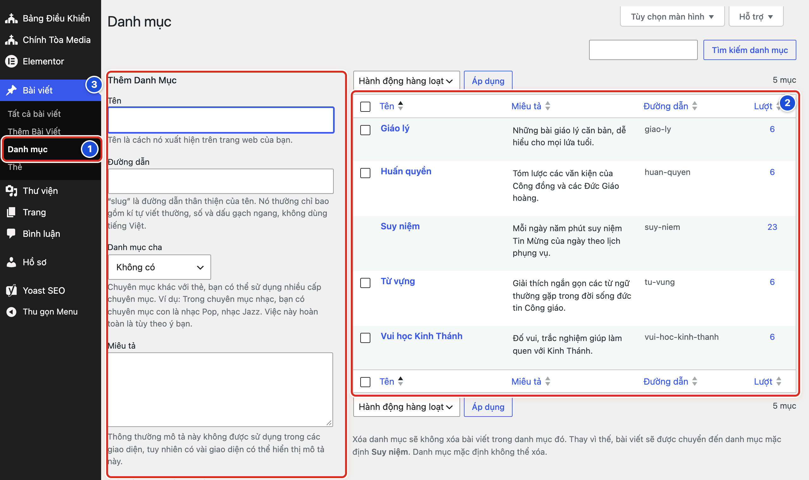
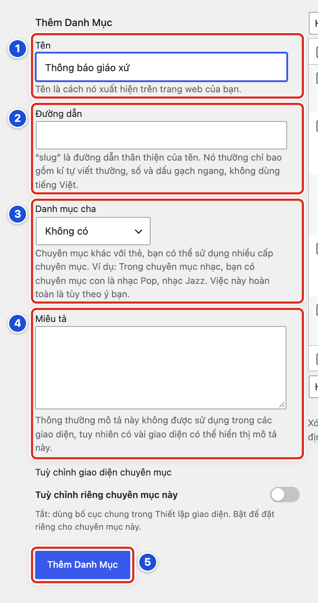
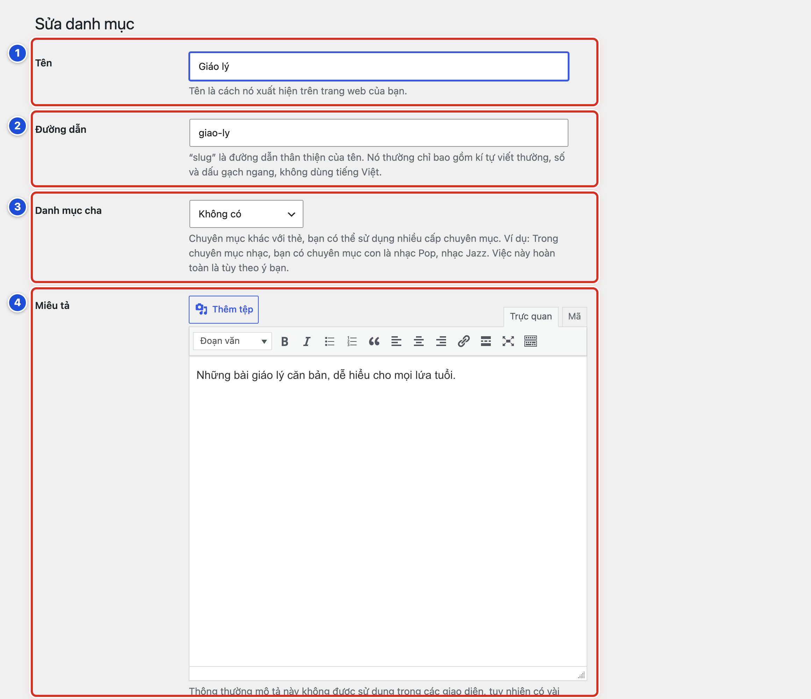
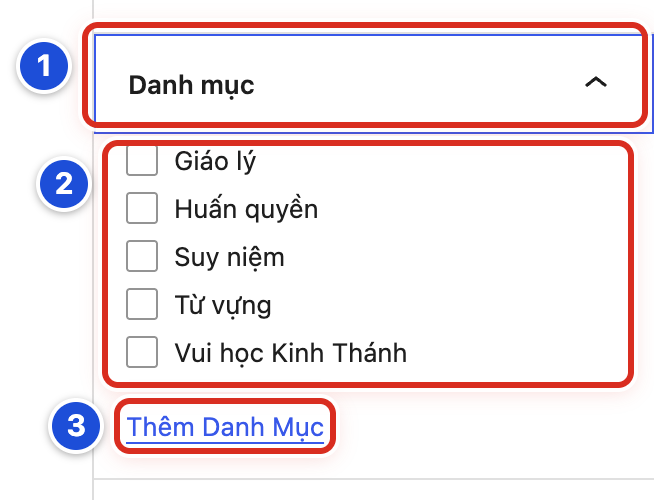
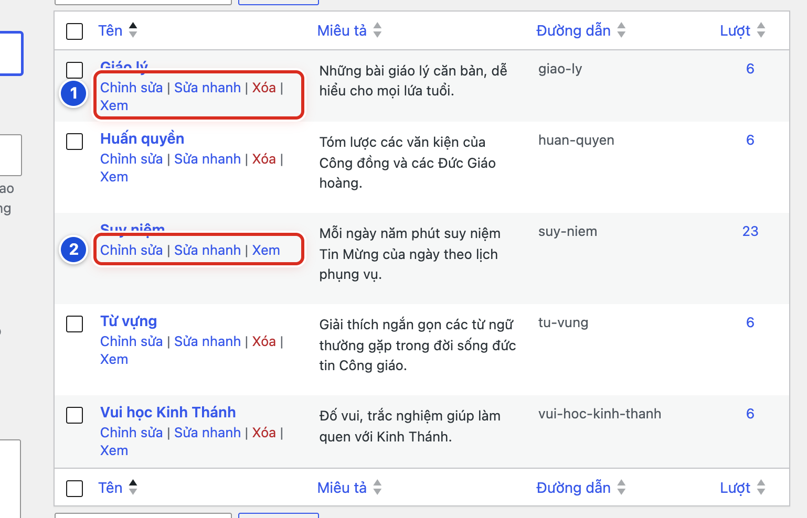

# Phần 3 Quản lý danh mục

## Chương 7 Tổ chức bài viết theo danh mục

### Bài 07.01 Danh mục dùng để làm gì

**Nhãn:** Bắt buộc học · 🟢 An toàn

#### Mục đích

Danh mục (chuyên mục — nhóm các bài cùng chủ đề) giúp xếp mỗi bài vào đúng chỗ trên website. Bài này giải thích danh mục dùng để làm gì, để bạn chọn đúng danh mục mỗi khi viết bài.

#### Trước khi bắt đầu

Không cần chuẩn bị gì. Nếu muốn xem danh sách danh mục ngay, đăng nhập bằng tài khoản Biên tập viên.

#### Các bước thực hiện

1. **Bước 1:** Đọc bài sắp đăng và tự hỏi: bài này nói về chủ đề gì?
2. **Bước 2:** Mở **Bài viết → Danh mục** để xem các danh mục đang có (Bài 07.02).
3. **Bước 3:** Chọn danh mục có sẵn gần nhất với chủ đề. Ví dụ: bài giải thích từ “Phụng vụ” thuộc **Từ vựng**.
4. **Bước 4:** Nếu không có danh mục nào phù hợp, hỏi Quản lý trước khi tạo danh mục mới (Bài 07.03).

#### Ảnh minh họa

Bài này không cần ảnh minh họa.

#### Kết quả

Bạn sẽ thấy rõ mỗi bài nên thuộc danh mục nào. Khi bài vào đúng danh mục, bạn sẽ thấy nó hiện ở đúng trang chuyên mục và đúng khối trên trang chủ.

#### Lưu ý

- **Hai tên, một thứ:** trong trang quản trị, WordPress gọi là **Danh mục**. Ngoài website, trên thẻ **Chuyên mục** của Bảng Điều Khiển và trong Thiết lập giao diện, giao diện Chính Tòa Media gọi là **Chuyên mục**. Hai tên chỉ cùng một thứ.
- Website mẫu “5 phút cho Lời Chúa” có 5 danh mục: **Suy niệm**, **Từ vựng**, **Giáo lý**, **Vui học Kinh Thánh**, **Huấn quyền**.
- Mỗi danh mục có một trang chuyên mục riêng, liệt kê mọi bài của nó. Ví dụ địa chỉ `.../category/suy-niem/`.
- Mỗi khối trên trang chủ lấy bài từ một chuyên mục. Ví dụ khối **Giáo lý** lấy bài của danh mục Giáo lý.
- Khối **Lời Chúa hôm nay**, widget (ô nhỏ ở thanh bên) **Lịch Lời Chúa** và box “5 phút” lấy bài từ **Suy niệm**. Bài Lời Chúa mỗi ngày phải chọn **Suy niệm**.
- Thẻ khác danh mục: thẻ chỉ là từ khoá phụ, không có cấp cha – con và ít khi cần dùng (Bài 05.04).

#### Không nên làm

- Không tạo danh mục cho một bài lẻ, cho tên người viết hay cho một tháng.
- Không tích mọi danh mục cho một bài để bài “hiện nhiều chỗ”. Bài sẽ lặp lại ở nhiều khối trang chủ.

#### Nếu gặp lỗi

- Không thấy mục **Danh mục** trong menu trái → bấm **Bài viết** để mở các mục con; **Danh mục** nằm ngay dưới **Thêm Bài Viết**.
- Bài đã đăng nhưng không hiện ở khối trang chủ mong muốn → mở bài, kiểm tra bảng **Danh mục** (Bài 07.06), rồi hỏi Quản lý khối đó lấy bài từ chuyên mục nào.
- Phân vân giữa hai danh mục → bấm **Lưu nháp**, chưa xuất bản, và hỏi Quản lý.

### Bài 07.02 Xem danh sách danh mục

**Nhãn:** Bắt buộc học · 🟢 An toàn

#### Mục đích

Xem các danh mục đang có, đường dẫn và số bài của từng danh mục, trước khi chọn hoặc tạo danh mục.

#### Trước khi bắt đầu

Đăng nhập bằng tài khoản Biên tập viên hoặc Quản lý. Bài này chỉ xem, không thay đổi gì.

#### Các bước thực hiện

1. **Bước 1:** Ở menu trái, bấm **Bài viết → Danh mục** (số 1).
2. **Bước 2:** Xem bảng bên phải (số 2). Mỗi dòng là một danh mục, gồm các cột **Tên**, **Miêu tả**, **Đường dẫn** (phần cuối địa chỉ trang chuyên mục, viết không dấu) và **Lượt** (số bài).
3. **Bước 3:** Nhìn khung **Thêm Danh Mục** bên trái (số 3). Khung này dùng để tạo danh mục mới (Bài 07.03). Chưa gõ gì vào đây.
4. **Bước 4:** Bấm con số ở cột **Lượt** của một danh mục, ví dụ số **23** của **Suy niệm**. Danh sách bài của danh mục đó mở ra.
5. **Bước 5:** Bấm lại **Bài viết → Danh mục** để quay về bảng danh mục.

#### Ảnh minh họa

*Hình 07.02 Số 1: mục Danh mục trong menu Bài viết; số 2: bảng danh mục; số 3: khung Thêm Danh Mục.*

#### Kết quả

Bạn sẽ thấy 5 danh mục xếp theo vần chữ cái: Giáo lý, Huấn quyền, Suy niệm, Từ vựng, Vui học Kinh Thánh. Góc phải phía trên bảng ghi “5 mục”.

#### Lưu ý

- Dòng **Suy niệm** không có ô tích ở đầu dòng. Đây là danh mục mặc định, không xoá được (Bài 07.08).
- Dòng chữ dưới bảng nhắc: xoá một danh mục không xoá bài; bài được chuyển sang danh mục mặc định **Suy niệm**.
- Cột **Lượt** chỉ đếm bài đã xuất bản. Bài **Đã lên lịch** và bản nháp chưa được đếm.
- Danh mục con nằm ngay dưới danh mục cha, tên có dấu “—” phía trước (Bài 07.04).

#### Không nên làm

- Không bấm **Xóa** chỉ để xem điều gì xảy ra. Xoá danh mục không hoàn tác được.
- Không dùng ô **Hành động hàng loạt** ở màn hình này.

#### Nếu gặp lỗi

- Bảng có ít danh mục hơn bạn nhớ → ô tìm phía trên còn chữ của lần tìm trước; xoá chữ trong ô rồi bấm **Tìm kiếm danh mục**.
- Số ở cột **Lượt** nhỏ hơn số bài bạn đã viết → bài hẹn giờ và bản nháp chưa được đếm; mở **Bài viết → Tất cả bài viết** để xem đủ.
- Bấm số ở cột **Lượt** nhưng danh sách bài trống → danh mục chưa có bài đã xuất bản; đây không phải lỗi.

### Bài 07.03 Tạo danh mục mới

**Nhãn:** Bắt buộc học · 🟢 An toàn

#### Mục đích

Tạo một danh mục mới khi website có nhóm bài mới, ví dụ *Thông báo giáo xứ*.

#### Trước khi bắt đầu

- Quản lý đã đồng ý tên danh mục mới.
- Xem bảng danh mục trước (Bài 07.02) để chắc chắn chưa có danh mục giống hoặc gần giống.
- Mở **Bài viết → Danh mục**. Khung **Thêm Danh Mục** nằm bên trái.

#### Các bước thực hiện

1. **Bước 1:** Bấm vào ô **Tên** (số 1) và gõ tên danh mục, ví dụ *Thông báo giáo xứ*. Đây là tên hiện ra ngoài website.
2. **Bước 2:** Để trống ô **Đường dẫn** (số 2). Website tự tạo đường dẫn không dấu từ tên, ví dụ `thong-bao-giao-xu`.
3. **Bước 3:** Giữ ô **Danh mục cha** (số 3) là **Không có**. Chỉ đổi ô này khi tạo danh mục con (Bài 07.04).
4. **Bước 4:** Gõ một câu giới thiệu ngắn vào ô **Miêu tả** (số 4). Ô này không bắt buộc.
5. **Bước 5:** Bấm nút **Thêm Danh Mục** (số 5).

#### Ảnh minh họa

*Hình 07.03 Số 1: Tên; số 2: Đường dẫn; số 3: Danh mục cha; số 4: Miêu tả; số 5: nút Thêm Danh Mục.*

#### Kết quả

Bạn sẽ thấy danh mục mới hiện trong bảng bên phải, và ô **Tên** trống trở lại. Khi viết bài, danh mục mới có trong bảng **Danh mục** ở cột phải.

#### Lưu ý

- Giữa ô **Miêu tả** và nút **Thêm Danh Mục** có hộp **Tuỳ chỉnh giao diện chuyên mục**. Để công tắc **Tuỳ chỉnh riêng chuyên mục này** tắt. Hộp này dành cho Quản lý (Chương 8).
- Ô **Miêu tả** không hiện trên trang chuyên mục ngoài website. Nó giúp người quản trị nhớ danh mục dùng cho việc gì.
- Tạo danh mục không tự thêm danh mục vào thanh menu hay trang chủ. Quản lý thêm sau (Bài 17.03 và Bài 15.04).

#### Không nên làm

- Không tạo danh mục có tên gần giống danh mục cũ, ví dụ “Suy niệm Lời Chúa” khi đã có **Suy niệm**.
- Không tự gõ đường dẫn có dấu tiếng Việt, chữ hoa hoặc khoảng trắng.

#### Nếu gặp lỗi

- Hiện chữ đỏ *Yêu cầu nhập tên cho điều kiện này.* → ô **Tên** đang trống; gõ tên rồi bấm lại **Thêm Danh Mục**.
- Hiện chữ đỏ *Thẻ này đã được sử dụng.* → đã có danh mục cùng tên; tìm danh mục đó trong bảng và dùng lại.
- Hiện thông báo *Slug “…” đã sử dụng bởi một mục khác.* (slug là đường dẫn) → một danh mục hoặc thẻ khác đã dùng đường dẫn này; xoá chữ trong ô **Đường dẫn** để website tự tạo, hoặc hỏi Quản lý.
- Bấm nút mà bảng không đổi → tải lại trang (phím F5) và tìm tên danh mục trong bảng trước khi bấm lại, để không tạo hai lần.

### Bài 07.04 Chọn danh mục cha và tạo danh mục con

**Nhãn:** Nên biết · 🟡 Cẩn thận

#### Mục đích

Tạo danh mục con (danh mục nằm bên trong một danh mục lớn hơn), ví dụ *Giáo lý thiếu nhi* nằm trong **Giáo lý**.

#### Trước khi bắt đầu

- Quản lý đã đồng ý tên danh mục con và chọn danh mục cha.
- Danh mục cha đã có trong bảng danh mục.
- Mở **Bài viết → Danh mục**.

#### Các bước thực hiện

1. **Bước 1:** Gõ tên danh mục con vào ô **Tên**, ví dụ *Giáo lý thiếu nhi*.
2. **Bước 2:** Để trống ô **Đường dẫn**.
3. **Bước 3:** Bấm vào ô **Danh mục cha** (đang ghi **Không có**). Danh sách các danh mục mở ra.
4. **Bước 4:** Chọn danh mục cha, ví dụ **Giáo lý**.
5. **Bước 5:** Bấm **Thêm Danh Mục**.
6. **Bước 6:** Tìm danh mục mới trong bảng bên phải để kiểm tra.

#### Ảnh minh họa

Xem Hình 07.03, số 3 (ô **Danh mục cha** trong khung **Thêm Danh Mục**). Muốn đổi danh mục cha của một danh mục đã có, dùng ô **Danh mục cha** trên trang **Sửa danh mục** (Hình 07.05, số 3), rồi bấm **Cập nhật**.

#### Kết quả

Bạn sẽ thấy *— Giáo lý thiếu nhi* nằm ngay dưới **Giáo lý** trong bảng. Trong bảng **Danh mục** của trang viết bài, danh mục con lùi vào bên dưới danh mục cha.

#### Lưu ý

- Bài thuộc danh mục con cũng hiện ở trang chuyên mục cha và ở khối trang chủ lấy chuyên mục cha. Vì vậy khi viết bài, chỉ cần tích danh mục con.
- Trang chuyên mục con có địa chỉ dài hơn, ví dụ `.../category/giao-ly/giao-ly-thieu-nhi/`.
- Danh mục con không tự hiện trên thanh menu. Quản lý thêm nó làm mục con của menu (Bài 17.06).
- Đổi danh mục cha của một danh mục đang dùng sẽ đổi địa chỉ trang chuyên mục của nó. Liên kết cũ đã chia sẻ sẽ không mở được.

#### Không nên làm

- Không tạo quá hai cấp (cha → con → cháu). Người đọc sẽ khó tìm bài.
- Không đổi danh mục cha của **Suy niệm** hoặc của danh mục đang có trên menu khi chưa hỏi Quản lý.

#### Nếu gặp lỗi

- Ô **Danh mục cha** không có danh mục bạn cần → danh mục cha chưa được tạo; tạo nó trước (Bài 07.03).
- Danh mục mới không nằm dưới danh mục cha mà đứng riêng → lúc thêm bạn quên chọn **Danh mục cha**; mở **Chỉnh sửa**, chọn lại ô **Danh mục cha**, bấm **Cập nhật**.
- Bài của danh mục con không hiện ở khối trang chủ mong muốn → khối đó có thể lấy chuyên mục khác; nhờ Quản lý kiểm tra **Nguồn bài viết** của khối (Bài 15.06).

### Bài 07.05 Sửa tên đường dẫn và miêu tả danh mục

**Nhãn:** Nên biết · 🟡 Cẩn thận

#### Mục đích

Sửa tên, đường dẫn hoặc câu miêu tả của một danh mục đã có, mà không làm hỏng các liên kết đang dùng.

#### Trước khi bắt đầu

- Quản lý đã đồng ý thay đổi. Đổi **Đường dẫn** cần Quản lý đồng ý riêng.
- Chụp màn hình hoặc ghi lại tên, đường dẫn và miêu tả cũ.
- Mở **Bài viết → Danh mục**. Rê chuột vào tên danh mục, bấm **Chỉnh sửa**. Trang **Sửa danh mục** mở ra.

#### Các bước thực hiện

1. **Bước 1:** Sửa chữ trong ô **Tên** (số 1), ví dụ đổi *Giáo lý* thành *Giáo lý căn bản*.
2. **Bước 2:** Giữ nguyên ô **Đường dẫn** (số 2), trừ khi Quản lý yêu cầu đổi.
3. **Bước 3:** Giữ nguyên ô **Danh mục cha** (số 3), trừ khi muốn chuyển danh mục này vào trong danh mục khác (Bài 07.04).
4. **Bước 4:** Sửa câu giới thiệu trong ô **Miêu tả** (số 4).
5. **Bước 5:** Kéo xuống cuối trang, bấm **Cập nhật**.
6. **Bước 6:** Bấm liên kết **← Đi đến danh mục** ở đầu trang để quay về bảng và xem tên mới.

#### Ảnh minh họa

*Hình 07.05 Trang Sửa danh mục của Giáo lý. Số 1: Tên; số 2: Đường dẫn; số 3: Danh mục cha; số 4: Miêu tả.*

#### Kết quả

Bạn sẽ thấy dòng thông báo xanh ở đầu trang, báo chuyên mục đã được cập nhật. Tên mới hiện trong bảng danh mục và trong bảng **Danh mục** khi viết bài.

#### Lưu ý

- Ô **Miêu tả** ở trang sửa có thanh công cụ soạn chữ và nút **Thêm tệp**. Chỉ gõ chữ thường, không chèn ảnh.
- **Sửa nhanh** trong bảng danh mục chỉ sửa được **Tên** và **Đường dẫn**.
- Đổi tên danh mục không đổi tiêu đề khối trên trang chủ. Tiêu đề khối do Quản lý đặt riêng (Bài 15.06).
- Mục menu trỏ tới danh mục thường tự đổi theo tên mới, trừ khi Quản lý đã đặt tên riêng cho mục menu (Bài 17.04).
- Đổi **Đường dẫn** làm đổi địa chỉ trang chuyên mục. Địa chỉ cũ đã chia sẻ lên Facebook hoặc đã chèn trong bài sẽ không mở được nữa.

#### Không nên làm

- Không đổi **Đường dẫn** của **Suy niệm** hoặc của danh mục đang có trên menu.
- Không gõ dấu tiếng Việt, chữ hoa hay khoảng trắng vào ô **Đường dẫn**.

#### Nếu gặp lỗi

- Hiện thông báo *Slug “…” đã sử dụng bởi một mục khác.* → đường dẫn mới trùng với danh mục hoặc thẻ khác; gõ lại đường dẫn cũ đã ghi (slug là đường dẫn), bấm **Cập nhật**.
- Sau khi đổi đường dẫn, liên kết cũ báo không tìm thấy trang → gõ lại đường dẫn cũ vào ô **Đường dẫn**, bấm **Cập nhật**, rồi báo Quản lý.
- Thanh menu vẫn hiện tên cũ → mục menu đang có tên riêng; nhờ Quản lý sửa **Nhãn Điều Hướng** (Bài 17.04).
- Bấm **Cập nhật** mà không thấy thông báo xanh → kéo lên đầu trang để xem; nếu có chữ đỏ, đọc và sửa đúng ô được báo.

### Bài 07.06 Gán hoặc đổi danh mục của bài viết

**Nhãn:** Bắt buộc học · 🟢 An toàn

#### Mục đích

Đặt bài vào đúng danh mục, hoặc chuyển bài sang danh mục khác khi lỡ chọn nhầm.

#### Trước khi bắt đầu

- Biết bài thuộc danh mục nào (Bài 07.01).
- Mở bài cần sửa: **Bài viết → Tất cả bài viết**, rê chuột vào tên bài, bấm **Chỉnh sửa**.
- Nếu không thấy cột phải, bấm nút **Cài đặt** (ô vuông chia đôi) ở góc trên bên phải.

#### Các bước thực hiện

1. **Bước 1:** Ở cột phải, tab **Bài viết**, kéo xuống bảng **Danh mục** (số 1). Nếu bảng đang đóng, bấm vào tên bảng để mở.
2. **Bước 2:** Tích vào ô của danh mục đúng và bỏ tích ở ô danh mục sai (số 2).
3. **Bước 3:** Bấm **Lưu nháp** (bài chưa đăng) hoặc **Lưu thay đổi** (bài đã đăng).
4. **Bước 4:** Mở trang chuyên mục ngoài website để thấy bài đã nằm đúng chỗ.

#### Ảnh minh họa

*Hình 07.06 Số 1: bảng Danh mục; số 2: các ô tích danh mục; số 3: liên kết Thêm Danh Mục (chỉ dùng khi Quản lý đã đồng ý tạo danh mục mới).*

Muốn đổi danh mục mà không mở bài, dùng **Sửa nhanh** trong danh sách bài: xem Hình 06.01, số 2 (khung **Danh mục**).

#### Kết quả

Bạn sẽ thấy ô của danh mục đúng có dấu tích. Ở **Bài viết → Tất cả bài viết**, cột **Danh mục** của bài ghi tên danh mục mới.

#### Lưu ý

- Mỗi bài nên thuộc một danh mục. Chỉ tích hai danh mục khi bài thật sự thuộc cả hai.
- Nếu bỏ tích hết, WordPress tự xếp bài vào **Suy niệm** khi lưu. Bài đó có thể chen vào khối **Lời Chúa hôm nay** và box “5 phút”.
- Đổi nhanh không cần mở bài: ở danh sách bài, rê chuột vào tên bài, bấm **Sửa nhanh**, tích lại trong khung **Danh mục**, rồi bấm **Cập nhật**.
- Liên kết **Thêm Danh Mục** (số 3) tạo danh mục mới ngay trong trang viết bài. Chỉ dùng khi Quản lý đã đồng ý.

#### Không nên làm

- Không tích mọi danh mục để bài hiện ở nhiều nơi.
- Không xếp bài thông báo hay bài giáo lý vào **Suy niệm**. Danh mục này dành cho bài Lời Chúa mỗi ngày.

#### Nếu gặp lỗi

- Cột phải không có bảng **Danh mục** → cột phải đang mở tab **Khối**; bấm tab **Bài viết**.
- Đã đổi danh mục nhưng ngoài website bài vẫn ở chỗ cũ → bạn chưa bấm **Lưu thay đổi**; bấm lưu rồi tải lại trang ngoài website (phím F5).
- Bài bỗng nằm trong **Suy niệm** dù bạn không chọn → lúc lưu bạn đã bỏ tích hết; tích danh mục đúng, bỏ tích **Suy niệm**, rồi lưu lại.
- Bảng không có danh mục bạn cần → danh mục chưa được tạo; hỏi Quản lý (Bài 07.03).

### Bài 07.07 Xóa danh mục và hiểu nơi bài viết được chuyển đến

**Nhãn:** Nên biết · 🟡 Cẩn thận

#### Mục đích

Xoá một danh mục không còn dùng, và biết các bài của nó sẽ đi đâu.

#### Trước khi bắt đầu

- Quản lý đã đồng ý xoá. Hỏi Quản lý xem danh mục có đang dùng ở khối trang chủ, menu hay widget không.
- Mở **Bài viết → Danh mục**. Bấm số ở cột **Lượt** để xem các bài của danh mục.
- Chuyển các bài đó sang danh mục đúng trước (Bài 07.06). Sau khi xoá, bài sẽ lẫn vào **Suy niệm** và khó tìm lại.

#### Các bước thực hiện

1. **Bước 1:** Rê chuột vào tên danh mục cần xoá, ví dụ *Thông báo giáo xứ* tạo ở Bài 07.03. Dòng **Chỉnh sửa | Sửa nhanh | Xóa | Xem** hiện ra (số 1).
2. **Bước 2:** Đọc lại tên danh mục và con số ở cột **Lượt** cho chắc.
3. **Bước 3:** Bấm **Xóa** (chữ đỏ).
4. **Bước 4:** Đọc hộp hỏi lại: hành động này không thể hoàn tác. Bấm **OK** để xoá.
5. **Bước 5:** Mở **Bài viết → Tất cả bài viết**, lọc theo **Suy niệm** (Bài 03.04) và kiểm tra không có bài lạ chuyển sang.

#### Ảnh minh họa

*Hình 07.07 Số 1: dòng Chỉnh sửa | Sửa nhanh | Xóa | Xem khi rê chuột vào một danh mục (ở đây là Giáo lý); số 2: dòng của Suy niệm không có Xóa vì là danh mục mặc định.*

#### Kết quả

Bạn sẽ thấy dòng danh mục biến mất khỏi bảng. Bài viết không bị xoá: bài nào chỉ thuộc danh mục vừa xoá nay nằm trong **Suy niệm**.

#### Lưu ý

- Danh mục không có Thùng rác. Xoá là mất hẳn tên, đường dẫn, miêu tả và bố cục riêng của danh mục.
- Mục menu trỏ tới danh mục đó tự biến mất khỏi menu.
- Khối trang chủ hoặc widget đang lấy bài từ danh mục đó cần Quản lý chọn lại chuyên mục.
- Trên trang **Sửa danh mục** cũng có liên kết **Xóa** ở cuối trang. Liên kết này làm cùng một việc.
- **Suy niệm** không có **Xóa** (số 2). Xem Bài 07.08.

#### Không nên làm

- Không xoá danh mục còn bài khi chưa chuyển các bài đó đi.
- Không xoá danh mục chỉ vì cột **Lượt** bằng 0. Có thể Quản lý đã chuẩn bị nó cho bài sắp đăng.

#### Nếu gặp lỗi

- Lỡ xoá nhầm → tạo lại danh mục cùng **Tên** và **Đường dẫn** (Bài 07.03), gán lại bài (Bài 07.06), rồi báo Quản lý chọn lại chuyên mục cho khối trang chủ, menu và widget.
- Sau khi xoá, một khối trang chủ trống hoặc hiện sai bài → khối vẫn trỏ tới danh mục đã xoá; Quản lý chọn chuyên mục khác ở **Nguồn bài viết** rồi bấm **Lưu thay đổi** (Bài 15.06).
- Rê chuột mà không thấy chữ **Xóa** → đó là danh mục mặc định, không xoá được (Bài 07.08).
- Lỡ bấm **Xóa** → trong hộp hỏi lại, bấm **Hủy**; danh mục còn nguyên.

### Bài 07.08 Không xóa danh mục mặc định

**Nhãn:** Bắt buộc học · 🔴 Không tự thay đổi

#### Mục đích

Hiểu vì sao **Suy niệm** là danh mục đặc biệt và phải giữ nguyên.

#### Trước khi bắt đầu

Biết khái niệm danh mục mặc định: danh mục WordPress tự gán khi bài không có danh mục nào. Trên website mẫu, danh mục mặc định là **Suy niệm**.

#### Các bước thực hiện

1. **Bước 1:** Mở **Bài viết → Danh mục**.
2. **Bước 2:** Rê chuột vào **Suy niệm**. Bạn chỉ thấy **Chỉnh sửa | Sửa nhanh | Xem**, không có **Xóa**.
3. **Bước 3:** Đọc dòng ghi chú dưới bảng: *Danh mục mặc định không thể xóa.*
4. **Bước 4:** Giữ nguyên **Tên** và **Đường dẫn** (`suy-niem`) của Suy niệm.
5. **Bước 5:** Nếu cần đổi danh mục mặc định, báo Quản lý. Thiết lập này nằm ở **Cài đặt → Viết**, ô **Danh mục mặc định**.

#### Ảnh minh họa

Bài này không cần ảnh minh họa riêng. Dòng của **Suy niệm** không có **Xóa** ở Hình 07.07, số 2.

#### Kết quả

Bạn sẽ thấy **Suy niệm** là dòng duy nhất không có ô tích và không có **Xóa**, nhờ đó nhận ra ngay danh mục mặc định.

#### Lưu ý

- Danh mục mặc định nhận hai loại bài: bài được lưu mà không tích danh mục nào, và bài của danh mục vừa bị xoá.
- **Suy niệm** là nguồn bài của khối **Lời Chúa hôm nay**, widget **Lịch Lời Chúa** và box “5 phút”. Bài lạ lọt vào đây sẽ hiện ở những chỗ đó.
- Đổi **Đường dẫn** của Suy niệm thì mọi liên kết tới trang chuyên mục Suy niệm đã chia sẻ sẽ không mở được.
- Nếu Quản lý đổi danh mục mặc định sang danh mục khác, **Suy niệm** sẽ có **Xóa** như mọi danh mục. Lúc đó vẫn không được xoá.

#### Không nên làm

- Không dùng **Suy niệm** làm chỗ “cất tạm” bài chưa biết xếp vào đâu.
- Không đổi danh mục mặc định ở **Cài đặt → Viết** khi chưa có kế hoạch (việc của Quản lý).

#### Nếu gặp lỗi

- Bài thông báo hoặc bài giáo lý hiện ở khối **Lời Chúa hôm nay** → bài đó đang nằm trong **Suy niệm**; mở bài, tích đúng danh mục, bỏ tích **Suy niệm**, bấm **Lưu thay đổi**.
- Lỡ đổi **Tên** hoặc **Đường dẫn** của Suy niệm → bấm **Chỉnh sửa**, gõ lại *Suy niệm* và `suy-niem`, bấm **Cập nhật**, rồi báo Quản lý.
- Suy niệm bỗng có chữ **Xóa** → danh mục mặc định đã bị đổi ở **Cài đặt → Viết**; không xoá, báo Quản lý kiểm tra.
