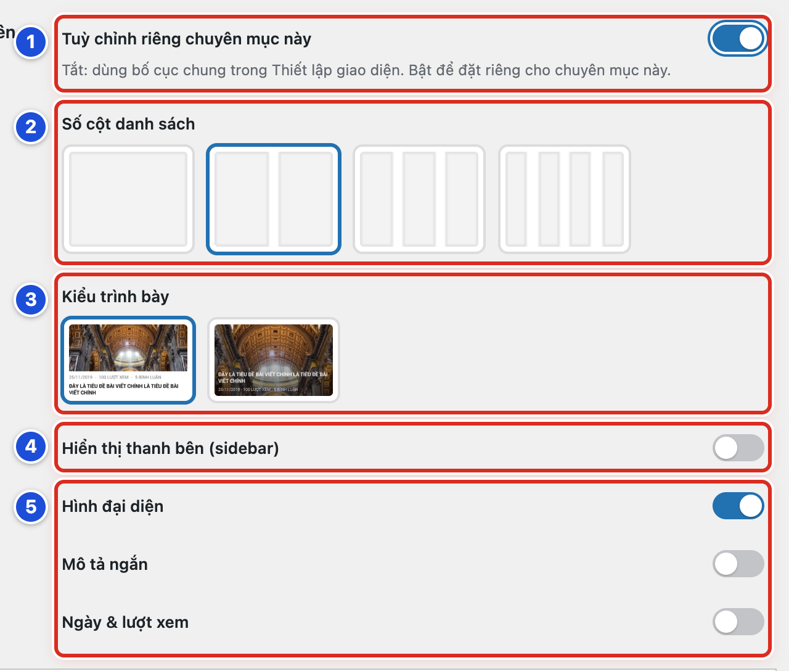

# Phần 3 Quản lý danh mục

## Chương 8 Giao diện riêng của chuyên mục

### Bài 08.01 Khi nào cần bật tùy chỉnh riêng

**Nhãn:** Kỹ thuật dành cho quản trị viên · 🟡 Cẩn thận

#### Mục đích

Cho một chuyên mục trình bày khác các chuyên mục còn lại, ví dụ chuyên mục nhiều ảnh xếp 3 cột. Chỉ bật khi thật sự cần.

#### Trước khi bắt đầu

- Đăng nhập bằng tài khoản Quản lý.
- Mở trang chuyên mục ngoài website và chụp màn hình để so sánh sau.
- Biết bố cục chung nằm ở **Chính Tòa Media → Thiết lập giao diện → Trang chủ & Bài viết → Trang Chuyên mục & Bài viết** (Bài 15.12). Mọi chuyên mục đang dùng bố cục chung này.

#### Các bước thực hiện

1. **Bước 1:** Ở menu trái, bấm **Bài viết → Danh mục**.
2. **Bước 2:** Rê chuột vào tên chuyên mục cần đổi, bấm **Chỉnh sửa**.
3. **Bước 3:** Kéo xuống hộp **Tuỳ chỉnh giao diện chuyên mục**.
4. **Bước 4:** Bật công tắc **Tuỳ chỉnh riêng chuyên mục này** (số 1). Các ô số 2 đến số 5 hiện ra.
5. **Bước 5:** Chọn các ô theo Bài 08.02 và Bài 08.03.
6. **Bước 6:** Kéo xuống cuối trang, bấm **Cập nhật**. Không bấm thì thay đổi không được lưu.
7. **Bước 7:** Mở trang chuyên mục ngoài website, so với ảnh đã chụp lúc trước.

#### Ảnh minh họa

*Hình 08.01 Hộp Tuỳ chỉnh giao diện chuyên mục khi đã bật. Số 1: công tắc Tuỳ chỉnh riêng chuyên mục này (Bước 4); số 2: Số cột danh sách; số 3: Kiểu trình bày; số 4: Hiển thị thanh bên (sidebar); số 5: Hình đại diện, Mô tả ngắn, Ngày & lượt xem.*

#### Kết quả

Bạn sẽ thấy trang chuyên mục này đổi bố cục theo lựa chọn mới. Các chuyên mục khác vẫn giữ bố cục chung.

#### Lưu ý

- Nên bật khi: chuyên mục toàn ảnh cần nhiều cột; chuyên mục bài dài cần 1 cột có mô tả ngắn; chuyên mục cần thanh bên (cột nhỏ bên cạnh nội dung) khác các chuyên mục còn lại.
- Dòng chữ dưới công tắc ghi: tắt thì chuyên mục dùng bố cục chung trong **Thiết lập giao diện**.
- Khi vừa bật, **Mô tả ngắn** và **Ngày & lượt xem** đang tắt, trong khi bố cục chung hiện cả hai. Bật lại nếu muốn giữ như cũ (Bài 08.03).
- Hộp này cũng có trong khung **Thêm Danh Mục** (Hình 07.03). Nên tạo danh mục trước, kiểm tra xong rồi mới tuỳ chỉnh.

#### Không nên làm

- Không bật tuỳ chỉnh riêng cho mọi chuyên mục. Muốn đổi cho tất cả thì sửa bố cục chung (Bài 15.12).
- Không rời trang **Sửa danh mục** khi chưa bấm **Cập nhật**.

#### Nếu gặp lỗi

- Bật công tắc mà các ô bên dưới không hiện → tải lại trang (phím F5) rồi bật lại công tắc.
- Đã chọn xong nhưng ngoài website không đổi → bạn chưa bấm **Cập nhật**; mở lại trang **Sửa danh mục**, kiểm tra công tắc còn bật, chọn lại và bấm **Cập nhật**.
- Trang chuyên mục trông khác xa dự kiến → tắt công tắc và bấm **Cập nhật** để về bố cục chung (Bài 08.04).

### Bài 08.02 Chọn số cột kiểu trình bày và thanh bên

**Nhãn:** Kỹ thuật dành cho quản trị viên · 🟡 Cẩn thận

#### Mục đích

Chọn số cột, kiểu thẻ bài và thanh bên cho trang của một chuyên mục.

#### Trước khi bắt đầu

- Đăng nhập bằng tài khoản Quản lý.
- Chuyên mục đã bật **Tuỳ chỉnh riêng chuyên mục này** (Bài 08.01).
- Chuyên mục có ít nhất vài bài đã xuất bản để xem thử.

#### Các bước thực hiện

1. **Bước 1:** Mở trang **Sửa danh mục** của chuyên mục, kéo xuống hộp **Tuỳ chỉnh giao diện chuyên mục**.
2. **Bước 2:** Ở **Số cột danh sách** (số 2), bấm ô có số cột muốn dùng: 1, 2, 3 hoặc 4 cột. Ô đang chọn có viền xanh.
3. **Bước 3:** Ở **Kiểu trình bày** (số 3), bấm ảnh bên trái (ảnh trên, chữ dưới) hoặc ảnh bên phải (chữ nằm trên ảnh).
4. **Bước 4:** Bật **Hiển thị thanh bên (sidebar)** (số 4) nếu muốn trang có thanh bên.
5. **Bước 5:** Ở **Vị trí thanh bên** (hiện ra khi bật), bấm ảnh thanh bên trái hoặc thanh bên phải.
6. **Bước 6:** Bấm **Cập nhật** ở cuối trang.
7. **Bước 7:** Xem trang chuyên mục trên máy tính và trên điện thoại.

#### Ảnh minh họa

Xem Hình 08.01: số 2 là **Số cột danh sách**, số 3 là **Kiểu trình bày**, số 4 là **Hiển thị thanh bên (sidebar)**. Bước 2 đến Bước 4 ứng với số 2 đến số 4.

#### Kết quả

Bạn sẽ thấy các bài trong chuyên mục xếp theo số cột đã chọn. Nếu bật thanh bên, cột nhỏ hiện ở bên đã chọn.

#### Lưu ý

- Trên điện thoại (màn hình hẹp), danh sách tự xếp thành 1 cột cho dễ đọc.
- Thanh bên hiện các widget (ô nhỏ ở thanh bên) của khu vực **Chuyên Mục** trong **Giao diện → Cấu hình cột tiện ích** (Chương 18). Khu vực này trống thì thanh bên trống.
- Kiểu “chữ nằm trên ảnh” không hiện **Mô tả ngắn**.
- 3–4 cột hợp với chuyên mục nhiều ảnh, tiêu đề ngắn. Bài có tiêu đề dài nên dùng 1–2 cột.

#### Không nên làm

- Không chọn 4 cột kèm thanh bên. Các thẻ bài sẽ rất hẹp.
- Không bật thanh bên khi khu vực **Chuyên Mục** chưa có widget nào.

#### Nếu gặp lỗi

- Không thấy **Vị trí thanh bên** → công tắc **Hiển thị thanh bên (sidebar)** chưa bật.
- Đã bật thanh bên nhưng ngoài website chỉ thấy khoảng trống → khu vực widget **Chuyên Mục** chưa có widget; thêm widget (Bài 18.03) hoặc tắt thanh bên.
- Chọn 3 cột mà trên điện thoại chỉ thấy 1 cột → đúng như thiết kế; mở trên máy tính để thấy đủ cột.
- Tiêu đề bài bị xuống nhiều dòng, thẻ quá hẹp → giảm **Số cột danh sách** rồi bấm **Cập nhật**.

### Bài 08.03 Bật tắt ảnh mô tả ngày và lượt xem

**Nhãn:** Kỹ thuật dành cho quản trị viên · 🟡 Cẩn thận

#### Mục đích

Chọn những thông tin hiện trên mỗi thẻ bài (ô chứa ảnh và tên một bài) ở trang chuyên mục.

#### Trước khi bắt đầu

- Đăng nhập bằng tài khoản Quản lý.
- Chuyên mục đã bật **Tuỳ chỉnh riêng chuyên mục này** (Bài 08.01).
- Biết các bài trong chuyên mục có ảnh đại diện và mô tả ngắn hay không.

#### Các bước thực hiện

1. **Bước 1:** Mở trang **Sửa danh mục**, kéo xuống hộp **Tuỳ chỉnh giao diện chuyên mục**.
2. **Bước 2:** Bật hoặc tắt **Hình đại diện** (ảnh đại diện của bài).
3. **Bước 3:** Bật hoặc tắt **Mô tả ngắn** (đoạn tóm tắt dưới tên bài).
4. **Bước 4:** Bật hoặc tắt **Ngày & lượt xem** (ngày đăng và số lượt xem).
5. **Bước 5:** Bấm **Cập nhật** ở cuối trang.
6. **Bước 6:** Mở trang chuyên mục, xem một bài có ảnh và một bài không có ảnh.

#### Ảnh minh họa

Xem Hình 08.01, số 5: ba công tắc **Hình đại diện**, **Mô tả ngắn**, **Ngày & lượt xem**. Công tắc bật có nền xanh, nút tròn nằm bên phải.

#### Kết quả

Bạn sẽ thấy mỗi thẻ bài chỉ hiện những phần đang bật.

#### Lưu ý

- Bài **Lời Chúa (câu ghi nhớ)** không có ảnh đại diện sẽ hiện câu Lời Chúa ở chỗ ảnh. Tắt **Hình đại diện** ở **Suy niệm** thì câu Lời Chúa này cũng mất.
- **Mô tả ngắn** chỉ hiện với kiểu trình bày ảnh trên, chữ dưới.
- Tắt **Hình đại diện** chỉ ẩn ảnh ở trang chuyên mục. Ảnh của bài không bị xoá.
- Bài chưa có mô tả ngắn thì website tự lấy mấy chục chữ đầu bài, có thể bị cắt giữa câu.
- Lượt xem do plugin WP-PostViews đếm.
- Khi vừa bật tuỳ chỉnh riêng, **Hình đại diện** đang bật, hai công tắc còn lại đang tắt.

#### Không nên làm

- Không tắt **Hình đại diện** ở chuyên mục **Suy niệm**.
- Không bật **Mô tả ngắn** khi phần lớn bài chưa có mô tả ngắn được viết sẵn (Bài 05.05).

#### Nếu gặp lỗi

- Bật **Mô tả ngắn** mà không thấy đoạn tóm tắt → **Kiểu trình bày** đang là chữ nằm trên ảnh; chọn kiểu ảnh trên, chữ dưới, rồi bấm **Cập nhật**.
- Lượt xem luôn là 0 → bài mới chưa có người xem, hoặc plugin WP-PostViews đã bị tắt; báo người phụ trách kỹ thuật.
- Bật tắt mà trang chuyên mục không đổi → công tắc **Tuỳ chỉnh riêng chuyên mục này** đang tắt; bật lên, chọn lại rồi bấm **Cập nhật**.

### Bài 08.04 Trở về bố cục chung của giao diện

**Nhãn:** Kỹ thuật dành cho quản trị viên · 🟢 An toàn

#### Mục đích

Bỏ bố cục riêng để chuyên mục dùng lại bố cục chung giống các chuyên mục khác.

#### Trước khi bắt đầu

- Đăng nhập bằng tài khoản Quản lý.
- Chụp màn hình hộp **Tuỳ chỉnh giao diện chuyên mục** để nhớ các lựa chọn riêng đang có.

#### Các bước thực hiện

1. **Bước 1:** Ở menu trái, bấm **Bài viết → Danh mục**.
2. **Bước 2:** Rê chuột vào tên chuyên mục, bấm **Chỉnh sửa**.
3. **Bước 3:** Kéo xuống hộp **Tuỳ chỉnh giao diện chuyên mục**.
4. **Bước 4:** Tắt công tắc **Tuỳ chỉnh riêng chuyên mục này** (số 1). Các ô bên dưới ẩn đi.
5. **Bước 5:** Bấm **Cập nhật** ở cuối trang.
6. **Bước 6:** Mở trang chuyên mục ngoài website để kiểm tra.

#### Ảnh minh họa

Xem Hình 08.01, số 1 (công tắc **Tuỳ chỉnh riêng chuyên mục này**). Khi tắt, công tắc có nền xám và nút tròn nằm bên trái.

#### Kết quả

Bạn sẽ thấy trang chuyên mục giống các chuyên mục khác, theo bố cục chung ở **Trang Chuyên mục & Bài viết**.

#### Lưu ý

- Các lựa chọn riêng vẫn được giữ, chỉ bị ẩn đi. Bật lại công tắc thì chúng hiện lại.
- Sau khi tắt, mọi thay đổi ở bố cục chung (Bài 15.12) tự áp dụng cho chuyên mục này.

#### Không nên làm

- Không tắt khi chưa hỏi người đã yêu cầu bố cục riêng cho chuyên mục.
- Không xoá rồi tạo lại danh mục chỉ để bỏ bố cục riêng. Xoá danh mục làm mất liên kết và chuyển bài sang **Suy niệm**.

#### Nếu gặp lỗi

- Đã tắt mà trang chuyên mục chưa đổi → bạn chưa bấm **Cập nhật**; mở lại trang **Sửa danh mục**, kiểm tra công tắc rồi bấm **Cập nhật**.
- Bố cục chung cũng chưa như ý → sửa ở **Thiết lập giao diện → Trang chủ & Bài viết → Trang Chuyên mục & Bài viết** (Bài 15.12).
- Bật lại công tắc thấy các lựa chọn cũ không còn hợp → chọn lại từng ô (Bài 08.02, Bài 08.03) trước khi bấm **Cập nhật**.
