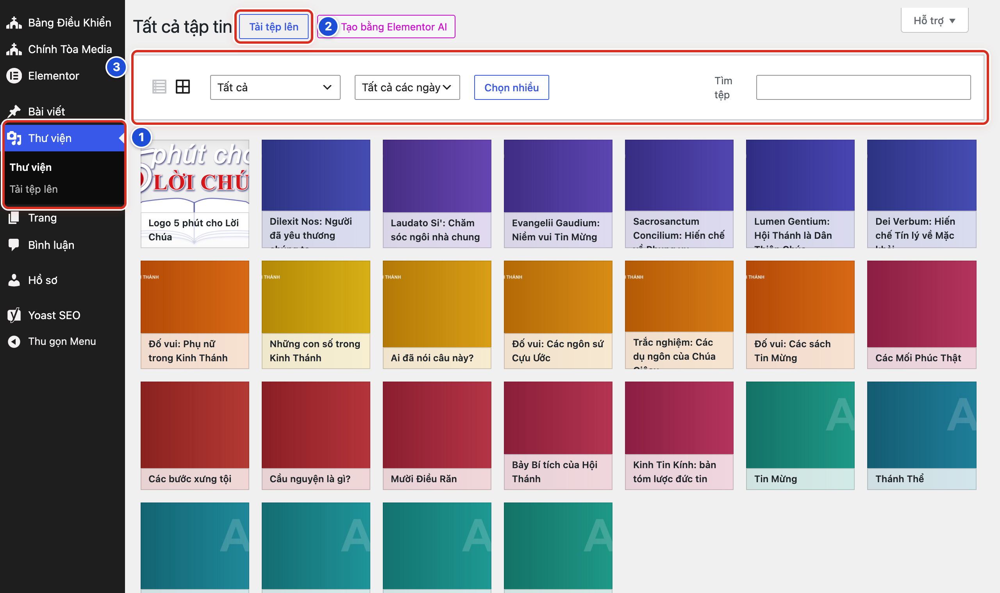
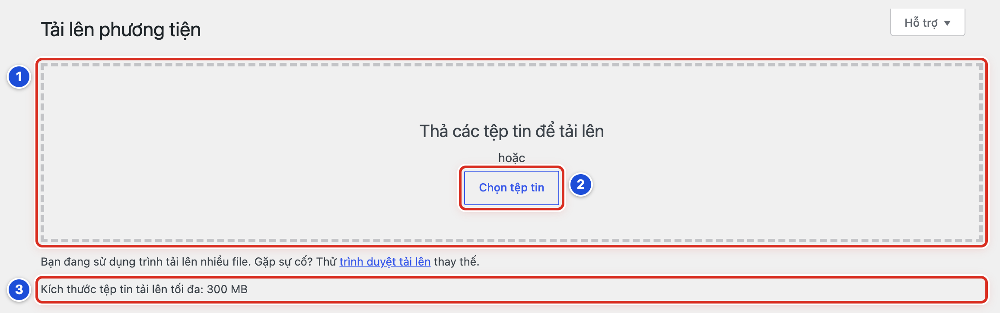
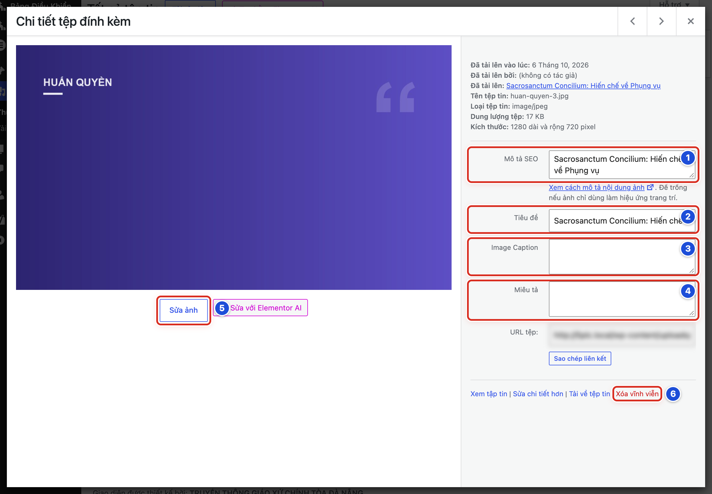

# Phần 4 Hình ảnh và thư viện

## Chương 10 Sử dụng Thư viện

### Bài 10.01 Mở Thư viện

**Nhãn:** Bắt buộc học · 🟢 An toàn

#### Mục đích

Mở Thư viện — nơi chứa mọi ảnh, video, tệp PDF đã tải lên website — để tìm và xem ảnh. Ảnh tải lên một lần có thể dùng lại cho nhiều bài.

#### Trước khi bắt đầu

Đăng nhập bằng tài khoản Biên tập viên hoặc Quản lý.

#### Các bước thực hiện

1. **Bước 1:** Ở menu trái, bấm **Thư viện** (số 1). Màn hình **Tất cả tập tin** mở ra.
2. **Bước 2:** Tìm nút **Tải tệp lên** cạnh tiêu đề **Tất cả tập tin** (số 2). Nút này dùng để thêm ảnh mới (Bài 10.02).
3. **Bước 3:** Ở thanh lọc (số 3), bấm ô **Tất cả** và chọn **Hình ảnh** để chỉ xem ảnh.
4. **Bước 4:** Bấm ô **Tất cả các ngày** và chọn tháng đã tải ảnh lên, nếu nhớ.
5. **Bước 5:** Gõ từ khoá vào ô **Tìm tệp**, ví dụ *Huấn quyền*. Thư viện lọc ngay khi bạn gõ.
6. **Bước 6:** Bấm vào một ảnh để mở khung **Chi tiết tệp đính kèm** (Bài 10.04).
7. **Bước 7:** Bấm dấu **X** ở góc trên bên phải để đóng khung chi tiết.

#### Ảnh minh họa

*Hình 10.01 Số 1: menu Thư viện; số 2: nút Tải tệp lên; số 3: thanh lọc gồm biểu tượng dạng danh sách / dạng lưới, ô Tất cả, ô Tất cả các ngày, nút Chọn nhiều và ô Tìm tệp.*

#### Kết quả

Bạn sẽ thấy các ảnh xếp thành lưới, ảnh mới nhất ở đầu. Bấm vào ảnh thì khung chi tiết của ảnh mở ra.

#### Lưu ý

- Hai biểu tượng nhỏ đầu thanh lọc đổi cách xem: **Xem dạng danh sách** (các dòng) và **Xem dạng lưới** (các ô ảnh).
- Nút **Chọn nhiều** dùng để chọn nhiều ảnh cùng lúc, thường để xoá hàng loạt. Công việc hằng ngày không cần dùng.
- Ô **Tìm tệp** tìm theo tiêu đề và tên tệp. Tên tệp đặt tốt giúp tìm nhanh (Bài 09.02).

#### Không nên làm

- Không bấm nút **Tạo bằng Elementor AI** cạnh nút **Tải tệp lên**.
- Không xoá ảnh chỉ vì tên ảnh lạ. Mở chi tiết và kiểm tra trước (Bài 10.05).

#### Nếu gặp lỗi

- Thư viện trống hoặc thiếu ảnh → ô **Tìm tệp** còn chữ cũ, hoặc ô lọc đang chọn một tháng; xoá chữ trong ô tìm, chọn lại **Tất cả** và **Tất cả các ngày**.
- Ảnh hiện thành các dòng chữ thay vì ô ảnh → bạn đang ở dạng danh sách; bấm biểu tượng **Xem dạng lưới**.
- Bấm vào ảnh mà khung chi tiết không mở, ảnh chỉ hiện dấu tích → bạn đã bấm **Chọn nhiều**; bấm **Hủy** trên thanh lọc để trở lại bình thường.

### Bài 10.02 Tải một ảnh mới lên

**Nhãn:** Bắt buộc học · 🟢 An toàn

#### Mục đích

Đưa ảnh đã chuẩn bị từ máy tính vào Thư viện để dùng cho bài viết.

#### Trước khi bắt đầu

- Ảnh đã được chuẩn bị theo Chương 9: đúng loại tệp, tên không dấu, nặng dưới 1 MB.
- Ở menu trái, bấm **Thư viện → Tải tệp lên**. Màn hình **Tải lên phương tiện** mở ra.

#### Các bước thực hiện

1. **Bước 1:** Kéo tệp ảnh từ thư mục trên máy, thả vào khung **Thả các tệp tin để tải lên** (số 1).
2. **Bước 2:** Nếu không kéo thả được, bấm **Chọn tệp tin** (số 2), chọn ảnh trên máy rồi bấm **Mở**.
3. **Bước 3:** Đọc dòng **Kích thước tệp tin tải lên tối đa: 300 MB** (số 3). Ảnh của bạn phải nhỏ hơn mức này.
4. **Bước 4:** Chờ thanh tải chạy hết. Ảnh hiện thành một dòng ngay dưới khung, kèm tên tệp.
5. **Bước 5:** Ở menu trái, bấm **Thư viện**. Ảnh vừa tải nằm đầu tiên.
6. **Bước 6:** Bấm vào ảnh mới và điền **Mô tả SEO** (Bài 10.04).

#### Ảnh minh họa

*Hình 10.02 Số 1: khung thả tệp; số 2: nút Chọn tệp tin; số 3: dòng kích thước tệp tải lên tối đa.*

#### Kết quả

Bạn sẽ thấy ảnh mới ở đầu Thư viện, sẵn sàng để chèn vào bài hoặc đặt làm ảnh đại diện.

#### Lưu ý

- Có thể kéo thả nhiều ảnh cùng lúc.
- Khi đang viết bài, bạn cũng tải ảnh lên được ngay trong bài: khối **Hình ảnh** (nút **Tải lên**, Hình 05.01) hoặc hộp **Ảnh đại diện** (tab **Tải lên tệp mới**). Ảnh vẫn được lưu vào Thư viện.
- Mức 300 MB là giới hạn của máy chủ, không phải kích thước nên dùng. Ảnh nên nặng dưới 1 MB (Bài 09.04).

#### Không nên làm

- Không đóng tab hoặc tắt máy khi thanh tải chưa chạy xong.
- Không tải lại cùng một ảnh nhiều lần. Mỗi lần tải tạo thêm một bản trùng trong Thư viện.

#### Nếu gặp lỗi

- Báo *Rất tiếc, bạn không được phép tải lên định dạng tệp tin này.* → tệp không phải loại ảnh thông dụng; lưu lại thành JPG hoặc PNG (Bài 09.01).
- Thanh tải chạy rất lâu hoặc báo lỗi → ảnh quá nặng hoặc mạng yếu; thu nhỏ ảnh dưới 1 MB (Bài 09.04) rồi tải lại.
- Kéo thả không có tác dụng → bấm nút **Chọn tệp tin**, hoặc bấm liên kết *trình duyệt tải lên* ngay dưới khung để dùng cách tải đơn giản.
- Lỡ tải một ảnh hai lần → Thư viện có hai bản giống nhau; giữ một bản, bản thừa chưa dùng ở đâu thì xoá (Bài 10.08).

### Bài 10.03 Chọn lại ảnh đã có

**Nhãn:** Bắt buộc học · 🟢 An toàn

#### Mục đích

Dùng lại ảnh đã có trong Thư viện cho một bài khác, thay vì tải lên thêm một bản trùng.

#### Trước khi bắt đầu

- Biết một từ trong tiêu đề hoặc tên tệp của ảnh.
- Mở bài cần ảnh (bản nháp của bạn). Ở cột phải, tab **Bài viết**, bấm **Đặt ảnh đại diện** (Hình 05.02a). Hộp **Ảnh đại diện** mở ra.

#### Các bước thực hiện

1. **Bước 1:** Bấm tab **Tất cả tập tin** (số 1).
2. **Bước 2:** Bấm vào ảnh cần dùng (số 2). Ảnh được chọn có viền xanh và dấu tích. Không thấy ảnh thì gõ từ khoá vào ô **Tìm tệp**.
3. **Bước 3:** Xem ô **Văn bản thay thế** bên phải (số 3). Nếu trống, gõ một câu tả ảnh.
4. **Bước 4:** Bấm nút **Đặt ảnh đại diện** ở góc dưới bên phải (số 4).
5. **Bước 5:** Bấm **Lưu nháp** (bài chưa đăng) hoặc **Lưu thay đổi** (bài đã đăng).

#### Ảnh minh họa

Xem Hình 05.02b (hộp **Ảnh đại diện**): số 1 là tab **Tất cả tập tin**, số 2 là ảnh đã chọn, số 3 là ô **Văn bản thay thế**, số 4 là nút **Đặt ảnh đại diện**. Bước 1 đến Bước 4 ứng với số 1 đến số 4.

#### Kết quả

Bạn sẽ thấy ảnh đã chọn hiện ở ô ảnh đại diện trong cột phải. Thư viện không có thêm bản trùng nào.

#### Lưu ý

- Ô **Văn bản thay thế** trong hộp này chính là ô **Mô tả SEO** trong Thư viện. Hai tên, một ô.
- Chèn ảnh có sẵn vào nội dung: ở khối **Hình ảnh** trống, bấm **Tất cả tập tin** (Hình 05.01, số 2), chọn ảnh như Bước 2–3, rồi bấm nút **Chọn**.
- Ô lọc **Lọc theo loại** và **Lọc theo ngày** ở đầu hộp giúp thu hẹp danh sách khi Thư viện có nhiều ảnh.

#### Không nên làm

- Không chọn ảnh chỉ dựa vào hình nhỏ khi có nhiều ảnh gần giống. Đọc tên tệp và kích thước ở cột phải trước.
- Không tải lên lại một ảnh đã có chỉ vì lười tìm.

#### Nếu gặp lỗi

- Hộp chỉ có khung thả tệp, không thấy ảnh nào → hộp đang ở tab **Tải lên tệp mới**; bấm tab **Tất cả tập tin**.
- Ô **Tìm tệp** không ra ảnh → thử gõ từ không dấu như trong tên tệp, hoặc chọn **Tất cả các ngày** ở ô **Lọc theo ngày**.
- Nút **Đặt ảnh đại diện** mờ, không bấm được → chưa có ảnh nào được chọn; bấm vào một ảnh cho tới khi thấy dấu tích.

### Bài 10.04 Nhập mô tả SEO tiêu đề và chú thích

**Nhãn:** Bắt buộc học · 🟢 An toàn

#### Mục đích

Điền thông tin cho ảnh: câu tả ảnh giúp người khiếm thị và Google hiểu ảnh, tên giúp bạn tìm lại, chú thích hiện dưới ảnh trong bài.

#### Trước khi bắt đầu

Ở menu trái, bấm **Thư viện**, rồi bấm vào ảnh cần điền. Khung **Chi tiết tệp đính kèm** mở ra.

#### Các bước thực hiện

1. **Bước 1:** Gõ vào ô **Mô tả SEO** (số 1) một câu tả nội dung ảnh, ví dụ “Ca đoàn hát trong Thánh lễ Phục Sinh”.
2. **Bước 2:** Sửa ô **Tiêu đề** (số 2) thành tên dễ tìm, ví dụ “Lễ Phục Sinh 2026 – ca đoàn”.
3. **Bước 3:** Gõ vào ô **Image Caption** (số 3) dòng chú thích nếu cần, ví dụ nguồn ảnh “Ảnh: Ban Truyền thông giáo xứ”.
4. **Bước 4:** Để trống ô **Miêu tả** (số 4), trừ khi Quản lý yêu cầu ghi thêm.
5. **Bước 5:** Bấm chuột vào chỗ trống bên ngoài ô vừa gõ. Ô tự lưu.
6. **Bước 6:** Bấm dấu **X** ở góc trên bên phải để đóng khung.

#### Ảnh minh họa

*Hình 10.04 Số 1: Mô tả SEO; số 2: Tiêu đề; số 3: Image Caption; số 4: Miêu tả; số 5: nút Sửa ảnh (Bài 10.06); số 6: Xóa vĩnh viễn (Bài 10.08).*

#### Kết quả

Bạn sẽ thấy các ô giữ nguyên chữ vừa gõ khi mở lại ảnh. Ô **Tìm tệp** tìm ra ảnh theo tiêu đề mới.

#### Lưu ý

- **Mô tả SEO** còn gọi là văn bản thay thế. Trong hộp **Ảnh đại diện**, ô này tên **Văn bản thay thế**.
- Dưới ô **Mô tả SEO** có dòng nhắc: để trống nếu ảnh chỉ dùng làm hiệu ứng trang trí.
- **Image Caption** là nhãn tiếng Anh trên màn hình, nghĩa là chú thích ảnh.
- Sửa các ô trong Thư viện không tự sửa những ảnh đã chèn vào bài trước đó. Ảnh trong bài cũ giữ chữ cũ.
- Các ô tự lưu khi bạn bấm ra ngoài. Không có nút lưu riêng.

#### Không nên làm

- Không gõ chuỗi từ khoá lặp lại vào **Mô tả SEO**, ví dụ “giáo xứ, giáo xứ, lễ, lễ”.
- Không bắt đầu **Mô tả SEO** bằng “Hình ảnh của…”. Tả thẳng nội dung ảnh.

#### Nếu gặp lỗi

- Mở lại ảnh thấy chữ vừa gõ đã mất → bạn đóng khung ngay khi đang gõ; gõ lại, bấm ra ngoài ô, chờ một giây rồi mới đóng.
- Lỡ bấm mũi tên trái hoặc phải ở góc trên và chuyển sang ảnh khác → đọc **Tên tệp tin:** ở cột phải để chắc đang sửa đúng ảnh.
- Chú thích mới không hiện dưới ảnh trong bài cũ → ảnh đã chèn trước khi có chú thích; trong bài, chọn lại chính ảnh đó bằng **Thay thế** (Bài 10.07) để lấy chú thích mới.

### Bài 10.05 Xem thông tin và nơi ảnh đang được dùng

**Nhãn:** Nên biết · 🟢 An toàn

#### Mục đích

Xem ngày tải lên, dung lượng, kích thước của ảnh, và bài ảnh được tải lên cho. Nên xem trước khi sửa hoặc xoá ảnh.

#### Trước khi bắt đầu

Ở menu trái, bấm **Thư viện**, rồi bấm vào ảnh cần xem. Khung **Chi tiết tệp đính kèm** mở ra.

#### Các bước thực hiện

1. **Bước 1:** Đọc phần chữ ở đầu cột phải, phía trên ô **Mô tả SEO**.
2. **Bước 2:** Xem dòng **Đã tải lên vào lúc:** để biết ngày ảnh được tải lên.
3. **Bước 3:** Xem dòng **Dung lượng tệp:**. Dưới 1 MB là tốt.
4. **Bước 4:** Xem dòng **Kích thước:**. Số đầu là chiều ngang, số sau là chiều cao (ví dụ *1280 dài và rộng 720 pixel* nghĩa là ngang 1280, cao 720).
5. **Bước 5:** Xem dòng **Đã tải lên:**. Đây là tên bài mà ảnh được tải lên lần đầu. Bấm vào tên bài để mở bài đó.
6. **Bước 6:** Muốn xem nhiều ảnh cùng lúc, đóng khung, bấm biểu tượng **Xem dạng danh sách** (Hình 10.01, số 3) rồi đọc cột **Đã tải lên vào**.

#### Ảnh minh họa

Xem Hình 10.04: phần chữ ở đầu cột phải của khung chi tiết ghi **Đã tải lên vào lúc:**, **Đã tải lên bởi:**, **Đã tải lên:** (tên bài), **Tên tệp tin:**, **Loại tệp tin:**, **Dung lượng tệp:**, **Kích thước:**.

#### Kết quả

Bạn sẽ thấy ảnh nặng bao nhiêu, lớn bao nhiêu, và bài nào đã dùng ảnh khi tải lên.

#### Lưu ý

- Dòng **Đã tải lên:** chỉ ghi bài đầu tiên. Ảnh có thể đang được dùng ở bài khác, làm ảnh đại diện, làm logo, banner đầu trang hay trong widget mà Thư viện không ghi.
- Ảnh tải thẳng vào Thư viện không có dòng **Đã tải lên:**. Ở dạng danh sách, cột **Đã tải lên vào** ghi *Chưa được đính kèm*.
- *Chưa được đính kèm* không có nghĩa là ảnh không được dùng ở đâu.

#### Không nên làm

- Không xoá ảnh chỉ vì nó ghi *Chưa được đính kèm*.
- Không sửa ảnh đang làm logo hoặc banner đầu trang. Việc đó do Quản lý làm (Chương 14).

#### Nếu gặp lỗi

- Không thấy dòng **Đã tải lên:** → ảnh được tải thẳng vào Thư viện, không gắn với bài nào; hỏi người tải lên trước khi sửa hoặc xoá.
- Bấm tên bài ở dòng **Đã tải lên:** mà bài không còn ảnh đó → ảnh đã được thay trong bài; ảnh có thể vẫn dùng ở chỗ khác, hỏi Quản lý trước khi xoá.
- Dòng **Kích thước:** không có → tệp không phải ảnh (ví dụ PDF hoặc âm thanh); kiểm tra **Loại tệp tin:**.

### Bài 10.06 Cắt xoay hoặc thay tỷ lệ ảnh

**Nhãn:** Nên biết · 🟡 Cẩn thận

#### Mục đích

Cắt bớt mép, xoay ảnh bị ngược, hoặc cắt ảnh về khung 16:9 ngay trong Thư viện khi không có phần mềm sửa ảnh.

#### Trước khi bắt đầu

- Ảnh gốc vẫn còn trên máy của bạn.
- Đã xem ảnh đang được dùng ở đâu (Bài 10.05). Nếu ảnh dùng ở nhiều nơi, nên tải lên một bản mới (Bài 10.02) và sửa bản mới.
- Ở menu trái, bấm **Thư viện**, rồi bấm vào ảnh cần sửa.

#### Các bước thực hiện

1. **Bước 1:** Bấm nút **Sửa ảnh** dưới ảnh xem trước (Hình 10.04, số 5). Khung sửa ảnh mở ra.
2. **Bước 2:** Để cắt: bấm giữ chuột trên ảnh và kéo để khoanh vùng muốn giữ. Khung **Cắt ảnh** hiện ở bên phải.
3. **Bước 3:** Muốn đúng khung 16:9, gõ 16 và 9 vào hai ô **Giữ tỉ lệ:** trong khung **Cắt ảnh**.
4. **Bước 4:** Bấm **Áp dụng Cắt**.
5. **Bước 5:** Để xoay: bấm nút **Xoay Ảnh** phía trên ảnh.
6. **Bước 6:** Chọn **Xoay 90° về bên trái** hoặc **Xoay 90° về bên phải**.
7. **Bước 7:** Bấm **Lưu chỉnh sửa**.
8. **Bước 8:** Xem lại ảnh trong khung **Chi tiết tệp đính kèm** và dòng **Kích thước:** mới.

#### Ảnh minh họa

Xem Hình 10.04, số 5 (nút **Sửa ảnh**). Không bấm nút **Sửa với Elementor AI** nằm ngay bên cạnh.

#### Kết quả

Bạn sẽ thấy ảnh xem trước đã được cắt hoặc xoay, và dòng **Kích thước:** ghi số mới.

#### Lưu ý

- Ảnh đại diện dùng ảnh này sẽ đổi theo. Ảnh đã chèn sẵn trong nội dung bài cũ thường vẫn giữ bản cũ; muốn đổi thì thay lại ảnh trong bài (Bài 10.07).
- Mục **Phóng to/Thu nhỏ ảnh** trong khung sửa chỉ thu nhỏ được, không phóng to được.
- WordPress vẫn giữ bản gốc. Mục **Hoàn lại ảnh gốc** trong khung sửa giúp quay về bản ban đầu.
- Nút **Hoàn tác** và **Làm lại** phía trên ảnh huỷ hoặc làm lại thao tác vừa làm, khi chưa bấm **Lưu chỉnh sửa**.

#### Không nên làm

- Không cắt ảnh đang làm logo hoặc banner đầu trang.
- Không dùng **Sửa ảnh** để cắt bỏ thông tin riêng trong ảnh. Bản gốc vẫn còn (Bài 09.05).

#### Nếu gặp lỗi

- Nút **Áp dụng Cắt** mờ, không bấm được → chưa khoanh vùng trên ảnh; bấm giữ chuột và kéo trên ảnh trước.
- Cắt sai và đã lưu → bấm lại **Sửa ảnh**, mở mục **Hoàn lại ảnh gốc**, bấm **Lấy lại ảnh**.
- Ảnh trong bài cũ chưa đổi sau khi sửa → ảnh đã chèn giữ bản cũ; bấm vào ảnh trong bài và chọn lại ảnh (Bài 10.07).
- Lỡ bấm **Hủy chỉnh sửa** → các thao tác chưa lưu bị bỏ; làm lại từ Bước 2.

### Bài 10.07 Thay ảnh trong bài viết

**Nhãn:** Bắt buộc học · 🟢 An toàn

#### Mục đích

Đổi một ảnh trong nội dung bài sang ảnh khác, mà không xoá ảnh cũ khỏi Thư viện.

#### Trước khi bắt đầu

- Ảnh mới đã có trong Thư viện (Bài 10.02).
- Mở bài cần sửa: **Bài viết → Tất cả bài viết**, rê chuột vào tên bài, bấm **Chỉnh sửa**.

#### Các bước thực hiện

1. **Bước 1:** Bấm vào ảnh cần thay trong nội dung. Thanh công cụ của khối hiện phía trên ảnh.
2. **Bước 2:** Bấm **Thay thế** trên thanh công cụ của khối.
3. **Bước 3:** Chọn **Mở tất cả tập tin**.
4. **Bước 4:** Bấm vào ảnh mới cho tới khi thấy dấu tích.
5. **Bước 5:** Kiểm tra ô **Văn bản thay thế** ở cột phải của hộp.
6. **Bước 6:** Bấm nút **Chọn** ở góc dưới bên phải.
7. **Bước 7:** Đọc dòng chú thích dưới ảnh; sửa lại nếu còn là chú thích của ảnh cũ.
8. **Bước 8:** Bấm **Lưu thay đổi** (bài đã đăng) hoặc **Lưu nháp** (bài chưa đăng).

#### Ảnh minh họa

Xem Hình 05.01 (khối **Hình ảnh**). Menu **Thay thế** có các cách chọn ảnh giống khối Hình ảnh trống: **Mở tất cả tập tin** (giống **Tất cả tập tin**, số 2), **Tải lên** (số 1) và ô dán địa chỉ ảnh.

#### Kết quả

Bạn sẽ thấy ảnh mới nằm đúng chỗ ảnh cũ trong bài. Ảnh cũ vẫn còn trong Thư viện.

#### Lưu ý

- Chọn **Tải lên** trong menu **Thay thế** thì máy mở thư mục để chọn ảnh từ máy tính; ảnh vừa tải tự thay vào chỗ ảnh cũ.
- Thay ảnh trong nội dung không đổi ảnh đại diện. Đổi ảnh đại diện ở cột phải: bấm vào ảnh đại diện và chọn ảnh khác (Bài 10.03).
- Nếu ảnh mới chưa có chú thích, khối giữ chú thích của ảnh cũ. Luôn đọc lại dòng chú thích.

#### Không nên làm

- Không xoá khối ảnh rồi chèn khối mới khi chỉ cần thay ảnh. Bạn sẽ mất kích thước và vị trí đã chỉnh.
- Không xoá ảnh cũ trong Thư viện ngay sau khi thay. Ảnh có thể đang dùng ở bài khác (Bài 10.05).

#### Nếu gặp lỗi

- Không thấy nút **Thay thế** → bạn chưa bấm đúng vào ảnh; bấm thẳng vào giữa ảnh để chọn khối.
- Ảnh mới không hiện ngoài website → bạn chưa bấm **Lưu thay đổi**; bấm lưu rồi tải lại trang ngoài website (phím F5).
- Chú thích dưới ảnh mới vẫn nói về ảnh cũ → bấm vào dòng chú thích, xoá và gõ lại.

### Bài 10.08 Xóa vĩnh viễn một ảnh

**Nhãn:** Nên biết · 🟡 Cẩn thận

#### Mục đích

Xoá hẳn một ảnh không còn dùng khỏi website, ví dụ ảnh tải lên trùng hoặc ảnh đăng nhầm.

#### Trước khi bắt đầu

- Chắc chắn ảnh không còn dùng trong bài, làm ảnh đại diện, logo, banner hay widget (Bài 10.05).
- Với ảnh không phải do bạn tải lên, hỏi Quản lý trước.
- Ảnh gốc vẫn còn trên máy, phòng khi cần tải lên lại.

#### Các bước thực hiện

1. **Bước 1:** Ở menu trái, bấm **Thư viện**.
2. **Bước 2:** Gõ tên ảnh vào ô **Tìm tệp**.
3. **Bước 3:** Bấm vào đúng ảnh cần xoá.
4. **Bước 4:** Đọc **Tên tệp tin:** và dòng **Đã tải lên:** ở cột phải để chắc là đúng ảnh.
5. **Bước 5:** Bấm **Xóa vĩnh viễn** (chữ đỏ, số 6).
6. **Bước 6:** Đọc hộp hỏi lại: hành động này không thể hoàn tác. Bấm **OK** để xoá.

#### Ảnh minh họa

Xem Hình 10.04, số 6: liên kết **Xóa vĩnh viễn** ở cuối cột phải của khung **Chi tiết tệp đính kèm**.

#### Kết quả

Bạn sẽ thấy khung chi tiết đóng lại và ảnh biến mất khỏi Thư viện.

#### Lưu ý

- Thư viện không có Thùng rác. Ảnh đã xoá vĩnh viễn không lấy lại được.
- Nếu ảnh còn nằm trong bài, chỗ đó sẽ thành ô ảnh hỏng. Nếu ảnh là ảnh đại diện, bài sẽ mất ảnh đại diện.
- Gỡ ảnh khỏi bài không xoá ảnh khỏi Thư viện. Muốn ảnh biến mất hẳn khỏi mạng thì mới cần **Xóa vĩnh viễn**.

#### Không nên làm

- Không xoá ảnh chỉ vì nó ghi *Chưa được đính kèm*.
- Không dùng nút **Chọn nhiều** để xoá hàng loạt khi chưa kiểm tra từng ảnh.

#### Nếu gặp lỗi

- Lỡ xoá nhầm → ảnh không lấy lại được trong Thư viện; tải lại ảnh gốc từ máy (Bài 10.02) rồi chọn lại cho các bài (Bài 10.03, Bài 10.07). Nếu là logo hoặc banner, báo Quản lý.
- Bài có ô ảnh hỏng sau khi xoá → mở bài, bấm vào ô ảnh hỏng, bấm **Thay thế** để chọn ảnh khác (Bài 10.07), rồi lưu.
- Lỡ bấm **Xóa vĩnh viễn** → trong hộp hỏi lại, bấm **Hủy**; ảnh còn nguyên.
