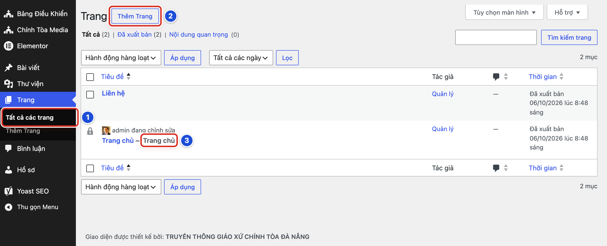
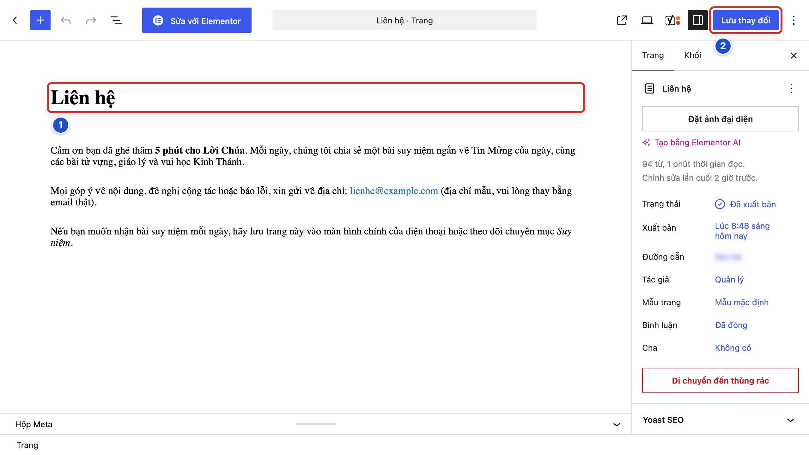

# Phần 5 Quản lý trang

## Chương 11 Hiểu và chỉnh sửa trang

### Bài 11.01 Phân biệt Trang và Bài viết

**Nhãn:** Bắt buộc học · 🟢 An toàn

#### Mục đích

Biết khi nào dùng **Bài viết**, khi nào dùng **Trang**, để tạo nội dung đúng chỗ ngay từ đầu.

#### Trước khi bắt đầu

Biết nội dung sắp tạo là gì: tin tức, suy niệm theo ngày, hay thông tin cố định của giáo xứ.

#### Các bước thực hiện

1. **Bước 1:** Tự hỏi: nội dung này có gắn với một ngày, và sẽ có bài mới cùng loại về sau không?
2. **Bước 2:** Nếu có (suy niệm, thông báo, bài giáo lý, video Lời Chúa), tạo **Bài viết** (**Bài viết → Thêm Bài Viết**).
3. **Bước 3:** Nếu là thông tin cố định, ít khi đổi (Liên hệ, Giới thiệu giáo xứ), tạo **Trang** (**Trang → Thêm Trang**, Bài 11.03).
4. **Bước 4:** Nếu chưa chắc, hỏi Quản lý trước khi tạo.

#### Ảnh minh họa

Bài này không cần ảnh minh họa.

#### Kết quả

Bạn sẽ thấy nội dung mới nằm đúng chỗ: bài viết trong **Bài viết → Tất cả bài viết**, trang trong **Trang → Tất cả các trang**.

#### Lưu ý

| | Bài viết | Trang |
|---|---|---|
| Có ngày đăng | Có | Không hiện ngày |
| Thuộc danh mục | Có | Không |
| Tự hiện ở trang chủ, trang chuyên mục | Có (theo danh mục) | Không |
| Người đọc tìm thấy nhờ | Khối trang chủ, chuyên mục, tìm kiếm | Thanh menu, liên kết |

- Website mẫu có 2 trang: **Trang chủ** (trang đặc biệt, xem Chương 12) và **Liên hệ**.
- Trang không có hộp **Phân loại bài viết**. Bài Lời Chúa và bài video luôn là **Bài viết**.
- Trang mới không tự hiện trên thanh menu. Quản lý thêm trang vào menu (Bài 17.03).

#### Không nên làm

- Không tạo Trang cho bài suy niệm hay thông báo hằng tuần.
- Không tạo cùng một nội dung ở cả Bài viết lẫn Trang.

#### Nếu gặp lỗi

- Lỡ tạo Trang cho một bài thông báo → nếu trang còn là bản nháp, chép nội dung sang một bài viết mới, rồi bấm **Xóa tạm** trang nháp đó.
- Không tìm thấy nội dung vừa tạo trong **Bài viết → Tất cả bài viết** → có thể bạn đã tạo Trang; xem ở **Trang → Tất cả các trang**.
- Đã xuất bản nhầm loại → không xoá vội; báo Quản lý, vì nội dung có thể đã được chia sẻ hoặc gắn vào menu.

### Bài 11.02 Xem danh sách trang

**Nhãn:** Bắt buộc học · 🟢 An toàn

#### Mục đích

Xem các trang đang có, nhận ra trang nào đang là trang chủ, trước khi sửa hoặc tạo trang mới.

#### Trước khi bắt đầu

Đăng nhập bằng tài khoản Biên tập viên hoặc Quản lý. Bài này chỉ xem, không thay đổi gì.

#### Các bước thực hiện

1. **Bước 1:** Ở menu trái, bấm **Trang → Tất cả các trang** (số 1).
2. **Bước 2:** Tìm nút **Thêm Trang** cạnh tiêu đề **Trang** (số 2). Nút này dùng để tạo trang mới (Bài 11.03).
3. **Bước 3:** Tìm dòng **Trang chủ — Trang chủ** (số 3). Nhãn **— Trang chủ** sau tên cho biết trang này đang được đặt làm trang chủ.
4. **Bước 4:** Đọc cột **Thời gian** của từng trang: *Đã xuất bản* kèm ngày giờ.
5. **Bước 5:** Rê chuột vào tên một trang để thấy dòng **Chỉnh sửa | Sửa nhanh | Xóa tạm | Xem**.
6. **Bước 6:** Muốn tìm một trang, gõ tên vào ô tìm ở góc trên bên phải, bấm **Tìm kiếm trang**.

#### Ảnh minh họa

*Hình 11.02 Số 1: mục Tất cả các trang; số 2: nút Thêm Trang; số 3: nhãn “— Trang chủ” cho biết trang đang là trang chủ.*

#### Kết quả

Bạn sẽ thấy 2 trang: **Liên hệ** và **Trang chủ — Trang chủ**, cả hai đều *Đã xuất bản*.

#### Lưu ý

- Trang nháp có chữ **— Bản nháp** sau tên.
- Dòng lọc phía trên bảng (**Tất cả**, **Đã xuất bản**…) cho biết số trang theo trạng thái.
- Trang **Trang chủ** là trang đặc biệt. Không xoá, không đổi trạng thái, không đổi mẫu trang (Bài 11.06).

#### Không nên làm

- Không bấm **Xóa tạm** ở dòng **Trang chủ**.
- Không dùng ô **Hành động hàng loạt** ở danh sách trang.

#### Nếu gặp lỗi

- Không thấy trang vừa tạo → trang có thể là bản nháp hoặc đang lọc theo trạng thái khác; bấm **Tất cả** ở dòng lọc.
- Không thấy nhãn **— Trang chủ** ở dòng nào → thiết lập trang chủ có thể đã bị đổi; báo Quản lý ngay (Bài 12.04).
- Ô tìm không ra trang → xoá bớt chữ, chỉ gõ một từ chính trong tên trang, rồi bấm lại **Tìm kiếm trang**.

### Bài 11.03 Tạo trang mới dưới dạng bản nháp

**Nhãn:** Nên biết · 🟢 An toàn

#### Mục đích

Tạo một trang mới, ví dụ *Giới thiệu giáo xứ*, và lưu ở dạng bản nháp (chưa ai ngoài website thấy).

#### Trước khi bắt đầu

- Quản lý đã đồng ý tạo trang và tên trang.
- Đã soạn sẵn nội dung, ảnh (nếu có) đã chuẩn bị theo Chương 9.

#### Các bước thực hiện

1. **Bước 1:** Ở màn hình **Trang**, bấm nút **Thêm Trang** (Hình 11.02, số 2). Trình soạn mở ra.
2. **Bước 2:** Bấm vào ô **Thêm tiêu đề** và gõ tên trang, ví dụ *Giới thiệu giáo xứ*.
3. **Bước 3:** Bấm vào dòng trống dưới tiêu đề và gõ nội dung (Hình 04.02).
4. **Bước 4:** Ở cột phải, tab **Trang**, kiểm tra **Mẫu trang** đang là **Mẫu mặc định**.
5. **Bước 5:** Bấm **Lưu nháp** ở thanh trên cùng.

#### Ảnh minh họa

Xem Hình 11.02, số 2 (nút **Thêm Trang**). Cách gõ tiêu đề và nội dung giống bài viết: xem Hình 04.02 (số 1 là tiêu đề, số 2 là đoạn nội dung đầu tiên).

#### Kết quả

Bạn sẽ thấy thông báo *Đã lưu nháp.* ở góc dưới. Trong **Trang → Tất cả các trang**, trang mới có chữ **— Bản nháp** sau tên.

#### Lưu ý

- Soạn trang giống hệt soạn bài viết (Chương 4): nút **+** để thêm khối, khối **Văn bản**, **Tiêu đề**, **Hình ảnh**…
- Trang không có bảng **Danh mục** và **Thẻ**.
- Ảnh đại diện của trang không hiện ngoài website. Muốn có ảnh, chèn khối **Hình ảnh** vào nội dung.
- Trang mới không tự hiện trên thanh menu. Sau khi trang được xuất bản, Quản lý thêm vào menu (Bài 17.03).

#### Không nên làm

- Không bấm nút xanh **Sửa với Elementor** (xem Phụ lục C).
- Không chọn **Mẫu trang** là **Trang Chủ** cho trang mới. Mẫu này chỉ dành cho trang chủ.
- Không bấm **Xuất bản** khi trang chưa được Quản lý duyệt.

#### Nếu gặp lỗi

- Lỡ bấm **Xuất bản** một lần → bảng **Bạn sẵn sàng xuất bản chưa?** hiện ra; bấm **Hủy**, trang vẫn là bản nháp.
- Lỡ xuất bản trang chưa duyệt → ở cột phải, bấm chữ **Đã xuất bản** cạnh **Trạng thái**, chọn **Bản nháp**, rồi lưu lại; báo Quản lý.
- Lỡ bấm **Sửa với Elementor** → không sửa gì trong màn hình Elementor; thoát ra và báo Quản lý (Phụ lục C).
- Không thấy nút **Lưu nháp** → trang đã được xuất bản; kiểm tra **Trạng thái** ở cột phải.

### Bài 11.04 Chỉnh sửa trang bằng Gutenberg

**Nhãn:** Bắt buộc học · 🟡 Cẩn thận

#### Mục đích

Sửa chữ, ảnh hoặc liên kết trong một trang đã có, ví dụ trang **Liên hệ**, bằng trình soạn Gutenberg (trình soạn theo khối của WordPress).

#### Trước khi bắt đầu

- Biết chính xác cần sửa gì, ở đoạn nào.
- Mở **Trang → Tất cả các trang**. Rê chuột vào tên trang, bấm **Chỉnh sửa**.
- Không mở trang **Trang chủ** để sửa nội dung trang chủ (Bài 12.02).

#### Các bước thực hiện

1. **Bước 1:** Đọc tiêu đề ở đầu vùng soạn (số 1) để chắc đang mở đúng trang.
2. **Bước 2:** Bấm vào đoạn văn cần sửa và gõ nội dung mới.
3. **Bước 3:** Nếu cần thêm nội dung, bấm nút **+** để thêm khối, giống khi viết bài (Chương 4).
4. **Bước 4:** Bấm nút **Xem** để xem trước (Bài 11.05).
5. **Bước 5:** Bấm **Lưu thay đổi** (số 2).

#### Ảnh minh họa

*Hình 11.04 Trang Liên hệ trong trình soạn. Số 1: tiêu đề trang (Bước 1); số 2: nút Lưu thay đổi (Bước 5).*

#### Kết quả

Bạn sẽ thấy thông báo *Trang đã được cập nhật.* ở góc dưới. Mở trang ngoài website thấy nội dung mới.

#### Lưu ý

- Trang đã xuất bản thay đổi ngay khi bấm **Lưu thay đổi**. Không có bước duyệt.
- Cột phải có tab **Trang** (thông tin của trang) và tab **Khối** (thiết lập của khối đang chọn).
- Trong tab **Trang**, giữ nguyên **Đường dẫn**, **Mẫu trang** và **Cha** nếu chỉ sửa nội dung.

#### Không nên làm

- Không bấm nút xanh **Sửa với Elementor**.
- Không bấm **Di chuyển đến thùng rác** ở cuối cột phải.
- Không đổi **Đường dẫn** của trang đang có trên menu. Liên kết cũ sẽ không mở được.

#### Nếu gặp lỗi

- Lỡ xoá một đoạn → bấm **Hoàn tác** (mũi tên cong sang trái ở thanh trên cùng) hoặc nhấn Ctrl + Z.
- Đã bấm **Lưu thay đổi** rồi mới thấy sai → sửa lại và lưu tiếp; nếu cần lấy lại bản trước, xem lịch sử sửa (Bài 06.04).
- Lỡ mở trang **Trang chủ** và gõ chữ → bấm mũi tên quay lại ở góc trên bên trái, không lưu; nội dung trang chủ sửa ở chỗ khác (Bài 12.02).

### Bài 11.05 Xem trước và cập nhật trang

**Nhãn:** Bắt buộc học · 🟡 Cẩn thận

#### Mục đích

Xem trang trên máy tính và điện thoại trước khi lưu, rồi lưu và kiểm tra ngoài website.

#### Trước khi bắt đầu

Đã sửa xong nội dung trang trong trình soạn (Bài 11.04).

#### Các bước thực hiện

1. **Bước 1:** Bấm nút **Xem** (hình màn hình) ở thanh trên cùng (Hình 05.06, số 1).
2. **Bước 2:** Chọn **Di động** để xem trang như trên điện thoại (Hình 05.06, số 2).
3. **Bước 3:** Bấm **Xem** lần nữa, chọn **Xem trước ở tab mới** (Hình 05.06, số 3).
4. **Bước 4:** Ở tab mới, đọc lại nội dung, bấm thử các liên kết và địa chỉ email.
5. **Bước 5:** Quay về tab trình soạn, bấm **Lưu thay đổi** (Hình 05.09, số 2).
6. **Bước 6:** Bấm biểu tượng mũi tên chéo **Xem trang** cạnh nút **Xem** để mở trang ngoài website (Hình 05.09, số 1 — với bài viết nút này tên **Xem bài viết**).
7. **Bước 7:** Tải lại trang ngoài website (phím F5) để thấy nội dung mới.

#### Ảnh minh họa

Xem Hình 05.06 (nút **Xem**: số 1 là nút **Xem**, số 2 là **Máy tính / Máy tính bảng / Di động**, số 3 là **Xem trước ở tab mới**) và Hình 05.09 (số 2 là nút **Lưu thay đổi**). Trang dùng đúng các nút này như bài viết.

#### Kết quả

Bạn sẽ thấy thông báo *Trang đã được cập nhật.* trong trình soạn, và trang ngoài website hiện nội dung mới.

#### Lưu ý

- **Xem trước ở tab mới** chỉ người đang đăng nhập thấy. Người ngoài chỉ thấy thay đổi sau khi bấm **Lưu thay đổi**.
- Trang nháp có nút **Lưu nháp** thay cho **Lưu thay đổi**.
- Trang có thể được liên kết từ menu hoặc từ bài viết. Sau khi lưu, mở thử từ thanh menu.

#### Không nên làm

- Không bấm **Lưu thay đổi** nhiều lần liên tiếp khi trang ngoài website chưa đổi. Tải lại trang trước.
- Không lưu trang khi nội dung còn dở dang. Người đọc thấy ngay.

#### Nếu gặp lỗi

- Đã lưu nhưng trang ngoài website chưa đổi → tải lại trang (phím F5); nếu vẫn chưa đổi, kiểm tra đã thấy thông báo *Trang đã được cập nhật.* chưa.
- Tab xem trước không mở → trình duyệt chặn cửa sổ mới; cho phép cửa sổ bật lên cho website rồi bấm lại.
- Xem trên **Di động** thấy chữ hoặc ảnh tràn ra ngoài → ảnh quá rộng hoặc có bảng nhiều cột; bỏ bớt cột hoặc dùng ảnh nhỏ hơn rồi xem lại.

### Bài 11.06 Những trang không được xóa hoặc đổi trạng thái

**Nhãn:** Bắt buộc học · 🔴 Không tự thay đổi

#### Mục đích

Bảo vệ trang **Trang chủ**. Trang này giữ chỗ cho toàn bộ trang chủ của website; xoá hay đổi nó là trang chủ hỏng.

#### Trước khi bắt đầu

Biết nhận ra trang **Trang chủ** trong danh sách trang (Bài 11.02).

#### Các bước thực hiện

1. **Bước 1:** Mở **Trang → Tất cả các trang**.
2. **Bước 2:** Tìm dòng có nhãn **— Trang chủ** (Hình 11.02, số 3).
3. **Bước 3:** Ghi nhớ: ở dòng này, không bấm **Xóa tạm**.
4. **Bước 4:** Ghi nhớ: không dùng **Sửa nhanh** để đổi **Trạng thái** hoặc **Mẫu trang** của trang này.
5. **Bước 5:** Trước khi xoá hoặc chuyển nháp một trang khác (ví dụ **Liên hệ**), hỏi Quản lý xem trang có đang nằm trên menu không.

#### Ảnh minh họa

Xem Hình 11.02, số 3: nhãn **— Trang chủ** sau tên trang cho biết trang đang làm trang chủ.

#### Kết quả

Bạn sẽ thấy dòng **Trang chủ — Trang chủ** vẫn còn trong danh sách, và trang chủ ngoài website hiện đủ các khối.

#### Lưu ý

- Trang **Trang chủ** dùng **Mẫu trang: Trang Chủ** và được chọn làm trang chủ ở **Cài đặt → Đọc** (Chương 12). Không đổi mẫu, không xoá, không chuyển sang bản nháp.
- Nếu trang **Trang chủ** bị chuyển vào Thùng rác, WordPress tự bỏ thiết lập trang chủ. Khôi phục trang chưa đủ; Quản lý phải chọn lại ở **Cài đặt → Đọc**.
- Nếu đổi mẫu trang sang **Mẫu mặc định**, trang chủ chỉ còn tiêu đề “Trang chủ”, mất hết các khối.
- Trang **Liên hệ** có thể đang nằm trên menu. Xoá nó làm mục menu biến mất.

#### Không nên làm

- Không chuyển **Trang chủ** sang bản nháp để “ẩn tạm”.
- Không xoá trang chỉ vì thấy trang ít chữ hoặc trống. Trang **Trang chủ** ít hoặc không có chữ là bình thường.

#### Nếu gặp lỗi

- Lỡ bấm **Xóa tạm** trang **Trang chủ** → vào Thùng rác của danh sách trang, bấm **Khôi phục lại** (giống Bài 06.03), rồi báo Quản lý chọn lại trang chủ (Bài 12.04).
- Trang chủ ngoài website chỉ còn tiêu đề, mất các khối → **Mẫu trang** đã bị đổi; báo Quản lý chọn lại **Trang Chủ** (Bài 12.01).
- Trang chủ ngoài website thành danh sách bài mới nhất → thiết lập trang chủ đã bị bỏ; báo Quản lý kiểm tra **Cài đặt → Đọc** (Bài 12.04).
