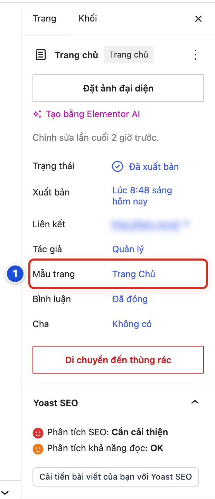
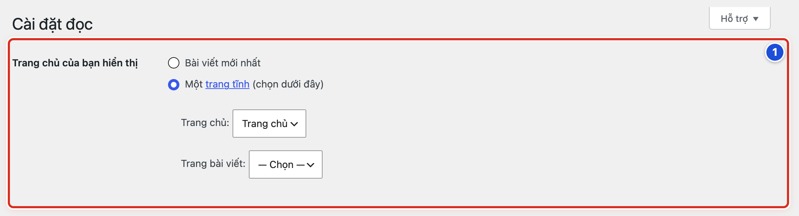

# Phần 5 Quản lý trang

## Chương 12 Trang chủ và trang hệ thống

### Bài 12.01 Nhận biết trang Trang chủ đang được dùng

**Nhãn:** Kỹ thuật dành cho quản trị viên · 🟡 Cẩn thận

#### Mục đích

Kiểm tra trang **Trang chủ** đang được đặt làm trang chủ và đang dùng đúng mẫu trang **Trang Chủ**. Đây là hai điều kiện để trang chủ hiện đủ các khối.

#### Trước khi bắt đầu

- Đăng nhập bằng tài khoản Quản lý.
- Bài này chỉ xem. Không gõ gì và không bấm lưu trong trang **Trang chủ**.

#### Các bước thực hiện

1. **Bước 1:** Ở menu trái, bấm **Trang → Tất cả các trang**.
2. **Bước 2:** Tìm dòng **Trang chủ — Trang chủ** (Hình 11.02, số 3).
3. **Bước 3:** Rê chuột vào tên trang, bấm **Chỉnh sửa**.
4. **Bước 4:** Ở cột phải, tab **Trang**, xem dòng **Mẫu trang**: phải ghi **Trang Chủ** (số 1).
5. **Bước 5:** Xem dòng **Trạng thái**: phải ghi **Đã xuất bản**.
6. **Bước 6:** Bấm mũi tên quay lại ở góc trên bên trái để thoát, không lưu gì.

#### Ảnh minh họa

*Hình 12.01 Cột phải của trang Trang chủ. Số 1: dòng Mẫu trang ghi Trang Chủ (Bước 4).*

Dòng **Trang chủ — Trang chủ** trong danh sách trang: xem Hình 11.02, số 3.

#### Kết quả

Bạn sẽ thấy cạnh tên trang có nhãn xám **Trang chủ**, dòng **Mẫu trang** ghi **Trang Chủ**, **Trạng thái** ghi **Đã xuất bản**, và dòng **Liên kết** là địa chỉ chính của website.

#### Lưu ý

- Có hai chữ gần giống nhau: tên trang **Trang chủ** và tên mẫu trang **Trang Chủ**. Cả hai đều phải giữ nguyên.
- Chữ gõ trong trang **Trang chủ** không hiện ngoài website, vì mẫu **Trang Chủ** không hiện phần nội dung của trang (Bài 12.02).
- Thanh trên cùng vẫn có nút **Sửa với Elementor**. Không bấm.

#### Không nên làm

- Không đổi **Mẫu trang**, **Trạng thái** hay **Liên kết** của trang này.
- Không bấm **Di chuyển đến thùng rác** ở cuối cột phải.

#### Nếu gặp lỗi

- Danh sách trang không có nhãn **— Trang chủ** → thiết lập ở **Cài đặt → Đọc** đã bị đổi; làm theo Bài 12.04 để kiểm tra.
- Dòng **Mẫu trang** ghi **Mẫu mặc định** → trang chủ đang mất các khối; bấm vào chữ đó, chọn **Trang Chủ**, rồi bấm **Lưu thay đổi**.
- Lỡ gõ chữ vào trang → bấm mũi tên quay lại và không lưu; nếu đã lưu, chữ đó không hiện ngoài website, nhưng nên xoá đi và lưu lại cho gọn.

### Bài 12.02 Nội dung trang chủ được chỉnh ở đâu

**Nhãn:** Kỹ thuật dành cho quản trị viên · 🟡 Cẩn thận

#### Mục đích

Biết trang chủ không được soạn trong trang **Trang chủ**. Nội dung trang chủ là các khối trong **Thiết lập giao diện**.

#### Trước khi bắt đầu

- Đăng nhập bằng tài khoản Quản lý. Biên tập viên không thấy mục **Thiết lập giao diện**.
- Mở trang chủ ngoài website ở một tab khác để đối chiếu.

#### Các bước thực hiện

1. **Bước 1:** Ở menu trái, bấm **Chính Tòa Media → Thiết lập giao diện**.
2. **Bước 2:** Bấm tab **Trang chủ & Bài viết**.
3. **Bước 3:** Bấm tab con **Trang chủ**.
4. **Bước 4:** Kéo xuống phần **Khối nội dung trang chủ**.
5. **Bước 5:** Bấm mũi tên của một khối để mở xem chi tiết (Hình 15.04, số 2).
6. **Bước 6:** Sửa theo Chương 15, rồi bấm **Lưu thay đổi** ở cuối trang.

#### Ảnh minh họa

Xem Hình 15.04: danh sách 6 khối trang chủ khi đã thu gọn. Số 1 là biểu tượng **✥** (kéo để đổi thứ tự), số 2 là mũi tên mở/thu gọn, số 3 là ô chọn mẫu, số 4 là **Xoá khối**, số 5 là **+ Thêm khối**.

#### Kết quả

Bạn sẽ thấy 6 khối theo đúng thứ tự ngoài trang chủ: **Lời Chúa hôm nay**, **Bài viết mới**, **Từ vựng**, **Giáo lý**, **Vui học Kinh Thánh**, **Huấn quyền**.

#### Lưu ý

| Phần trên trang chủ | Sửa ở đâu | Xem |
|---|---|---|
| Logo, khẩu hiệu | Thiết lập giao diện → Giao diện → Header | Chương 14 |
| Thanh menu | Giao diện → Thiết lập Menu | Chương 17 |
| Khối Nổi bật, box “5 phút”, 6 khối nội dung | Thiết lập giao diện → Trang chủ & Bài viết → Trang chủ | Chương 15 |
| Lịch Lời Chúa, Liên kết, Bài xem nhiều | Giao diện → Cấu hình cột tiện ích → Trang Chủ | Chương 18 |
| Cuối trang | Thiết lập giao diện → Giao diện → Footer | Chương 14 |
| Bài trong từng khối | Bài viết, chọn đúng danh mục | Chương 5, 7 |

- Các khối chỉ hiện trên trang dùng mẫu **Trang Chủ** và đang được đặt làm trang chủ (Bài 12.01, Bài 12.04).
- Muốn thêm lời chào hay đoạn giới thiệu trên trang chủ, dùng một khối mẫu **Tĩnh / HTML** (Bài 15.04, Bài 15.05).
- Lưu thiết lập là trang chủ cập nhật ngay.

#### Không nên làm

- Không gõ nội dung vào trang **Trang chủ** trong trình soạn. Nội dung đó không hiện ngoài website.
- Không bấm **Sửa với Elementor** ở trang **Trang chủ**.

#### Nếu gặp lỗi

- Đã gõ chữ vào trang **Trang chủ** nhưng ngoài website không thấy → đúng như thiết kế; xoá chữ đó và dùng khối **Tĩnh / HTML** trong Thiết lập giao diện.
- Khối có trong Thiết lập nhưng ngoài website không thấy → mở khối, kiểm tra **Hiển thị khối** là **Có** và **Chỉ Admin thấy** là **Không**; nếu khối trống, xem Bài 24.02.
- Menu trái không có **Thiết lập giao diện** → bạn đang dùng tài khoản Biên tập viên; nhờ Quản lý làm.

### Bài 12.03 Trang Liên hệ và các trang thông thường

**Nhãn:** Nên biết · 🟢 An toàn

#### Mục đích

Sửa trang **Liên hệ** và các trang thông thường khác. Các trang này soạn giống hệt bài viết.

#### Trước khi bắt đầu

- Đăng nhập bằng tài khoản Biên tập viên hoặc Quản lý.
- Có sẵn thông tin mới cần thay, ví dụ địa chỉ email thật của giáo xứ.

#### Các bước thực hiện

1. **Bước 1:** Ở menu trái, bấm **Trang → Tất cả các trang**.
2. **Bước 2:** Rê chuột vào **Liên hệ**, bấm **Chỉnh sửa**.
3. **Bước 3:** Bấm vào đoạn có địa chỉ email mẫu *lienhe@example.com*.
4. **Bước 4:** Bôi đen địa chỉ cũ và gõ địa chỉ mới.
5. **Bước 5:** Nếu địa chỉ là liên kết (chữ xanh gạch chân), bấm **Liên kết** trên thanh công cụ của khối và sửa cho khớp (Bài 04.07).
6. **Bước 6:** Bấm **Lưu thay đổi** (Hình 11.04, số 2).
7. **Bước 7:** Mở trang **Liên hệ** ngoài website và bấm thử địa chỉ email.

#### Ảnh minh họa

Xem Hình 11.04: trang **Liên hệ** trong trình soạn, số 1 là tiêu đề trang, số 2 là nút **Lưu thay đổi**. Trang này được sửa giống hệt một bài viết.

#### Kết quả

Bạn sẽ thấy thông báo *Trang đã được cập nhật.*, và trang **Liên hệ** ngoài website hiện địa chỉ email mới.

#### Lưu ý

- Trang thông thường dùng **Mẫu trang: Mẫu mặc định**. Ngoài website, trang hiện tiêu đề và nội dung, không có ngày đăng.
- Trang **Liên hệ** của website mẫu chỉ gồm chữ và địa chỉ email, không có ô để người đọc gửi tin nhắn.
- Đoạn ghi “(địa chỉ mẫu, vui lòng thay bằng email thật)” trên website mẫu cần xoá sau khi thay email.
- Trang mới như *Giới thiệu giáo xứ* tạo theo Bài 11.03.

#### Không nên làm

- Không đổi **Đường dẫn** (`lien-he`) của trang **Liên hệ**.
- Không đăng số điện thoại hay email cá nhân khi người đó chưa đồng ý.

#### Nếu gặp lỗi

- Bấm vào email ngoài website nhưng mở ra địa chỉ cũ → bạn chỉ sửa chữ, chưa sửa liên kết; bấm **Liên kết** và sửa địa chỉ trong ô liên kết.
- Không tìm thấy trang **Liên hệ** trong danh sách → gõ “Liên hệ” vào ô tìm và bấm **Tìm kiếm trang**; vẫn không có thì báo Quản lý.
- Đã lưu nhưng ngoài website vẫn là nội dung cũ → tải lại trang (phím F5) và kiểm tra đã thấy thông báo *Trang đã được cập nhật.* chưa.

### Bài 12.04 Không thay đổi Cài đặt đọc khi chưa có kế hoạch

**Nhãn:** Kỹ thuật dành cho quản trị viên · 🔴 Không tự thay đổi

#### Mục đích

Biết thiết lập đúng của **Cài đặt đọc** và giữ nguyên nó. Thiết lập này quyết định trang nào là trang chủ của website.

#### Trước khi bắt đầu

- Đăng nhập bằng tài khoản Quản lý. Biên tập viên không thấy menu **Cài đặt**.
- Bài này chỉ xem. Chụp màn hình trước khi xem (Bài 13.03).

#### Các bước thực hiện

1. **Bước 1:** Ở menu trái, bấm **Cài đặt → Đọc**. Màn hình **Cài đặt đọc** mở ra.
2. **Bước 2:** Tìm nhóm **Trang chủ của bạn hiển thị** (số 1).
3. **Bước 3:** Kiểm tra đang chọn **Một trang tĩnh (chọn dưới đây)**.
4. **Bước 4:** Kiểm tra ô **Trang chủ:** đang là **Trang chủ**.
5. **Bước 5:** Kiểm tra ô **Trang bài viết:** đang là **— Chọn —**.
6. **Bước 6:** Rời màn hình mà không bấm **Lưu thay đổi**.

#### Ảnh minh họa

*Hình 12.04 Số 1: nhóm Trang chủ của bạn hiển thị (Bước 2) với thiết lập đúng: Một trang tĩnh, Trang chủ: Trang chủ, Trang bài viết: — Chọn —.*

#### Kết quả

Bạn sẽ thấy đúng thiết lập: **Một trang tĩnh (chọn dưới đây)** → **Trang chủ:** Trang chủ, **Trang bài viết:** — Chọn —.

#### Lưu ý

- Đây là thiết lập cho toàn website. Đổi sang **Bài viết mới nhất** thì trang chủ thành danh sách bài và mất hết các khối.
- Nút **Lưu thay đổi** lưu mọi ô trên màn hình, kể cả ô bạn vô tình bấm đổi.
- Cùng màn hình còn ô **Khả năng hiển thị trên công cụ tìm kiếm**. Tích vào ô này thì website sẽ dần biến mất khỏi kết quả tìm kiếm của Google.
- Muốn thay trang chủ bằng trang khác phải có kế hoạch: chuẩn bị trang mới với mẫu **Trang Chủ**, chọn thời điểm ít người xem, và có người phụ trách kỹ thuật kiểm tra.

#### Không nên làm

- Không đổi sang **Bài viết mới nhất** để thử.
- Không chọn cùng một trang cho **Trang chủ:** và **Trang bài viết:**.
- Không tích ô **Khả năng hiển thị trên công cụ tìm kiếm** trên website đang chạy.

#### Nếu gặp lỗi

- Trang chủ ngoài website thành danh sách bài mới nhất → thiết lập đã bị đổi; chọn lại **Một trang tĩnh (chọn dưới đây)**, ô **Trang chủ:** chọn **Trang chủ**, rồi bấm **Lưu thay đổi**.
- Ô **Trang chủ:** không có trang **Trang chủ** để chọn → trang đang ở Thùng rác hoặc là bản nháp; khôi phục hoặc xuất bản lại trang trước (Bài 11.06), rồi chọn lại.
- Lỡ bấm **Lưu thay đổi** sau khi vô tình đổi một ô → so với ảnh chụp lúc trước, chọn lại đúng như cũ, rồi bấm **Lưu thay đổi**.
- Lỡ tích ô ẩn khỏi công cụ tìm kiếm → bỏ tích ngay, bấm **Lưu thay đổi**, rồi báo người phụ trách kỹ thuật.
