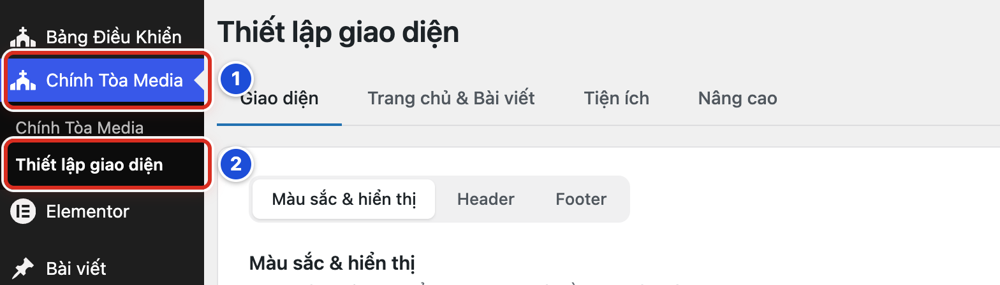
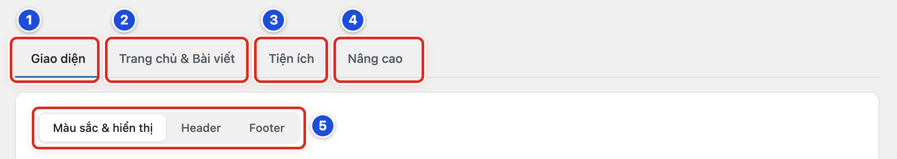
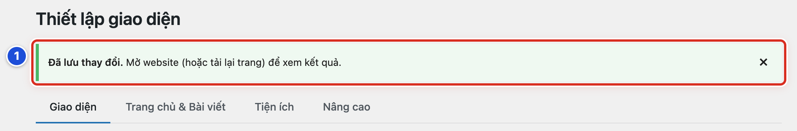

# Phần 6 Thiết lập giao diện Chính Tòa Media

## Chương 13 Làm quen với Thiết lập giao diện

### Bài 13.01 Mở Thiết lập giao diện

**Nhãn:** Kỹ thuật dành cho quản trị viên · 🟡 Cẩn thận

#### Mục đích

Mở trang **Thiết lập giao diện**. Đây là nơi chỉnh màu sắc, Đầu trang (Header), Cuối trang (Footer), trang chủ và thanh thông báo của website.

#### Trước khi bắt đầu

- Đăng nhập bằng tài khoản **Quản lý**. Tài khoản Biên tập viên không thấy trang này.
- Lần đầu mở trang, chỉ xem cho quen. Chưa đổi ô nào.

#### Các bước thực hiện

1. **Bước 1:** Ở menu bên trái, bấm **Chính Tòa Media**. Trang **Hướng dẫn sử dụng** mở ra, bên dưới hiện các mục con.
2. **Bước 2:** Bấm mục con **Thiết lập giao diện**.
3. **Bước 3:** Nhìn tiêu đề trang. Tiêu đề phải là **Thiết lập giao diện**.

#### Ảnh minh họa

*Hình 13.01 Số 1: menu Chính Tòa Media (Bước 1); số 2: mục con Thiết lập giao diện (Bước 2).*

#### Kết quả

Bạn sẽ thấy trang **Thiết lập giao diện** với bốn tab ở trên cùng: **Giao diện**, **Trang chủ & Bài viết**, **Tiện ích**, **Nâng cao**. Tab **Giao diện** mở sẵn, đang ở tab con **Màu sắc & hiển thị**.

#### Lưu ý

- Cách khác: ở **Bảng Điều Khiển**, tìm thẻ **Thiết lập giao diện** và bấm nút **Mở thiết lập**.
- Chỉ mở trang thì website chưa thay đổi gì. Website chỉ đổi khi bạn bấm **Lưu thay đổi** (Bài 13.04).
- Mọi thay đổi ở đây áp dụng cho cả website. Ai vào website cũng thấy.

#### Không nên làm

- Không nhầm với mục **Giao diện → Giao diện** ở menu trái. Đó là nơi đổi cả bộ giao diện (theme) của website, thuộc khu vực không tự thay đổi (Phụ lục E.02).
- Không đưa mật khẩu tài khoản Quản lý cho người khác chỉ để họ mở trang này (Bài 22.05).

#### Nếu gặp lỗi

- Dưới **Chính Tòa Media** không có mục **Thiết lập giao diện** → bạn đang dùng tài khoản Biên tập viên. Đăng xuất, rồi đăng nhập bằng tài khoản Quản lý.
- Menu trái chỉ còn biểu tượng, không có chữ → menu đang thu gọn. Bấm nút mũi tên tròn ở cuối menu (**Thu gọn Menu**) để mở rộng lại.
- Không thấy cả mục **Chính Tòa Media** → giao diện Chính Tòa Media có thể đã bị tắt. Không tự bật hay đổi giao diện; báo người hỗ trợ kỹ thuật (Bài 24.07).

### Bài 13.02 Hiểu bốn nhóm thiết lập

**Nhãn:** Kỹ thuật dành cho quản trị viên · 🟢 An toàn

#### Mục đích

Biết mỗi tab (nút chuyển nhóm ở trên cùng trang) chứa những gì, để khi cần đổi thì mở đúng chỗ.

#### Trước khi bắt đầu

- Đã mở trang **Thiết lập giao diện** (Bài 13.01).
- Bài này chỉ bấm xem các tab. Không gõ vào ô nào, không bấm **Lưu thay đổi**.

#### Các bước thực hiện

1. **Bước 1:** Bấm tab **Giao diện**. Đây là nơi chỉnh màu, thanh menu, Đầu trang (Header) và Cuối trang (Footer) (Chương 14).
2. **Bước 2:** Bấm tab **Trang chủ & Bài viết**. Đây là nơi sắp xếp trang chủ và bố cục chung của trang chuyên mục, trang bài viết (Chương 15).
3. **Bước 3:** Bấm tab **Tiện ích**. Ở đây có thanh thông báo nổi bật theo thời gian (Bài 16.01–16.03).
4. **Bước 4:** Bấm tab **Nâng cao** để biết vị trí, rồi rời đi. Đây là khu vực mã kỹ thuật, không tự sửa (Bài 16.04).
5. **Bước 5:** Bấm lại tab **Giao diện**, rồi bấm lần lượt các tab con **Màu sắc & hiển thị**, **Header**, **Footer**.

#### Ảnh minh họa

*Hình 13.02 Số 1–4: bốn tab Giao diện, Trang chủ & Bài viết, Tiện ích, Nâng cao (Bước 1–4); số 5: các tab con của tab Giao diện (Bước 5).*

#### Kết quả

Bạn sẽ thấy mỗi lần bấm một tab, phần bên dưới đổi theo. Tab đang mở có gạch xanh bên dưới. Tab con đang mở có nền trắng.

#### Lưu ý

| Tab | Bên trong có | Xem bài |
|---|---|---|
| **Giao diện** | Màu sắc & hiển thị · Header · Footer | Chương 14 |
| **Trang chủ & Bài viết** | Trang chủ · Trang Chuyên mục & Bài viết | Chương 15 |
| **Tiện ích** | Thanh thông báo nổi bật | Bài 16.01–16.03 |
| **Nâng cao** | Kỹ thuật (mã theo dõi, mã chèn, shortcode) | Bài 16.04–16.05 |

- Cả bốn tab nằm trong cùng một trang. Nút **Lưu thay đổi** ở cuối trang lưu cùng lúc mọi tab.
- Tab **Nâng cao** đang chứa mã quan trọng của website mẫu “5 phút cho Lời Chúa” (Bài 16.04). Chỉ xem, không sửa.

#### Không nên làm

- Không gõ thử vào các ô khi đang xem.
- Không bấm **Lưu thay đổi** sau khi “đi một vòng” các tab, nếu không chắc mình chưa lỡ đổi gì.

#### Nếu gặp lỗi

- Bấm tab mà phần bên dưới không đổi → trang chưa tải xong. Chờ vài giây, hoặc nhấn phím F5 để tải lại trang.
- Lỡ đổi một ô khi đang xem → không bấm **Lưu thay đổi**. Bấm lại **Thiết lập giao diện** ở menu trái để mở lại trang; các ô trở về như cũ.
- Tên tab trên màn hình khác với sổ tay → website có thể đang dùng phiên bản giao diện khác. Không đoán ô “gần giống”; chụp màn hình gửi người hỗ trợ kỹ thuật.

### Bài 13.03 Ghi lại giá trị cũ trước khi thay đổi

**Nhãn:** Kỹ thuật dành cho quản trị viên · 🟡 Cẩn thận

#### Mục đích

Lưu lại thiết lập đang dùng trước khi đổi. Thiết lập giao diện không có nút hoàn tác sau khi đã lưu, nên bản ghi này giúp bạn trả lại như cũ khi cần.

#### Trước khi bắt đầu

- Biết mình sắp đổi ô nào, ở tab con nào.
- Biết cách chụp màn hình. Trên Windows: nhấn **Windows + Shift + S**, rồi kéo chọn vùng cần chụp. Trên Mac: nhấn **Cmd + Shift + 4**, rồi kéo chọn vùng.
- Tạo sẵn một thư mục để cất ảnh, ví dụ *Thiet lap giao dien*.

#### Các bước thực hiện

1. **Bước 1:** Mở tab con có ô bạn sắp đổi, ví dụ **Header**.
2. **Bước 2:** Kéo trang để thấy trọn các ô sẽ đổi, gồm cả tên ô và giá trị đang chọn.
3. **Bước 3:** Chụp màn hình phần đó.
4. **Bước 4:** Kéo xuống và chụp tiếp nếu các ô dài hơn một màn hình.
5. **Bước 5:** Với ô màu, bấm **Chọn màu** để hiện mã màu (bắt đầu bằng dấu #, ví dụ #ffffff). Chép mã màu vào ghi chú.
6. **Bước 6:** Với ô có nhiều chữ, bấm vào giữa ô, rồi nhấn **Ctrl + A** (Mac: **Cmd + A**) để chọn hết chữ trong ô. Nếu ô có hai tab **Trực quan** và **Mã**, bấm tab **Mã** trước.
7. **Bước 7:** Nhấn **Ctrl + C** (Mac: **Cmd + C**) để chép.
8. **Bước 8:** Mở Notepad (Windows) hoặc TextEdit (Mac), nhấn **Ctrl + V** (Mac: **Cmd + V**) để dán.
9. **Bước 9:** Lưu tệp với tên có ngày, ví dụ *header-2026-10-06*. Đặt tên ảnh chụp theo cùng cách.
10. **Bước 10:** Ghi thêm một dòng vào tệp: đổi gì, vì sao, ai đổi.

#### Ảnh minh họa

Bài này không cần ảnh minh họa. Các hình trong Chương 14–16 cho biết các ô cần chụp lại.

#### Kết quả

Bạn sẽ có ảnh chụp và tệp ghi chú cho thấy rõ giá trị cũ của từng ô. Khi cần trả lại, bạn nhìn ảnh để chọn lại và dán lại chữ cũ từ tệp ghi chú.

#### Lưu ý

- Ảnh phải thấy cả **tên ô** lẫn **giá trị**. Ảnh chỉ có một ô màu thì không biết đó là màu của ô nào.
- Các ô nhiều chữ cần chép thành tệp: **Nội dung Header**, **Nội dung cuối trang**, ô **Nội dung** của thanh thông báo, ô **Nội dung (HTML)** của khối Tĩnh / HTML, các ô trong tab **Nâng cao**. Chữ trong ảnh chụp không dán lại được.
- Với danh sách khối trang chủ, chụp một ảnh ở dạng thu gọn để thấy thứ tự và tên các khối (Hình 15.04). Sau đó mở từng khối định đổi và chụp chi tiết.
- Website hiện chưa bật sao lưu tự động (Phụ lục D). Bản ghi này là cách trả lại như cũ nhanh nhất.

#### Không nên làm

- Không dựa vào trí nhớ.
- Không đổi nhiều nhóm ô khi chưa ghi lại hết các nhóm đó.
- Không gửi ảnh chụp tab **Nâng cao** vào nhóm chat chung. Các ô ở đó có thể chứa mã riêng của website.

#### Nếu gặp lỗi

- Đã chụp màn hình trên Windows mà không thấy ảnh đâu → bấm vào thông báo hiện ở góc màn hình để lưu ảnh, hoặc mở Paint, nhấn **Ctrl + V** rồi lưu. Trên Mac, ảnh nằm ngoài màn hình nền.
- Nhấn **Ctrl + A** mà cả trang bị bôi xanh → bạn chưa bấm vào trong ô. Bấm vào giữa ô chữ rồi nhấn lại.
- Bấm **Chọn màu** mà không thấy mã màu → ô đang để trống (dùng màu mặc định). Ghi là “để trống”.
- Đã đổi và lưu nhưng quên ghi giá trị cũ → dừng lại, không thử thêm giá trị khác. Báo người hỗ trợ kỹ thuật (Bài 24.07).

### Bài 13.04 Lưu thay đổi và kiểm tra kết quả

**Nhãn:** Kỹ thuật dành cho quản trị viên · 🟡 Cẩn thận

#### Mục đích

Lưu thay đổi đúng cách, rồi mở website kiểm tra ngay để chắc kết quả như mong muốn.

#### Trước khi bắt đầu

- Đã ghi lại giá trị cũ (Bài 13.03).
- Mỗi lần chỉ đổi một nhóm ô nhỏ. Như vậy, khi website hiện sai, bạn biết ngay do ô nào.

#### Các bước thực hiện

1. **Bước 1:** Đổi ô bạn cần đổi, theo bài hướng dẫn của ô đó (Chương 14–16).
2. **Bước 2:** Kéo xuống cuối trang.
3. **Bước 3:** Bấm nút xanh **Lưu thay đổi**.
4. **Bước 4:** Chờ trang tải lại. Đầu trang hiện thông báo xanh **“Đã lưu thay đổi.** Mở website (hoặc tải lại trang) để xem kết quả.” Trang mở lại đúng tab bạn đang làm.
5. **Bước 5:** Mở website: rê chuột vào tên website trên thanh đen phía trên, rồi bấm **Xem website** (Bài 01.06).
6. **Bước 6:** Nhấn phím **F5** (Mac: **Cmd + R**) để tải lại trang website.
7. **Bước 7:** Xem chỗ vừa đổi trên máy tính, rồi mở website trên điện thoại để xem lại.

#### Ảnh minh họa

*Hình 13.04 Số 1: thông báo xanh “Đã lưu thay đổi.” hiện sau khi bấm Lưu thay đổi (Bước 4).*

#### Kết quả

Bạn sẽ thấy thông báo xanh **Đã lưu thay đổi.** ở đầu trang Thiết lập giao diện. Ngoài website, bạn thấy đúng thay đổi vừa làm. Trang chủ cập nhật ngay sau khi lưu, không phải chờ.

#### Lưu ý

- Chỉ có **một** nút **Lưu thay đổi** cho cả bốn tab. Bấm lưu là lưu mọi ô của mọi tab, kể cả ô bạn lỡ tay đổi ở tab khác.
- Muốn bỏ hết thay đổi chưa lưu: không bấm **Lưu thay đổi**. Bấm lại **Chính Tòa Media → Thiết lập giao diện** ở menu trái để mở lại trang.
- Nên mở website ở một tab mới để quay lại trang thiết lập dễ hơn: bấm chuột phải vào **Xem website**, chọn **Mở liên kết trong thẻ mới**.
- Thông báo xanh chỉ cho biết đã lưu. Nó không kiểm tra giúp bạn website có đẹp hay không. Bấm dấu **×** ở cuối thông báo để ẩn nó.

#### Không nên làm

- Không bấm **Lưu thay đổi** nhiều lần liên tiếp khi trang đang tải.
- Không đổi nhiều thứ rồi lưu một lần.
- Không rời máy khi vừa lưu mà chưa mở website kiểm tra.

#### Nếu gặp lỗi

- Bấm lưu nhưng không thấy thông báo xanh → mạng có thể chậm hoặc bạn đã bị đăng xuất. Mở lại trang và xem các ô; nếu vẫn là giá trị cũ, đăng nhập lại và làm lại.
- Đã thấy thông báo xanh nhưng website chưa đổi → nhấn F5 trên trang website. Vẫn chưa đổi thì mở website bằng cửa sổ ẩn danh (trong Chrome: **Ctrl + Shift + N**; Mac: **Cmd + Shift + N**).
- Website hiện sai sau khi lưu → mở lại tab vừa đổi, nhập lại giá trị cũ theo ảnh chụp (Bài 13.03), rồi bấm **Lưu thay đổi**.
- Website chỉ hiện sai trên điện thoại → chụp màn hình điện thoại, ghi loại máy, trả lại giá trị cũ rồi hỏi người hỗ trợ kỹ thuật.
