# Phần 6 Thiết lập giao diện Chính Tòa Media

## Chương 14 Màu sắc, thanh menu, Đầu trang (Header) và Cuối trang (Footer)

### Bài 14.01 Chọn màu giao diện và nền trang

**Nhãn:** Kỹ thuật dành cho quản trị viên · 🟡 Cẩn thận

#### Mục đích

Đặt màu chủ đạo cho liên kết, nút bấm và các điểm nổi bật trên website. Chọn nền chung của website là một màu hoặc một hình.

#### Trước khi bắt đầu

- Đăng nhập bằng tài khoản Quản lý.
- Mở **Chính Tòa Media → Thiết lập giao diện** (Bài 13.01). Tab **Giao diện**, tab con **Màu sắc & hiển thị** mở sẵn.
- Chụp màn hình phần **Màu giao diện** và **Nền trang** đang dùng (Bài 13.03).
- Muốn màu riêng thì chuẩn bị mã màu, ví dụ màu của logo giáo xứ. Muốn dùng hình nền thì tải ảnh vào **Thư viện** trước (Bài 10.02).

#### Các bước thực hiện

1. **Bước 1:** Ở **Màu giao diện**, bấm một ô màu có sẵn, ví dụ **Xanh dương**. Muốn màu riêng thì bấm ô **Tự chọn**. Ô đang chọn có viền xanh đậm.
2. **Bước 2:** Nếu đã bấm **Tự chọn**: ở **Màu tự chọn**, bấm **Chọn màu**, rồi chọn màu trong bảng màu hoặc gõ mã màu.
3. **Bước 3:** Kéo xuống **Nền trang**, chọn **Dùng màu nền** hoặc **Dùng hình nền**.
4. **Bước 4:** Nếu chọn **Dùng màu nền**: ở **Màu nền**, bấm **Chọn màu** và chọn một màu nhạt.
5. **Bước 5:** Nếu chọn **Dùng hình nền**: ở **Hình nền**, bấm **Chọn ảnh**, chọn ảnh trong Thư viện, rồi bấm nút **Chọn**.
6. **Bước 6:** Cũng với hình nền: ở **Cách lặp hình nền**, chọn **Không lặp**, **Lặp cả hai chiều**, **Lặp theo chiều ngang** hoặc **Lặp theo chiều dọc**.
7. **Bước 7:** Kéo xuống cuối trang, bấm **Lưu thay đổi**.
8. **Bước 8:** Mở website, nhấn F5. Xem màu liên kết, nút bấm và nền ở trang chủ, một trang chuyên mục và một bài viết.

#### Ảnh minh họa

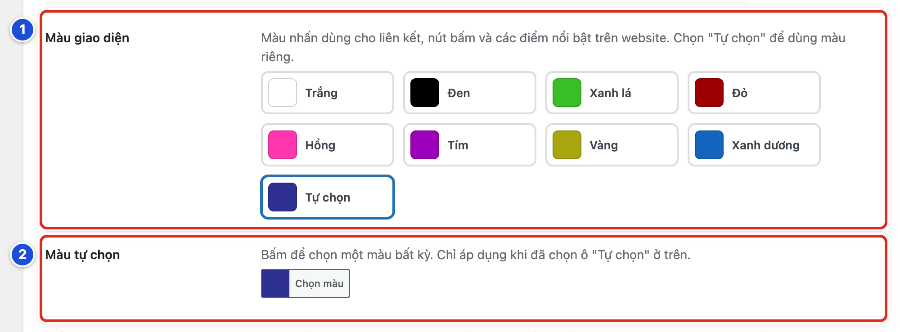

*Hình 14.01a Số 1: Màu giao diện (Bước 1); số 2: Màu tự chọn (Bước 2).*

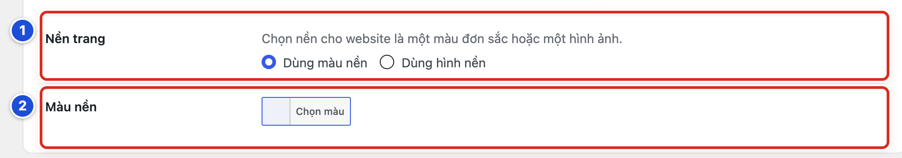

*Hình 14.01b Số 1: Nền trang (Bước 3); số 2: Màu nền (Bước 4).*

#### Kết quả

Bạn sẽ thấy liên kết, nút bấm và các điểm nhấn trên website đổi sang màu mới. Nền phía sau các ô nội dung đổi theo màu hoặc hình bạn chọn.

#### Lưu ý

- **Màu tự chọn** chỉ có tác dụng khi ô **Tự chọn** đang được chọn ở **Màu giao diện**.
- Ô **Màu nền** chỉ hiện khi chọn **Dùng màu nền**. Hai ô **Hình nền** và **Cách lặp hình nền** chỉ hiện khi chọn **Dùng hình nền**.
- Website mẫu dùng màu **Tự chọn** là xanh tím than, giống màu logo.
- Ảnh lớn thì chọn **Không lặp**. Ảnh hoa văn nhỏ, mép ảnh nối liền nhau thì chọn **Lặp cả hai chiều**.
- Màu thanh menu đặt riêng ở Bài 14.02. Màu Đầu trang (Header) đặt ở Bài 14.04–14.06.

#### Không nên làm

- Không chọn **Trắng** làm màu giao diện. Liên kết và nút sẽ gần như không thấy trên nền trắng.
- Không dùng ảnh nền nặng, nhiều chi tiết. Trang sẽ tải chậm và chữ khó đọc.
- Không đổi màu khi chưa chụp lại màu cũ.

#### Nếu gặp lỗi

- Đã chọn **Màu tự chọn** nhưng website không đổi màu → ở **Màu giao diện** chưa bấm ô **Tự chọn**. Bấm ô **Tự chọn**, rồi lưu lại.
- Không thấy ô **Hình nền** → **Nền trang** đang chọn **Dùng màu nền**. Chọn **Dùng hình nền** trước.
- Hình nền bị lặp thành nhiều ô nhỏ trông rối → ở **Cách lặp hình nền**, chọn **Không lặp**, rồi lưu.
- Màu mới làm chữ khó đọc → chọn lại màu cũ theo ảnh chụp (Bài 13.03) và lưu.

### Bài 14.02 Chọn kiểu thanh menu và màu thanh menu

**Nhãn:** Kỹ thuật dành cho quản trị viên · 🟡 Cẩn thận

#### Mục đích

Chọn hình dáng và màu của thanh menu chính, tức dải các mục như Trang chủ, Suy niệm, Giáo lý… ngay dưới Đầu trang (Header).

#### Trước khi bắt đầu

- Đăng nhập bằng tài khoản Quản lý.
- Mở **Thiết lập giao diện**, tab **Giao diện**, tab con **Màu sắc & hiển thị**.
- Chụp màn hình phần **Kiểu thanh menu** và ba ô màu thanh menu đang dùng (Bài 13.03).

#### Các bước thực hiện

1. **Bước 1:** Ở **Kiểu thanh menu**, bấm một trong bốn ảnh mẫu. Bốn ảnh xếp từ trên xuống, lần lượt là kiểu 1 đến kiểu 4. Ảnh đang chọn có viền xanh.
2. **Bước 2:** Ở **Màu nền thanh menu**, bấm **Chọn màu** và chọn màu nền cho thanh. Để trống thì dùng màu mặc định của kiểu menu.
3. **Bước 3:** Ở **Màu chữ thanh menu**, chọn màu chữ của các mục menu.
4. **Bước 4:** Ở **Màu nhấn thanh menu**, chọn màu đánh dấu mục đang xem. Để trống thì dùng màu giao diện.
5. **Bước 5:** Kéo xuống cuối trang, bấm **Lưu thay đổi**.
6. **Bước 6:** Mở website, nhấn F5. Bấm thử vài mục menu để xem mục đang xem được đánh dấu.

#### Ảnh minh họa

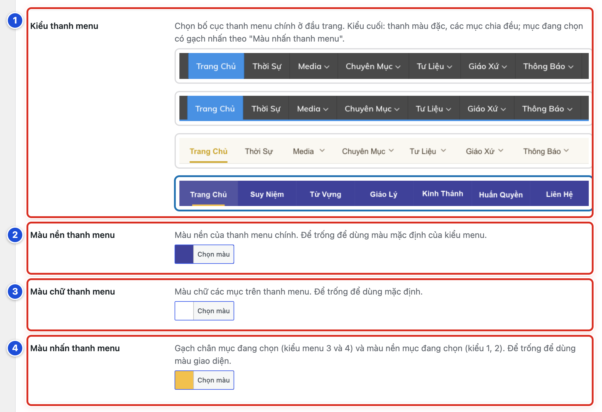

*Hình 14.02a Số 1–4 ứng với Bước 1–4: Kiểu thanh menu, Màu nền thanh menu, Màu chữ thanh menu, Màu nhấn thanh menu.*

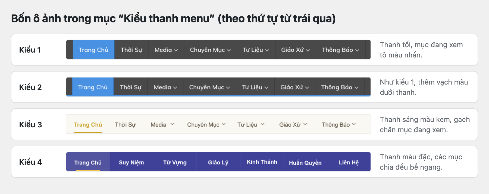

*Hình 14.02b Bốn kiểu thanh menu, theo đúng thứ tự bốn ảnh trong ô Kiểu thanh menu.*

#### Kết quả

Bạn sẽ thấy thanh menu đổi kiểu và màu. Mục đang xem được tô màu nền (kiểu 1, 2) hoặc có gạch chân (kiểu 3, 4) theo **Màu nhấn thanh menu**.

#### Lưu ý

| Kiểu | Hình dáng | Màu nhấn dùng để |
|---|---|---|
| Kiểu 1 | Thanh tối, mục đang xem tô màu | Tô nền mục đang xem |
| Kiểu 2 | Như kiểu 1, thêm vạch màu dưới thanh | Tô nền mục đang xem |
| Kiểu 3 | Thanh sáng màu kem | Gạch chân mục đang xem |
| Kiểu 4 | Thanh màu đặc, các mục chia đều | Gạch chân mục đang xem |

- Website mẫu dùng kiểu 4: nền xanh tím than, chữ trắng, gạch chân màu vàng.
- Nên chọn chữ sáng trên nền tối, hoặc chữ tối trên nền sáng.
- Bài này chỉ đổi hình dáng và màu. Tên và thứ tự các mục menu sửa ở **Giao diện → Thiết lập Menu** (Chương 17).
- Trên điện thoại, menu mở bằng nút ☰ (Bài 17.10).

#### Không nên làm

- Không chọn màu chữ gần giống màu nền thanh menu. Khách sẽ không đọc được tên mục.
- Không để **Màu nhấn thanh menu** trùng màu nền thanh. Mục đang xem sẽ không nổi lên.

#### Nếu gặp lỗi

- Chữ trên thanh menu khó đọc → đổi **Màu chữ thanh menu** cho tương phản với màu nền, hoặc để trống cả hai ô để dùng màu mặc định.
- Không thấy gạch chân ở mục đang xem → kiểu 1, 2 tô nền chứ không gạch chân. Nếu đang dùng kiểu 3, 4, kiểm tra **Màu nhấn thanh menu** có trùng màu nền không.
- Đổi kiểu xong thanh menu trông lệch màu → trả lại kiểu cũ và ba màu cũ theo ảnh chụp (Bài 13.03), rồi lưu.

### Bài 14.03 Chọn kiểu Đầu trang (Header)

**Nhãn:** Kỹ thuật dành cho quản trị viên · 🟡 Cẩn thận

#### Mục đích

Chọn cách hiện phần đầu website, nằm ngay trên thanh menu: logo kèm khẩu hiệu, một ảnh banner, hoặc nội dung tự soạn.

#### Trước khi bắt đầu

- Đăng nhập bằng tài khoản Quản lý.
- Mở **Thiết lập giao diện**, tab **Giao diện**.
- Chuẩn bị đủ thứ cho kiểu sẽ chọn: logo và câu khẩu hiệu, hoặc ảnh banner, hoặc nội dung tự soạn.
- Chụp màn hình tab con **Header** đang dùng (Bài 13.03).

#### Các bước thực hiện

1. **Bước 1:** Bấm tab con **Header**.
2. **Bước 2:** Ở **Kiểu Header**, chọn một trong ba kiểu: **Tự nhập nội dung**, **Ảnh banner rộng**, **Logo + khẩu hiệu**. Các ô bên dưới đổi theo kiểu bạn chọn.
3. **Bước 3:** Điền các ô của kiểu đã chọn: Bài 14.04 (Logo + khẩu hiệu), Bài 14.05 (Tự nhập nội dung) hoặc Bài 14.06 (Ảnh banner rộng).
4. **Bước 4:** Kéo xuống cuối trang, bấm **Lưu thay đổi**.
5. **Bước 5:** Mở website, nhấn F5. Xem phần đầu trang trên máy tính và trên điện thoại.

#### Ảnh minh họa

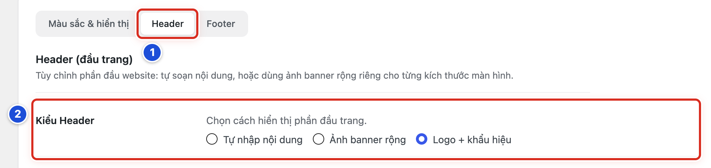

*Hình 14.03 Số 1: tab con Header (Bước 1); số 2: Kiểu Header với ba lựa chọn (Bước 2).*

#### Kết quả

Bạn sẽ thấy phần đầu website đổi theo kiểu mới, ngay phía trên thanh menu.

#### Lưu ý

| Kiểu Header | Dùng khi | Xem bài |
|---|---|---|
| **Logo + khẩu hiệu** | Có logo và một câu khẩu hiệu. Dễ làm, gọn trên điện thoại. | 14.04 |
| **Ảnh banner rộng** | Đã có ảnh banner thiết kế sẵn | 14.06 |
| **Tự nhập nội dung** | Muốn tự soạn chữ, chèn ảnh (cần chút kinh nghiệm) | 14.05 |

- Website mẫu dùng kiểu **Logo + khẩu hiệu**.
- Đổi kiểu không xoá các ô của kiểu cũ. Chọn lại kiểu cũ là các ô vẫn còn nguyên.

#### Không nên làm

- Không đổi kiểu khi chưa chuẩn bị xong logo hoặc banner. Đầu trang sẽ trống hoặc lệch.
- Không chọn **Tự nhập nội dung** chỉ để sửa câu khẩu hiệu. Câu khẩu hiệu sửa ở kiểu **Logo + khẩu hiệu** (Bài 14.04).

#### Nếu gặp lỗi

- Không thấy các ô như **Logo** hay **Ảnh cho Máy tính** → chưa chọn đúng kiểu ở **Kiểu Header**. Mỗi kiểu chỉ hiện các ô của nó.
- Đầu trang trống sau khi đổi kiểu → kiểu mới chưa có nội dung. Điền các ô theo bài của kiểu đó, hoặc chọn lại kiểu cũ và lưu.
- Đầu trang đẹp trên máy tính nhưng vỡ trên điện thoại → dùng kiểu **Logo + khẩu hiệu**; kiểu này tự xếp gọn trên điện thoại.

### Bài 14.04 Đầu trang kiểu Logo và khẩu hiệu

**Nhãn:** Kỹ thuật dành cho quản trị viên · 🟡 Cẩn thận

#### Mục đích

Đặt logo bên trái và câu khẩu hiệu bên phải ở đầu website, trên nền màu chuyển dần từ trên xuống.

#### Trước khi bắt đầu

- Đăng nhập bằng tài khoản Quản lý. Mở **Thiết lập giao diện**, tab **Giao diện**.
- Tải logo vào **Thư viện** (Bài 10.02). Nên dùng ảnh PNG nền trong suốt, rõ nét.
- Chuẩn bị một câu khẩu hiệu ngắn và nguồn trích dẫn của câu đó.
- Chụp màn hình tab con **Header** đang dùng (Bài 13.03).

#### Các bước thực hiện

1. **Bước 1:** Bấm tab con **Header**.
2. **Bước 2:** Ở **Kiểu Header**, chọn **Logo + khẩu hiệu**. Các ô bên dưới hiện ra.
3. **Bước 3:** Ở **Logo**, bấm **Chọn ảnh**, chọn ảnh logo trong Thư viện, rồi bấm nút **Chọn**. Ảnh logo hiện nhỏ bên dưới ô.
4. **Bước 4:** Ở **Câu khẩu hiệu**, gõ câu khẩu hiệu, ví dụ *Lời Chúa là ngọn đèn soi cho con bước*. Ở **Trích dẫn** ngay dưới, gõ nguồn, ví dụ *Tv 119,105*.
5. **Bước 5:** Chọn ba màu: **Màu nền phía trên**, **Màu nền phía dưới** (hai màu chuyển dần từ trên xuống) và **Màu chữ khẩu hiệu**.
6. **Bước 6:** Kéo xuống cuối trang, bấm **Lưu thay đổi**.
7. **Bước 7:** Mở website, nhấn F5. Xem đầu trang trên máy tính và trên điện thoại.

#### Ảnh minh họa

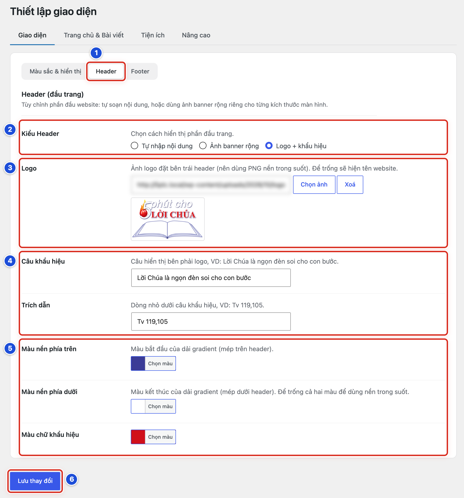

*Hình 14.04a Số 1–6 ứng với Bước 1–6.*

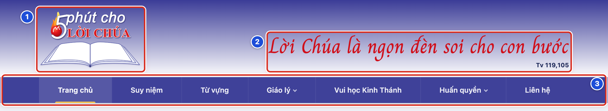

*Hình 14.04b Đầu trang website mẫu: số 1 là logo; số 2 là câu khẩu hiệu và trích dẫn; số 3 là thanh menu ngay bên dưới.*

#### Kết quả

Bạn sẽ thấy logo ở bên trái, câu khẩu hiệu và dòng trích dẫn nhỏ ở bên phải, trên nền màu chuyển dần. Trên điện thoại, logo và khẩu hiệu xếp chồng lên nhau, căn giữa.

#### Lưu ý

- Để trống **Logo** thì đầu trang hiện tên website thay cho logo.
- Để trống cả **Màu nền phía trên** và **Màu nền phía dưới** thì đầu trang không có màu nền riêng.
- Website mẫu: logo “5 phút cho Lời Chúa”, khẩu hiệu *Lời Chúa là ngọn đèn soi cho con bước* (Tv 119,105), nền xanh tím than chuyển sang trắng, chữ khẩu hiệu màu đỏ.
- Nút **Xoá** cạnh **Chọn ảnh** chỉ gỡ logo khỏi đầu trang. Ảnh vẫn còn trong Thư viện.

#### Không nên làm

- Không dùng logo có nền trắng đặc trên nền màu. Sẽ thấy một ô trắng quanh logo.
- Không viết khẩu hiệu quá dài. Trên điện thoại chữ sẽ xuống nhiều dòng.
- Không dùng ảnh chụp màn hình mờ làm logo.

#### Nếu gặp lỗi

- Bấm **Chọn ảnh** mà không thấy logo trong danh sách → logo chưa được tải lên. Bấm tab **Tải lên tệp mới** trong hộp chọn ảnh, hoặc tải vào Thư viện trước (Bài 10.02).
- Quanh logo có một ô nền trắng → ảnh logo không có nền trong suốt. Xin bản PNG nền trong suốt rồi chọn lại.
- Không thấy câu khẩu hiệu → ô **Câu khẩu hiệu** đang trống, hoặc **Màu chữ khẩu hiệu** trùng màu nền. Kiểm tra lại hai ô này.
- Đầu trang vẫn như cũ → kiểm tra **Kiểu Header** đang là **Logo + khẩu hiệu** và đã thấy thông báo **Đã lưu thay đổi.**; mở website, nhấn F5.

### Bài 14.05 Đầu trang kiểu Tự nhập nội dung

**Nhãn:** Kỹ thuật dành cho quản trị viên · 🟡 Cẩn thận

#### Mục đích

Tự soạn phần đầu website trong một ô soạn thảo (chữ, ảnh, liên kết), khi kiểu Logo + khẩu hiệu không đáp ứng được.

#### Trước khi bắt đầu

- Đăng nhập bằng tài khoản Quản lý. Mở **Thiết lập giao diện**, tab **Giao diện**, tab con **Header**.
- Chuẩn bị nội dung muốn đặt ở đầu trang. Ảnh cần chèn thì tải vào **Thư viện** trước (Bài 10.02).
- Nếu ô **Nội dung Header** đã có chữ, chép ra tệp ghi chú trước (Bài 13.03).

#### Các bước thực hiện

1. **Bước 1:** Ở **Kiểu Header**, chọn **Tự nhập nội dung**.
2. **Bước 2:** Soạn trong ô **Nội dung Header**. Bấm tab **Trực quan** để soạn như soạn văn bản. Cần chèn ảnh thì bấm **Thêm tệp**.
3. **Bước 3:** Ở **Màu nền Header**, bấm **Chọn màu** và chọn màu nền.
4. **Bước 4:** Kéo xuống cuối trang, bấm **Lưu thay đổi**.
5. **Bước 5:** Mở website, nhấn F5. Xem đầu trang trên máy tính và trên điện thoại.

#### Ảnh minh họa

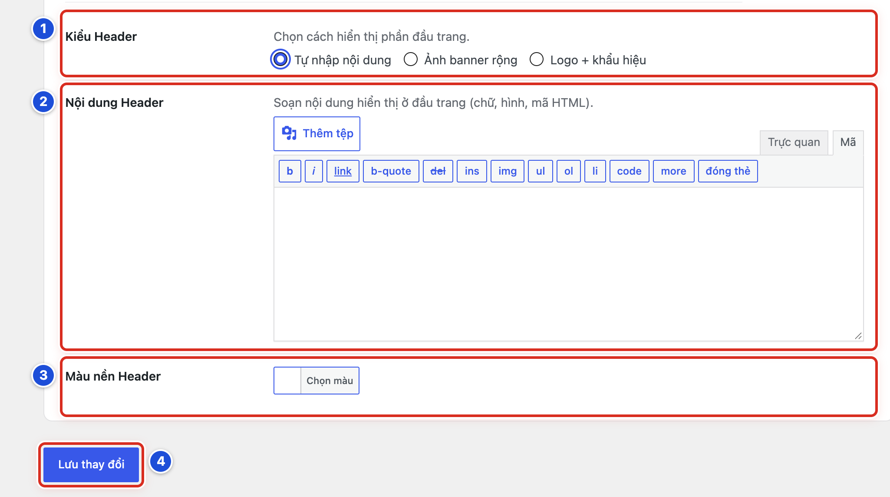

*Hình 14.05 Số 1–4 ứng với Bước 1–4. Ô Nội dung Header trong hình đang mở ở tab Mã.*

#### Kết quả

Bạn sẽ thấy nội dung vừa soạn ở đầu website, ngay trên thanh menu, với màu nền đã chọn.

#### Lưu ý

- Ô **Nội dung Header** có hai tab: **Trực quan** (soạn như văn bản) và **Mã** (xem mã của nội dung). Người không rành kỹ thuật chỉ dùng tab **Trực quan**.
- Bấm **Thêm tệp** mở hộp chọn ảnh từ Thư viện. Chọn ảnh, rồi bấm nút xanh ở góc dưới bên phải để chèn vào ô.
- Kiểu này không tự canh gọn như kiểu **Logo + khẩu hiệu**. Luôn xem lại trên điện thoại sau khi lưu.
- Website mẫu không dùng kiểu này.

#### Không nên làm

- Không dán đoạn mã lạ (từ email, mạng xã hội, trang web khác) vào tab **Mã**.
- Không dán chữ thẳng từ Word. Định dạng lạ có thể làm lệch đầu trang. Dán vào Notepad trước, rồi chép lại.
- Không chèn ảnh quá lớn so với bề ngang đầu trang.

#### Nếu gặp lỗi

- Không thấy ô **Nội dung Header** → **Kiểu Header** chưa chọn **Tự nhập nội dung**.
- Ô soạn chỉ có các nút nhỏ như b, i, link và chữ có dấu < > → ô đang ở tab **Mã**. Bấm tab **Trực quan**.
- Đầu trang bị lệch hoặc vỡ sau khi lưu → mở lại ô, xoá hết, dán lại nội dung cũ từ tệp ghi chú, rồi lưu. Hoặc chọn lại kiểu cũ ở **Kiểu Header**.

### Bài 14.06 Đầu trang kiểu Ảnh banner rộng

**Nhãn:** Kỹ thuật dành cho quản trị viên · 🟡 Cẩn thận

#### Mục đích

Dùng một ảnh banner thiết kế sẵn làm đầu website. Có thể dùng ảnh riêng cho máy tính bảng và điện thoại.

#### Trước khi bắt đầu

- Đăng nhập bằng tài khoản Quản lý. Mở **Thiết lập giao diện**, tab **Giao diện**, tab con **Header**.
- Tải banner vào **Thư viện** (Bài 10.02): một ảnh ngang khổ rộng cho máy tính. Nếu có, thêm bản gọn hơn cho máy tính bảng và điện thoại (Bài 09.03).
- Chụp màn hình thiết lập đang dùng (Bài 13.03).

#### Các bước thực hiện

1. **Bước 1:** Ở **Kiểu Header**, chọn **Ảnh banner rộng**.
2. **Bước 2:** Ở **Ảnh cho Máy tính**, bấm **Chọn ảnh**, chọn banner ngang, rồi bấm nút **Chọn**. Làm tương tự ở **Ảnh cho Máy tính bảng** và **Ảnh cho Điện thoại** nếu có ảnh riêng.
3. **Bước 3:** Ở **Mô tả ảnh**, gõ một câu tả banner, ví dụ *5 phút cho Lời Chúa — Lời Chúa là ngọn đèn soi cho con bước*.
4. **Bước 4:** Ở **Liên kết khi bấm**, dán địa chỉ trang muốn mở khi bấm vào banner. Chỉ tích **Bật** ở **Mở liên kết ở tab mới** khi liên kết dẫn sang website khác.
5. **Bước 5:** Kéo xuống cuối trang, bấm **Lưu thay đổi**.
6. **Bước 6:** Mở website, nhấn F5. Xem banner trên máy tính và điện thoại, rồi bấm thử vào banner.

#### Ảnh minh họa

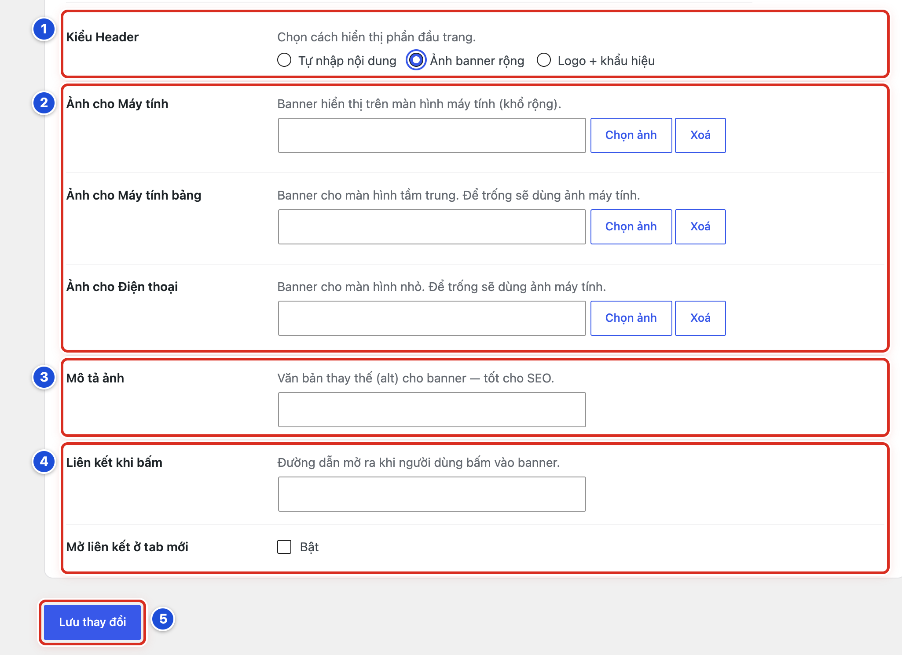

*Hình 14.06 Số 1–5 ứng với Bước 1–5.*

#### Kết quả

Bạn sẽ thấy banner ở đầu website. Trên điện thoại, website dùng **Ảnh cho Điện thoại** nếu bạn đã chọn. Bấm vào banner mở đúng trang đã đặt: cùng tab nếu không tích **Mở liên kết ở tab mới**, tab mới nếu có tích.

#### Lưu ý

- **Ảnh cho Máy tính bảng** và **Ảnh cho Điện thoại** không bắt buộc. Để trống thì dùng ảnh máy tính.
- **Mô tả ảnh** là lời tả banner cho Google và cho người khiếm thị dùng phần mềm đọc màn hình. Nên viết đúng nội dung chữ trên banner.
- Để trống **Liên kết khi bấm** thì bấm banner sẽ về trang chủ.
- Nút **Xoá** cạnh mỗi ô ảnh chỉ gỡ ảnh khỏi ô. Ảnh vẫn còn trong Thư viện.

#### Không nên làm

- Không dùng banner chứa đoạn chữ dài, nhỏ li ti. Trên điện thoại sẽ không đọc được.
- Không dán địa chỉ trang quản trị (có chữ wp-admin) hay địa chỉ bản nháp vào **Liên kết khi bấm**.
- Không tích **Mở liên kết ở tab mới** cho liên kết trong chính website.

#### Nếu gặp lỗi

- Điện thoại vẫn hiện ảnh máy tính → ô **Ảnh cho Điện thoại** đang trống. Đây là cách hoạt động bình thường. Chọn ảnh cho ô này nếu muốn ảnh riêng.
- Bấm banner lại về trang chủ → ô **Liên kết khi bấm** đang trống hoặc chưa lưu. Dán lại địa chỉ đầy đủ (bắt đầu bằng https://) rồi lưu.
- Banner mờ, vỡ hạt → ảnh quá nhỏ so với khổ màn hình. Dùng ảnh gốc khổ lớn hơn (Bài 09.03).

### Bài 14.07 Sửa nội dung và màu Cuối trang (Footer)

**Nhãn:** Kỹ thuật dành cho quản trị viên · 🟡 Cẩn thận

#### Mục đích

Sửa dòng chữ ở cuối mọi trang (bản quyền, địa chỉ, số điện thoại) và màu của dải cuối trang.

#### Trước khi bắt đầu

- Đăng nhập bằng tài khoản Quản lý. Mở **Thiết lập giao diện**, tab **Giao diện**.
- Chép nội dung cũ của ô **Nội dung cuối trang** ra tệp ghi chú, chụp hai ô màu (Bài 13.03).
- Chuẩn bị dòng chữ mới đã được duyệt.

#### Các bước thực hiện

1. **Bước 1:** Bấm tab con **Footer**.
2. **Bước 2:** Ở **Nội dung cuối trang**, bấm tab **Trực quan**, rồi sửa dòng chữ. Ví dụ *© 2026 5 phút cho Lời Chúa — Lời Chúa là ngọn đèn soi cho con bước (Tv 119,105).*
3. **Bước 3:** Ở **Màu nền cuối trang** và **Màu chữ cuối trang**, bấm **Chọn màu** và chọn màu. Nên chọn chữ sáng trên nền tối.
4. **Bước 4:** Kéo xuống cuối trang, bấm **Lưu thay đổi**.
5. **Bước 5:** Mở website, nhấn F5, kéo xuống cuối trang để xem.

#### Ảnh minh họa

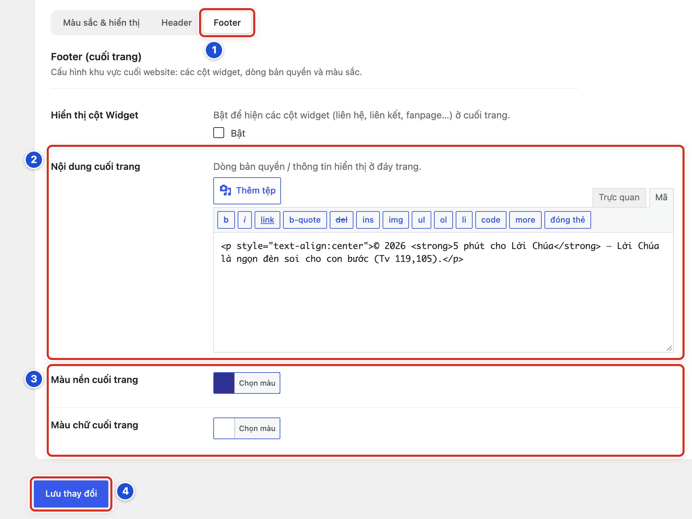

*Hình 14.07 Số 1–4 ứng với Bước 1–4. Ô Nội dung cuối trang trong hình đang mở ở tab Mã.*

#### Kết quả

Bạn sẽ thấy dòng chữ mới ở dải cuối cùng của mọi trang (trang chủ, trang chuyên mục, trang bài viết), với màu nền và màu chữ vừa chọn.

#### Lưu ý

- Website mẫu: dòng chữ căn giữa, nền xanh tím than, chữ trắng.
- Ô **Nội dung cuối trang** có tab **Trực quan** (soạn như văn bản) và **Mã** (xem mã). Hãy dùng tab **Trực quan**.
- Muốn thêm liên kết, ví dụ tới trang Liên hệ: bôi đen chữ, bấm nút liên kết (hình mắt xích) trên thanh công cụ của ô, rồi dán địa chỉ.
- Ô **Hiển thị cột Widget** ở đầu tab con **Footer** dùng cho các cột widget (Bài 14.08).

#### Không nên làm

- Không ghi số điện thoại, email riêng của một người khi chưa được người đó đồng ý.
- Không chọn màu chữ gần giống màu nền.
- Không dán mã theo dõi hay đoạn mã lạ vào ô này.

#### Nếu gặp lỗi

- Thấy chữ lạ kiểu `
` trong ô → ô đang ở tab **Mã**. Bấm tab **Trực quan** để thấy chữ bình thường.
- Cuối trang không đổi → kiểm tra đã bấm **Lưu thay đổi** và thấy thông báo xanh; mở website, nhấn F5.
- Dòng chữ bị mất định dạng (mất căn giữa, mất chữ đậm) → dán lại nội dung cũ từ tệp ghi chú vào tab **Mã**, rồi lưu.

### Bài 14.08 Bật hoặc tắt các cột widget Cuối trang (Footer)

**Nhãn:** Kỹ thuật dành cho quản trị viên · 🟡 Cẩn thận

#### Mục đích

Thêm các cột nội dung ở cuối trang (liên hệ, liên kết, fanpage…). Mỗi cột chứa các widget (ô nội dung nhỏ có sẵn, đặt ở **Giao diện → Cấu hình cột tiện ích**).

#### Trước khi bắt đầu

- Đăng nhập bằng tài khoản Quản lý. Mở **Thiết lập giao diện**, tab **Giao diện**, tab con **Footer**.
- Biết mỗi cột sẽ đặt widget gì.
- Chụp màn hình thiết lập đang dùng (Bài 13.03).

#### Các bước thực hiện

1. **Bước 1:** Ở **Hiển thị cột Widget**, tích vào ô **Bật**. Ô **Số cột Widget** hiện ra.
2. **Bước 2:** Ở **Số cột Widget**, bấm ô có số cột mong muốn (1, 2, 3 hoặc 4 cột).
3. **Bước 3:** Kéo xuống cuối trang, bấm **Lưu thay đổi**.
4. **Bước 4:** Vào **Giao diện → Cấu hình cột tiện ích**. Các khu vực **Cuối Trang - Cột 1**, **Cuối Trang - Cột 2**… đã xuất hiện.
5. **Bước 5:** Thêm widget vào từng cột (Bài 18.03).
6. **Bước 6:** Mở website, nhấn F5, kéo xuống cuối trang để xem các cột.

#### Ảnh minh họa

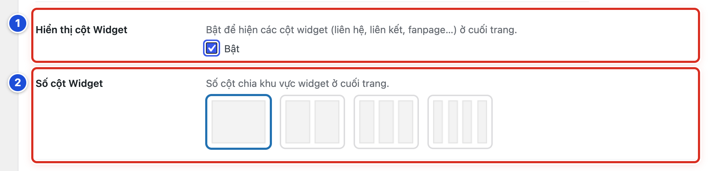

*Hình 14.08 Số 1: Hiển thị cột Widget (Bước 1); số 2: Số cột Widget (Bước 2).*

#### Kết quả

Bạn sẽ thấy cuối trang có số cột đã chọn. Mỗi cột hiện các widget bạn đã đặt vào khu vực **Cuối Trang - Cột** tương ứng.

#### Lưu ý

- Website mẫu đang tắt các cột widget cuối trang.
- Cột nào chưa có widget thì để trống ngoài website.
- Muốn tắt: bỏ tích **Bật** ở **Hiển thị cột Widget**, rồi bấm **Lưu thay đổi**.
- Dòng chữ ở **Nội dung cuối trang** (Bài 14.07) vẫn hiện, dù bật hay tắt các cột.

#### Không nên làm

- Không bật 4 cột khi chỉ có nội dung cho 1–2 cột. Cuối trang sẽ nhiều khoảng trống.
- Không giảm số cột khi các cột cuối còn widget mà chưa chụp lại. Widget ở cột bị bỏ sẽ không hiện nữa.

#### Nếu gặp lỗi

- Không thấy khu vực **Cuối Trang - Cột 1** trong **Cấu hình cột tiện ích** → chưa tích **Bật** hoặc chưa bấm **Lưu thay đổi** ở tab con **Footer**.
- Đã bật nhưng cuối trang không có cột nào → các cột chưa có widget. Thêm widget theo Bài 18.03.
- Một cột trống trơn → cột đó chưa có widget. Thêm widget, hoặc giảm **Số cột Widget**.
