# Phần 6 Thiết lập giao diện Chính Tòa Media

## Chương 15 Trang chủ và bố cục mặc định

### Bài 15.01 Bật tắt và chọn vị trí thanh bên trang chủ

**Nhãn:** Kỹ thuật dành cho quản trị viên · 🟡 Cẩn thận

#### Mục đích

Bật hoặc tắt thanh bên (cột nhỏ bên cạnh các khối nội dung) ở trang chủ, và đặt nó bên trái hay bên phải.

#### Trước khi bắt đầu

- Đăng nhập bằng tài khoản Quản lý. Mở **Chính Tòa Media → Thiết lập giao diện** (Bài 13.01).
- Biết thanh bên trang chủ hiện các widget (ô nội dung nhỏ) đặt ở khu vực **Trang Chủ** (Bài 18.01). Website mẫu có **Lịch Lời Chúa**, **Liên kết** và **Bài xem nhiều**.
- Chụp màn hình thiết lập đang dùng (Bài 13.03).

#### Các bước thực hiện

1. **Bước 1:** Bấm tab **Trang chủ & Bài viết**.
2. **Bước 2:** Bấm tab con **Trang chủ** (thường đã mở sẵn).
3. **Bước 3:** Ở **Hiển thị thanh bên**, tích **Bật** để có thanh bên. Bỏ tích để tắt.
4. **Bước 4:** Ở **Vị trí thanh bên**, chọn **Bên trái** hoặc **Bên phải**.
5. **Bước 5:** Kéo xuống cuối trang, bấm **Lưu thay đổi**.
6. **Bước 6:** Mở trang chủ, nhấn F5 để xem.

#### Ảnh minh họa

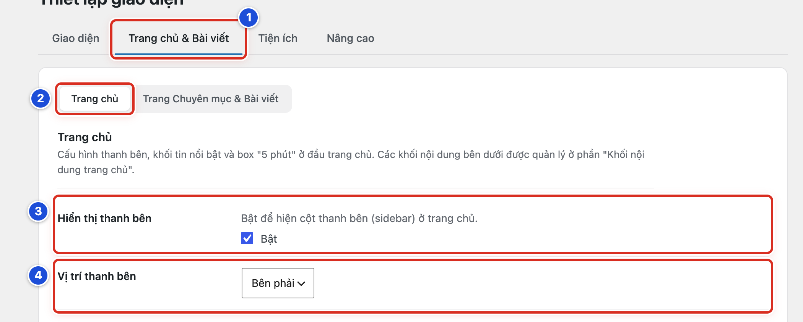

*Hình 15.01 Số 1–4 ứng với Bước 1–4.*

#### Kết quả

Bạn sẽ thấy thanh bên nằm đúng phía đã chọn, các khối nội dung chiếm phần còn lại. Nếu tắt, trang chủ không còn cột thanh bên.

#### Lưu ý

- Website mẫu: thanh bên **Bật**, **Bên phải**.
- Tắt thanh bên không xoá widget. Bật lại là các widget hiện lại.
- Khi tắt, widget **Lịch Lời Chúa** cũng không hiện ở trang chủ. Khách không bấm xem bài các ngày khác được nữa.
- **Vị trí thanh bên** chỉ có tác dụng khi **Hiển thị thanh bên** đang bật.
- Thanh bên ở trang chuyên mục và trang bài viết đặt riêng (Bài 15.12, 15.13).

#### Không nên làm

- Không tắt thanh bên chỉ vì một widget hiện sai. Sửa widget đó ở Chương 18.
- Không đổi vị trí thanh bên mà không xem lại trên điện thoại.

#### Nếu gặp lỗi

- Đã bật nhưng thanh bên trống → khu vực widget **Trang Chủ** chưa có widget (Bài 18.03).
- Trang chuyên mục có thanh bên mà trang chủ không có → đó là hai thiết lập riêng. Kiểm tra **Hiển thị thanh bên** ở tab con **Trang chủ**.
- Đổi vị trí rồi mà trang chủ vẫn như cũ → kiểm tra đã bấm **Lưu thay đổi** và thấy thông báo xanh; mở trang chủ, nhấn F5.

### Bài 15.02 Cấu hình khối Nổi bật

**Nhãn:** Kỹ thuật dành cho quản trị viên · 🟡 Cẩn thận

#### Mục đích

Bật khối Nổi bật ở đầu trang chủ. Khối gồm dải **Tin Hot** (tên các bài được xem nhiều) và phần **Tiêu điểm** (một bài lớn và các bài nhỏ).

#### Trước khi bắt đầu

- Đăng nhập bằng tài khoản Quản lý. Mở **Thiết lập giao diện**, tab **Trang chủ & Bài viết**, tab con **Trang chủ**.
- Chuyên mục nguồn có đủ bài đã xuất bản, bài có ảnh đại diện.
- Chụp màn hình thiết lập đang dùng (Bài 13.03).

#### Các bước thực hiện

1. **Bước 1:** Ở **Hiển thị khối Nổi bật**, tích **Bật**.
2. **Bước 2:** Ở **Kiểu khối Nổi bật**, chọn **Tin nổi bật + tiêu điểm**.
3. **Bước 3:** Ở **Bật khối "Tin Hot"**, tích **Bật** nếu muốn có dải tin xem nhiều.
4. **Bước 4:** Ở **Tin Hot — Chuyên mục**, bấm chọn chuyên mục. Giữ phím Ctrl (Windows) hoặc Cmd (Mac) rồi bấm để chọn thêm.
5. **Bước 5:** Ở **Tin Hot — Số bài**, kéo thanh trượt hoặc gõ số bài.
6. **Bước 6:** Ở **Tin Hot — Trong vòng (ngày)**, gõ số ngày gần đây, ví dụ *30*.
7. **Bước 7:** Ở **Tiêu điểm — Chuyên mục**, bấm chọn chuyên mục.
8. **Bước 8:** Ở **Tiêu điểm — Số bài**, kéo thanh trượt hoặc gõ số bài.
9. **Bước 9:** Kéo xuống cuối trang, bấm **Lưu thay đổi**.
10. **Bước 10:** Mở trang chủ, nhấn F5 để xem khối Nổi bật.

#### Ảnh minh họa

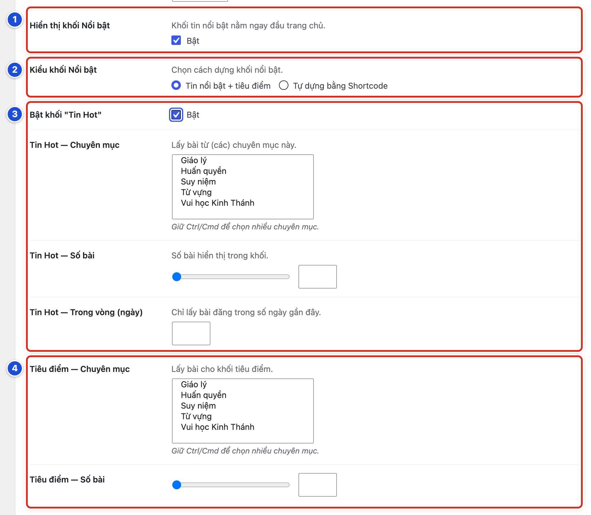

*Hình 15.02 Số 1: Hiển thị khối Nổi bật (Bước 1); số 2: Kiểu khối Nổi bật (Bước 2); số 3: các ô Tin Hot (Bước 3–6); số 4: các ô Tiêu điểm (Bước 7–8).*

#### Kết quả

Bạn sẽ thấy khối Nổi bật ở đầu trang chủ, phía trên các khối nội dung. Dải Tin Hot hiện tên các bài được xem nhiều. Phần Tiêu điểm có một bài lớn và các bài nhỏ.

#### Lưu ý

- Không chọn chuyên mục nào thì khối lấy bài của mọi chuyên mục.
- **Tin Hot** xếp bài theo lượt xem do plugin WP-PostViews đếm.
- **Tin Hot — Trong vòng (ngày)** chỉ lấy bài đăng trong số ngày gần đây. Để trống là lấy các bài đăng trong tuần này.
- **Tiêu điểm — Số bài** để trống thì hiện 5 bài.
- Kiểu **Tự dựng bằng Shortcode** dành cho người làm kỹ thuật. Không chọn nếu không có hướng dẫn riêng.
- Muốn tắt khối: bỏ tích **Bật** ở **Hiển thị khối Nổi bật**, rồi lưu.

#### Không nên làm

- Không bật khối khi chuyên mục nguồn còn ít bài hoặc bài chưa có ảnh đại diện. Khối sẽ trông trống trải.
- Không đặt **Trong vòng (ngày)** quá ngắn (như *1*) khi website ít bài mới. Dải Tin Hot dễ bị trống.
- Không gõ vào ô **Shortcode** theo hướng dẫn trên mạng.

#### Nếu gặp lỗi

- Dải Tin Hot trống → chưa có bài nào được xem trong số ngày đã đặt. Tăng số ở **Tin Hot — Trong vòng (ngày)**, ví dụ *30*, rồi lưu.
- Không thấy các ô Tin Hot → chưa tích **Bật** ở **Bật khối "Tin Hot"**, hoặc **Kiểu khối Nổi bật** chưa chọn **Tin nổi bật + tiêu điểm**.
- Tiêu điểm hiện bài không mong muốn → còn chọn thừa chuyên mục. Giữ Ctrl (Mac: Cmd) và bấm vào tên chuyên mục thừa để bỏ chọn.
- Không thấy khối ngoài website → kiểm tra **Hiển thị khối Nổi bật** đã tích **Bật** và đã lưu. Khối chỉ hiện ở trang chủ.

### Bài 15.03 Cấu hình box 5 phút Lời Chúa

**Nhãn:** Kỹ thuật dành cho quản trị viên · 🟡 Cẩn thận

#### Mục đích

Bật box “5 phút” ngay dưới thanh menu. Box hiện tiêu đề, đoạn tóm tắt của bài mới nhất trong chuyên mục bạn chọn, và liên kết **Suy niệm »** tới bài đó.

#### Trước khi bắt đầu

- Đăng nhập bằng tài khoản Quản lý. Mở **Thiết lập giao diện**, tab **Trang chủ & Bài viết**, tab con **Trang chủ**, kéo xuống phần box “5 phút”.
- Chuyên mục nguồn đã có bài. Bài mới nhất nên có mô tả ngắn (Bài 05.05).
- Chụp màn hình thiết lập đang dùng (Bài 13.03).

#### Các bước thực hiện

1. **Bước 1:** Ở **Hiển thị box "5 phút"**, tích **Bật**. Các ô bên dưới hiện ra.
2. **Bước 2:** Ở **Tiêu đề box**, gõ tiêu đề, ví dụ *5 phút Lời Chúa*.
3. **Bước 3:** Ở **Chuyên mục nguồn**, bấm chọn chuyên mục chứa bài suy niệm, ví dụ **Suy niệm**.
4. **Bước 4:** Tích **Bật** ở từng nơi muốn hiện box: **Hiện ở Trang chủ**, **Hiện ở trang Bài viết**, **Hiện ở trang Chuyên mục**.
5. **Bước 5:** Kéo xuống cuối trang, bấm **Lưu thay đổi**.
6. **Bước 6:** Mở website, nhấn F5 ở từng loại trang đã bật để xem box.

#### Ảnh minh họa

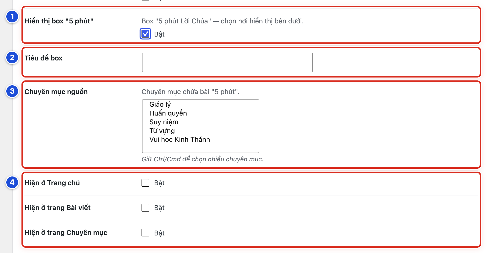

*Hình 15.03 Số 1–4 ứng với Bước 1–4.*

#### Kết quả

Bạn sẽ thấy box ngay dưới thanh menu, chỉ ở các loại trang đã bật. Box có tiêu đề, đoạn tóm tắt của bài mới nhất trong chuyên mục nguồn và liên kết **Suy niệm »** dẫn tới bài đó.

#### Lưu ý

- Box tự đổi khi có bài mới đăng trong chuyên mục nguồn. Không cần sửa lại thiết lập.
- Đoạn tóm tắt lấy từ mô tả ngắn của bài. Bài không có mô tả ngắn thì website tự lấy mấy dòng đầu của bài.
- Box chỉ hiện ở nơi đã tích **Bật**. Box không hiện ở trang kết quả tìm kiếm.
- Nên chọn một chuyên mục. Nếu giữ Ctrl/Cmd để chọn nhiều, box lấy bài mới nhất trong các chuyên mục đã chọn.
- Trang chủ website mẫu đã có khối **Lời Chúa hôm nay** (Bài 15.07). Nếu bật thêm box ở trang chủ, khách có thể thấy cùng một bài hai lần.

#### Không nên làm

- Không chọn chuyên mục có lẫn nhiều loại bài làm nguồn. Box có thể hiện bài không phải suy niệm.
- Không để trống **Chuyên mục nguồn**. Khi đó box lấy bài mới nhất của mọi chuyên mục.

#### Nếu gặp lỗi

- Đã bật nhưng không thấy box ở trang chủ → chưa tích **Bật** ở **Hiện ở Trang chủ**. Mỗi nơi phải tích riêng.
- Box hiện bài không đúng → kiểm tra **Chuyên mục nguồn**. Giữ Ctrl (Mac: Cmd) và bấm vào tên chuyên mục thừa để bỏ chọn.
- Đoạn tóm tắt dài hoặc lộn xộn → bài mới nhất chưa có mô tả ngắn. Viết mô tả ngắn cho bài (Bài 05.05).

### Bài 15.04 Thêm một khối nội dung trang chủ

**Nhãn:** Kỹ thuật dành cho quản trị viên · 🟡 Cẩn thận

#### Mục đích

Thêm một khối (một mảng nội dung trên trang chủ, ví dụ khối “Giáo lý” hiện các bài mới của chuyên mục Giáo lý), thử trước, rồi mới cho mọi người thấy.

#### Trước khi bắt đầu

- Đăng nhập bằng tài khoản Quản lý. Mở **Thiết lập giao diện**, tab **Trang chủ & Bài viết**, tab con **Trang chủ**.
- Biết khối sẽ dùng mẫu nào (Bài 15.05) và lấy bài từ chuyên mục nào.
- Chụp danh sách khối hiện tại ở dạng thu gọn (Bài 13.03).
- Các khối chỉ hiện trên trang **Trang chủ** đang dùng mẫu trang **Trang Chủ** và được đặt làm trang chủ (Bài 12.01).

#### Các bước thực hiện

1. **Bước 1:** Kéo xuống phần **Khối nội dung trang chủ**.
2. **Bước 2:** Bấm **+ Thêm khối** ở cuối danh sách. Khối mới hiện ở cuối, đang mở sẵn.
3. **Bước 3:** Ở ô chọn mẫu của khối mới, chọn mẫu, ví dụ **Danh sách bài 3** (Bài 15.05).
4. **Bước 4:** Ở **Tiêu đề khối**, gõ tên khối, ví dụ *Giáo lý*.
5. **Bước 5:** Ở **Hiển thị khối**, để **Có**.
6. **Bước 6:** Ở **Chỉ Admin thấy**, chọn **Có** để thử trước.
7. **Bước 7:** Ở nhóm **Nguồn bài viết**, bấm chọn **Chuyên mục** (Bài 15.06).
8. **Bước 8:** Ở **Số bài hiển thị**, kéo thanh trượt hoặc gõ số bài.
9. **Bước 9:** Kéo xuống cuối trang, bấm **Lưu thay đổi**.
10. **Bước 10:** Mở trang chủ, nhấn F5. Kéo xuống cuối trang chủ để xem khối mới.
11. **Bước 11:** Thấy đúng rồi thì quay lại khối, đổi **Chỉ Admin thấy** thành **Không**.
12. **Bước 12:** Bấm **Lưu thay đổi** để mọi người cùng thấy khối.

#### Ảnh minh họa

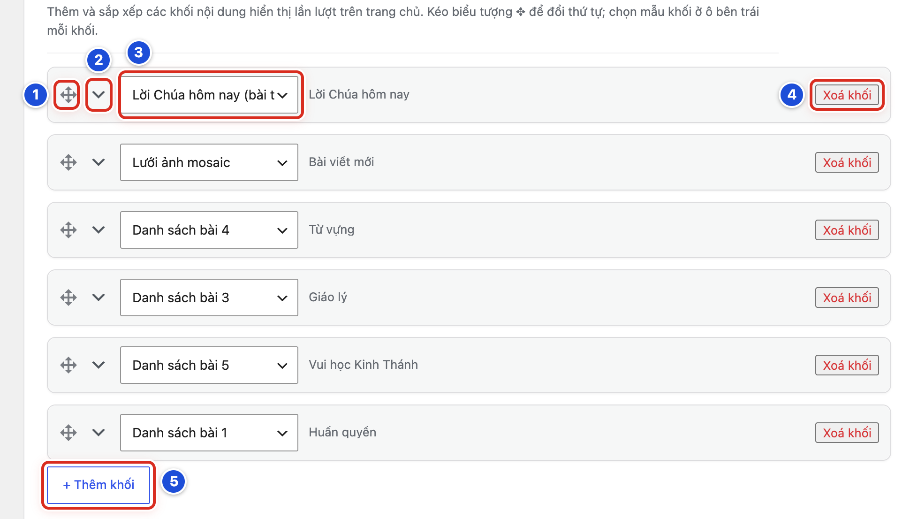

*Hình 15.04 Sáu khối của website mẫu (đã thu gọn). Số 5: nút + Thêm khối (Bước 2); số 3: ô chọn mẫu (Bước 3); số 1: biểu tượng ✥ để đổi thứ tự (Bài 15.09); số 2: mũi tên thu gọn / mở rộng; số 4: nút Xoá khối (Bài 15.11).*

#### Kết quả

Bạn sẽ thấy khối mới ở cuối danh sách khối và ở cuối trang chủ. Khi **Chỉ Admin thấy** là **Có**, chỉ người đang đăng nhập tài khoản Quản lý thấy khối. Sau khi đổi về **Không**, mọi người đều thấy.

#### Lưu ý

- Khối mới luôn nằm ở cuối. Muốn đưa lên trên, xem Bài 15.09.
- Cạnh ô chọn mẫu có tên tóm tắt của khối. Khối chưa có tiêu đề ghi *(Khối chưa đặt tiêu đề)*.
- Khối mới chưa ảnh hưởng website cho tới khi bấm **Lưu thay đổi**.
- **Hiển thị khối: Không** dùng để tạm ẩn khối mà không xoá.
- Website mẫu có 6 khối: **Lời Chúa hôm nay**, **Bài viết mới**, **Từ vựng**, **Giáo lý**, **Vui học Kinh Thánh**, **Huấn quyền**.

#### Không nên làm

- Không tạo hai khối lấy cùng một chuyên mục. Trang chủ sẽ lặp bài.
- Không để **Chỉ Admin thấy: Có** sau khi thử xong. Khách sẽ không thấy khối.
- Không đổi **Cài đặt → Đọc** để “thử” khối (Bài 12.04).

#### Nếu gặp lỗi

- Khối hiện dòng “Hiện chưa có bài viết nào ở danh mục này.” → chuyên mục đã chọn chưa có bài đã xuất bản. Chọn chuyên mục khác hoặc đăng bài trước (Bài 24.02).
- Đã lưu nhưng không thấy khối ngoài trang chủ → kiểm tra **Hiển thị khối** là **Có**. Nếu **Chỉ Admin thấy** là **Có**, bạn phải đang đăng nhập tài khoản Quản lý mới thấy.
- Người khác báo không thấy khối, còn bạn thấy → **Chỉ Admin thấy** vẫn là **Có**. Đổi về **Không** rồi lưu.
- Bấm **+ Thêm khối** mà không thấy khối mới → kéo xuống cuối danh sách. Khối mới nằm ngay trên nút **+ Thêm khối**.

### Bài 15.05 Chọn mẫu khối phù hợp

**Nhãn:** Kỹ thuật dành cho quản trị viên · 🟢 An toàn

#### Mục đích

Chọn đúng một trong chín mẫu, để khối trình bày bài theo hình dáng mong muốn.

#### Trước khi bắt đầu

- Đăng nhập bằng tài khoản Quản lý. Mở **Thiết lập giao diện**, tab **Trang chủ & Bài viết**, tab con **Trang chủ**, kéo xuống **Khối nội dung trang chủ**.
- Xem hình dáng chín mẫu ở Hình 15.05.
- Muốn thử an toàn, dùng một khối mới đặt **Chỉ Admin thấy: Có** (Bài 15.04).

#### Các bước thực hiện

1. **Bước 1:** Bấm mũi tên ở đầu khối để mở khối, nếu khối đang thu gọn.
2. **Bước 2:** Bấm vào ô chọn mẫu ở đầu khối.
3. **Bước 3:** Chọn tên mẫu trong danh sách, ví dụ **Danh sách bài 4**.
4. **Bước 4:** Nhìn ảnh **Bố cục mẫu khối:** ngay bên dưới. Ảnh đổi theo mẫu vừa chọn.
5. **Bước 5:** Điền các ô của mẫu mới: **Tiêu đề khối**, rồi nguồn bài (Bài 15.06).
6. **Bước 6:** Kéo xuống cuối trang, bấm **Lưu thay đổi**.
7. **Bước 7:** Mở trang chủ, nhấn F5 để xem hình dáng mới.

#### Ảnh minh họa

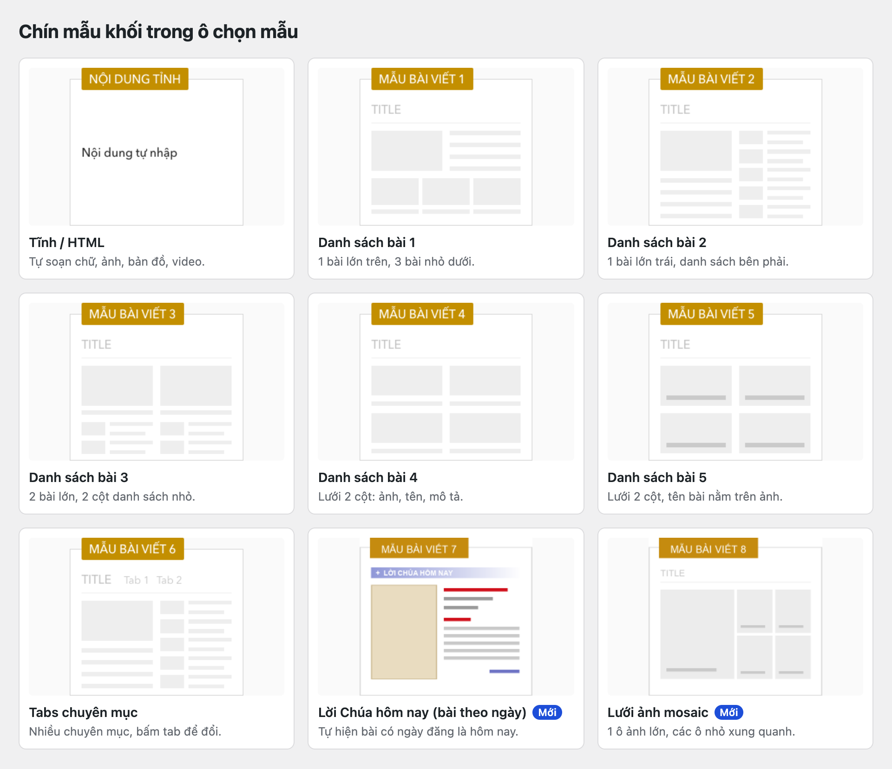

*Hình 15.05 Chín mẫu khối trong ô chọn mẫu: tên mẫu, hình dáng và mô tả ngắn.*

#### Kết quả

Bạn sẽ thấy khối ngoài trang chủ trình bày theo hình dáng của mẫu mới, giống ảnh **Bố cục mẫu khối:**.

#### Lưu ý

| Mẫu | Hình dáng | Ô nguồn cần điền |
|---|---|---|
| **Tĩnh / HTML** | Nội dung tự soạn: lời ngỏ, bản đồ, video | **Nội dung (HTML)** |
| **Danh sách bài 1** | 1 bài lớn trên, 3 bài nhỏ dưới | Chuyên mục, Số bài |
| **Danh sách bài 2** | Bài lớn bên trái, danh sách cuộn bên phải | Chuyên mục, Số bài |
| **Danh sách bài 3** | 2 bài lớn, 2 cột danh sách nhỏ | Chuyên mục, Số bài |
| **Danh sách bài 4** | Lưới 2 cột: ảnh, tên, mô tả | Chuyên mục, Số bài |
| **Danh sách bài 5** | Lưới 2 cột, tên bài nằm trên ảnh | Chuyên mục, Số bài |
| **Tabs chuyên mục** | Nhiều chuyên mục, bấm tab để đổi | Chuyên mục (Tab đầu), các tab |
| **Lời Chúa hôm nay (bài theo ngày)** | Bài có ngày đăng là hôm nay | Chuyên mục |
| **Lưới ảnh mosaic** | 1 ô ảnh lớn, các ô nhỏ bên cạnh | Chuyên mục, Số bài |

- Mỗi mẫu có bộ ô riêng. Đổi mẫu thì các ô của mẫu cũ ẩn đi; bạn phải gõ lại **Tiêu đề khối** và chọn lại chuyên mục.
- Sau khi lưu, chỉ các ô của mẫu đang chọn được giữ lại. Hãy chụp thiết lập cũ trước khi đổi mẫu (Bài 13.03).
- Mẫu **Lời Chúa hôm nay** và hai mẫu **Lưới ảnh mosaic**, **Tabs chuyên mục** có hướng dẫn riêng (Bài 15.07, 15.08).

#### Không nên làm

- Không chọn **Tĩnh / HTML** để hiện bài viết. Mẫu này không lấy bài từ chuyên mục.
- Không đổi mẫu của khối đang dùng tốt chỉ để thử. Hãy thử trên một khối mới đặt **Chỉ Admin thấy: Có**.

#### Nếu gặp lỗi

- Đổi mẫu xong, tên tóm tắt ghi *(Khối chưa đặt tiêu đề)* → mẫu mới chưa có tiêu đề. Gõ lại **Tiêu đề khối**.
- Sau khi đổi mẫu, khối hiện bài của mọi chuyên mục → mẫu mới chưa chọn chuyên mục. Mở khối, chọn lại **Chuyên mục**, rồi lưu.
- Lỡ đổi mẫu, chưa lưu → chọn lại mẫu cũ trong ô chọn mẫu. Các ô cũ hiện lại như trước.
- Đã lưu với mẫu mới, muốn trở lại mẫu cũ → chọn lại mẫu cũ và điền lại các ô theo ảnh chụp (Bài 13.03).

### Bài 15.06 Chọn nguồn bài và thành phần hiển thị của khối

**Nhãn:** Kỹ thuật dành cho quản trị viên · 🟡 Cẩn thận

#### Mục đích

Chọn khối lấy bài từ chuyên mục nào, hiện bao nhiêu bài, và mỗi thẻ bài (ô nhỏ chứa một bài) hiện những gì.

#### Trước khi bắt đầu

- Đăng nhập bằng tài khoản Quản lý. Mở **Khối nội dung trang chủ** ở tab con **Trang chủ**.
- Khối đã chọn mẫu (Bài 15.05).
- Chụp thiết lập cũ của khối (Bài 13.03).

#### Các bước thực hiện

1. **Bước 1:** Bấm mũi tên ở đầu khối để mở khối. Ô chọn mẫu cho biết khối đang dùng mẫu nào.
2. **Bước 2:** Ở nhóm **Thông tin khối**, gõ **Tiêu đề khối**. Tiêu đề hiện ở đầu khối ngoài trang chủ.
3. **Bước 3:** Ở **Hiển thị khối**, chọn **Có** để hiện, hoặc **Không** để tạm ẩn.
4. **Bước 4:** Ở nhóm **Nguồn bài viết**, bấm chọn **Chuyên mục**.
5. **Bước 5:** Ở **Số bài hiển thị**, kéo thanh trượt hoặc gõ số bài (từ 1 đến 30).
6. **Bước 6:** Ở nhóm **Hiển thị trên thẻ bài**, chọn **Có** hoặc **Không** cho **Ảnh đại diện**, **Mô tả ngắn**, **Ngày đăng**, **Lượt xem**, **Tác giả**.
7. **Bước 7:** Kéo xuống cuối trang, bấm **Lưu thay đổi**.
8. **Bước 8:** Mở trang chủ, nhấn F5 để xem khối.

#### Ảnh minh họa

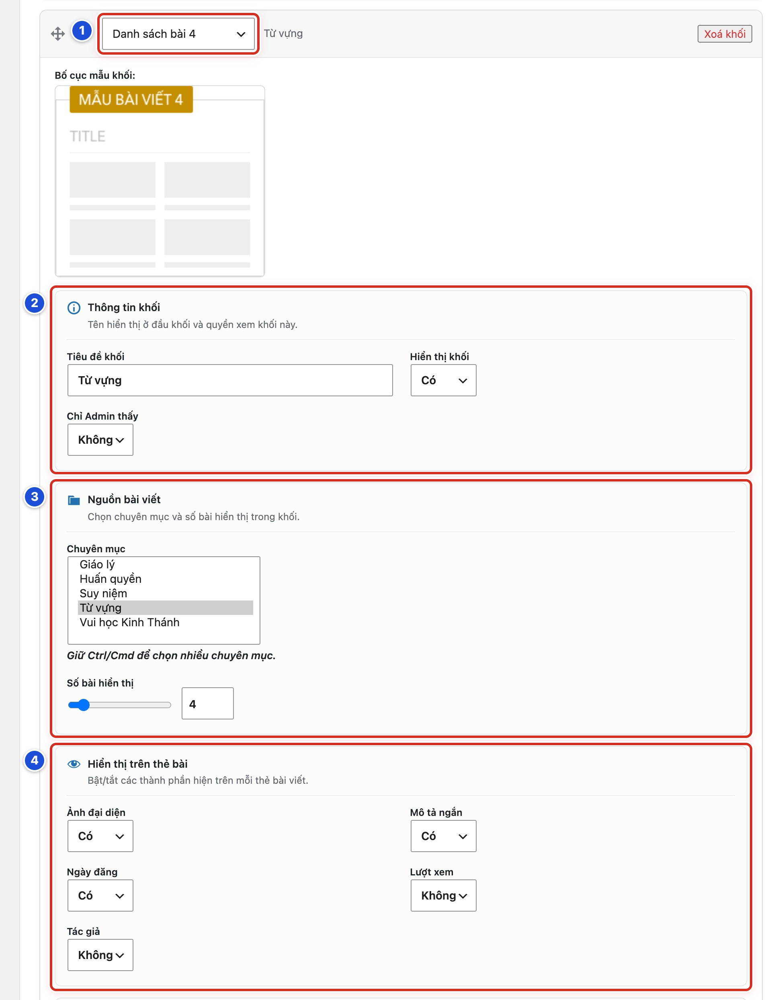

*Hình 15.06 Khối “Từ vựng” của website mẫu (mẫu Danh sách bài 4). Số 1: ô chọn mẫu (Bước 1); số 2: Thông tin khối (Bước 2–3); số 3: Nguồn bài viết (Bước 4–5); số 4: Hiển thị trên thẻ bài (Bước 6).*

#### Kết quả

Bạn sẽ thấy khối hiện đúng số bài của chuyên mục đã chọn. Mỗi thẻ bài chỉ hiện các thành phần đặt là **Có**.

#### Lưu ý

- **Số bài hiển thị** mặc định là 6.
- Không chọn chuyên mục nào thì khối lấy bài mới nhất của mọi chuyên mục.
- Hai khối chọn hai chuyên mục khác nhau thì mỗi khối hiện bài của chuyên mục mình, kể cả khi hai khối trùng tiêu đề. Một bài được tích cả hai danh mục sẽ hiện ở cả hai khối.
- Mặc định của **Hiển thị trên thẻ bài**: **Ảnh đại diện**, **Mô tả ngắn**, **Ngày đăng**, **Lượt xem** là **Có**; **Tác giả** là **Không**.
- Khối “Từ vựng” của website mẫu: chuyên mục **Từ vựng**, 4 bài, **Lượt xem** và **Tác giả** đặt **Không**.
- Mẫu **Tĩnh / HTML** không có nhóm **Nguồn bài viết**. Thay vào đó là ô **Nội dung (HTML)**: gõ lời ngỏ, hoặc dán mã nhúng video YouTube (ô giữ nguyên mã nhúng sau khi lưu).
- Mẫu **Tĩnh / HTML** và **Lời Chúa hôm nay** không có nhóm **Hiển thị trên thẻ bài**.
- Bài Lời Chúa không có ảnh đại diện sẽ hiện câu Lời Chúa ở chỗ ảnh.

#### Không nên làm

- Không chọn quá nhiều bài (như 30) cho mẫu có ảnh lớn. Trang chủ sẽ dài và tải chậm.
- Không bật **Tác giả** nếu mọi bài cùng một người đăng. Thẻ bài sẽ rối thêm.
- Không chọn chuyên mục chưa có bài đã xuất bản.

#### Nếu gặp lỗi

- Khối hiện dòng “Hiện chưa có bài viết nào ở danh mục này.” → chuyên mục chưa có bài đã xuất bản. Bài hẹn giờ chưa tới ngày thì chưa tính (Bài 24.02).
- Khối hiện lẫn bài của chuyên mục khác → còn chọn nhầm một chuyên mục nữa. Giữ Ctrl (Mac: Cmd) và bấm vào tên đó để bỏ chọn.
- Khối hiện ít bài hơn số đã đặt → chuyên mục chỉ có chừng đó bài đã xuất bản.
- Thẻ bài vẫn hiện thành phần đã đặt **Không** → kiểm tra đã bấm **Lưu thay đổi**; mở trang chủ, nhấn F5.

### Bài 15.07 Thêm khối Lời Chúa hôm nay

**Nhãn:** Kỹ thuật dành cho quản trị viên · 🟡 Cẩn thận

#### Mục đích

Thêm khối tự đổi bài mỗi ngày. Khối hiện bài có ngày đăng là hôm nay trong một chuyên mục, ví dụ **Suy niệm**.

#### Trước khi bắt đầu

- Đăng nhập bằng tài khoản Quản lý.
- Mỗi ngày có một bài loại **Lời Chúa (câu ghi nhớ)** trong cùng một chuyên mục, hẹn giờ đăng đúng ngày của bài (Bài 19.06).
- Đã bấm **+ Thêm khối** (Bài 15.04, Bước 1–2). Khối mới đang mở ở cuối danh sách.

#### Các bước thực hiện

1. **Bước 1:** Ở ô chọn mẫu của khối mới, chọn **Lời Chúa hôm nay (bài theo ngày)**.
2. **Bước 2:** Ở **Tiêu đề khối**, gõ *Lời Chúa hôm nay*.
3. **Bước 3:** Ở nhóm **Nguồn bài viết**, ô **Chuyên mục**, bấm chọn chuyên mục chứa bài mỗi ngày, ví dụ **Suy niệm**.
4. **Bước 4:** Kéo khối lên đầu danh sách bằng biểu tượng **✥** (Bài 15.09).
5. **Bước 5:** Kéo xuống cuối trang, bấm **Lưu thay đổi**.
6. **Bước 6:** Mở trang chủ, nhấn F5 để xem khối.
7. **Bước 7:** Thêm widget **Lịch Lời Chúa** vào thanh bên trang chủ, chọn cùng chuyên mục với khối (Bài 18.07).

#### Ảnh minh họa

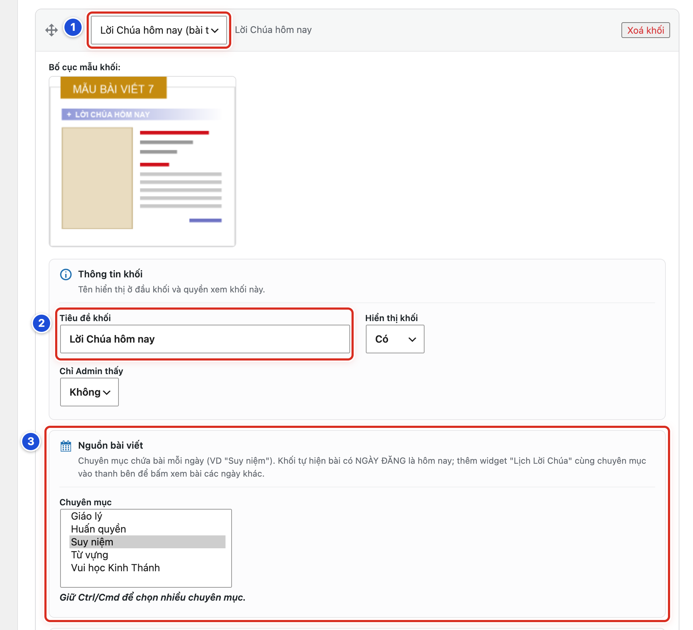

*Hình 15.07a Số 1–3 ứng với Bước 1–3.*

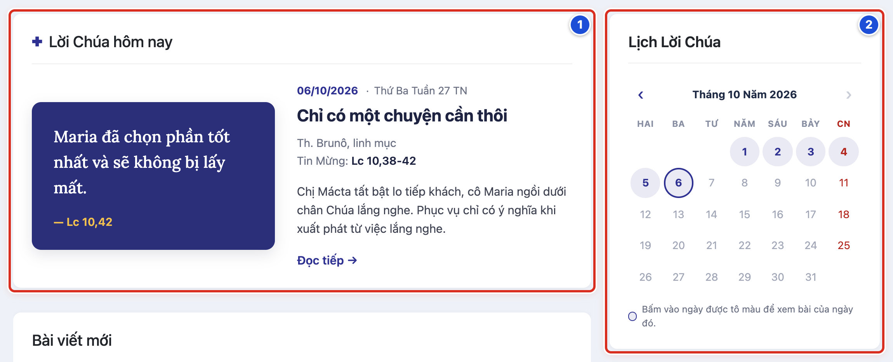

*Hình 15.07b Ngoài website: số 1 là khối Lời Chúa hôm nay (bài ngày 06/10/2026); số 2 là widget Lịch Lời Chúa ở thanh bên.*

#### Kết quả

Bạn sẽ thấy khối có tiêu đề kèm dấu ✚. Bên trái là ảnh đại diện; bài không có ảnh thì hiện thẻ màu có câu Lời Chúa và trích dẫn. Bên phải là ngày, Ngày phụng vụ, tên bài, Lễ / kính thánh, dòng “Tin Mừng: …”, mô tả ngắn và liên kết **Đọc tiếp →**. Ví dụ ngày 06/10/2026: *Chỉ có một chuyện cần thôi*, *Thứ Ba Tuần 27 TN*, *Th. Brunô, linh mục*, Tin Mừng *Lc 10,38-42*.

#### Lưu ý

- Khối chỉ dùng chuyên mục đầu tiên được chọn. Hãy chọn đúng một chuyên mục.
- Hôm nay chưa có bài thì khối hiện bài gần nhất trước đó. Trang chủ không bao giờ bị trống.
- Khối tự đổi bài khi sang ngày mới, không cần sửa thiết lập. Việc hằng ngày chỉ là chuẩn bị bài đúng ngày (Bài 19.06).
- Widget **Lịch Lời Chúa** cùng chuyên mục với khối: bấm một ngày được tô màu là bài của ngày đó hiện ngay trong khối.
- Ngày phụng vụ, Lễ / kính thánh, Đoạn Tin Mừng lấy từ hộp **Phân loại bài viết** của bài (Bài 19.05).
- Mẫu này không có nhóm **Hiển thị trên thẻ bài** và nút **Xem thêm**. Vẫn có nhóm **Màu sắc khối** (Bài 15.10).

#### Không nên làm

- Không tạo hai khối Lời Chúa hôm nay trên cùng trang chủ.
- Không chọn chuyên mục có lẫn bài tin tức. Khối có thể hiện bài không phải Lời Chúa.
- Không chọn khác chuyên mục giữa khối và widget **Lịch Lời Chúa**.

#### Nếu gặp lỗi

- Khối hiện bài của hôm qua → bài hôm nay chưa có, hoặc hẹn sai ngày. Mở bài, xem lại ngày ở mục **Xuất bản** (Bài 24.05).
- Bấm ngày trên lịch thì mở sang trang bài, thay vì đổi bài trong khối → widget và khối đang khác chuyên mục. Chọn lại cho giống nhau (Bài 18.07).
- Khối không có Ngày phụng vụ hay dòng Tin Mừng → bài chưa điền các ô này trong hộp **Phân loại bài viết** (Bài 19.05).
- Khối nằm ở cuối trang chủ → kéo khối lên đầu danh sách bằng **✥**, rồi lưu (Bài 15.09).

### Bài 15.08 Dùng khối Lưới ảnh mosaic và Tabs chuyên mục

**Nhãn:** Kỹ thuật dành cho quản trị viên · 🟡 Cẩn thận

#### Mục đích

Dùng hai mẫu khối: **Lưới ảnh mosaic** (bài đầu ở ô ảnh lớn, các bài sau ở ô nhỏ, tên bài nằm trên ảnh) và **Tabs chuyên mục** (nhiều chuyên mục trong một khối, bấm tab để đổi).

#### Trước khi bắt đầu

- Đăng nhập bằng tài khoản Quản lý. Mở **Khối nội dung trang chủ** ở tab con **Trang chủ**.
- Xem hình dáng hai mẫu ở Hình 15.05 (ô thứ bảy là **Tabs chuyên mục**, ô thứ chín là **Lưới ảnh mosaic**).
- Chụp danh sách khối hiện tại (Bài 13.03).

#### Các bước thực hiện

1. **Bước 1:** Bấm **+ Thêm khối**.
2. **Bước 2:** Ở ô chọn mẫu của khối mới, chọn **Lưới ảnh mosaic**.
3. **Bước 3:** Ở **Tiêu đề khối**, gõ tên, ví dụ *Bài viết mới*.
4. **Bước 4:** Ở **Chuyên mục**, chọn chuyên mục. Để trống nếu muốn lấy bài mới nhất của mọi chuyên mục.
5. **Bước 5:** Ở **Số bài hiển thị**, chọn *5* (một ô lớn và bốn ô nhỏ).
6. **Bước 6:** Bấm **+ Thêm khối** lần nữa để tạo khối Tabs.
7. **Bước 7:** Ở ô chọn mẫu của khối này, chọn **Tabs chuyên mục**.
8. **Bước 8:** Ở **Chuyên mục (Tab đầu)**, chọn chuyên mục cho tab đầu tiên, ví dụ **Giáo lý**.
9. **Bước 9:** Bấm **+ Thêm Tab**. Một dòng mới hiện ra.
10. **Bước 10:** Ở dòng mới, gõ **Tên Tab**, ví dụ *Huấn quyền*.
11. **Bước 11:** Ở cùng dòng, bấm chọn chuyên mục cho tab đó, ví dụ **Huấn quyền**. Lặp lại Bước 9–11 cho mỗi tab tiếp theo.
12. **Bước 12:** Kéo xuống cuối trang, bấm **Lưu thay đổi**.
13. **Bước 13:** Mở trang chủ, nhấn F5, bấm thử từng tab.

#### Ảnh minh họa

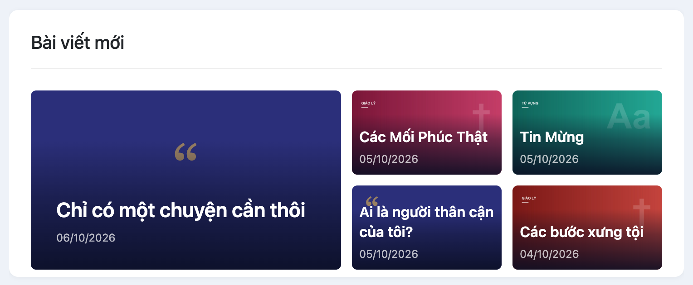

*Hình 15.08 Khối “Bài viết mới” của website mẫu, mẫu Lưới ảnh mosaic: bài mới nhất ở ô lớn, bốn bài kế tiếp ở ô nhỏ.*

Hình dáng mẫu **Tabs chuyên mục**: xem Hình 15.05, ô thứ bảy.

#### Kết quả

Bạn sẽ thấy khối mosaic với bài mới nhất ở ô lớn, các bài sau ở ô nhỏ, tên bài và ngày đăng nằm trên ảnh. Khối Tabs có một hàng tab ở đầu khối. Bấm một tab là danh sách đổi sang bài của chuyên mục đó, mỗi tab 10 bài.

#### Lưu ý

- Mosaic dùng nhóm **Nguồn bài viết** giống Danh sách bài 1–5: **Chuyên mục** và **Số bài hiển thị**.
- Trong mosaic, bài không có ảnh đại diện hiện ô màu. Bài Lời Chúa không có ảnh hiện câu Lời Chúa ở chỗ ảnh.
- Tabs: **Tiêu đề khối** là tên của tab đầu. Khối Tabs không cần tiêu đề; để trống thì tab đầu lấy tên chuyên mục ở **Chuyên mục (Tab đầu)**.
- Tab không gõ **Tên Tab** tự lấy tên chuyên mục của tab đó.
- Tabs không có ô **Số bài hiển thị** (mỗi tab luôn 10 bài) và không có nút **Xem thêm**.
- Bấm dấu **×** ở cuối một dòng tab để bỏ tab đó.

#### Không nên làm

- Không cho hai tab cùng một chuyên mục. Hai tab sẽ hiện cùng bài.
- Không thêm quá nhiều tab. Hàng tab dài khó bấm trên điện thoại.
- Không đặt số bài mosaic quá ít (1–2). Lưới sẽ không đủ ô.

#### Nếu gặp lỗi

- Một tab hiện dòng “Hiện chưa có bài viết nào ở danh mục này.” → chuyên mục của tab đó chưa có bài đã xuất bản. Chọn chuyên mục khác cho tab.
- Tab đầu hiện chữ “Mới nhất” → khối chưa có tiêu đề và chưa chọn **Chuyên mục (Tab đầu)**. Gõ **Tiêu đề khối** hoặc chọn chuyên mục.
- Mosaic chỉ có một ô lớn → **Số bài hiển thị** đang là 1, hoặc chuyên mục chỉ có một bài.
- Lỡ bấm **×** bỏ mất một tab, chưa lưu → nhấn F5 để tải lại trang. Tab hiện lại như cũ.

### Bài 15.09 Đổi thứ tự các khối trang chủ

**Nhãn:** Kỹ thuật dành cho quản trị viên · 🟡 Cẩn thận

#### Mục đích

Sắp xếp khối nào hiện trước, khối nào hiện sau trên trang chủ.

#### Trước khi bắt đầu

- Đăng nhập bằng tài khoản Quản lý. Mở **Khối nội dung trang chủ** ở tab con **Trang chủ**.
- Chụp thứ tự khối hiện tại (Bài 13.03).
- Làm trên máy tính có chuột. Kéo thả trên điện thoại rất khó.

#### Các bước thực hiện

1. **Bước 1:** Bấm mũi tên ở từng khối để thu gọn, cho danh sách ngắn và dễ kéo.
2. **Bước 2:** Rê chuột lên biểu tượng **✥** ở đầu khối cần chuyển. Con trỏ chuột đổi thành hình mũi tên bốn chiều.
3. **Bước 3:** Bấm giữ chuột trái và kéo khối lên hoặc xuống.
4. **Bước 4:** Thả chuột khi khối nằm đúng vị trí mới.
5. **Bước 5:** Đọc lại tên các khối từ trên xuống để chắc thứ tự đúng.
6. **Bước 6:** Kéo xuống cuối trang, bấm **Lưu thay đổi**.
7. **Bước 7:** Mở trang chủ, nhấn F5, xem các khối từ trên xuống.

#### Ảnh minh họa

Xem Hình 15.04, số 1 (biểu tượng **✥** để kéo, Bước 2–4) và số 2 (mũi tên thu gọn / mở rộng, Bước 1).

#### Kết quả

Bạn sẽ thấy các khối trên trang chủ xếp đúng như trong danh sách: khối trên cùng danh sách hiện trên cùng trang chủ.

#### Lưu ý

- Website mẫu xếp: **Lời Chúa hôm nay** → **Bài viết mới** → **Từ vựng** → **Giáo lý** → **Vui học Kinh Thánh** → **Huấn quyền**.
- Kéo xong mà chưa lưu thì trang chủ chưa đổi.
- Thu gọn chỉ để dễ nhìn trên màn hình thiết lập. Không ảnh hưởng website.
- Khối Nổi bật (Bài 15.02) luôn ở đầu trang chủ, không nằm trong danh sách này.

#### Không nên làm

- Không bấm vào ô chọn mẫu khi đang kéo. Dễ đổi nhầm mẫu.
- Không đoán khối theo vị trí. Đọc tên tóm tắt cạnh ô chọn mẫu.

#### Nếu gặp lỗi

- Kéo không được → bạn đang kéo chỗ khác. Chỉ kéo được khi bấm giữ đúng biểu tượng **✥**.
- Khối rơi sai chỗ → kéo lại. Hoặc, khi chưa lưu, nhấn F5 để trở về thứ tự cũ.
- Trang chủ chưa đổi thứ tự → kiểm tra đã bấm **Lưu thay đổi** và thấy thông báo xanh; mở trang chủ, nhấn F5.

### Bài 15.10 Sửa màu và nút Xem thêm của khối

**Nhãn:** Kỹ thuật dành cho quản trị viên · 🟡 Cẩn thận

#### Mục đích

Đặt màu riêng cho một khối, và thêm nút “Xem thêm” ở cuối khối để khách mở trang có đủ bài.

#### Trước khi bắt đầu

- Đăng nhập bằng tài khoản Quản lý. Mở khối cần sửa (bấm mũi tên), kéo xuống nhóm **Màu sắc khối**.
- Lấy sẵn địa chỉ trang đích: mở website, bấm tên chuyên mục trên menu, chép địa chỉ trên thanh địa chỉ của trình duyệt.
- Chụp thiết lập cũ của khối (Bài 13.03).

#### Các bước thực hiện

1. **Bước 1:** Ở **Dùng màu mặc định**, chọn **Không**. Ba ô màu hiện ra.
2. **Bước 2:** Ở **Màu nền**, **Màu chữ**, **Màu nhấn**, bấm **Chọn màu** và chọn màu cho từng ô.
3. **Bước 3:** Ở nhóm **Nút "Xem thêm"**, ô **Hiện nút**, chọn **Có**.
4. **Bước 4:** Ở **Chữ trên nút**, gõ chữ, ví dụ *Xem thêm »*.
5. **Bước 5:** Ở **Liên kết**, dán địa chỉ trang đích đã chép.
6. **Bước 6:** Ở **Mở tab mới**, để **Không** nếu trang đích thuộc website này.
7. **Bước 7:** Kéo xuống cuối trang, bấm **Lưu thay đổi**.
8. **Bước 8:** Mở trang chủ, nhấn F5, bấm thử nút ở cuối khối.

#### Ảnh minh họa

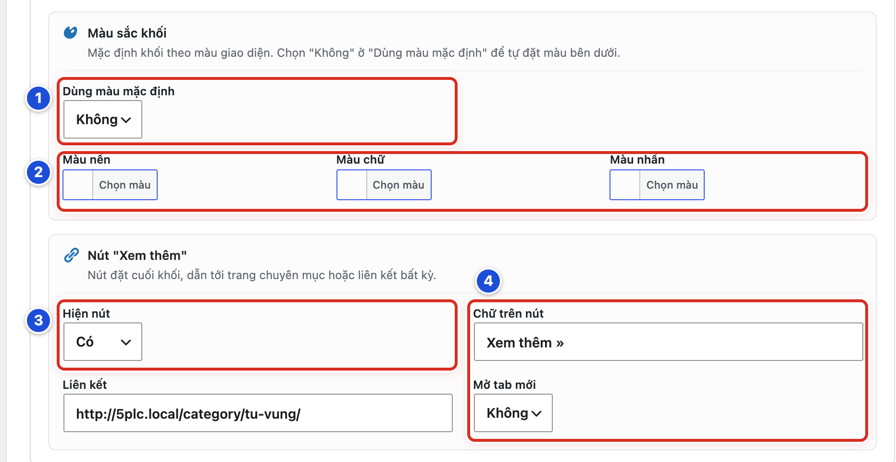

*Hình 15.10 Số 1–3 ứng với Bước 1–3; số 4: Chữ trên nút và Mở tab mới (Bước 4 và 6). Ô Liên kết (Bước 5) nằm ngay dưới Hiện nút.*

#### Kết quả

Bạn sẽ thấy khối có màu nền, màu chữ, màu nhấn mới. Cuối khối có nút mang chữ bạn gõ, ví dụ **Xem thêm »**. Bấm vào nút mở đúng trang đích.

#### Lưu ý

- **Dùng màu mặc định: Có** thì khối theo màu giao diện (Bài 14.01). Ba ô màu chỉ hiện khi chọn **Không**.
- Mẫu **Tĩnh / HTML** chỉ có **Màu nền** và **Màu chữ**, không có **Màu nhấn**.
- Mẫu **Tabs chuyên mục** và **Lời Chúa hôm nay** không có nút **Xem thêm**.
- Ví dụ khối “Từ vựng” của website mẫu: **Chữ trên nút** là *Xem thêm »*, **Liên kết** là trang chuyên mục Từ vựng, **Mở tab mới** là **Không**.
- Chỉ chọn **Mở tab mới: Có** khi liên kết dẫn sang website khác.

#### Không nên làm

- Không đặt màu chữ gần giống màu nền.
- Không dán địa chỉ trang quản trị (có chữ wp-admin) hoặc địa chỉ bản nháp vào **Liên kết**.
- Không bật **Hiện nút** mà để trống **Liên kết**.

#### Nếu gặp lỗi

- Không thấy ba ô màu → **Dùng màu mặc định** đang là **Có**. Chọn **Không**.
- Không thấy nhóm **Nút "Xem thêm"** → khối đang dùng mẫu **Tabs chuyên mục** hoặc **Lời Chúa hôm nay**. Hai mẫu này không có nút.
- Bấm nút ra trang báo “không tìm thấy” → địa chỉ ở **Liên kết** sai. Mở trang đích trên website, chép lại địa chỉ, dán lại và lưu.
- Nút không hiện ngoài website → kiểm tra **Hiện nút** là **Có** và đã lưu; mở trang chủ, nhấn F5.

### Bài 15.11 Xóa một khối trang chủ

**Nhãn:** Kỹ thuật dành cho quản trị viên · 🟡 Cẩn thận

#### Mục đích

Gỡ hẳn một khối không dùng nữa khỏi trang chủ.

#### Trước khi bắt đầu

- Đăng nhập bằng tài khoản Quản lý. Mở **Khối nội dung trang chủ** ở tab con **Trang chủ**.
- Chắc chắn muốn xoá hẳn. Nếu chỉ muốn ẩn vài hôm, đặt **Hiển thị khối: Không** (Bài 15.06) thay vì xoá.
- Mở rộng khối và chụp màn hình toàn bộ các ô, để tạo lại khi cần (Bài 13.03).

#### Các bước thực hiện

1. **Bước 1:** Tìm khối cần xoá trong danh sách.
2. **Bước 2:** Đọc tên tóm tắt cạnh ô chọn mẫu để chắc chắn đúng khối.
3. **Bước 3:** Bấm **Xoá khối** ở cuối dòng của khối đó. Khối biến mất ngay, không có câu hỏi xác nhận.
4. **Bước 4:** Nhìn lại danh sách, chắc chắn các khối khác còn đủ.
5. **Bước 5:** Kéo xuống cuối trang, bấm **Lưu thay đổi**. Lúc này khối mới thật sự bị xoá.
6. **Bước 6:** Mở trang chủ, nhấn F5, kiểm tra khối đã mất.

#### Ảnh minh họa

Xem Hình 15.04, số 4 (nút **Xoá khối** ở cuối mỗi dòng, Bước 3).

#### Kết quả

Bạn sẽ thấy khối không còn trong danh sách và không còn trên trang chủ. Các khối khác giữ nguyên thứ tự.

#### Lưu ý

- Bấm **Xoá khối** chỉ xoá trên màn hình. Khối chỉ thật sự bị xoá khi bấm **Lưu thay đổi**.
- Lỡ tay xoá nhầm: **không** bấm **Lưu thay đổi**, nhấn F5 để tải lại trang. Khối trở lại như cũ. Mọi thay đổi khác chưa lưu cũng mất theo.
- Đã lưu thì không lấy lại được. Phải tạo lại khối theo ảnh chụp (Bài 15.04).
- Xoá khối không xoá bài viết hay chuyên mục nào.

#### Không nên làm

- Không xoá khối để “tạm ẩn” vài ngày. Dùng **Hiển thị khối: Không**.
- Không xoá nhiều khối trong một lần lưu.

#### Nếu gặp lỗi

- Xoá nhầm khối, chưa lưu → nhấn F5 để tải lại trang. Khối hiện lại.
- Xoá nhầm và đã lưu → tạo lại khối theo ảnh chụp (Bài 15.04, 15.06), rồi kéo về đúng vị trí (Bài 15.09).
- Đã lưu nhưng khối vẫn còn trên trang chủ → nhấn F5 trên trang chủ. Vẫn còn thì xem lại danh sách khối; có thể bạn đã xoá nhầm một khối khác cùng tên.

### Bài 15.12 Đặt bố cục chung cho trang chuyên mục

**Nhãn:** Kỹ thuật dành cho quản trị viên · 🟡 Cẩn thận

#### Mục đích

Đặt cách trình bày chung cho trang danh sách bài của các chuyên mục, tức trang mở ra khi bấm **Giáo lý**, **Từ vựng**… trên menu.

#### Trước khi bắt đầu

- Đăng nhập bằng tài khoản Quản lý. Mở **Thiết lập giao diện**, tab **Trang chủ & Bài viết**, tab con **Trang Chuyên mục & Bài viết**.
- Biết chuyên mục nào đang dùng bố cục riêng (Chương 8).
- Chụp thiết lập đang dùng (Bài 13.03).

#### Các bước thực hiện

1. **Bước 1:** Ở **Số cột danh sách**, bấm ô có số cột mong muốn (1–4 cột).
2. **Bước 2:** Ở **Kiểu trình bày**, bấm một trong hai ảnh: ảnh trên, chữ dưới; hoặc chữ nằm trên ảnh.
3. **Bước 3:** Ở **Hiển thị thanh bên**, tích **Bật** để có thanh bên. Bỏ tích để tắt.
4. **Bước 4:** Ở **Vị trí thanh bên**, chọn **Bên trái** hoặc **Bên phải**.
5. **Bước 5:** Kéo xuống cuối trang, bấm **Lưu thay đổi**.
6. **Bước 6:** Mở website, bấm một chuyên mục trên menu (ví dụ **Giáo lý**), nhấn F5 để xem.

#### Ảnh minh họa

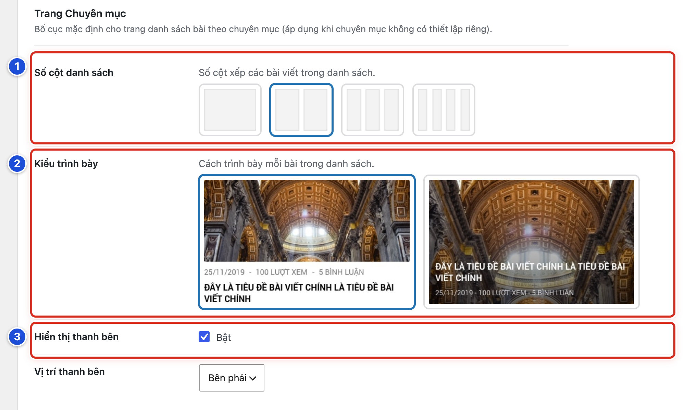

*Hình 15.12 Số 1–3 ứng với Bước 1–3. Ô Vị trí thanh bên (Bước 4) nằm ngay bên dưới.*

#### Kết quả

Bạn sẽ thấy trang chuyên mục xếp bài theo số cột và kiểu đã chọn. Thanh bên ở đúng phía đã chọn, nếu bật.

#### Lưu ý

- Website mẫu: 2 cột, ảnh trên chữ dưới, thanh bên bật, bên phải.
- Thanh bên trang chuyên mục hiện widget ở khu vực **Chuyên Mục** (Bài 18.01).
- Chuyên mục đã bật **Tuỳ chỉnh riêng chuyên mục này** giữ bố cục riêng, không đổi theo thiết lập chung (Bài 08.01).
- Bài Lời Chúa không có ảnh đại diện hiện câu Lời Chúa ở chỗ ảnh.

#### Không nên làm

- Không đổi thiết lập chung chỉ để sửa một chuyên mục. Dùng bố cục riêng của chuyên mục đó (Chương 8).
- Không chọn 4 cột khi đang bật thanh bên. Mỗi thẻ bài sẽ hẹp, chữ khó đọc.

#### Nếu gặp lỗi

- Một chuyên mục không đổi theo → chuyên mục đó đang bật bố cục riêng. Mở **Bài viết → Danh mục**, sửa chuyên mục đó, xem hộp **Tuỳ chỉnh giao diện chuyên mục** (Bài 08.04).
- Thanh bên trang chuyên mục trống → khu vực widget **Chuyên Mục** chưa có widget (Bài 18.03).
- Trang chuyên mục vẫn như cũ → kiểm tra đã bấm **Lưu thay đổi**; mở trang chuyên mục, nhấn F5.

### Bài 15.13 Đặt bố cục chung cho bài viết chi tiết

**Nhãn:** Kỹ thuật dành cho quản trị viên · 🟡 Cẩn thận

#### Mục đích

Bật hoặc tắt thanh bên ở trang đọc một bài viết, và đặt nó bên trái hay bên phải.

#### Trước khi bắt đầu

- Đăng nhập bằng tài khoản Quản lý. Mở **Thiết lập giao diện**, tab **Trang chủ & Bài viết**, tab con **Trang Chuyên mục & Bài viết**, kéo xuống nhóm **Trang Bài viết**.
- Chụp thiết lập đang dùng (Bài 13.03).

#### Các bước thực hiện

1. **Bước 1:** Ở nhóm **Trang Bài viết**, ô **Hiển thị thanh bên**, tích **Bật** để có thanh bên. Bỏ tích để tắt.
2. **Bước 2:** Ở **Vị trí thanh bên** ngay bên dưới, chọn **Bên trái** hoặc **Bên phải**.
3. **Bước 3:** Kéo xuống cuối trang, bấm **Lưu thay đổi**.
4. **Bước 4:** Mở một bài viết ngoài website, nhấn F5 để xem.
5. **Bước 5:** Mở thêm một bài Lời Chúa và một bài video để xem lại.

#### Ảnh minh họa

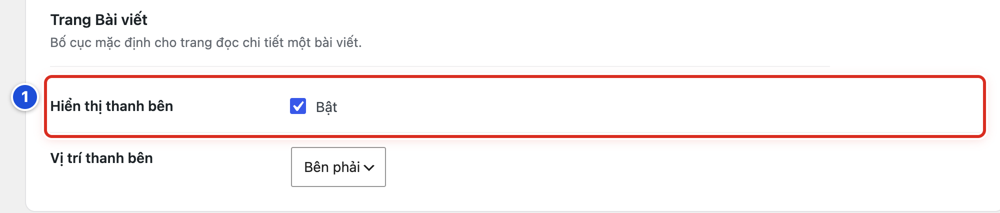

*Hình 15.13 Số 1: Hiển thị thanh bên của nhóm Trang Bài viết (Bước 1). Ô Vị trí thanh bên (Bước 2) nằm ngay bên dưới.*

#### Kết quả

Bạn sẽ thấy trang bài viết có thanh bên ở đúng phía đã chọn. Nếu tắt, nội dung bài trải rộng hơn.

#### Lưu ý

- Website mẫu: thanh bên bật, bên phải.
- Thanh bên trang bài viết hiện widget ở khu vực **Bài Viết Chi Tiết** (Bài 18.01).
- Bài đã bật **Tuỳ chỉnh riêng bài này** giữ bố cục riêng (Bài 20.03–20.05).
- Nhóm này chỉ có thanh bên. Ảnh đại diện, tác giả, ngày và lượt xem của một bài chỉnh trong chính bài đó (Bài 20.04).

#### Không nên làm

- Không đổi thiết lập chung để sửa một bài. Dùng tuỳ chỉnh riêng của bài (Bài 20.03).
- Không nhầm với nhóm **Trang Chuyên mục** ngay phía trên. Nhóm đó cũng có ô **Hiển thị thanh bên**.

#### Nếu gặp lỗi

- Đổi xong lại thấy trang chuyên mục thay đổi → bạn sửa nhầm nhóm **Trang Chuyên mục**. Trả lại giá trị cũ theo ảnh chụp, rồi sửa đúng nhóm **Trang Bài viết**.
- Một bài không đổi theo → bài đó đang bật **Tuỳ chỉnh riêng bài này**. Mở bài, xem hộp **Tuỳ chỉnh giao diện bài viết** (Bài 20.05).
- Thanh bên trang bài trống → khu vực **Bài Viết Chi Tiết** chưa có widget (Bài 18.03).
