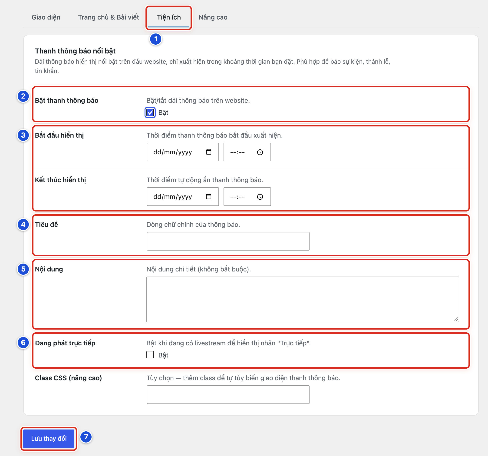
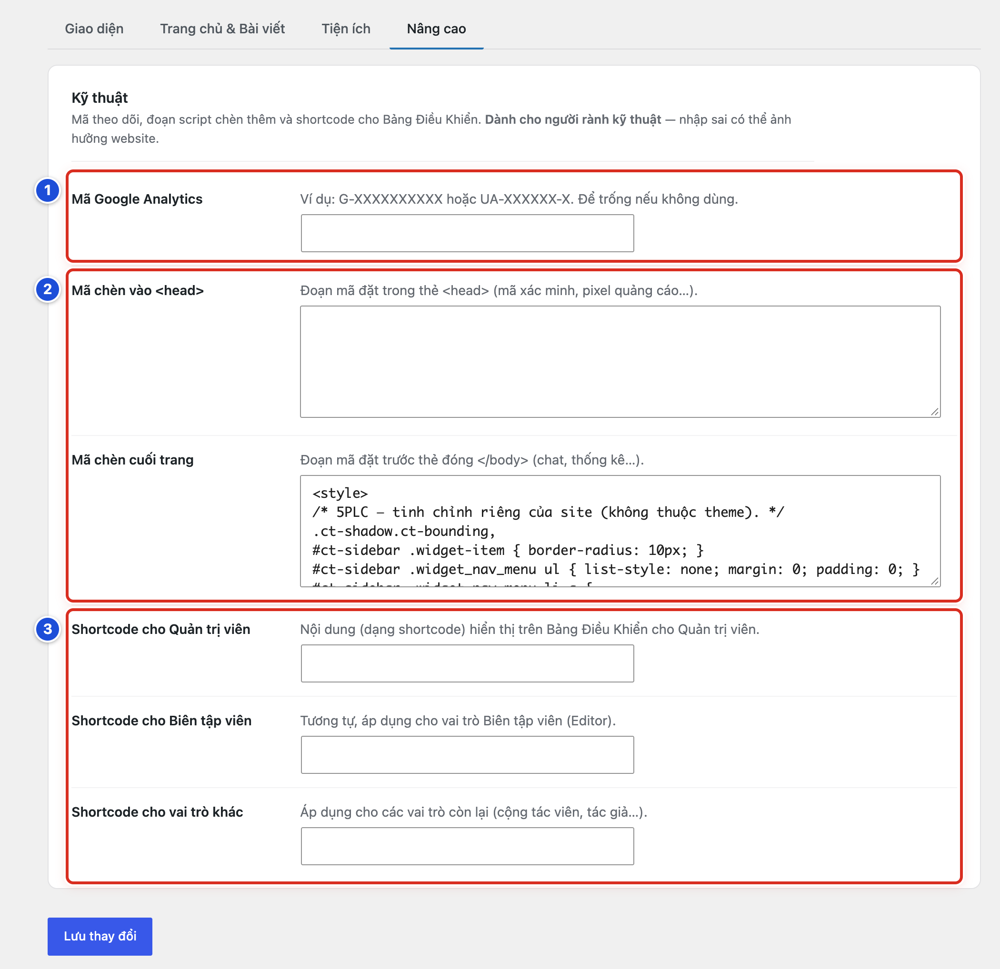

# Phần 6 Thiết lập giao diện Chính Tòa Media

## Chương 16 Thanh thông báo và khu vực Nâng cao

### Bài 16.01 Bật thanh thông báo theo khoảng thời gian

**Nhãn:** Kỹ thuật dành cho quản trị viên · 🟡 Cẩn thận

#### Mục đích

Hiện một ô thông báo nổi bật ở đầu mọi trang, ví dụ lịch lễ đặc biệt, sự kiện, buổi phát trực tiếp. Ô tự hiện và tự ẩn theo giờ bạn đặt.

#### Trước khi bắt đầu

- Đăng nhập bằng tài khoản Quản lý. Mở **Chính Tòa Media → Thiết lập giao diện** (Bài 13.01).
- Có nội dung thông báo đã được duyệt.
- Biết ngày giờ bắt đầu và kết thúc theo giờ Việt Nam (Bài 16.03).
- Chụp màn hình tab **Tiện ích** đang dùng (Bài 13.03).

#### Các bước thực hiện

1. **Bước 1:** Bấm tab **Tiện ích**.
2. **Bước 2:** Ở **Bật thanh thông báo**, tích **Bật**. Các ô bên dưới hiện ra.
3. **Bước 3:** Ở **Bắt đầu hiển thị** và **Kết thúc hiển thị**, chọn ngày ở ô dd/mm/yyyy và chọn giờ ở ô bên cạnh.
4. **Bước 4:** Ở **Tiêu đề**, gõ dòng chữ chính, ví dụ *Giờ chầu Thánh Thể tối thứ Năm lúc 20:00*.
5. **Bước 5:** Ở **Nội dung**, gõ thông tin chi tiết. Ô này không bắt buộc; có thể dán mã nhúng video (Bài 16.02).
6. **Bước 6:** Ở **Đang phát trực tiếp**, chỉ tích **Bật** khi đang phát trực tiếp (Bài 16.02).
7. **Bước 7:** Kéo xuống cuối trang, bấm **Lưu thay đổi**.
8. **Bước 8:** Khi tới giờ bắt đầu, mở website, nhấn F5 để xem thanh thông báo.

#### Ảnh minh họa

*Hình 16.01 Số 1–7 ứng với Bước 1–7.*

#### Kết quả

Bạn sẽ thấy, trong khoảng thời gian đã đặt, một ô trắng ở đầu mọi trang, ngay dưới phần đầu trang và thanh menu. Ô có tiêu đề in đậm, nội dung ở bên dưới. Tới giờ kết thúc, ô tự ẩn.

#### Lưu ý

- Phải điền đủ cả **Bắt đầu hiển thị** và **Kết thúc hiển thị**. Thiếu một trong hai thì thanh không hiện.
- Ngoài khoảng thời gian đã đặt, thanh không hiện, kể cả khi đang tích **Bật**.
- Thanh hiện ở mọi trang của website, trừ trang báo lỗi “không tìm thấy” (trang 404).
- Ô **Class CSS (nâng cao)** dành cho người làm kỹ thuật. Để trống.
- Hết dịp thông báo, nên bỏ tích **Bật** cho gọn.

#### Không nên làm

- Không viết tiêu đề quá dài. Nên vừa một dòng trên điện thoại.
- Không đặt giờ kết thúc quá xa (như cả năm) cho thông báo chỉ dùng vài ngày.
- Không gõ gì vào ô **Class CSS (nâng cao)**.

#### Nếu gặp lỗi

- Đã tích **Bật** nhưng không thấy thanh → giờ **Bắt đầu hiển thị** chưa tới, hoặc giờ **Kết thúc hiển thị** đã qua. Kiểm tra lại theo Bài 16.03.
- Đang trong khoảng giờ mà thanh vẫn không hiện → một ô ngày còn trống. Điền đủ ngày ở cả hai ô, rồi lưu.
- Thanh vẫn hiện sau khi sự kiện đã xong → giờ kết thúc đặt sai ngày. Bỏ tích **Bật** ở **Bật thanh thông báo**, rồi lưu.
- Không thấy các ô ngày giờ, tiêu đề → chưa tích **Bật** ở **Bật thanh thông báo**.

### Bài 16.02 Nhập nội dung nhúng video và bật nhãn Trực tiếp

**Nhãn:** Kỹ thuật dành cho quản trị viên · 🟡 Cẩn thận

#### Mục đích

Đưa video hoặc buổi phát trực tiếp trên YouTube (hay Facebook) vào thanh thông báo, và bật nhãn đỏ **● Trực tiếp** cạnh tiêu đề trong lúc phát.

#### Trước khi bắt đầu

- Đăng nhập bằng tài khoản Quản lý.
- Thanh thông báo đã bật và đã đặt giờ (Bài 16.01).
- Có video hoặc buổi phát trực tiếp trên YouTube, để chế độ **Công khai** hoặc **Không công khai**.

#### Các bước thực hiện

1. **Bước 1:** Trên YouTube, mở video hoặc buổi phát trực tiếp cần nhúng.
2. **Bước 2:** Bấm **Chia sẻ** ngay dưới video.
3. **Bước 3:** Bấm **Nhúng**.
4. **Bước 4:** Bấm **Sao chép** để chép đoạn mã nhúng.
5. **Bước 5:** Quay lại **Thiết lập giao diện**, tab **Tiện ích**. Bấm vào ô **Nội dung** và dán (Ctrl + V; Mac: Cmd + V).
6. **Bước 6:** Ở **Đang phát trực tiếp**, tích **Bật**.
7. **Bước 7:** Kéo xuống cuối trang, bấm **Lưu thay đổi**.
8. **Bước 8:** Mở website, nhấn F5, bấm thử nút phát của video.
9. **Bước 9:** Hết buổi phát, bỏ tích **Đang phát trực tiếp** và bấm **Lưu thay đổi**.

#### Ảnh minh họa

Xem Hình 16.01, số 5 (ô **Nội dung**, Bước 5) và số 6 (**Đang phát trực tiếp**, Bước 6).

#### Kết quả

Bạn sẽ thấy trong thanh thông báo có nhãn đỏ **● Trực tiếp** ngay cạnh tiêu đề. Bên dưới là khung video phát được ngay trên website. Khung video tự co giãn vừa màn hình điện thoại.

#### Lưu ý

- Ô **Nội dung** giữ nguyên đoạn mã nhúng video sau khi lưu.
- Ô **Nội dung** cũng nhận chữ thường. Có thể gõ một dòng chữ (giờ lễ, địa điểm), rồi dán mã nhúng ở dòng dưới.
- Với Facebook: mở video công khai, bấm nút ba chấm, chọn **Nhúng**, rồi chép đoạn mã.
- Nhãn **● Trực tiếp** chỉ hiện khi thanh thông báo đang trong khoảng thời gian hiển thị.

#### Không nên làm

- Không để nhãn **Trực tiếp** bật sau khi buổi phát đã kết thúc.
- Không dán đoạn mã nhận qua tin nhắn từ người lạ.
- Không dán vào ô **Nội dung** những đoạn mã dài không phải mã nhúng video.

#### Nếu gặp lỗi

- Ngoài website chỉ thấy một dòng địa chỉ, không có khung video → bạn đã dán đường dẫn của video, không phải mã nhúng. Làm lại Bước 2–4 để chép mã nhúng (đoạn mã nhúng luôn bắt đầu bằng chữ `<iframe`).
- Khung video báo video không xem được → video đang để **Riêng tư**, hoặc chủ kênh không cho nhúng. Nhờ người quản lý kênh kiểm tra (Bài 24.04).
- Không thấy nhãn **● Trực tiếp** → chưa tích **Bật** ở **Đang phát trực tiếp**, hoặc thanh đã hết giờ hiển thị.

### Bài 16.03 Kiểm tra thời gian thông báo theo giờ Việt Nam

**Nhãn:** Kỹ thuật dành cho quản trị viên · 🟡 Cẩn thận

#### Mục đích

Bảo đảm thanh thông báo hiện và ẩn đúng giờ Việt Nam, không sớm, không muộn.

#### Trước khi bắt đầu

- Đăng nhập bằng tài khoản Quản lý.
- Biết giờ sự kiện theo giờ Việt Nam.
- Đã điền thanh thông báo (Bài 16.01).

#### Các bước thực hiện

1. **Bước 1:** Ở menu trái, bấm **Cài đặt → Tổng quan**.
2. **Bước 2:** Tìm ô **Múi giờ**. Ô này phải là giờ Việt Nam: **UTC+7**, hoặc một thành phố như **Hồ Chí Minh**. Chỉ xem, không đổi.
3. **Bước 3:** Đọc giờ hiện tại của website, ghi ngay dưới ô **Múi giờ**. So với đồng hồ của bạn.
4. **Bước 4:** Bấm **Chính Tòa Media → Thiết lập giao diện** ở menu trái. Không bấm **Lưu thay đổi** ở trang **Tổng quan**.
5. **Bước 5:** Bấm tab **Tiện ích**.
6. **Bước 6:** Đọc lại ô ngày của **Bắt đầu hiển thị** và **Kết thúc hiển thị**. Ngày ghi trước, tháng ghi sau: 05/12/2026 là ngày 5 tháng 12.
7. **Bước 7:** Đọc lại ô giờ. Nếu ô giờ có chữ SA/CH (hoặc AM/PM): SA (AM) là buổi sáng, CH (PM) là buổi chiều tối. Ví dụ 8 giờ tối là 08:00 CH.
8. **Bước 8:** Nếu vừa sửa ngày giờ, bấm **Lưu thay đổi**.
9. **Bước 9:** Khi tới giờ bắt đầu, mở website, nhấn F5 để xem thanh đã hiện.
10. **Bước 10:** Sau giờ kết thúc, mở website, nhấn F5 để xem thanh đã ẩn.

#### Ảnh minh họa

Xem Hình 16.01, số 3 (hai ô **Bắt đầu hiển thị** và **Kết thúc hiển thị**; mỗi ô gồm ô ngày và ô giờ).

#### Kết quả

Bạn sẽ thấy thanh thông báo hiện sau giờ bắt đầu và tự ẩn khi tới giờ kết thúc, khớp với đồng hồ Việt Nam.

#### Lưu ý

- Thanh dùng giờ của website (ô **Múi giờ** trong **Cài đặt → Tổng quan**), không dùng giờ trên máy tính của bạn hay của khách.
- Chọn ngày mà để trống ô giờ thì website hiểu là 0 giờ (nửa đêm, đầu ngày).
- Nên đặt giờ bắt đầu sớm hơn giờ sự kiện vài phút.
- Khách ở nước ngoài vẫn thấy thanh theo giờ Việt Nam.

#### Không nên làm

- Không đổi **Múi giờ** để sửa một thông báo. Việc đó làm lệch giờ hẹn đăng của mọi bài, gồm cả bài Lời Chúa mỗi ngày.
- Không đổi các ô khác trong **Cài đặt → Tổng quan** (Phụ lục E.03).

#### Nếu gặp lỗi

- Thanh hiện sớm hoặc muộn đúng 7 tiếng → **Múi giờ** của website không phải giờ Việt Nam. Không tự đổi; báo người hỗ trợ kỹ thuật (Bài 24.07).
- Thanh hiện sai ngày → nhầm thứ tự ngày và tháng. Ô ngày ghi ngày trước, tháng sau (dd/mm/yyyy).
- Thanh hiện từ lúc nửa đêm → ô giờ bắt đầu đang trống. Chọn giờ, rồi lưu.
- Thanh lệch đúng 12 tiếng → nhầm SA và CH. Sửa lại ô giờ, rồi lưu.

### Bài 16.04 Nhận biết khu vực mã theo dõi và mã chèn

**Nhãn:** Kỹ thuật dành cho quản trị viên · 🔴 Không tự thay đổi

#### Mục đích

Biết tab **Nâng cao** có những ô gì, và vì sao không được tự sửa.

#### Trước khi bắt đầu

- Đăng nhập bằng tài khoản Quản lý.
- Bài này chỉ xem: không gõ, không xoá, không bấm **Lưu thay đổi**.
- Mở **Thiết lập giao diện**, bấm tab **Nâng cao**. Dòng đầu nhắc: “Dành cho người rành kỹ thuật — nhập sai có thể ảnh hưởng website”.

#### Các bước thực hiện

1. **Bước 1:** Tìm ô **Mã Google Analytics**. Đây là mã của dịch vụ thống kê lượt truy cập, có dạng G-XXXXXXXXXX. Chỉ xem.
2. **Bước 2:** Tìm hai ô **Mã chèn vào <head>** và **Mã chèn cuối trang**. Hai ô này chèn đoạn mã vào mọi trang của website. Chỉ xem.
3. **Bước 3:** Tìm ba ô **Shortcode cho Quản trị viên**, **Shortcode cho Biên tập viên**, **Shortcode cho vai trò khác**. Ba ô này đặt nội dung hiện trên Bảng Điều Khiển theo vai trò. Chỉ xem.
4. **Bước 4:** Rời trang bằng cách bấm một mục khác ở menu trái. Không bấm **Lưu thay đổi**.

#### Ảnh minh họa

*Hình 16.04 Số 1: Mã Google Analytics (Bước 1); số 2: Mã chèn vào <head> và Mã chèn cuối trang (Bước 2); số 3: ba ô Shortcode (Bước 3).*

#### Kết quả

Bạn sẽ biết vị trí từng ô của tab **Nâng cao**, và rời trang mà website không có gì thay đổi.

#### Lưu ý

- 🔴 Trên website mẫu, ô **Mã chèn cuối trang** đang chứa đoạn mã định kiểu riêng (CSS — mã quy định bo góc, khoảng cách, kiểu danh sách của một số phần giao diện). **Xoá ô này là vỡ giao diện.**
- **Mã chèn vào <head>** dùng cho mã xác minh của Google, Facebook và các dịch vụ tương tự. Ô này hoạt động bình thường.
- Một ký tự sai trong các ô này có thể làm hỏng giao diện hoặc thống kê trên mọi trang.
- Chỉ người hỗ trợ kỹ thuật được sửa tab này, và chỉ khi đã có bản sao (Bài 16.05).

#### Không nên làm

- Không dán mã nhận qua email, tin nhắn, diễn đàn hay công cụ trí tuệ nhân tạo vào các ô này.
- Không xoá chữ trong ô **Mã chèn cuối trang**, dù thấy lạ.
- Không chụp tab này gửi vào nhóm chat chung.

#### Nếu gặp lỗi

- Lỡ gõ hoặc xoá chữ trong một ô, chưa lưu → không bấm **Lưu thay đổi**. Bấm lại **Chính Tòa Media → Thiết lập giao diện** ở menu trái để mở lại trang; mọi ô trở về như cũ.
- Lỡ xoá **Mã chèn cuối trang** và đã lưu, website mất bo góc, lệch khoảng cách → dán lại nguyên văn từ bản sao (Bài 16.05), lưu, rồi báo người hỗ trợ kỹ thuật.
- Chưa có bản sao mà mã đã mất → dừng mọi thao tác, báo ngay người hỗ trợ kỹ thuật (Bài 24.07).

### Bài 16.05 Không sửa CSS script hoặc shortcode khi không có bản sao

**Nhãn:** Kỹ thuật dành cho quản trị viên · 🔴 Không tự thay đổi

#### Mục đích

Luôn có bản sao nguyên văn các ô trong tab **Nâng cao** trước khi bất kỳ ai sửa, để trả lại ngay khi website bị lỗi.

#### Trước khi bắt đầu

- Đăng nhập bằng tài khoản Quản lý.
- Chỉ làm bài này khi người hỗ trợ kỹ thuật cần sửa tab **Nâng cao**. Bạn không tự sửa mã.
- Website chưa bật sao lưu tự động (plugin UpdraftPlus đang tắt, Phụ lục D). Bản chép tay này là bản dự phòng duy nhất.
- Mở sẵn Notepad (Windows) hoặc TextEdit (Mac).

#### Các bước thực hiện

1. **Bước 1:** Mở **Thiết lập giao diện**, bấm tab **Nâng cao**.
2. **Bước 2:** Bấm chuột vào giữa ô **Mã chèn cuối trang**.
3. **Bước 3:** Nhấn **Ctrl + A** (Mac: **Cmd + A**) để chọn hết chữ trong ô.
4. **Bước 4:** Nhấn **Ctrl + C** (Mac: **Cmd + C**) để chép.
5. **Bước 5:** Chuyển sang Notepad hoặc TextEdit, nhấn **Ctrl + V** (Mac: **Cmd + V**) để dán.
6. **Bước 6:** Lưu tệp với tên có ngày, ví dụ *ma-chen-cuoi-trang-2026-10-06*.
7. **Bước 7:** Làm lại Bước 2–6 cho từng ô còn lại có chữ: **Mã chèn vào <head>**, **Mã Google Analytics**, ba ô Shortcode.
8. **Bước 8:** Cất các tệp ở nơi chỉ người có trách nhiệm mở được. Rời tab mà không bấm **Lưu thay đổi**.
9. **Bước 9:** Sau khi người hỗ trợ kỹ thuật sửa và lưu, mở website, nhấn F5. Kiểm tra trang chủ, một trang chuyên mục và một bài viết, trên máy tính và điện thoại.

#### Ảnh minh họa

Bài này không cần ảnh minh họa. Vị trí các ô xem Hình 16.04.

#### Kết quả

Bạn sẽ có một tệp chữ cho mỗi ô của tab **Nâng cao**, chứa nguyên văn mã đang dùng. Nếu website lỗi sau khi sửa, bạn dán lại đúng như cũ trong vài phút.

#### Lưu ý

- Ảnh chụp màn hình không đủ. Ô dài bị che mất phần dưới, và chữ trong ảnh không dán lại được.
- Ô **Mã chèn cuối trang** của website mẫu đang chứa đoạn mã định kiểu (CSS) riêng. Mất ô này là giao diện vỡ.
- Mỗi lần chỉ sửa một ô. Kiểm tra xong ô này mới sửa ô tiếp theo.
- Ghi vào biên bản: ngày, ai sửa, sửa ô nào, vì sao (Phụ lục E.04).

#### Không nên làm

- Không tự sửa, thêm hay xoá mã trong tab **Nâng cao**, kể cả khi có hướng dẫn trên mạng.
- Không xoá trắng một ô “để thử” khi chưa có bản sao.
- Không dán bản sao vào Word. Word có thể đổi dấu ngoặc kép và làm hỏng mã.
- Không gửi bản sao vào nhóm chat hay thư gửi nhiều người.

#### Nếu gặp lỗi

- Nhấn **Ctrl + A** mà cả trang bị bôi xanh → chưa bấm vào trong ô. Bấm vào giữa ô rồi nhấn lại.
- Sau khi sửa, giao diện vỡ (mất bo góc, chữ lệch, menu lạ) → mở tab **Nâng cao**, bấm vào ô vừa sửa, nhấn **Ctrl + A**, dán lại nguyên văn từ tệp bản sao, rồi bấm **Lưu thay đổi**.
- Dán lại rồi mà vẫn lỗi → dừng thao tác, báo người hỗ trợ kỹ thuật kèm ảnh chụp màn hình website (Bài 24.07).
- Không tìm thấy tệp bản sao → không sửa tiếp. Báo người hỗ trợ kỹ thuật trước khi làm gì thêm.
