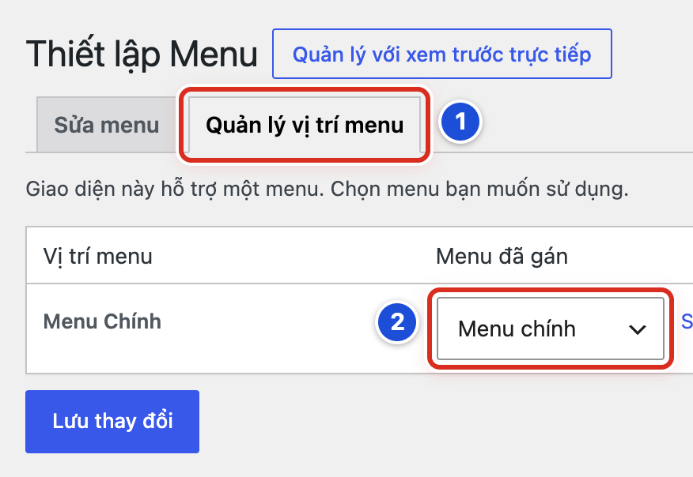
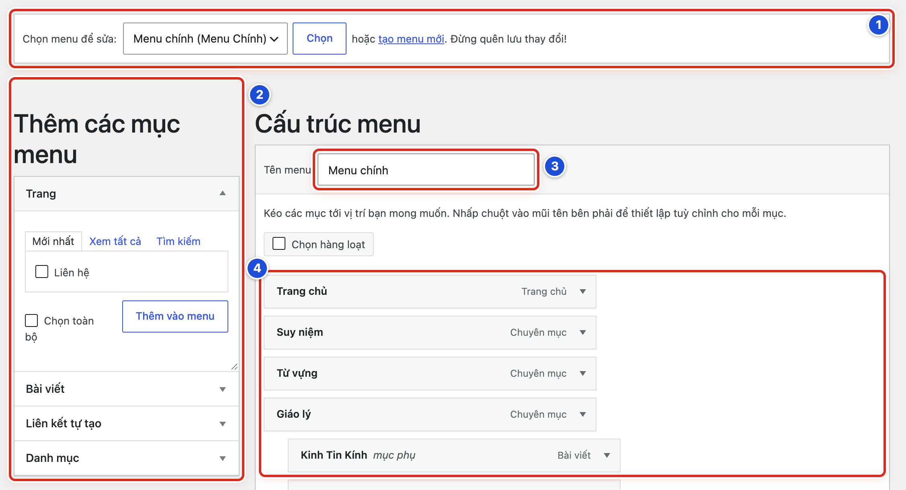
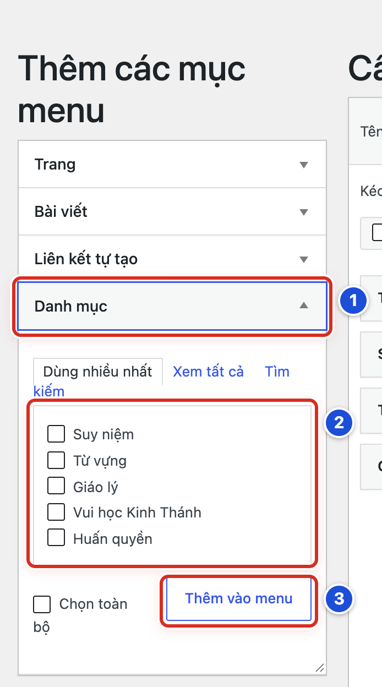
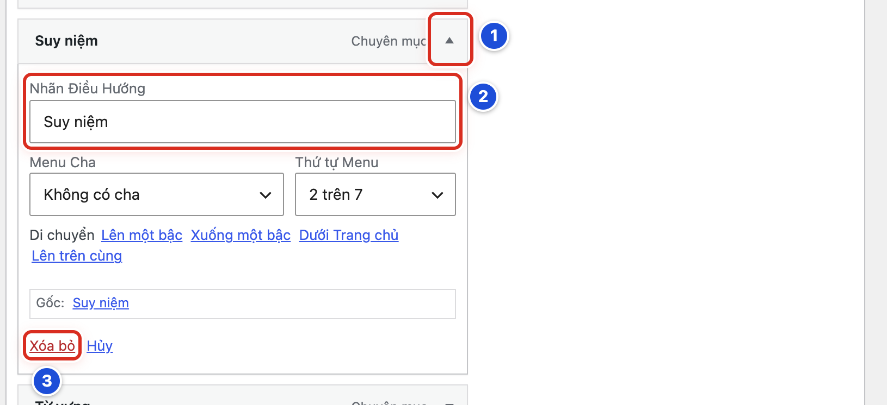
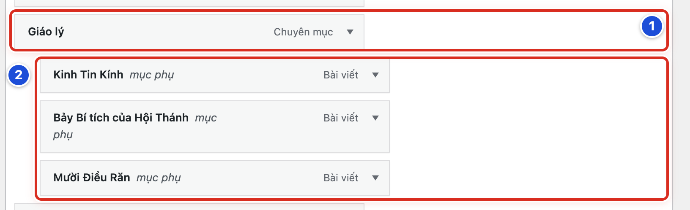
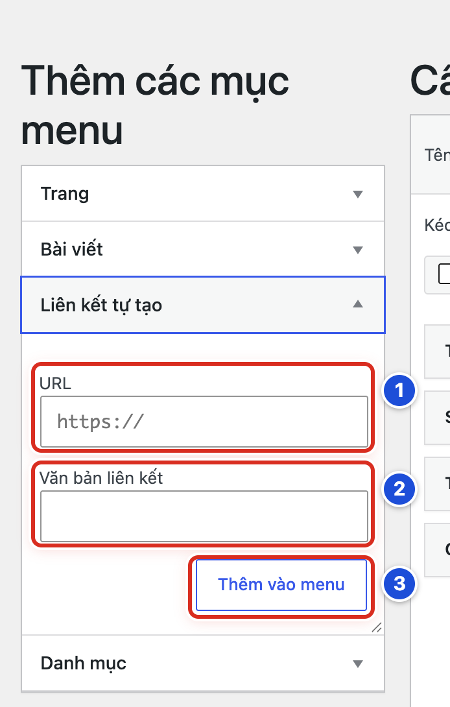
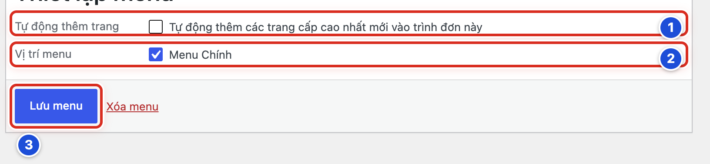
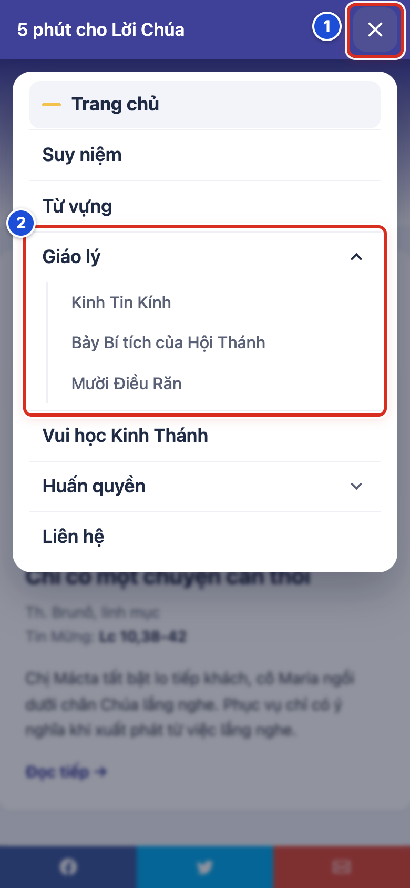
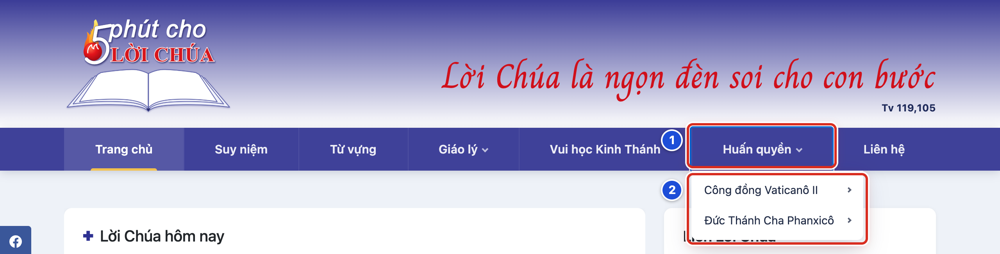

# Phần 7 Menu và widget

## Chương 17 Quản lý Menu Chính

### Bài 17.01 Menu và vị trí Menu Chính dùng để làm gì

**Nhãn:** Kỹ thuật dành cho quản trị viên · 🟢 An toàn

#### Mục đích

Hiểu hai khái niệm trước khi sửa thanh menu. **Menu** là một danh sách các mục (liên kết) bạn tự sắp xếp. **Vị trí menu** là chỗ trên website mà giao diện dành sẵn để đặt một menu vào.

#### Trước khi bắt đầu

- Đăng nhập bằng tài khoản Quản lý. Biên tập viên không thấy mục **Giao diện**.
- Ở menu trái, bấm **Giao diện → Thiết lập Menu**. Cách khác: ở **Bảng Điều Khiển**, thẻ **Menu điều hướng**, bấm **Chỉnh menu**.
- Bài này chỉ xem, không thay đổi gì.

#### Các bước thực hiện

1. **Bước 1:** Bấm tab **Quản lý vị trí menu** ở đầu màn hình (số 1).
2. **Bước 2:** Nhìn dòng **Menu Chính**. Ô bên cạnh, ở cột **Menu đã gán**, phải ghi **Menu chính** (số 2).
3. **Bước 3:** Không đổi gì. Bấm tab **Sửa menu** để quay lại màn hình sửa menu.

#### Ảnh minh họa

*Hình 17.01 Số 1: tab Quản lý vị trí menu; số 2: menu đang gắn vào vị trí Menu Chính.*

#### Kết quả

Bạn sẽ thấy dòng chữ “Giao diện này hỗ trợ một menu”. Vị trí duy nhất là **Menu Chính**, chính là thanh menu ngay dưới đầu trang. Vị trí này đang gắn **Menu chính**.

#### Lưu ý

Website mẫu có hai menu:

- **Menu chính**: gắn vào vị trí **Menu Chính**, hiện thành thanh menu trên đầu trang.
- **Liên kết**: 5 liên kết sang website khác. Menu này không gắn vào vị trí nào. Nó hiện ở thanh bên (cột nhỏ bên cạnh nội dung) nhờ widget **Menu** (xem Bài 18.08).

Thêm vài điều cần nhớ:

- Tên menu (“Menu chính”, “Liên kết”) chỉ để bạn nhận ra. Khách không thấy tên này.
- Sửa các mục trong menu và đổi menu gắn vào vị trí là hai việc khác nhau.

#### Không nên làm

Không đổi ô **Menu đã gán** sang **Liên kết** hoặc để trống rồi bấm **Lưu thay đổi**. Thanh menu trên website sẽ đổi thành 5 liên kết ngoài hoặc biến mất.

#### Nếu gặp lỗi

- Website không còn thanh menu, ô **Menu đã gán** đang trống → chọn **Menu chính**, bấm **Lưu thay đổi**, rồi tải lại website.
- Thanh menu hiện các liên kết như “Tòa Thánh Vatican” → ô **Menu đã gán** đang chọn **Liên kết**. Chọn lại **Menu chính** và bấm **Lưu thay đổi**.
- Không thấy mục **Giao diện** ở menu trái → bạn đang dùng tài khoản Biên tập viên. Nhờ người có tài khoản Quản lý.
- Không thấy tab **Quản lý vị trí menu** → bạn đang ở màn hình khác. Bấm lại **Giao diện → Thiết lập Menu**.

### Bài 17.02 Mở và chọn đúng Menu chính

**Nhãn:** Kỹ thuật dành cho quản trị viên · 🟡 Cẩn thận

#### Mục đích

Chắc chắn bạn đang sửa đúng **Menu chính** (thanh menu trên đầu trang), không phải menu **Liên kết**.

#### Trước khi bắt đầu

- Đăng nhập bằng tài khoản Quản lý.
- Mở **Giao diện → Thiết lập Menu**. Màn hình mở sẵn ở tab **Sửa menu**.
- Chụp màn hình phần **Cấu trúc menu** hiện tại. Nếu lỡ làm sai, bạn sẽ dựa vào ảnh này để sắp lại.

#### Các bước thực hiện

1. **Bước 1:** Ở dòng **Chọn menu để sửa:**, bấm vào ô danh sách và chọn **Menu chính (Menu Chính)** (số 1).
2. **Bước 2:** Bấm nút **Chọn** ngay bên cạnh (cũng trong khung số 1). Trang tải lại.
3. **Bước 3:** Nhìn cột trái **Thêm các mục menu** (số 2). Đây là kho để lấy trang, bài viết, danh mục, liên kết đưa vào menu.
4. **Bước 4:** Kiểm tra ô **Tên menu** ghi **Menu chính** (số 3).
5. **Bước 5:** Đọc phần **Cấu trúc menu** (số 4). Các mục xếp từ trên xuống đúng như thứ tự từ trái sang phải trên website.

#### Ảnh minh họa

*Hình 17.02 Số 1: Chọn menu để sửa và nút Chọn; số 2: Thêm các mục menu; số 3: Tên menu; số 4: Cấu trúc menu.*

#### Kết quả

Bạn sẽ thấy ô **Tên menu** ghi **Menu chính**. **Cấu trúc menu** bắt đầu bằng **Trang chủ**, **Suy niệm**, **Từ vựng**, **Giáo lý**. Dưới **Giáo lý** có các mục lùi vào, ghi chữ *mục phụ*.

#### Lưu ý

- WordPress thường mở sẵn menu bạn sửa gần nhất. Vì vậy, luôn nhìn ô **Tên menu** trước khi sửa.
- Trong ô danh sách, chữ trong ngoặc “(Menu Chính)” cho biết menu đó đang gắn vào vị trí Menu Chính. Menu **Liên kết** không có ngoặc.
- Bên phải mỗi mục có chữ nhỏ cho biết mục đó dẫn tới đâu: **Chuyên mục** (một danh mục), **Bài viết**, **Trang**. Riêng mục dẫn về trang chủ ghi **Trang chủ**.

#### Không nên làm

- Không bấm “tạo menu mới” khi chỉ cần sửa menu đang có.
- Không sửa menu **Liên kết** khi bạn muốn đổi thanh menu trên đầu trang.

#### Nếu gặp lỗi

- **Cấu trúc menu** chỉ có 5 liên kết như “Tòa Thánh Vatican” → bạn đang mở menu **Liên kết**. Chọn lại **Menu chính (Menu Chính)** và bấm **Chọn**.
- Đã chọn trong ô danh sách mà cấu trúc không đổi → bạn chưa bấm nút **Chọn**.
- Không thấy dòng **Chọn menu để sửa:** → website chỉ còn một menu nên WordPress tự mở menu đó. Kiểm tra ô **Tên menu** xem đó có phải **Menu chính** không.
- Lỡ sửa nhầm mà chưa bấm **Lưu menu** → tải lại trang (F5). Khi trình duyệt hỏi có rời trang không, đồng ý rời trang. Thay đổi chưa lưu sẽ bị bỏ.

### Bài 17.03 Thêm trang hoặc danh mục vào menu

**Nhãn:** Kỹ thuật dành cho quản trị viên · 🟡 Cẩn thận

#### Mục đích

Đưa một trang (ví dụ **Liên hệ**) hoặc một danh mục (ví dụ **Vui học Kinh Thánh**) lên thanh menu để khách bấm vào.

#### Trước khi bắt đầu

- Đăng nhập bằng tài khoản Quản lý và mở đúng **Menu chính** (Bài 17.02).
- Trang cần thêm đã **xuất bản**. Danh mục cần thêm đã có bài, để khách bấm vào không gặp trang trống.
- Chụp màn hình **Cấu trúc menu** hiện tại.

#### Các bước thực hiện

1. **Bước 1:** Ở cột **Thêm các mục menu**, bấm vào nhóm **Danh mục** để mở ra (số 1). Muốn thêm trang thì bấm nhóm **Trang**.
2. **Bước 2:** Tích vào ô của mục cần thêm, ví dụ **Vui học Kinh Thánh** (số 2).
3. **Bước 3:** Bấm **Thêm vào menu** (số 3).
4. **Bước 4:** Nhìn **Cấu trúc menu**. Mục mới nằm ở cuối danh sách.
5. **Bước 5:** Kéo mục mới đến đúng chỗ, nếu cần (cách kéo ở Bài 17.05).
6. **Bước 6:** Kéo xuống cuối trang, bấm **Lưu menu**.

#### Ảnh minh họa

*Hình 17.03 Số 1: nhóm Danh mục đang mở; số 2: các ô tích; số 3: nút Thêm vào menu.*

#### Kết quả

Bạn sẽ thấy mục mới trong **Cấu trúc menu**, bên phải ghi **Chuyên mục** (với danh mục) hoặc **Trang** (với trang). Sau khi bấm **Lưu menu** và tải lại website, mục mới hiện trên thanh menu.

#### Lưu ý

- Thêm vào menu không làm thay đổi trang hay danh mục đó.
- Trong mỗi nhóm có các tab nhỏ. Nhóm **Danh mục** mở sẵn tab *Dùng nhiều nhất*, nhóm **Trang** mở sẵn tab *Mới nhất*. Không thấy mục cần thêm thì bấm tab **Xem tất cả** hoặc **Tìm kiếm**.
- **Menu chính** đang có 7 mục ở hàng đầu. Thêm nhiều mục nữa sẽ làm thanh menu chật, chữ dễ xuống dòng.
- Muốn thêm địa chỉ của website khác, dùng **Liên kết tự tạo** (Bài 17.07).

#### Không nên làm

- Không thêm danh mục chưa có bài nào.
- Không tích ô **Chọn toàn bộ** rồi bấm **Thêm vào menu**. Cách này thêm tất cả các mục trong nhóm cùng lúc.

#### Nếu gặp lỗi

- Không thấy trang trong nhóm **Trang** → trang đó còn là bản nháp. Xuất bản trang trước, rồi thêm lại.
- Bấm **Thêm vào menu** mà không có gì xảy ra → bạn chưa tích ô nào. Tích ô rồi bấm lại.
- Đã thêm nhưng website chưa có mục mới → bạn chưa bấm **Lưu menu**. Nếu đã rời trang, phải thêm lại rồi lưu.
- Lỡ thêm một mục hai lần → mở mục thừa và bấm **Xóa bỏ** (Bài 17.08), rồi bấm **Lưu menu**.

### Bài 17.04 Đổi tên hiển thị của mục menu

**Nhãn:** Kỹ thuật dành cho quản trị viên · 🟡 Cẩn thận

#### Mục đích

Đổi chữ hiện trên thanh menu cho ngắn gọn, dễ đọc. Tên thật của trang hoặc danh mục vẫn giữ nguyên.

#### Trước khi bắt đầu

- Đăng nhập bằng tài khoản Quản lý và mở đúng **Menu chính** (Bài 17.02).
- Chuẩn bị sẵn tên mới, ngắn (1–3 từ).

#### Các bước thực hiện

1. **Bước 1:** Trong **Cấu trúc menu**, bấm mũi tên ▾ ở mép phải của mục cần đổi tên, ví dụ **Suy niệm** (số 1). Mục mở ra.
2. **Bước 2:** Xoá chữ cũ trong ô **Nhãn Điều Hướng** và gõ tên mới (số 2).
3. **Bước 3:** Kéo xuống cuối trang, bấm **Lưu menu**.

#### Ảnh minh họa

*Hình 17.04 Số 1: mũi tên mở mục; số 2: ô Nhãn Điều Hướng; số 3: Xóa bỏ (dùng ở Bài 17.08).*

#### Kết quả

Bạn sẽ thấy tên mới trên thanh tên của mục trong **Cấu trúc menu**. Sau khi lưu và tải lại website, thanh menu hiện tên mới.

#### Lưu ý

- Dòng **Gốc:** ở cuối mục cho biết mục dẫn tới đâu. Ví dụ “Gốc: Suy niệm” là danh mục Suy niệm.
- Đổi **Nhãn Điều Hướng** chỉ đổi chữ trên menu. Tên danh mục ở trang danh mục và trong **Bài viết → Danh mục** không đổi. Muốn đổi tên thật, xem Bài 07.05.
- Muốn quay về tên cũ, gõ lại đúng tên ghi ở dòng **Gốc:**.

#### Không nên làm

- Không đặt tên khác nghĩa với trang đích. Khách sẽ bối rối khi bấm vào.
- Không sửa ô **Menu Cha** hay **Thứ tự Menu** khi bạn chỉ cần đổi tên.

#### Nếu gặp lỗi

- Không thấy ô **Nhãn Điều Hướng** → bạn chưa mở mục. Bấm đúng mũi tên ▾ ở mép phải của mục.
- Đã sửa mà website vẫn tên cũ → bạn chưa bấm **Lưu menu**, hoặc trình duyệt còn giữ trang cũ. Bấm **Lưu menu**, rồi tải lại website (F5).
- Tên mới quá dài, thanh menu xuống hai dòng → rút ngắn tên, lưu lại.

### Bài 17.05 Đổi thứ tự các mục menu

**Nhãn:** Kỹ thuật dành cho quản trị viên · 🟡 Cẩn thận

#### Mục đích

Sắp các mục trên thanh menu theo thứ tự ưu tiên của giáo xứ, ví dụ đưa **Suy niệm** lên ngay sau **Trang chủ**.

#### Trước khi bắt đầu

- Đăng nhập bằng tài khoản Quản lý và mở đúng **Menu chính** (Bài 17.02).
- Chụp màn hình **Cấu trúc menu** hiện tại.
- Ghi ra giấy thứ tự mới mong muốn.

#### Các bước thực hiện

1. **Bước 1:** Trong **Cấu trúc menu**, đưa chuột lên thanh tên của mục cần chuyển. Con trỏ đổi thành hình mũi tên bốn chiều.
2. **Bước 2:** Bấm giữ chuột và kéo mục lên hoặc xuống.
3. **Bước 3:** Thả chuột khi mục đã ở đúng chỗ. Giữ mép trái của mục thẳng hàng với các mục ở hàng đầu.
4. **Bước 4:** Đọc lại toàn bộ cấu trúc từ trên xuống.
5. **Bước 5:** Kéo xuống cuối trang, bấm **Lưu menu**.

#### Ảnh minh họa

Xem Hình 17.02, số 4 (**Cấu trúc menu**). Mỗi thanh tên trong khung số 4 là một mục có thể kéo lên, kéo xuống.

#### Kết quả

Bạn sẽ thấy các mục trong **Cấu trúc menu** theo thứ tự mới. Sau khi lưu và tải lại website, thanh menu đổi thứ tự theo. Các mục con đi theo mục cha khi bạn kéo mục cha.

#### Lưu ý

- Nếu khó kéo bằng bàn di chuột, hãy mở mục (mũi tên ▾). Bên trong có dòng *Di chuyển* với các chữ **Lên một bậc**, **Xuống một bậc**, **Lên trên cùng**. Bấm các chữ này để chuyển mục mà không cần kéo.
- Ô **Thứ tự Menu** (ví dụ “2 trên 7”) cho biết mục đang đứng thứ mấy ở hàng đầu.
- Nên giữ **Trang chủ** ở đầu menu, như thói quen của người đọc.

#### Không nên làm

Không kéo lệch sang phải. Mục sẽ thành menu con của mục phía trên (Bài 17.06).

#### Nếu gặp lỗi

- Mục bị lùi vào và có chữ *mục phụ* → bạn kéo lệch sang phải. Kéo mục sang trái cho thẳng hàng, rồi lưu.
- Thứ tự trên website chưa đổi → bạn chưa bấm **Lưu menu**, hoặc trình duyệt còn giữ trang cũ. Lưu, rồi tải lại website (F5).
- Lỡ xếp lộn xộn mà chưa lưu → tải lại trang quản trị để bỏ thay đổi.
- Đã lưu thứ tự sai → xếp lại theo ảnh chụp lúc trước và lưu.

### Bài 17.06 Tạo menu con

**Nhãn:** Kỹ thuật dành cho quản trị viên · 🟡 Cẩn thận

#### Mục đích

Gom các mục cùng chủ đề vào dưới một mục. **Menu con** là danh sách nhỏ thả xuống dưới một mục trên thanh menu. Mục phía trên gọi là **mục cha**. Ví dụ dưới **Giáo lý** có ba bài: Kinh Tin Kính, Bảy Bí tích của Hội Thánh, Mười Điều Răn.

#### Trước khi bắt đầu

- Đăng nhập bằng tài khoản Quản lý và mở đúng **Menu chính** (Bài 17.02).
- Mục cha và các mục con đã có trong **Cấu trúc menu** (thêm theo Bài 17.03).
- Chụp màn hình **Cấu trúc menu** hiện tại.

#### Các bước thực hiện

1. **Bước 1:** Trong **Cấu trúc menu**, tìm mục cha, ví dụ **Giáo lý** (số 1).
2. **Bước 2:** Kéo mục muốn làm mục con đến ngay dưới mục cha, lệch sang phải một nấc rồi thả. Mục lùi vào và có chữ *mục phụ* (số 2).
3. **Bước 3:** Làm lại bước 2 cho từng mục con còn lại.
4. **Bước 4:** Kéo xuống cuối trang, bấm **Lưu menu**.

#### Ảnh minh họa

*Hình 17.06 Số 1: mục cha Giáo lý; số 2: ba mục con đã lùi vào, có chữ “mục phụ”.*

#### Kết quả

Bạn sẽ thấy các mục con lùi vào dưới mục cha, có chữ *mục phụ*. Trên website, mục cha có dấu ▾ (máy tính) hoặc mũi tên bên phải (điện thoại). Kiểm tra theo Bài 17.10.

#### Lưu ý

- Menu có tối đa **3 cấp**. Ví dụ **Huấn quyền** → **Công đồng Vaticanô II** → các văn kiện. Để tạo cấp 3, kéo mục lệch thêm một nấc nữa dưới một mục con.
- Cách không cần kéo: mở mục (mũi tên ▾), chọn mục cha ở ô **Menu Cha**, rồi bấm **Lưu menu**.
- Mục cha vẫn bấm được. Ví dụ bấm **Giáo lý** sẽ mở trang danh mục Giáo lý.
- Menu con chỉ là cách sắp xếp trên menu. Nó không đổi quan hệ danh mục cha, danh mục con thật (Bài 07.04).

#### Không nên làm

- Không tạo cấp thứ 4. Giao diện chỉ hiện tới cấp 3.
- Không đặt quá nhiều mục con dưới một mục cha. Menu thả xuống dài sẽ khó đọc trên điện thoại.

#### Nếu gặp lỗi

- Mục không có chữ *mục phụ* → bạn kéo chưa đủ xa sang phải. Kéo lại, lệch thêm một chút.
- Mục con nằm nhầm dưới mục cha khác → kéo nó về ngay dưới đúng mục cha, hoặc chọn lại ở ô **Menu Cha**.
- Website chưa có dấu ▾ ở mục cha → bạn chưa bấm **Lưu menu**, hoặc trình duyệt còn giữ trang cũ. Lưu, rồi tải lại website.
- Mục ở cấp 4 không hiện trên website → kéo nó lên cấp 3 hoặc cấp 2.

### Bài 17.07 Thêm liên kết tùy chỉnh

**Nhãn:** Kỹ thuật dành cho quản trị viên · 🟡 Cẩn thận

#### Mục đích

Thêm vào menu một địa chỉ không phải trang hay danh mục của website, ví dụ kênh YouTube của giáo xứ. WordPress gọi đây là **Liên kết tự tạo**.

#### Trước khi bắt đầu

- Đăng nhập bằng tài khoản Quản lý và mở đúng menu cần thêm (Bài 17.02).
- Có địa chỉ đầy đủ, bắt đầu bằng `https://`. Mở thử địa chỉ trên trình duyệt để chắc nó đúng.
- Chuẩn bị chữ sẽ hiện trên menu, ví dụ *Kênh YouTube*.

#### Các bước thực hiện

1. **Bước 1:** Ở cột **Thêm các mục menu**, bấm nhóm **Liên kết tự tạo** để mở ra.
2. **Bước 2:** Dán địa chỉ vào ô **URL** (số 1).
3. **Bước 3:** Gõ chữ sẽ hiện trên menu vào ô **Văn bản liên kết** (số 2).
4. **Bước 4:** Bấm **Thêm vào menu** (số 3).
5. **Bước 5:** Kéo mục mới đến đúng chỗ trong **Cấu trúc menu** (Bài 17.05).
6. **Bước 6:** Kéo xuống cuối trang, bấm **Lưu menu**.
7. **Bước 7:** Mở website, bấm thử mục mới.

#### Ảnh minh họa

*Hình 17.07 Số 1: ô URL; số 2: ô Văn bản liên kết; số 3: nút Thêm vào menu.*

#### Kết quả

Bạn sẽ thấy mục mới trong **Cấu trúc menu**. Sau khi lưu, bấm vào mục trên website sẽ mở đúng địa chỉ đã dán.

#### Lưu ý

- Các liên kết sang website khác của website mẫu (Tòa Thánh Vatican, Vatican News tiếng Việt…) nằm trong menu **Liên kết**, hiện ở thanh bên. Muốn thêm vào danh sách đó, hãy mở menu **Liên kết** (không phải **Menu chính**) rồi làm các bước như trên.
- Địa chỉ gõ tay không tự cập nhật. Nếu website kia đổi địa chỉ, bạn phải sửa lại.
- Muốn sửa địa chỉ sau này, mở mục (mũi tên ▾) và sửa ô **URL** bên trong.

#### Không nên làm

- Không dán địa chỉ trang quản trị (có chữ `wp-admin`) hay địa chỉ xem trước bản nháp.
- Không dán đường dẫn rút gọn mà bạn không biết dẫn tới đâu.
- Không dùng **Liên kết tự tạo** cho trang hay danh mục của chính website. Hãy dùng nhóm **Trang** hoặc **Danh mục** (Bài 17.03) để địa chỉ luôn đúng.

#### Nếu gặp lỗi

- Bấm **Thêm vào menu** mà ô **URL** viền đỏ, không thêm được → ô **URL** đang trống hoặc sai. Dán lại địa chỉ đầy đủ.
- Mục mới không có tên hoặc tên sai → mở mục và sửa ô **Nhãn Điều Hướng** (Bài 17.04).
- Bấm mục trên website ra trang lỗi → địa chỉ bị gõ thiếu hoặc thừa ký tự. Mở mục, sửa ô **URL**, rồi lưu.
- Mục hiện ở thanh bên thay vì thanh menu → bạn đã thêm vào menu **Liên kết**. Gỡ ở đó (Bài 17.08) và thêm lại vào **Menu chính**.

### Bài 17.08 Gỡ mục menu mà không xóa trang hoặc danh mục

**Nhãn:** Kỹ thuật dành cho quản trị viên · 🟡 Cẩn thận

#### Mục đích

Bỏ một mục khỏi thanh menu. Trang hoặc danh mục thật vẫn còn nguyên, chỉ không còn lối vào từ menu.

#### Trước khi bắt đầu

- Đăng nhập bằng tài khoản Quản lý và mở đúng **Menu chính** (Bài 17.02).
- Chụp màn hình **Cấu trúc menu** hiện tại.

#### Các bước thực hiện

1. **Bước 1:** Trong **Cấu trúc menu**, bấm mũi tên ▾ của mục cần gỡ.
2. **Bước 2:** Đọc dòng **Gốc:** để chắc đúng mục.
3. **Bước 3:** Bấm chữ đỏ **Xóa bỏ** ở cuối mục.
4. **Bước 4:** Kéo xuống cuối trang, bấm **Lưu menu**.
5. **Bước 5:** Mở website. Mục đã mất khỏi thanh menu.

#### Ảnh minh họa

Xem Hình 17.04, số 1 (mũi tên mở mục) và số 3 (chữ **Xóa bỏ**).

#### Kết quả

Bạn sẽ thấy mục biến mất khỏi **Cấu trúc menu** và khỏi thanh menu. Trang hoặc danh mục đó vẫn còn trong **Trang** hoặc **Bài viết → Danh mục**. Khách vẫn mở được nó nếu có địa chỉ.

#### Lưu ý

- **Xóa bỏ** chỉ có hiệu lực khi bạn bấm **Lưu menu**. Trước khi lưu, tải lại trang là mục trở lại.
- Gỡ một mục cha thì các mục con không mất. Chúng nhảy lên một cấp. Kiểm tra lại và gỡ tiếp nếu cần.

#### Không nên làm

- Không vào **Trang** hay **Danh mục** để xoá trang, danh mục thật khi bạn chỉ muốn bỏ nó khỏi menu.
- Không bấm chữ đỏ **Xóa menu** cạnh nút **Lưu menu**. Chữ này xoá cả menu.

#### Nếu gặp lỗi

- Lỡ gỡ nhầm mà chưa lưu → tải lại trang (F5). Mục trở lại.
- Lỡ gỡ nhầm và đã lưu → thêm lại mục (Bài 17.03), kéo về chỗ cũ theo ảnh chụp, rồi lưu.
- Không thấy chữ **Xóa bỏ** → bạn chưa mở mục. Bấm mũi tên ▾ ở mép phải của mục.
- Lỡ bấm **Xóa menu** → khi hộp xác nhận hiện ra, bấm **Hủy**. Nếu menu đã bị xoá, báo ngay người hỗ trợ kỹ thuật.

### Bài 17.09 Không bật tự động thêm trang nếu chưa có nhu cầu

**Nhãn:** Kỹ thuật dành cho quản trị viên · 🟡 Cẩn thận

#### Mục đích

Kiểm tra phần **Thiết lập menu** ở cuối trang, để trang mới không tự chen vào thanh menu và thanh menu không bị mất.

#### Trước khi bắt đầu

- Đăng nhập bằng tài khoản Quản lý và mở đúng **Menu chính** (Bài 17.02).
- Kéo xuống cuối trang, tới phần **Thiết lập menu**.

#### Các bước thực hiện

1. **Bước 1:** Ở dòng **Tự động thêm trang**, kiểm tra ô *Tự động thêm các trang cấp cao nhất mới vào trình đơn này* **không** có dấu tích (số 1).
2. **Bước 2:** Ở dòng **Vị trí menu**, kiểm tra ô **Menu Chính** **có** dấu tích (số 2).
3. **Bước 3:** Nếu bạn vừa phải sửa một trong hai ô, bấm **Lưu menu** (số 3).

#### Ảnh minh họa

*Hình 17.09 Số 1: ô Tự động thêm trang (để trống); số 2: ô Menu Chính (có dấu tích); số 3: nút Lưu menu.*

#### Kết quả

Bạn sẽ thấy ô tự động thêm trang để trống và ô **Menu Chính** có dấu tích, như Hình 17.09.

#### Lưu ý

- “Trang cấp cao nhất” là trang không nằm dưới trang nào khác. Nếu tích ô này, mỗi trang mới xuất bản sẽ tự hiện trên thanh menu, kể cả trang thử.
- Ô **Menu Chính** ở đây giống ô ở tab **Quản lý vị trí menu** (Bài 17.01). Đổi ở chỗ nào cũng có tác dụng như nhau.
- Mỗi menu có phần **Thiết lập menu** riêng. Ở menu **Liên kết**, ô **Menu Chính** phải **không** có dấu tích.

#### Không nên làm

- Không tích ô tự động thêm trang chỉ để đỡ một bước. Hãy thêm từng trang khi đã sẵn sàng (Bài 17.03).
- Không bỏ dấu tích ở ô **Menu Chính** của **Menu chính**.

#### Nếu gặp lỗi

- Một trang mới tự hiện trên thanh menu → ô tự động thêm trang đang có dấu tích. Bỏ dấu tích, gỡ mục thừa (Bài 17.08), rồi bấm **Lưu menu**.
- Thanh menu trên website biến mất → ô **Menu Chính** bị bỏ dấu tích. Tích lại và bấm **Lưu menu**.
- Thanh menu hiện 5 liên kết ngoài → menu **Liên kết** đang được tích **Menu Chính**. Mở **Menu chính**, tích **Menu Chính**, bấm **Lưu menu**.

### Bài 17.10 Kiểm tra Menu Chính trên máy tính và điện thoại

**Nhãn:** Kỹ thuật dành cho quản trị viên · 🟢 An toàn

#### Mục đích

Sau khi lưu menu, xem tận mắt thanh menu trên máy tính và điện thoại. Mỗi mục phải mở đúng trang, menu con phải mở được.

#### Trước khi bắt đầu

- Menu đã được lưu.
- Có máy tính và điện thoại. Không có điện thoại thì thu hẹp cửa sổ trình duyệt trên máy tính; menu sẽ chuyển sang kiểu điện thoại.
- Nên mở website trong cửa sổ ẩn danh (riêng tư) để thấy như khách.

#### Các bước thực hiện

1. **Bước 1:** Trên máy tính, mở trang chủ website và tải lại trang (F5).
2. **Bước 2:** Đưa chuột vào mục có dấu ▾, ví dụ **Huấn quyền** (Hình 17.10b, số 1). Menu con thả xuống (số 2).
3. **Bước 3:** Mục con nào có dấu › thì còn một cấp nữa. Đưa chuột vào để mở tiếp.
4. **Bước 4:** Bấm lần lượt từng mục và kiểm tra trang mở ra đúng.
5. **Bước 5:** Trên điện thoại, mở trang chủ website.
6. **Bước 6:** Bấm nút ☰ ở góc phải trên. Menu hiện thành thẻ trắng trên nền mờ.
7. **Bước 7:** Bấm mũi tên bên phải **Giáo lý** để mở menu con (Hình 17.10a, số 2). Muốn vào trang thì bấm vào chữ của mục.
8. **Bước 8:** Bấm nút ✕ (số 1) hoặc chạm vào nền mờ để đóng menu.

#### Ảnh minh họa

*Hình 17.10a Trên điện thoại. Số 1: nút ✕ đóng menu (khi đóng là nút ☰); số 2: mục Giáo lý đang mở menu con.*

*Hình 17.10b Trên máy tính. Số 1: mục Huấn quyền có dấu ▾; số 2: menu con thả xuống khi rê chuột.*

#### Kết quả

Bạn sẽ thấy thanh menu đúng tên, đúng thứ tự. Menu con mở được trên cả hai loại máy. Mỗi mục mở đúng trang.

#### Lưu ý

- Trên máy tính, có thể bấm phím Tab để di chuyển qua các mục. Menu con cũng mở ra khi tới mục cha.
- Ở website mẫu, mục đang xem có vạch màu bên dưới (máy tính) hoặc vạch màu bên trái (điện thoại).
- Màu và kiểu của thanh menu chỉnh ở **Thiết lập giao diện**, không phải ở đây (Bài 14.02).

#### Không nên làm

Không chỉ nhìn **Cấu trúc menu** trong trang quản trị rồi coi là xong. Luôn kiểm tra ngoài website.

#### Nếu gặp lỗi

- Website chưa đổi sau khi lưu → tải lại trang (F5). Trên điện thoại, đóng hẳn trình duyệt rồi mở lại. Xem thêm Bài 24.01.
- Chữ trên thanh menu máy tính xuống hai dòng → rút ngắn tên mục (Bài 17.04) hoặc bớt mục ở hàng đầu.
- Bấm ☰ mà menu không mở → tải lại trang. Vẫn không được thì chụp màn hình, ghi tên loại điện thoại và báo người hỗ trợ kỹ thuật.
- Một mục con không hiện → mục đó đang ở cấp 4. Kéo nó lên cấp 3 hoặc cấp 2 (Bài 17.06).
