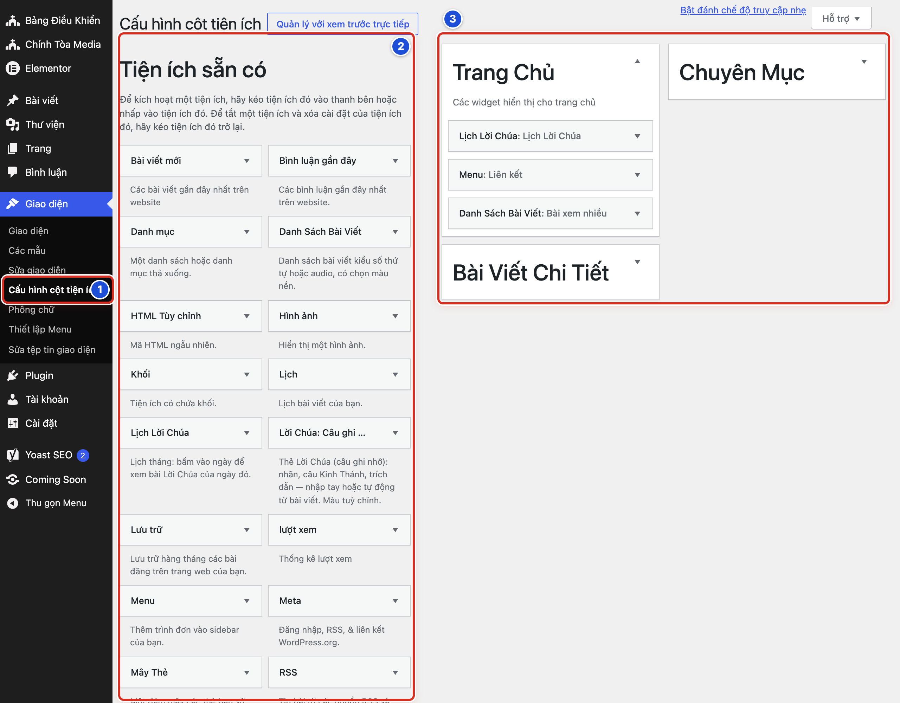
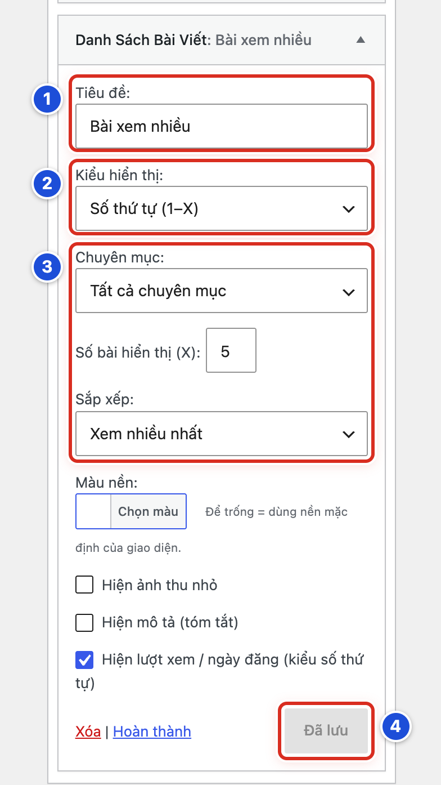
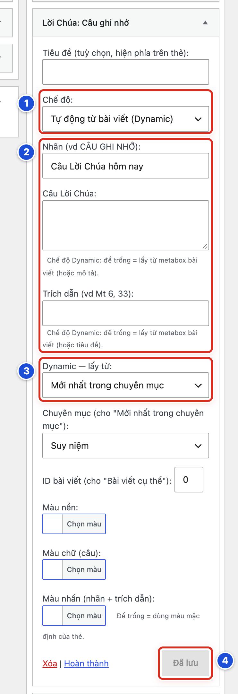
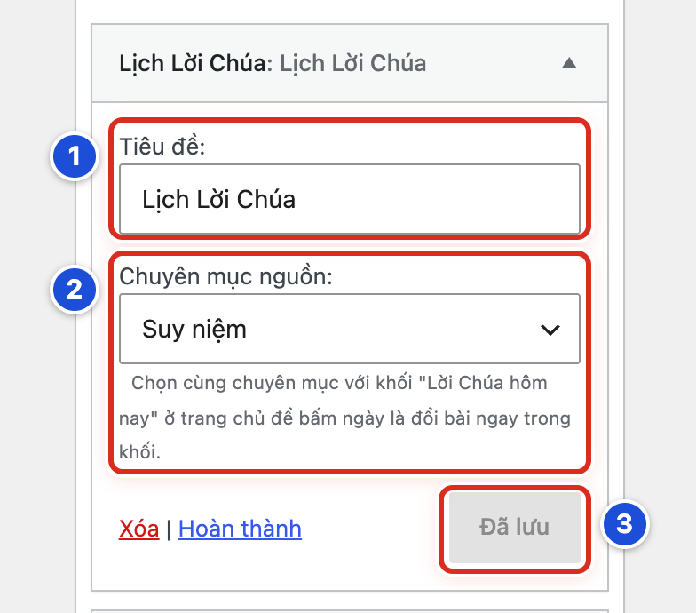
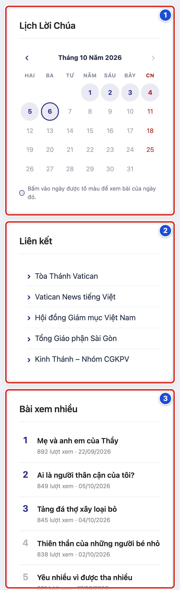

# Phần 7 Menu và widget

## Chương 18 Quản lý widget cổ điển

### Bài 18.01 Hiểu các khu vực widget của giao diện

**Nhãn:** Kỹ thuật dành cho quản trị viên · 🟢 An toàn

#### Mục đích

Biết widget nào hiện ở đâu trên website. **Widget** (tiện ích) là ô nhỏ ở thanh bên (cột nhỏ bên cạnh nội dung) hoặc ở cuối trang, ví dụ lịch, danh sách bài xem nhiều, danh sách liên kết. **Khu vực widget** là chỗ giao diện dành sẵn để đặt widget.

#### Trước khi bắt đầu

- Đăng nhập bằng tài khoản Quản lý. Biên tập viên không thấy mục **Giao diện**.
- Bài này chỉ xem, không thay đổi gì.

#### Các bước thực hiện

1. **Bước 1:** Ở menu trái, bấm **Giao diện → Cấu hình cột tiện ích** (số 1).
2. **Bước 2:** Nhìn cột trái **Tiện ích sẵn có** (số 2). Đây là kho các loại widget.
3. **Bước 3:** Nhìn các ô lớn bên phải (số 3). Mỗi ô là một khu vực widget. Bấm vào tên khu vực để mở ra hoặc thu lại.

#### Ảnh minh họa

*Hình 18.01 Số 1: mục Cấu hình cột tiện ích ở menu trái; số 2: Tiện ích sẵn có; số 3: các khu vực widget.*

#### Kết quả

Bạn sẽ thấy các khu vực sau. Mỗi khu vực ứng với một chỗ trên website:

| Khu vực | Hiện ở đâu trên website |
|---|---|
| **Trang Chủ** | Thanh bên của trang chủ |
| **Bài Viết Chi Tiết** | Thanh bên khi đọc một bài |
| **Chuyên Mục** | Thanh bên trang chuyên mục, trang thẻ, trang tìm kiếm |
| **Cuối Trang - Cột 1…4** | Các cột ở cuối website |
| **Tiện ích không sử dụng** | Không hiện ra ngoài; chỗ cất widget để dùng sau |

Ở website mẫu, khu vực **Trang Chủ** có ba widget: **Lịch Lời Chúa**, **Menu** (Liên kết) và **Danh Sách Bài Viết** (Bài xem nhiều).

#### Lưu ý

- Widget chỉ hiện khi thanh bên của loại trang đó đang bật trong **Thiết lập giao diện**: trang chủ (Bài 15.01), trang chuyên mục (Bài 15.12), bài viết (Bài 15.13). Vị trí trái hay phải cũng chỉnh ở đó.
- Các khu vực **Cuối Trang - Cột 1…4** chỉ có khi đã bật cột widget ở tab **Footer** (Bài 14.08). Số cột chọn bao nhiêu thì có bấy nhiêu khu vực.
- Trên điện thoại, thanh bên chuyển xuống dưới nội dung chính.
- Màn hình này là kiểu cổ điển: bạn kéo thả các ô widget. Sổ tay chỉ hướng dẫn kiểu này.

#### Không nên làm

Không kéo thử widget sang khu vực khác chỉ để “xem sao”. Thay đổi hiện ra ngoài website ngay.

#### Nếu gặp lỗi

- Không thấy mục **Cấu hình cột tiện ích** → bạn đang dùng tài khoản Biên tập viên. Nhờ người có tài khoản Quản lý.
- Không thấy khu vực **Cuối Trang - Cột 1** → chưa bật **Hiển thị cột Widget** ở tab **Footer** (Bài 14.08).
- Khu vực đang thu gọn, không thấy widget bên trong → bấm vào tên khu vực để mở ra.
- Màn hình hiện các khối kiểu mới thay vì các ô kéo thả → chụp màn hình và báo người hỗ trợ kỹ thuật.

### Bài 18.02 Mở màn hình Cấu hình cột tiện ích

**Nhãn:** Kỹ thuật dành cho quản trị viên · 🟢 An toàn

#### Mục đích

Mở một widget đang có để xem thiết lập của nó, rồi đóng lại mà không thay đổi gì.

#### Trước khi bắt đầu

- Đăng nhập bằng tài khoản Quản lý.
- Đã đọc Bài 18.01 để biết các khu vực.

#### Các bước thực hiện

1. **Bước 1:** Ở menu trái, bấm **Giao diện → Cấu hình cột tiện ích**.
2. **Bước 2:** Bấm vào tên khu vực **Trang Chủ** nếu khu vực đang thu gọn.
3. **Bước 3:** Bấm vào thanh tên của một widget, ví dụ “Danh Sách Bài Viết: Bài xem nhiều”. Widget mở ra.
4. **Bước 4:** Đọc các ô bên trong. Không sửa gì.
5. **Bước 5:** Bấm chữ **Hoàn thành** ở cuối widget để thu gọn lại.

#### Ảnh minh họa

Xem Hình 18.01: số 1 là mục cần bấm ở bước 1; khung số 3 là các khu vực, trong đó có ba widget của khu vực **Trang Chủ**.

#### Kết quả

Bạn sẽ thấy widget mở ra với các ô thiết lập. Cuối widget có chữ **Xóa | Hoàn thành** và một nút. Khi bạn chưa đổi gì, nút có màu xám, ghi **Đã lưu**.

#### Lưu ý

- Thanh tên widget ghi theo dạng “Loại widget: Tiêu đề”. Ví dụ “Lịch Lời Chúa: Lịch Lời Chúa”, “Menu: Liên kết”, “Danh Sách Bài Viết: Bài xem nhiều”.
- Khi bạn sửa một ô, nút đổi thành xanh **Lưu thay đổi**. Bấm nút này mới lưu.
- **Hoàn thành** chỉ thu gọn widget, không lưu.

#### Không nên làm

Không bấm chữ đỏ **Xóa** khi chỉ muốn đóng widget. **Xóa** gỡ widget ngay, kèm toàn bộ thiết lập.

#### Nếu gặp lỗi

- Bấm vào thanh tên mà widget không mở → bấm vào mũi tên ▾ ở mép phải thanh tên.
- Lỡ sửa một ô mà không muốn lưu → tải lại trang (F5). Thay đổi chưa lưu sẽ bị bỏ.
- Nút vẫn xám **Đã lưu** dù bạn đã sửa → bấm ra ngoài ô vừa sửa. Nút sẽ đổi thành **Lưu thay đổi**.

### Bài 18.03 Thêm di chuyển và gỡ một widget

**Nhãn:** Kỹ thuật dành cho quản trị viên · 🟡 Cẩn thận

#### Mục đích

Biết ba thao tác cơ bản với widget: đặt một widget vào khu vực, đổi thứ tự, và gỡ ra.

#### Trước khi bắt đầu

- Đăng nhập bằng tài khoản Quản lý và mở **Giao diện → Cấu hình cột tiện ích**.
- Chụp màn hình các khu vực đang dùng, mở sẵn từng widget nếu cần ghi lại thiết lập.
- Muốn tập trước, hãy kéo widget vào ô **Tiện ích không sử dụng**. Ô này không hiện ra ngoài website.

#### Các bước thực hiện

1. **Bước 1:** Ở **Tiện ích sẵn có**, bấm giữ chuột vào widget cần thêm, ví dụ **Lịch Lời Chúa**.
2. **Bước 2:** Kéo sang bên phải và thả vào khu vực cần đặt, ví dụ **Bài Viết Chi Tiết**. Widget tự mở ra.
3. **Bước 3:** Điền các ô của widget.
4. **Bước 4:** Bấm **Lưu thay đổi**. Nút đổi thành xám **Đã lưu**.
5. **Bước 5:** Bấm **Hoàn thành** để thu gọn widget.
6. **Bước 6:** Muốn đổi thứ tự, kéo thanh tên widget lên hoặc xuống trong khu vực rồi thả.
7. **Bước 7:** Muốn gỡ, mở widget và bấm chữ đỏ **Xóa**. Muốn giữ thiết lập để dùng lại, kéo widget vào ô **Tiện ích không sử dụng** thay vì bấm **Xóa**.

#### Ảnh minh họa

Xem Hình 18.01: khung số 2 là nơi lấy widget (bước 1); khung số 3 là các khu vực để thả widget vào (bước 2).

#### Kết quả

Bạn sẽ thấy widget mới nằm trong khu vực đã chọn, đúng thứ tự. Mở website và tải lại trang để thấy widget ở thanh bên.

#### Lưu ý

- Cách thêm không cần kéo: bấm vào tên widget ở **Tiện ích sẵn có**, chọn khu vực trong danh sách hiện ra, rồi bấm **Thêm tiện ích**.
- Kéo thả và **Xóa** có hiệu lực ngay, không cần bấm **Lưu thay đổi**.
- Mỗi widget đặt trong khu vực là một bản riêng. Có thể đặt cùng một loại widget ở nhiều khu vực với thiết lập khác nhau.

#### Không nên làm

- Không gỡ widget đang dùng rồi định làm lại theo trí nhớ. Hãy chụp màn hình thiết lập trước.
- Không kéo nhầm widget **Lịch** của WordPress khi bạn cần **Lịch Lời Chúa**.

#### Nếu gặp lỗi

- Thả widget mà nó bật về chỗ cũ → bạn thả chưa trúng khu vực, hoặc khu vực đang thu gọn. Bấm tên khu vực để mở ra, rồi kéo lại.
- Widget mới không hiện ngoài website → thanh bên của loại trang đó chưa bật (Bài 15.01, 15.12, 15.13), hoặc bạn đang mở sai loại trang. Xem thêm Bài 24.03.
- Lỡ bấm **Xóa** → widget và thiết lập đã mất. Thêm lại widget và điền lại theo ảnh chụp.
- Kéo nhầm widget sang khu vực khác → kéo nó về đúng khu vực. Thiết lập vẫn giữ nguyên.

### Bài 18.04 Cấu hình widget Danh Sách Bài Viết

**Nhãn:** Kỹ thuật dành cho quản trị viên · 🟡 Cẩn thận

#### Mục đích

Hiện một danh sách bài ở thanh bên, ví dụ *Bài xem nhiều*: 5 bài được xem nhiều nhất, đánh số 1 đến 5.

#### Trước khi bắt đầu

- Đăng nhập bằng tài khoản Quản lý và mở **Giao diện → Cấu hình cột tiện ích**.
- Ở khu vực **Trang Chủ**, bấm vào thanh “Danh Sách Bài Viết: Bài xem nhiều” để mở. Hoặc kéo widget **Danh Sách Bài Viết** mới vào khu vực cần đặt (Bài 18.03).
- Chụp màn hình thiết lập hiện tại.

#### Các bước thực hiện

1. **Bước 1:** Gõ **Tiêu đề**, ví dụ *Bài xem nhiều* (số 1).
2. **Bước 2:** Ở **Kiểu hiển thị**, chọn **Số thứ tự (1–X)** (số 2). Kiểu **Audio (icon play)** xem Bài 18.05.
3. **Bước 3:** Ở **Chuyên mục**, chọn **Tất cả chuyên mục** hoặc một chuyên mục (số 3).
4. **Bước 4:** Gõ số bài vào ô **Số bài hiển thị (X)**, ví dụ *5* (cũng trong khung số 3).
5. **Bước 5:** Ở **Sắp xếp**, chọn **Xem nhiều nhất** (cũng trong khung số 3).
6. **Bước 6:** Nếu muốn, chỉnh các ô bên dưới: **Màu nền**, **Hiện ảnh thu nhỏ**, **Hiện mô tả (tóm tắt)**, **Hiện lượt xem / ngày đăng (kiểu số thứ tự)**.
7. **Bước 7:** Bấm **Lưu thay đổi** (số 4). Nút đổi thành xám **Đã lưu**.

#### Ảnh minh họa

*Hình 18.04 Số 1: Tiêu đề; số 2: Kiểu hiển thị; số 3: Chuyên mục, Số bài hiển thị, Sắp xếp; số 4: nút lưu (đang xám “Đã lưu”).*

#### Kết quả

Bạn sẽ thấy nút xám **Đã lưu**. Ngoài website, thanh bên có danh sách đánh số 1 đến 5. Dưới mỗi tên bài là số lượt xem và ngày đăng (xem Hình 18.08, số 3).

#### Lưu ý

Ô **Sắp xếp** có ba lựa chọn:

- **Tự động theo kiểu**: kiểu số thứ tự xếp theo lượt xem, kiểu audio xếp theo bài mới nhất.
- **Xem nhiều nhất**: bài nhiều lượt xem lên đầu.
- **Mới nhất**: bài đăng gần đây lên đầu.

Các ô bên dưới:

- **Màu nền**: bấm **Chọn màu**. Để trống là dùng nền mặc định của giao diện.
- **Hiện lượt xem / ngày đăng (kiểu số thứ tự)**: số lượt xem chỉ hiện khi danh sách xếp theo lượt xem. Xếp theo **Mới nhất** thì chỉ hiện ngày.
- Danh sách xếp theo lượt xem được website nhớ tạm khoảng một giờ cho nhanh. Thứ tự có thể chậm cập nhật một chút.
- Nếu chuyên mục chưa có bài nào đã xuất bản, widget tự ẩn.

#### Không nên làm

Không đặt số bài quá lớn (ví dụ 20). Thanh bên sẽ dài hơn nhiều so với nội dung chính.

#### Nếu gặp lỗi

- Nút vẫn xanh **Lưu thay đổi** → thiết lập chưa được lưu. Bấm nút đó.
- Widget không hiện ngoài website → chuyên mục đã chọn chưa có bài đã xuất bản, hoặc thanh bên trang chủ chưa bật (Bài 15.01).
- Không thấy số lượt xem dưới tên bài → chưa tích ô **Hiện lượt xem / ngày đăng (kiểu số thứ tự)**, hoặc **Sắp xếp** đang là **Mới nhất**.
- Thứ tự bài xem nhiều chưa đổi ngay → chờ khoảng một giờ rồi tải lại trang.

### Bài 18.05 Chọn kiểu đánh số hoặc audio

**Nhãn:** Kỹ thuật dành cho quản trị viên · 🟡 Cẩn thận

#### Mục đích

Chọn cách trình bày của widget **Danh Sách Bài Viết**: danh sách đánh số (hợp với bảng xếp hạng như *Bài xem nhiều*) hoặc danh sách có nút phát (hợp với các bài nghe, xem video).

#### Trước khi bắt đầu

- Đăng nhập bằng tài khoản Quản lý.
- Mở widget **Danh Sách Bài Viết** cần đổi (Bài 18.04).
- Nếu chọn kiểu audio, biết chuyên mục chứa các bài loại **Video (audio) Lời Chúa** (Bài 19.07).

#### Các bước thực hiện

1. **Bước 1:** Ở ô **Kiểu hiển thị** (Hình 18.04, số 2), chọn **Số thứ tự (1–X)** hoặc **Audio (icon play)**.
2. **Bước 2:** Với kiểu audio, ở ô **Chuyên mục**, chọn chuyên mục chứa bài video, audio.
3. **Bước 3:** Để ô **Sắp xếp** là **Tự động theo kiểu**, hoặc chọn cách xếp khác.
4. **Bước 4:** Bấm **Lưu thay đổi**.
5. **Bước 5:** Mở website, tải lại trang và xem widget.

#### Ảnh minh họa

Xem Hình 18.04, số 2 (ô **Kiểu hiển thị**).

#### Kết quả

Bạn sẽ thấy một trong hai kiểu:

| Kiểu | Mỗi dòng có |
|---|---|
| **Số thứ tự (1–X)** | Số thứ tự, tên bài, (lượt xem · ngày) |
| **Audio (icon play)** | Nút phát tròn, tên bài, ngày dạng ngày.tháng |

#### Lưu ý

- Ở kiểu audio, bấm nút phát sẽ **mở trang bài**. Nhạc hay video không phát ngay trong thanh bên. Trình phát nằm ở đầu trang bài.
- Ô **Hiện lượt xem / ngày đăng (kiểu số thứ tự)** chỉ có tác dụng với kiểu số thứ tự.
- **Tự động theo kiểu** nghĩa là: kiểu số thứ tự xếp theo lượt xem, kiểu audio xếp theo bài mới nhất.

#### Không nên làm

Không đổi kiểu của widget *Bài xem nhiều* đang dùng khi chưa chụp lại thiết lập cũ.

#### Nếu gặp lỗi

- Bấm nút phát chỉ mở trang bài → đúng như thiết kế. Trình phát ở đầu trang bài.
- Trang bài không có trình phát → bài chưa chọn loại **Video (audio) Lời Chúa**, hoặc đường dẫn video không phát được (Bài 19.08, 19.09).
- Danh sách audio lẫn bài thường → chuyên mục đã chọn có cả bài thường. Chọn chuyên mục chỉ chứa bài video, audio.
- Ở kiểu audio không có số lượt xem → đúng như thiết kế. Kiểu này chỉ hiện ngày.

### Bài 18.06 Cấu hình widget Lời Chúa Câu ghi nhớ

**Nhãn:** Kỹ thuật dành cho quản trị viên · 🟡 Cẩn thận

#### Mục đích

Đặt ở thanh bên một thẻ màu có câu Lời Chúa nổi bật. Câu có thể do bạn tự gõ, hoặc tự lấy từ bài Lời Chúa mới nhất.

#### Trước khi bắt đầu

- Đăng nhập bằng tài khoản Quản lý và mở **Giao diện → Cấu hình cột tiện ích**.
- Kéo widget **Lời Chúa: Câu ghi nhớ** vào khu vực cần đặt (**Trang Chủ**, **Bài Viết Chi Tiết** hoặc **Chuyên Mục**). Widget tự mở ra. Hoặc mở widget đang có.
- Nếu lấy câu tự động, nguồn nên là chuyên mục chứa bài loại **Lời Chúa (câu ghi nhớ)**, ví dụ **Suy niệm**.

#### Các bước thực hiện

1. **Bước 1:** Ở ô **Chế độ**, chọn **Nhập tay (Static)** hoặc **Tự động từ bài viết (Dynamic)** (số 1).
2. **Bước 2:** Gõ chữ nhỏ phía trên câu vào ô **Nhãn (vd CÂU GHI NHỚ)**, ví dụ *Câu Lời Chúa hôm nay* (số 2).
3. **Bước 3:** Nếu chọn Nhập tay: gõ câu vào ô **Câu Lời Chúa** và chỗ trích vào ô **Trích dẫn (vd Mt 6, 33)** (cũng trong khung số 2). Nếu chọn Tự động: để trống hai ô này.
4. **Bước 4:** Nếu chọn Tự động: ở ô **Dynamic — lấy từ**, chọn **Mới nhất trong chuyên mục** (số 3).
5. **Bước 5:** Ở ô **Chuyên mục (cho "Mới nhất trong chuyên mục")**, chọn **Suy niệm**.
6. **Bước 6:** Bấm **Lưu thay đổi** (số 4). Nút đổi thành xám **Đã lưu**.

#### Ảnh minh họa

*Hình 18.06 Số 1: Chế độ; số 2: Nhãn, Câu Lời Chúa, Trích dẫn; số 3: Dynamic — lấy từ; số 4: nút lưu.*

#### Kết quả

Bạn sẽ thấy nút xám **Đã lưu**. Ngoài website, thanh bên có thẻ màu với nhãn, câu Lời Chúa và trích dẫn. Ở chế độ Tự động, thẻ tự đổi câu khi chuyên mục có bài mới.

#### Lưu ý

Ô **Dynamic — lấy từ** có ba lựa chọn:

- **Mới nhất trong chuyên mục**: bài mới nhất đã xuất bản của chuyên mục chọn ở ô bên dưới.
- **Bài đang xem**: chính bài khách đang đọc. Chỉ hợp ở khu vực **Bài Viết Chi Tiết**.
- **Bài viết cụ thể**: bài có số ghi ở ô **ID bài viết (cho "Bài viết cụ thể")**. Tìm số này: vào **Bài viết → Tất cả bài viết**, bấm tên bài; trên thanh địa chỉ, số sau chữ `post=` là ID.

Thêm vài điều cần nhớ:

- Ở chế độ Tự động, chữ bạn gõ trong widget luôn được ưu tiên. Để trống thì widget lấy từ bài.
- Nếu bài nguồn không có **Câu Lời Chúa**, thẻ dùng mô tả ngắn và tên bài thay vào.
- Ô **Tiêu đề (tuỳ chọn, hiện phía trên thẻ)** và ba ô màu (**Màu nền**, **Màu chữ (câu)**, **Màu nhấn (nhãn + trích dẫn)**) có thể để trống. Trống là dùng màu mặc định của thẻ.
- Bài Lời Chúa đã tự có thẻ câu ghi nhớ ở đầu bài. Đặt thêm widget **Bài đang xem** sẽ làm câu hiện hai lần.

#### Không nên làm

Không gõ đoạn chú giải dài vào ô **Câu Lời Chúa**. Thẻ chỉ hợp với một hai câu ngắn.

#### Nếu gặp lỗi

- Thẻ hiện mô tả ngắn và tên bài thay vì câu Lời Chúa → bài nguồn chưa điền **Câu Lời Chúa** và **Trích dẫn** (Bài 19.03, 19.04).
- Thẻ vẫn hiện câu cũ ở chế độ Tự động → ô **Câu Lời Chúa** trong widget còn chữ cũ. Xoá trống ô đó, rồi lưu.
- Thẻ không hiện → ở chế độ Nhập tay mà cả ba ô Nhãn, Câu, Trích dẫn đều trống; hoặc ô **ID bài viết** sai; hoặc thanh bên của trang đó chưa bật.
- Ngoài website chưa đổi → nút còn xanh **Lưu thay đổi**. Bấm nút đó, rồi tải lại trang.

### Bài 18.07 Cấu hình widget Lịch Lời Chúa

**Nhãn:** Kỹ thuật dành cho quản trị viên · 🟡 Cẩn thận

#### Mục đích

Đặt lịch tháng ở thanh bên. Khách bấm vào một ngày để xem bài Lời Chúa của ngày đó. Lịch đi cùng khối **Lời Chúa hôm nay** ở trang chủ.

#### Trước khi bắt đầu

- Đăng nhập bằng tài khoản Quản lý.
- Trang chủ đã có khối **Lời Chúa hôm nay** (Bài 15.07). Biết chuyên mục của khối, ví dụ **Suy niệm**.
- Mở **Giao diện → Cấu hình cột tiện ích**. Kéo widget **Lịch Lời Chúa** vào khu vực **Trang Chủ**. Muốn có lịch ở trang bài, kéo thêm một widget vào **Bài Viết Chi Tiết**. Widget tự mở ra.

#### Các bước thực hiện

1. **Bước 1:** Gõ **Tiêu đề**, ví dụ *Lịch Lời Chúa* (số 1).
2. **Bước 2:** Ở **Chuyên mục nguồn**, chọn **cùng chuyên mục** với khối Lời Chúa hôm nay, ví dụ **Suy niệm** (số 2).
3. **Bước 3:** Bấm **Lưu thay đổi** (số 3). Nút đổi thành xám **Đã lưu**.
4. **Bước 4:** Mở trang chủ, tải lại trang. Bấm thử một ngày được tô màu trên lịch.

#### Ảnh minh họa

*Hình 18.07 Số 1: Tiêu đề; số 2: Chuyên mục nguồn và ghi chú bên dưới; số 3: nút lưu.*

#### Kết quả

Bạn sẽ thấy lịch tháng hiện tại, ví dụ “Tháng 10 Năm 2026”. Bấm vào một ngày được tô màu, bài của ngày đó hiện ngay trong khối **Lời Chúa hôm nay**, không phải mở trang khác.

#### Lưu ý

Cách lịch hoạt động:

- Ngày **có bài** được tô màu. Ngày hôm nay có vòng tròn. Chủ Nhật chữ đỏ.
- Cùng chuyên mục với khối: bấm ngày thì bài đổi ngay trong khối. Khác chuyên mục, hoặc lịch ở trang khác: bấm ngày thì mở trang bài của ngày đó.
- Mũi tên **‹ ›** để xem tháng trước, tháng sau. Lịch chỉ mở tới **tháng hiện tại**.
- Bài hẹn giờ của các ngày tới chỉ được tô màu khi đã tới ngày đăng.
- Ở trang một bài viết, lịch đánh dấu ngày của bài đó và mở đúng tháng của bài.
- Widget **Lịch** có sẵn của WordPress là widget khác, không làm được những việc trên.

#### Không nên làm

Không chọn **Tất cả chuyên mục** ở **Chuyên mục nguồn**. Ngày nào có bất kỳ bài nào cũng sẽ được tô màu, kể cả bài không phải Lời Chúa.

#### Nếu gặp lỗi

- Bấm ngày mà website mở sang trang bài, khối không đổi → widget và khối đang khác chuyên mục. Chọn lại **Chuyên mục nguồn** cho giống khối.
- Lịch không tô màu ngày nào → chuyên mục nguồn chưa có bài đã xuất bản trong tháng, hoặc bạn chọn nhầm chuyên mục.
- Không bấm được mũi tên › → bạn đang xem tháng hiện tại. Lịch không mở tới tháng sau.
- Bài ngày mai đã hẹn giờ mà lịch chưa tô màu → đúng như thiết kế. Tới ngày đăng, ngày đó mới được tô màu.
- Lịch trông khác Hình 18.08, bấm ngày thì mở một trang danh sách bài → bạn đã đặt nhầm widget **Lịch** của WordPress. Gỡ nó và đặt **Lịch Lời Chúa**.

### Bài 18.08 Kiểm tra widget ngoài website

**Nhãn:** Kỹ thuật dành cho quản trị viên · 🟢 An toàn

#### Mục đích

Sau khi lưu widget, xem tận mắt thanh bên ngoài website. Mỗi widget phải đúng chỗ, đúng thứ tự và bấm được.

#### Trước khi bắt đầu

- Widget đã được lưu (nút xám **Đã lưu**).
- Nên mở website trong cửa sổ ẩn danh (riêng tư) để thấy như khách.

#### Các bước thực hiện

1. **Bước 1:** Mở trang chủ website và tải lại trang (F5).
2. **Bước 2:** Ở thanh bên, bấm thử một ngày được tô màu trên **Lịch Lời Chúa** (số 1).
3. **Bước 3:** Bấm thử một liên kết trong ô **Liên kết** (số 2).
4. **Bước 4:** Đếm số bài trong ô **Bài xem nhiều** (số 3). Phải có 5 bài, mỗi bài có số lượt xem và ngày.
5. **Bước 5:** Mở một bài viết và một trang chuyên mục. Kiểm tra widget của khu vực **Bài Viết Chi Tiết** và **Chuyên Mục**, nếu bạn có đặt.
6. **Bước 6:** Mở website trên điện thoại. Kéo xuống dưới nội dung chính để thấy thanh bên.

#### Ảnh minh họa

*Hình 18.08 Số 1: Lịch Lời Chúa; số 2: Liên kết (widget Menu); số 3: Bài xem nhiều (widget Danh Sách Bài Viết).*

#### Kết quả

Bạn sẽ thấy ba widget theo đúng thứ tự trong khu vực **Trang Chủ**: lịch tháng, 5 liên kết có dấu ›, và danh sách 5 bài đánh số.

#### Lưu ý

- Ô **Liên kết** là widget **Menu** có sẵn của WordPress. Widget này có ô tiêu đề và ô chọn menu; website mẫu chọn menu **Liên kết**. Sửa các liên kết bên trong ở **Giao diện → Thiết lập Menu** (Bài 17.07).
- Widget chỉ hiện trên đúng loại trang của khu vực. Widget đặt ở **Bài Viết Chi Tiết** không hiện ở trang chủ.
- Thanh bên bên trái hay bên phải do **Thiết lập giao diện** quyết định (Bài 15.01).

#### Không nên làm

Không kết luận widget bị lỗi khi đang mở sai loại trang. Ví dụ widget khu vực **Chuyên Mục** chỉ hiện ở trang chuyên mục, trang thẻ, trang tìm kiếm.

#### Nếu gặp lỗi

- Không thấy cả thanh bên → thanh bên của loại trang đó đang tắt (Bài 15.01, 15.12, 15.13).
- Widget vừa lưu chưa hiện → tải lại trang (F5). Vẫn chưa thấy thì xem Bài 24.03.
- Ô **Liên kết** trống hoặc hiện sai danh sách → widget **Menu** đang chọn nhầm menu. Mở widget, chọn **Liên kết**, rồi lưu.
- Thứ tự widget khác mong muốn → kéo lại thứ tự trong khu vực (Bài 18.03).
