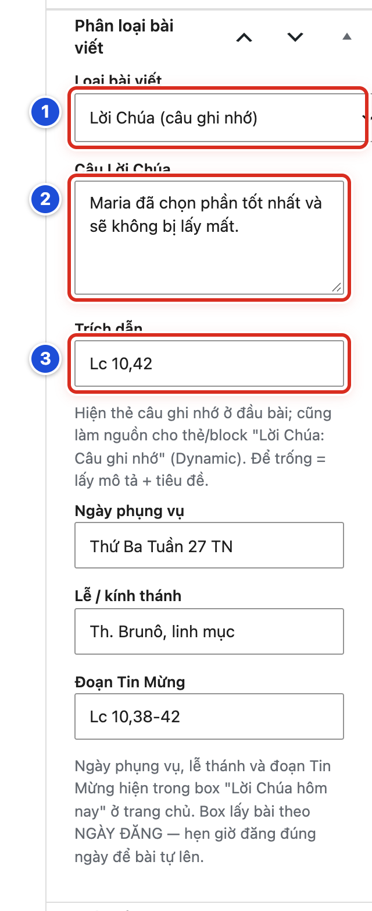
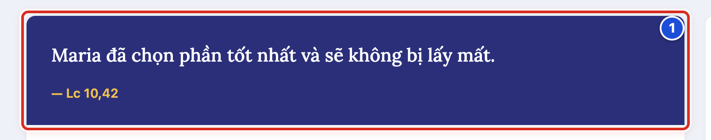
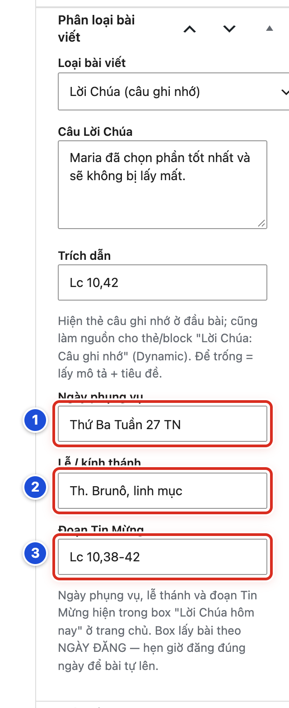
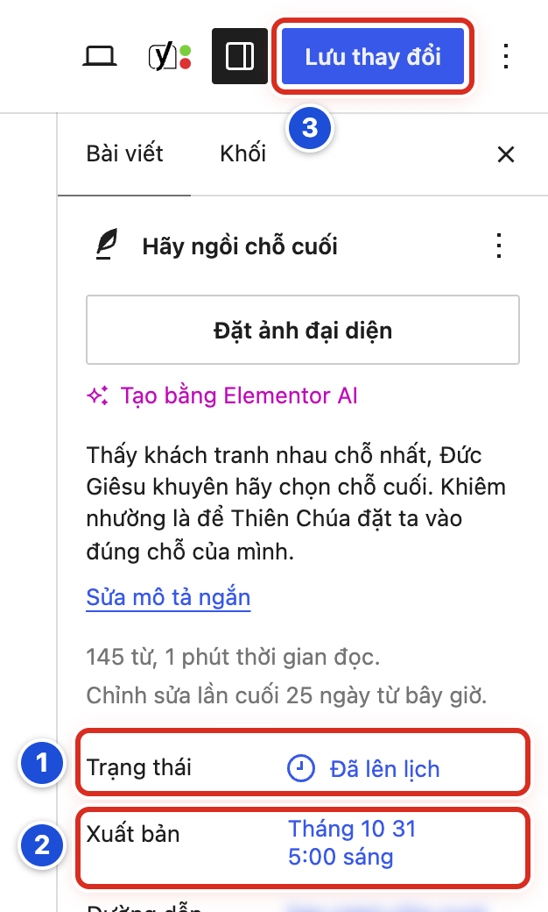
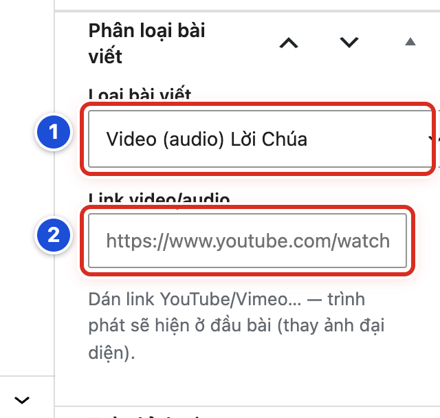

# Phần 8 Chức năng nội dung riêng của giao diện

## Chương 19 Phân loại bài viết và Lời Chúa hôm nay

### Bài 19.01 Hiểu ba loại bài viết

**Nhãn:** Bắt buộc học · 🟢 An toàn

#### Mục đích

Mỗi bài viết có một **Loại bài viết**. Loại bài quyết định phần đầu bài hiện thế nào: ảnh đại diện, thẻ câu Lời Chúa, hay trình phát video. Bài này giúp bạn chọn đúng loại.

#### Trước khi bắt đầu

- Đăng nhập bằng tài khoản Biên tập viên hoặc Quản lý.
- Mở một bản nháp của bạn trong trang viết bài (Bài 04.01).

#### Các bước thực hiện

1. **Bước 1:** Nếu cột bên phải đang đóng, bấm nút **Cài đặt** (ô vuông chia đôi, góc phải trên).
2. **Bước 2:** Ở cột phải, bấm tab **Bài viết**.
3. **Bước 3:** Kéo cột phải xuống tới hộp **Phân loại bài viết**.
4. **Bước 4:** Bấm vào ô **Loại bài viết** để xem ba lựa chọn.
5. **Bước 5:** Chọn thử từng loại. Các ô bên dưới thay đổi theo loại.
6. **Bước 6:** Chọn lại loại đúng với bài, rồi bấm **Lưu nháp**.

#### Ảnh minh họa

Xem Hình 19.03a (hộp **Phân loại bài viết** khi chọn loại Lời Chúa) và Hình 19.07 (khi chọn loại Video). Số 1 trên cả hai hình là ô **Loại bài viết**.

#### Kết quả

Bạn sẽ thấy ba loại bài:

| Loại bài viết | Dùng cho | Đầu bài hiện |
|---|---|---|
| **Mặc định (bài viết thường)** | Tin tức, thông báo, giáo lý | Ảnh đại diện |
| **Lời Chúa (câu ghi nhớ)** | Suy niệm, Lời Chúa mỗi ngày | Thẻ màu có câu Lời Chúa |
| **Video (audio) Lời Chúa** | Bài có video YouTube, Vimeo | Trình phát video |

#### Lưu ý

- Loại bài khác với danh mục (chuyên mục — nhóm bài cùng chủ đề). Bài nào cũng vẫn phải chọn danh mục (Bài 05.03).
- Bài mới luôn bắt đầu ở loại **Mặc định (bài viết thường)**.
- Loại **Lời Chúa** có 5 ô: Câu Lời Chúa, Trích dẫn, Ngày phụng vụ, Lễ / kính thánh, Đoạn Tin Mừng. Loại **Video** có 1 ô: Link video/audio.
- Hộp **Phân loại bài viết** chỉ có ở **Bài viết**, không có ở **Trang**.

#### Không nên làm

Không chọn loại Lời Chúa cho tin tức hay thông báo chỉ để có thẻ màu đẹp.

#### Nếu gặp lỗi

- Không thấy hộp **Phân loại bài viết** → cột phải đang ở tab **Khối**. Bấm tab **Bài viết** và kéo xuống. Nếu hộp đang thu gọn, bấm vào tên hộp để mở.
- Không thấy hộp dù đã kéo hết cột phải → bạn đang sửa một **Trang**, không phải bài viết.
- Chọn loại mà các ô bên dưới không đổi → bấm **Lưu nháp**, tải lại trang (F5), rồi chọn lại.

### Bài 19.02 Tạo bài viết thông thường

**Nhãn:** Bắt buộc học · 🟢 An toàn

#### Mục đích

Viết một bài thường, như tin tức, thông báo, bài giáo lý. Đầu bài hiện ảnh đại diện.

#### Trước khi bắt đầu

- Đăng nhập bằng tài khoản Biên tập viên hoặc Quản lý.
- Chuẩn bị nội dung bài, một ảnh đại diện và biết bài thuộc danh mục nào.

#### Các bước thực hiện

1. **Bước 1:** Bấm **Bài viết → Thêm Bài Viết**.
2. **Bước 2:** Gõ tiêu đề và nội dung (Hình 04.02).
3. **Bước 3:** Ở bảng **Danh mục** bên phải, tích danh mục của bài, ví dụ **Giáo lý** (Bài 05.03).
4. **Bước 4:** Bấm **Đặt ảnh đại diện** và chọn ảnh (Bài 05.02).
5. **Bước 5:** Ở hộp **Phân loại bài viết**, để **Loại bài viết** là **Mặc định (bài viết thường)**.
6. **Bước 6:** Bấm **Lưu nháp**.
7. **Bước 7:** Xem trước và kiểm tra (Bài 05.06, 05.07), rồi xuất bản (Bài 05.08).

#### Ảnh minh họa

Xem Hình 04.02: số 1 là ô tiêu đề, số 2 là đoạn nội dung đầu tiên (bước 2).

#### Kết quả

Bạn sẽ thấy hộp **Phân loại bài viết** chỉ có ô **Loại bài viết**, không có ô nào khác. Ngoài website, đầu bài là ảnh đại diện, rồi tới tiêu đề, tác giả, ngày đăng và lượt xem.

#### Lưu ý

- Bài thường nên có ảnh đại diện. Ảnh này hiện ở đầu bài và trên thẻ bài ở trang chủ, trang chuyên mục.
- Bài thường không có ô riêng nào trong hộp **Phân loại bài viết**. Mọi nội dung nằm trong phần soạn thảo.

#### Không nên làm

- Không bấm nút xanh **Sửa với Elementor** ở thanh trên.
- Không quên chọn danh mục. Bài không chọn danh mục sẽ tự vào **Suy niệm** (danh mục mặc định) và có thể chiếm chỗ bài Lời Chúa hôm nay trên trang chủ.

#### Nếu gặp lỗi

- Đầu bài hiện thẻ màu câu Lời Chúa dù là bài thường → **Loại bài viết** đang là Lời Chúa. Đổi về **Mặc định (bài viết thường)** và lưu.
- Đầu bài không có ảnh → bài chưa có ảnh đại diện, hoặc Quản lý đã tắt **Hình đại diện** cho bài này (Bài 20.04).
- Bài không hiện ở khối trang chủ mong muốn → bài nằm sai danh mục (Bài 23.03).

### Bài 19.03 Tạo bài Lời Chúa câu ghi nhớ

**Nhãn:** Bắt buộc học · 🟢 An toàn

#### Mục đích

Tạo bài suy niệm có câu Lời Chúa nổi bật. Đầu bài hiện thẻ màu với câu Lời Chúa và trích dẫn. Bài không cần ảnh đại diện.

#### Trước khi bắt đầu

- Đăng nhập bằng tài khoản Biên tập viên hoặc Quản lý.
- Đã có bài nháp với tiêu đề, nội dung suy niệm và danh mục, ví dụ **Suy niệm**.
- Có câu Lời Chúa đã đối chiếu với bản Kinh Thánh giáo xứ dùng.
- Cột phải đang mở ở tab **Bài viết** (Bài 19.01).

#### Các bước thực hiện

1. **Bước 1:** Ở hộp **Phân loại bài viết**, ô **Loại bài viết**, chọn **Lời Chúa (câu ghi nhớ)** (Hình 19.03a, số 1). Các ô mới hiện ra bên dưới.
2. **Bước 2:** Gõ câu vào ô **Câu Lời Chúa** (số 2), ví dụ *Maria đã chọn phần tốt nhất và sẽ không bị lấy mất.*
3. **Bước 3:** Gõ chỗ trích vào ô **Trích dẫn** (số 3), ví dụ *Lc 10,42*.
4. **Bước 4:** Nếu bài dùng cho khối **Lời Chúa hôm nay**, điền thêm ba ô bên dưới (Bài 19.05).
5. **Bước 5:** Bấm **Lưu nháp**.
6. **Bước 6:** Bấm **Xem → Xem trước ở tab mới** để kiểm tra thẻ ở đầu bài (Hình 19.03b).

#### Ảnh minh họa

*Hình 19.03a Số 1: Loại bài viết là Lời Chúa (câu ghi nhớ); số 2: Câu Lời Chúa; số 3: Trích dẫn.*

*Hình 19.03b Số 1: thẻ câu ghi nhớ ở đầu bài, gồm câu Lời Chúa và trích dẫn.*

#### Kết quả

Bạn sẽ thấy đầu bài có thẻ màu với câu Lời Chúa và trích dẫn “— Lc 10,42”. Trên trang chủ, lưới ảnh mosaic, trang chuyên mục và kết quả tìm kiếm, câu Lời Chúa hiện ở chỗ đặt ảnh.

#### Lưu ý

- **Bài Lời Chúa không cần ảnh đại diện.** Khi bài không có ảnh, website tự hiện câu Lời Chúa ở chỗ ảnh.
- Nếu bài có ảnh đại diện, thẻ bài ở trang chủ dùng ảnh. Ở đầu trang bài, thẻ câu ghi nhớ và ảnh cùng hiện.
- Dưới ô **Trích dẫn** có ghi chú: để trống thì thẻ dùng mô tả ngắn và tên bài. Nên điền đủ cả hai ô để thẻ đúng ý.
- Câu này cũng là nguồn cho widget và khối **Lời Chúa: Câu ghi nhớ** ở chế độ Tự động (Bài 18.06, 20.02).

#### Không nên làm

- Không chỉ gõ câu Lời Chúa trong nội dung bài rồi để loại **Mặc định**. Bài sẽ không có thẻ màu.
- Không gõ dấu gạch “—” trước trích dẫn. Giao diện tự thêm.

#### Nếu gặp lỗi

- Không thấy ô **Câu Lời Chúa** → ô **Loại bài viết** chưa chọn **Lời Chúa (câu ghi nhớ)**.
- Xem trước không thấy thẻ → bấm **Lưu nháp** trước, rồi xem trước lại.
- Thẻ hiện mô tả ngắn và tên bài thay vì câu Lời Chúa → hai ô **Câu Lời Chúa** và **Trích dẫn** đang trống. Điền rồi lưu.
- Trích dẫn hiện hai dấu gạch “— —” → xoá dấu gạch bạn đã gõ trong ô **Trích dẫn**.

### Bài 19.04 Nhập Câu Lời Chúa và Trích dẫn

**Nhãn:** Bắt buộc học · 🟢 An toàn

#### Mục đích

Nhập câu Lời Chúa và chỗ trích cho đúng, gọn và thống nhất giữa các bài.

#### Trước khi bắt đầu

- Bài đã chọn loại **Lời Chúa (câu ghi nhớ)** (Bài 19.03).
- Có câu Kinh Thánh đã đối chiếu với bản dịch giáo xứ dùng, ví dụ bản của Nhóm Phiên dịch Các Giờ Kinh Phụng vụ.

#### Các bước thực hiện

1. **Bước 1:** Kéo cột phải tới hộp **Phân loại bài viết**.
2. **Bước 2:** Bấm vào ô **Câu Lời Chúa** (Hình 19.03a, số 2). Gõ hoặc dán câu Kinh Thánh. Không gõ dấu ngoặc kép.
3. **Bước 3:** Bấm vào ô **Trích dẫn** (Hình 19.03a, số 3). Gõ tên sách viết tắt, số chương, số câu, ví dụ *Lc 10,42*.
4. **Bước 4:** Đọc lại từng chữ, dấu câu, số chương và số câu.
5. **Bước 5:** Bấm **Lưu nháp** (bài chưa đăng) hoặc **Lưu thay đổi** (bài đã đăng).

#### Ảnh minh họa

Xem Hình 19.03a, số 2 (ô **Câu Lời Chúa**) và số 3 (ô **Trích dẫn**).

#### Kết quả

Bạn sẽ thấy câu và trích dẫn hiện gọn trong thẻ ở đầu bài, như Hình 19.03b. Câu không bị lặp dấu ngoặc, trích dẫn không bị lặp dấu gạch.

#### Lưu ý

- Chọn một hai câu ngắn. Câu quá dài làm thẻ cao và khó đọc, nhất là ở chỗ ảnh trên trang chủ.
- Giữ một cách viết trích dẫn cho mọi bài. Website mẫu viết liền dấu phẩy: *Lc 10,42*; đoạn nhiều câu dùng gạch nối: *Lc 10,38-42*.
- Ở chỗ ảnh trên trang chủ, giao diện tự thêm một dấu ngoặc kép lớn trang trí.

#### Không nên làm

- Không dán cả đoạn chú giải dài vào ô **Câu Lời Chúa**.
- Không ghi chữ “Tin Mừng” hay tên sách đầy đủ vào ô **Trích dẫn**. Dùng tên viết tắt.

#### Nếu gặp lỗi

- Câu hiện hai lớp ngoặc kép → xoá dấu ngoặc kép bạn đã gõ, rồi lưu.
- Trích dẫn hiện hai dấu gạch “— —” → xoá dấu gạch bạn đã gõ ở đầu ô **Trích dẫn**.
- Đã sửa câu mà ngoài website vẫn câu cũ → bạn chưa bấm **Lưu thay đổi**. Lưu, rồi tải lại trang (F5).
- Phát hiện sai chữ sau khi đã đăng → sửa trong ô, bấm **Lưu thay đổi**. Thẻ đầu bài và chỗ ảnh trên trang chủ cùng đổi theo.

### Bài 19.05 Nhập Ngày phụng vụ Lễ thánh và Đoạn Tin Mừng

**Nhãn:** Bắt buộc học · 🟢 An toàn

#### Mục đích

Điền thông tin của ngày cho bài Lời Chúa. Ba ô này hiện trong khối **Lời Chúa hôm nay** ở trang chủ, cạnh tên bài.

#### Trước khi bắt đầu

- Bài đã chọn loại **Lời Chúa (câu ghi nhớ)**. Ba ô chỉ hiện với loại này (Bài 19.03).
- Bài nằm trong danh mục mà khối **Lời Chúa hôm nay** dùng, ví dụ **Suy niệm**.
- Có lịch phụng vụ để tra ngày, lễ và đoạn Tin Mừng.

#### Các bước thực hiện

1. **Bước 1:** Gõ vào ô **Ngày phụng vụ** (số 1), ví dụ *Thứ Ba Tuần 27 TN*.
2. **Bước 2:** Gõ vào ô **Lễ / kính thánh** (số 2), ví dụ *Th. Brunô, linh mục*. Ngày không có lễ thì để trống.
3. **Bước 3:** Gõ vào ô **Đoạn Tin Mừng** (số 3), ví dụ *Lc 10,38-42*.
4. **Bước 4:** Bấm **Lưu nháp** (bài chưa đăng) hoặc **Lưu thay đổi** (bài đã đăng).

#### Ảnh minh họa

*Hình 19.05 Số 1: Ngày phụng vụ; số 2: Lễ / kính thánh; số 3: Đoạn Tin Mừng.*

#### Kết quả

Bạn sẽ thấy, vào đúng ngày đăng của bài, khối **Lời Chúa hôm nay** ở trang chủ hiện: “06/10/2026 · Thứ Ba Tuần 27 TN”, tên bài, dòng “Th. Brunô, linh mục” và dòng “Tin Mừng: Lc 10,38-42” (xem Bài 15.07).

#### Lưu ý

- Ngày dạng 06/10/2026 trong khối lấy từ **ngày đăng** của bài, không lấy từ ô **Ngày phụng vụ**.
- Chữ “Tin Mừng:” do giao diện tự thêm. Ô **Đoạn Tin Mừng** chỉ ghi chỗ trích.
- Ba ô này chỉ hiện trong khối **Lời Chúa hôm nay**. Trang bài viết không hiện chúng.
- Dùng chữ viết tắt thống nhất cho mùa phụng vụ, ví dụ *TN* cho Thường Niên.

#### Không nên làm

Không ghi ngày dương lịch (ví dụ “06/10”) vào ô **Ngày phụng vụ**. Ngày đó đã tự hiện.

#### Nếu gặp lỗi

- Không thấy ba ô → **Loại bài viết** chưa phải **Lời Chúa (câu ghi nhớ)**.
- Khối hiện “Tin Mừng: Tin Mừng Lc 10,38-42” → bạn đã gõ chữ “Tin Mừng” vào ô. Xoá chữ đó, rồi lưu.
- Khối không có dòng lễ thánh → ô **Lễ / kính thánh** đang trống. Ngày không có lễ thì đó là bình thường.
- Khối hiện thông tin của bài hôm qua → bài hôm nay chưa đăng hoặc hẹn sai ngày (Bài 19.06).

### Bài 19.06 Chuẩn bị bài Lời Chúa trước cho từng ngày

**Nhãn:** Bắt buộc học · 🟡 Cẩn thận

#### Mục đích

Soạn trước bài Lời Chúa cho cả tuần hay cả tháng. Mỗi bài hẹn giờ đăng đúng ngày của nó. Đến ngày, bài tự đăng; khối **Lời Chúa hôm nay** và **Lịch Lời Chúa** tự cập nhật.

#### Trước khi bắt đầu

- Đăng nhập bằng tài khoản Biên tập viên hoặc Quản lý.
- Đã biết cách hẹn giờ đăng bài (Bài 05.10).
- Có danh sách các ngày cần chuẩn bị, kèm câu Lời Chúa, ngày phụng vụ, lễ và đoạn Tin Mừng.

#### Các bước thực hiện

1. **Bước 1:** Tạo bài mới. Gõ tiêu đề, nội dung suy niệm và mô tả ngắn.
2. **Bước 2:** Ở bảng **Danh mục**, tích **Suy niệm** (danh mục của khối Lời Chúa hôm nay).
3. **Bước 3:** Ở hộp **Phân loại bài viết**, chọn **Lời Chúa (câu ghi nhớ)** và điền đủ 5 ô (Bài 19.03 đến 19.05).
4. **Bước 4:** Ở cột phải, bấm chữ xanh **Ngay lập tức** cạnh **Xuất bản** để mở lịch (Hình 05.10, số 1).
5. **Bước 5:** Bấm vào đúng ngày của bài trên lịch, ví dụ ngày 31 (Hình 05.10, số 3).
6. **Bước 6:** Gõ giờ sớm vào ô giờ, ví dụ *05:00* (Hình 05.10, số 2).
7. **Bước 7:** Bấm ra ngoài để đóng lịch. Nút xanh trên cùng đổi thành **Lên lịch**.
8. **Bước 8:** Bấm **Lên lịch**.
9. **Bước 9:** Bấm **Lên lịch** lần nữa trong bảng xác nhận.
10. **Bước 10:** Kiểm tra cột phải: **Trạng thái** ghi **Đã lên lịch** (Hình 19.06, số 1), **Xuất bản** ghi đúng ngày giờ (số 2).
11. **Bước 11:** Sau này muốn sửa bài đã hẹn, sửa xong thì bấm **Lưu thay đổi** (số 3).

#### Ảnh minh họa

*Hình 19.06 Số 1: Trạng thái Đã lên lịch; số 2: ngày giờ sẽ đăng (Tháng 10 31, 5:00 sáng); số 3: nút Lưu thay đổi.*

Cách mở lịch chọn ngày giờ ở bước 4–6: xem Hình 05.10.

#### Kết quả

Bạn sẽ thấy trạng thái **Đã lên lịch**. Trong **Bài viết → Tất cả bài viết**, bài có chữ “— Lên kế hoạch”, cột Thời gian ghi “Đã lên lịch 31/10/2026 lúc 5:00 sáng”. Đúng 5:00 sáng ngày đó, bài tự đăng và hiện trong khối **Lời Chúa hôm nay**.

#### Lưu ý

- Khối **Lời Chúa hôm nay** lấy bài có **ngày đăng là hôm nay** trong danh mục đã chọn. Nếu hôm nay chưa có bài, khối hiện bài gần nhất trước đó. Trang chủ không bao giờ bị trống.
- Mỗi ngày chỉ nên có **một** bài trong danh mục **Suy niệm**. Nếu một ngày có hai bài, khối và lịch dùng bài đăng muộn hơn trong ngày.
- Khối lấy mọi bài trong danh mục, kể cả bài thường. Đừng đăng bài khác vào **Suy niệm**. Bài quên chọn danh mục cũng tự vào **Suy niệm**, vì đây là danh mục mặc định.
- Bài hẹn giờ của các ngày tới chưa được tô màu trên **Lịch Lời Chúa** cho tới ngày đăng.
- Để rà soát, vào **Bài viết → Tất cả bài viết**, bấm **Đã lên lịch**. Kiểm tra không thiếu ngày, không trùng ngày.

#### Không nên làm

- Không bấm **Xuất bản** ngay cho bài của ngày mai. Ngày đăng sẽ là hôm nay, và bài thành bài của hôm nay.
- Không hẹn giờ sát nửa đêm (ví dụ 23:59). Dễ nhầm sang ngày khác.
- Không hẹn hai bài vào cùng một ngày trong **Suy niệm**.

#### Nếu gặp lỗi

- Nút xanh vẫn ghi **Xuất bản**, không đổi thành **Lên lịch** → ngày giờ đã chọn chưa ở tương lai. Mở lịch và chọn lại.
- Khối trang chủ hiện bài hôm qua → bài hôm nay chưa có hoặc hẹn sai ngày. Mở bài, xem lại dòng **Xuất bản** (Bài 24.05).
- Đã tới giờ mà bài vẫn **Đã lên lịch** → xem Bài 23.02.
- Hai bài trùng một ngày → dùng **Sửa nhanh**, đổi ô Thời gian của một bài sang ngày đúng (Bài 06.01).

### Bài 19.07 Tạo bài Video audio Lời Chúa

**Nhãn:** Bắt buộc học · 🟢 An toàn

#### Mục đích

Tạo bài có video (ví dụ bài giảng trên YouTube). Trình phát video hiện ở đầu bài, thay cho ảnh đại diện.

#### Trước khi bắt đầu

- Đăng nhập bằng tài khoản Biên tập viên hoặc Quản lý.
- Đã có bài nháp với tiêu đề, nội dung và danh mục.
- Có đường dẫn video trên YouTube hoặc Vimeo (cách lấy ở Bài 19.08).

#### Các bước thực hiện

1. **Bước 1:** Ở hộp **Phân loại bài viết**, ô **Loại bài viết**, chọn **Video (audio) Lời Chúa** (số 1). Ô **Link video/audio** hiện ra.
2. **Bước 2:** Dán đường dẫn video vào ô **Link video/audio** (số 2).
3. **Bước 3:** Bấm **Đặt ảnh đại diện** và chọn ảnh (Bài 05.02).
4. **Bước 4:** Bấm **Lưu nháp**.
5. **Bước 5:** Bấm **Xem → Xem trước ở tab mới**. Bấm phát thử video ở đầu bài.
6. **Bước 6:** Xuất bản bài (Bài 05.08).

#### Ảnh minh họa

*Hình 19.07 Số 1: Loại bài viết là Video (audio) Lời Chúa; số 2: ô Link video/audio.*

#### Kết quả

Bạn sẽ thấy trình phát video ở đầu bài, thay chỗ ảnh đại diện. Trên trang chủ và trang chuyên mục, thẻ bài vẫn dùng ảnh đại diện.

#### Lưu ý

- Ảnh đại diện vẫn cần: nó hiện trên thẻ bài ở trang chủ, trang chuyên mục và khi chia sẻ.
- Ô **Link video/audio** nhận đường dẫn YouTube hoặc Vimeo. Tệp âm thanh tải lên **Thư viện** không dùng ô này; hãy chèn bằng khối **Âm thanh** trong nội dung.
- Widget **Danh Sách Bài Viết** kiểu audio có thể liệt kê các bài loại này ở thanh bên (Bài 18.05).

#### Không nên làm

- Không tải video dung lượng lớn lên **Thư viện**. Hãy đưa lên YouTube rồi dán đường dẫn.
- Không dán mã nhúng (đoạn mã dài ở mục **Nhúng** của YouTube) vào ô **Link video/audio**. Chỉ dán đường dẫn.

#### Nếu gặp lỗi

- Không thấy ô **Link video/audio** → **Loại bài viết** chưa chọn **Video (audio) Lời Chúa**.
- Đầu bài hiện ảnh đại diện thay vì trình phát → đường dẫn không phát được. Kiểm tra theo Bài 19.08.
- Video hiện hai lần trong bài → bạn đã chèn thêm video trong nội dung. Xoá khối video trong nội dung.

### Bài 19.08 Nhập và kiểm tra Link video audio

**Nhãn:** Bắt buộc học · 🟡 Cẩn thận

#### Mục đích

Lấy đúng đường dẫn video và kiểm tra khách xem được, không chỉ riêng bạn.

#### Trước khi bắt đầu

- Bài đã chọn loại **Video (audio) Lời Chúa** (Bài 19.07).
- Video trên YouTube đang ở chế độ **Công khai** hoặc **Không công khai**.

#### Các bước thực hiện

1. **Bước 1:** Mở video trên YouTube.
2. **Bước 2:** Bấm **Chia sẻ** dưới video.
3. **Bước 3:** Bấm **Sao chép**.
4. **Bước 4:** Quay lại bài, bấm vào ô **Link video/audio** (Hình 19.07, số 2). Dán đường dẫn (Ctrl+V; máy Mac: Cmd+V).
5. **Bước 5:** Kiểm tra đường dẫn bắt đầu bằng `https://` và không có khoảng trắng thừa.
6. **Bước 6:** Bấm **Lưu nháp** (bài chưa đăng) hoặc **Lưu thay đổi** (bài đã đăng).
7. **Bước 7:** Bấm **Xem → Xem trước ở tab mới**, rồi bấm phát.
8. **Bước 8:** Sau khi đăng, mở bài trong cửa sổ ẩn danh (riêng tư) hoặc trên điện thoại. Bấm phát lần nữa.

#### Ảnh minh họa

Xem Hình 19.07, số 2 (ô **Link video/audio**). Chữ mờ trong ô gợi ý dạng đường dẫn YouTube.

#### Kết quả

Bạn sẽ thấy trình phát ở đầu bài. Video phát được cả khi bạn không đăng nhập YouTube.

#### Lưu ý

- Các dạng đường dẫn dùng được: `https://www.youtube.com/watch?v=…`, `https://youtu.be/…`, `https://vimeo.com/…`.
- Trên YouTube: video **Công khai** hoặc **Không công khai** phát được; video **Riêng tư** không phát được.
- Chủ video có thể tắt quyền phát trên website khác. Khi đó trình phát báo lỗi dù đường dẫn đúng.
- Nếu bạn đang đăng nhập YouTube, bạn có thể xem được video mà khách không xem được. Vì vậy hãy thử trong cửa sổ ẩn danh.

#### Không nên làm

- Không dán đường dẫn trang quản lý kênh (có chữ `studio.youtube.com`).
- Không dùng đường dẫn video Facebook. Ô này không hiện trình phát cho Facebook.

#### Nếu gặp lỗi

- Đầu bài hiện ảnh đại diện, không có trình phát → đường dẫn sai, hoặc không phải YouTube, Vimeo. Lấy lại đường dẫn theo bước 1–3.
- Trình phát báo video riêng tư hoặc không khả dụng → đổi video sang **Công khai** hoặc **Không công khai** trên YouTube.
- Bạn xem được nhưng khách báo không xem được → video đang **Riêng tư**. Kiểm tra lại trong cửa sổ ẩn danh.
- Đã dán đường dẫn mới mà vẫn phát video cũ → bạn chưa bấm **Lưu thay đổi**. Lưu, rồi tải lại trang. Xem thêm Bài 24.04.

### Bài 19.09 Xử lý khi thẻ câu ghi nhớ hoặc trình phát không hiện

**Nhãn:** Nên biết · 🟡 Cẩn thận

#### Mục đích

Tự tìm nguyên nhân theo thứ tự khi đầu bài thiếu thẻ câu ghi nhớ hoặc thiếu trình phát video.

#### Trước khi bắt đầu

- Đăng nhập bằng tài khoản Biên tập viên hoặc Quản lý.
- Mở bài bị lỗi trong trang viết bài.

#### Các bước thực hiện

1. **Bước 1:** Kéo cột phải tới hộp **Phân loại bài viết**.
2. **Bước 2:** Kiểm tra ô **Loại bài viết** đúng loại (Hình 19.03a hoặc Hình 19.07, số 1).
3. **Bước 3:** Với bài Lời Chúa: kiểm tra hai ô **Câu Lời Chúa** và **Trích dẫn** có chữ (Hình 19.03a, số 2 và 3).
4. **Bước 4:** Với bài video: kiểm tra ô **Link video/audio** (Hình 19.07, số 2) theo Bài 19.08.
5. **Bước 5:** Bấm **Lưu thay đổi** (bài đã đăng) hoặc **Lưu nháp** (bài chưa đăng).
6. **Bước 6:** Mở bài ngoài website và tải lại trang (F5).
7. **Bước 7:** Nếu vẫn lỗi, chụp màn hình hộp **Phân loại bài viết** và đầu bài, ghi lại đường dẫn bài, rồi gửi Quản lý hoặc người hỗ trợ kỹ thuật.

#### Ảnh minh họa

Đối chiếu với Hình 19.03a (bài Lời Chúa) và Hình 19.07 (bài video) để xem hộp **Phân loại bài viết** khi điền đúng.

#### Kết quả

Bạn sẽ thấy thẻ câu ghi nhớ hoặc trình phát hiện đúng ở đầu bài. Nếu chưa, bạn đã có đủ ảnh và thông tin để nhờ hỗ trợ.

#### Lưu ý

- Công tắc **Hình đại diện** trong hộp **Tuỳ chỉnh giao diện bài viết** chỉ ẩn ảnh. Nó không ẩn thẻ câu ghi nhớ hay trình phát (Bài 20.04).
- Câu Lời Chúa chỉ thay chỗ ảnh trên trang chủ khi bài **không có ảnh đại diện** và ô **Câu Lời Chúa** có chữ.

#### Không nên làm

Không dán mã nhúng video vào nội dung bài để “chữa tạm”. Bài sẽ có hai trình phát khi ô **Link video/audio** được sửa đúng.

#### Nếu gặp lỗi

- Trang chủ hiện ảnh mặc định thay vì câu Lời Chúa → ô **Câu Lời Chúa** đang trống. Điền câu, rồi lưu.
- Trang chủ hiện ảnh thay vì câu Lời Chúa → bài có ảnh đại diện. Muốn hiện câu thì gỡ ảnh đại diện.
- Thẻ đầu bài hiện mô tả ngắn và tên bài → hai ô **Câu Lời Chúa** và **Trích dẫn** đang trống.
- Trình phát vẫn không hiện dù đường dẫn đúng → xem Bài 24.04.
