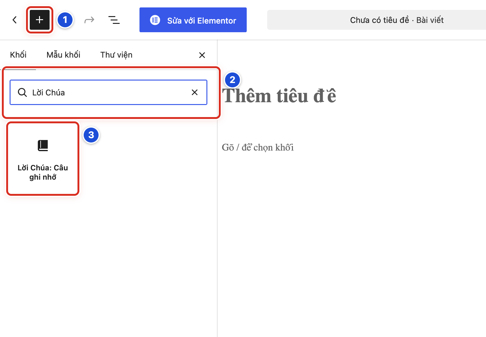
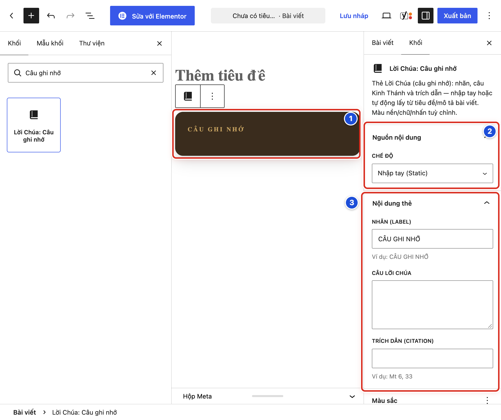
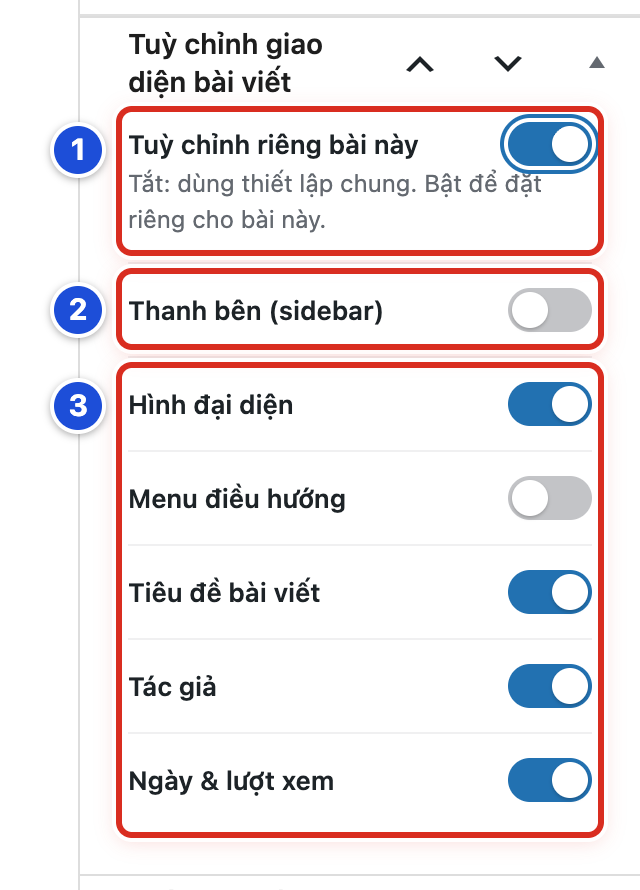
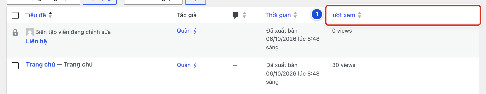

# Phần 8 Chức năng nội dung riêng của giao diện

## Chương 20 Khối Lời Chúa và bố cục riêng của bài viết

### Bài 20.01 Chèn khối Lời Chúa Câu ghi nhớ

**Nhãn:** Nên biết · 🟢 An toàn

#### Mục đích

Đặt một thẻ câu Lời Chúa nổi bật vào giữa nội dung bài viết hoặc trang, ở đúng chỗ bạn muốn. Thẻ này là một **khối** (một phần của nội dung trong trình soạn bài) tên **Lời Chúa: Câu ghi nhớ**.

#### Trước khi bắt đầu

- Đăng nhập bằng tài khoản Biên tập viên hoặc Quản lý.
- Mở bản nháp cần chèn (Bài 04.01).
- Bấm vào cuối đoạn văn nằm ngay trước chỗ muốn đặt thẻ.

#### Các bước thực hiện

1. **Bước 1:** Bấm nút **+** (*Mở thư viện khối*) ở góc trái trên (số 1).
2. **Bước 2:** Gõ *Lời Chúa* vào ô **Tìm kiếm** (số 2).
3. **Bước 3:** Bấm khối **Lời Chúa: Câu ghi nhớ** (số 3). Khối hiện trong bài. Cột phải chuyển sang tab **Khối**.
4. **Bước 4:** Chọn nội dung cho khối theo Bài 20.02.
5. **Bước 5:** Bấm **Lưu nháp**.
6. **Bước 6:** Bấm **Xem → Xem trước ở tab mới** để kiểm tra.

#### Ảnh minh họa

*Hình 20.01 Số 1: nút + mở thư viện khối; số 2: ô Tìm kiếm (đã gõ “Lời Chúa”); số 3: khối Lời Chúa: Câu ghi nhớ.*

#### Kết quả

Bạn sẽ thấy trong bài một thẻ màu nâu đậm có chữ “CÂU GHI NHỚ”. Cột phải có ba bảng: **Nguồn nội dung**, **Nội dung thẻ**, **Màu sắc**.

#### Lưu ý

- Cách nhanh: ở một dòng trống, gõ dấu `/` rồi gõ *Câu ghi nhớ*, bấm vào khối hiện ra.
- Khối này khác với thẻ tự hiện ở đầu bài loại **Lời Chúa (câu ghi nhớ)** (Bài 19.03). Nếu bài đã là loại Lời Chúa, đừng chèn thêm khối với cùng câu; câu sẽ hiện hai lần.
- Widget cùng tên đặt ở thanh bên là việc của Quản lý (Bài 18.06).

#### Không nên làm

- Không chèn nhiều khối giống nhau trong một bài chỉ để trang trí.
- Không bấm nút xanh **Sửa với Elementor** ở thanh trên.

#### Nếu gặp lỗi

- Tìm không ra khối → kiểm tra chữ đã gõ. Thử gõ *Câu ghi nhớ*.
- Khối chèn sai chỗ → bấm **Hoàn tác** (Bài 04.08), bấm vào đúng chỗ, rồi chèn lại.
- Cột phải không hiện các bảng của khối → bấm vào khối trong bài. Nếu cột phải đang đóng, bấm nút **Cài đặt** (Bài 04.09).
- Thẻ không hiện ngoài website → khối chưa có nội dung. Chọn nội dung theo Bài 20.02, rồi lưu.

### Bài 20.02 Chọn nội dung nhập tay hoặc lấy động

**Nhãn:** Nên biết · 🟢 An toàn

#### Mục đích

Chọn cách khối lấy câu Lời Chúa: bạn tự gõ (Nhập tay), hoặc khối tự lấy từ một bài Lời Chúa (Tự động). Ở chế độ Tự động, câu đổi theo bài nguồn mà bạn không phải sửa lại.

#### Trước khi bắt đầu

- Đã chèn khối **Lời Chúa: Câu ghi nhớ** (Bài 20.01).
- Nếu dùng Tự động, nên có bài nguồn loại **Lời Chúa (câu ghi nhớ)** đã điền câu (Bài 19.03).

#### Các bước thực hiện

1. **Bước 1:** Bấm vào khối trong bài để chọn nó (số 1).
2. **Bước 2:** Ở bảng **Nguồn nội dung** (số 2), ô **Chế độ**, chọn **Nhập tay (Static)** hoặc **Tự động từ bài viết (Dynamic)**.
3. **Bước 3:** Nếu chọn Nhập tay: ở bảng **Nội dung thẻ** (số 3), gõ **Câu Lời Chúa** và **Trích dẫn (CITATION)**. Có thể sửa **Nhãn (LABEL)**.
4. **Bước 4:** Nếu chọn Tự động: ở ô **Lấy từ** mới hiện trong bảng **Nguồn nội dung** (số 2), chọn nguồn. Rồi gõ số vào ô **ID chuyên mục (0 = mọi chuyên mục)** hoặc ô **ID bài viết** nếu ô đó hiện ra.
5. **Bước 5:** Nếu chọn Tự động: để trống **Câu Lời Chúa** và **Trích dẫn (CITATION)** ở bảng **Nội dung thẻ** (số 3).
6. **Bước 6:** Nếu muốn đổi màu, mở bảng **Màu sắc** và chọn màu.
7. **Bước 7:** Bấm **Lưu nháp** (bài chưa đăng) hoặc **Lưu thay đổi** (bài đã đăng).

#### Ảnh minh họa

*Hình 20.02 Số 1: khối trong bài; số 2: bảng Nguồn nội dung; số 3: bảng Nội dung thẻ.*

#### Kết quả

Bạn sẽ thấy câu Lời Chúa hiện ngay trong khối ở trình soạn bài, đúng với chế độ đã chọn.

#### Lưu ý

Ô **Lấy từ** có ba lựa chọn:

- **Mới nhất trong chuyên mục**: bài mới nhất đã xuất bản của chuyên mục có số ở ô **ID chuyên mục**. Để 0 là mọi chuyên mục. Khi có bài mới, câu tự đổi.
- **Bài đang xem**: chính bài đang chứa khối.
- **Bài viết cụ thể**: bài có số ở ô **ID bài viết**.

Cách tìm số ID:

- Chuyên mục: vào **Bài viết → Danh mục**, bấm tên danh mục. Trên thanh địa chỉ, số sau chữ `tag_ID=` là ID.
- Bài viết: vào **Bài viết → Tất cả bài viết**, bấm tên bài. Trên thanh địa chỉ, số sau chữ `post=` là ID.

Thêm vài điều cần nhớ:

- Ở chế độ Tự động, chữ bạn gõ trong **Nội dung thẻ** luôn được ưu tiên. Để trống thì khối lấy từ bài nguồn.
- Bài nguồn không có **Câu Lời Chúa** thì khối dùng mô tả ngắn và tên bài thay vào.
- Ba ô màu để trống là dùng màu mặc định của thẻ.

#### Không nên làm

- Không dùng chế độ Tự động cho câu cần giữ cố định. Khi có bài mới, câu sẽ đổi.
- Không gõ số ID đoán chừng. Tra đúng số theo cách ở trên.

#### Nếu gặp lỗi

- Khối chỉ có chữ “CÂU GHI NHỚ”, không có câu → ở Nhập tay bạn chưa gõ câu; ở Tự động thì số ID sai hoặc chuyên mục chưa có bài.
- Khối hiện mô tả ngắn và tên bài → bài nguồn chưa điền **Câu Lời Chúa** (Bài 19.04).
- Câu không đổi khi có bài mới → khối đang ở Nhập tay, hoặc ô **Câu Lời Chúa** trong khối còn chữ cũ. Xoá trống ô đó.
- Không thấy ô **Lấy từ** → **Chế độ** đang là **Nhập tay (Static)**.

### Bài 20.03 Khi nào cần bật tùy chỉnh giao diện bài viết

**Nhãn:** Kỹ thuật dành cho quản trị viên · 🟡 Cẩn thận

#### Mục đích

Biết khi nào nên cho một bài có bố cục riêng, khác bố cục chung của mọi bài. Ví dụ: bỏ thanh bên cho bài dài có bảng lớn, hoặc ẩn tên tác giả ở bài thông báo.

#### Trước khi bắt đầu

- Đăng nhập bằng tài khoản Quản lý.
- Biết bố cục chung của bài viết đang đặt thế nào (Bài 15.13).
- Mở bài cần chỉnh. Ở cột phải, tab **Bài viết**, kéo xuống hộp **Tuỳ chỉnh giao diện bài viết**.

#### Các bước thực hiện

1. **Bước 1:** Đọc công tắc **Tuỳ chỉnh riêng bài này** và dòng chữ nhỏ bên dưới (số 1). Đang tắt nghĩa là bài dùng bố cục chung.
2. **Bước 2:** Nếu bài cần khác bố cục chung, bật công tắc. Công tắc **Thanh bên (sidebar)** hiện ra (số 2).
3. **Bước 3:** Các công tắc hiển thị cũng hiện ra (số 3). Đặt từng công tắc theo Bài 20.04.
4. **Bước 4:** Bấm **Lưu thay đổi**.
5. **Bước 5:** Mở bài ngoài website, tải lại trang và kiểm tra.

#### Ảnh minh họa

*Hình 20.03 Số 1: công tắc Tuỳ chỉnh riêng bài này; số 2: Thanh bên (sidebar); số 3: các công tắc Hình đại diện, Menu điều hướng, Tiêu đề bài viết, Tác giả, Ngày & lượt xem.*

#### Kết quả

Bạn sẽ thấy công tắc **Tuỳ chỉnh riêng bài này** màu xanh và các công tắc bên dưới. Bài này dùng bố cục riêng; các bài khác không đổi.

#### Lưu ý

Nên bật khi:

- Bài dài, có bảng hay ảnh lớn, cần bỏ thanh bên cho rộng.
- Bài thông báo không cần tên tác giả, ngày và lượt xem.
- Ảnh đại diện trùng với ảnh đầu nội dung, cần ẩn bớt một ảnh.

Không nên bật khi bạn muốn đổi cho **mọi** bài. Hãy đổi bố cục chung (Bài 15.13).

**Cẩn thận:** lần đầu bật công tắc, **Thanh bên (sidebar)** và **Menu điều hướng** đang tắt. Nếu bố cục chung có thanh bên, bài sẽ mất thanh bên. Kiểm tra từng công tắc trước khi lưu.

#### Không nên làm

Không bật tuỳ chỉnh riêng cho hàng loạt bài. Sau này đổi bố cục chung, các bài đó sẽ không đổi theo.

#### Nếu gặp lỗi

- Không thấy hộp **Tuỳ chỉnh giao diện bài viết** → cột phải đang ở tab **Khối**. Bấm tab **Bài viết** và kéo xuống dưới cùng.
- Bật công tắc mà không thấy các công tắc khác → tải lại trang (F5) rồi bật lại.
- Bài mất thanh bên sau khi lưu → công tắc **Thanh bên (sidebar)** đang tắt. Bật lên (Bài 20.04), hoặc tắt hẳn tuỳ chỉnh riêng (Bài 20.05).

### Bài 20.04 Chọn thanh bên và các thành phần hiển thị

**Nhãn:** Kỹ thuật dành cho quản trị viên · 🟡 Cẩn thận

#### Mục đích

Chọn riêng cho một bài: có thanh bên hay không, và phần nào hiện ở đầu bài (ảnh, đường dẫn, tiêu đề, tác giả, ngày và lượt xem).

#### Trước khi bắt đầu

- Đăng nhập bằng tài khoản Quản lý.
- Đã bật **Tuỳ chỉnh riêng bài này** (Bài 20.03).
- Chụp màn hình bài ngoài website trước khi đổi.

#### Các bước thực hiện

1. **Bước 1:** Kiểm tra công tắc **Tuỳ chỉnh riêng bài này** đang bật (Hình 20.03, số 1).
2. **Bước 2:** Bật **Thanh bên (sidebar)** nếu muốn có cột nhỏ bên cạnh bài (số 2). Khi bật, chọn hình **Vị trí thanh bên**: bên trái hoặc bên phải.
3. **Bước 3:** Bật hoặc tắt **Hình đại diện**: ảnh lớn ở đầu bài (số 3).
4. **Bước 4:** Bật hoặc tắt **Menu điều hướng**: dòng đường dẫn kiểu “Trang chủ › Suy niệm › tên bài” phía trên tiêu đề.
5. **Bước 5:** Bật hoặc tắt **Tiêu đề bài viết**.
6. **Bước 6:** Bật hoặc tắt **Tác giả**.
7. **Bước 7:** Bật hoặc tắt **Ngày & lượt xem**.
8. **Bước 8:** Bấm **Lưu thay đổi**.
9. **Bước 9:** Mở bài ngoài website, tải lại trang và so với ảnh đã chụp.

#### Ảnh minh họa

Xem Hình 20.03: số 2 là **Thanh bên (sidebar)** (bước 2); khung số 3 là năm công tắc hiển thị (bước 3–7).

#### Kết quả

Bạn sẽ thấy bài ngoài website đúng như các công tắc đã chọn. Ví dụ tắt **Tác giả** thì dưới tiêu đề không còn tên tác giả.

#### Lưu ý

- Widget trong thanh bên của bài là các widget ở khu vực **Bài Viết Chi Tiết** (Bài 18.01).
- **Hình đại diện** chỉ ẩn ảnh. Thẻ câu ghi nhớ của bài Lời Chúa và trình phát của bài video vẫn hiện.
- **Ngày & lượt xem** tắt thì ẩn cả ngày đăng, số lượt xem và các nút chữ **A** đổi cỡ chữ.
- Dòng đường dẫn của **Menu điều hướng** do plugin Yoast SEO tạo. Bật mà không thấy thì báo người hỗ trợ kỹ thuật.

#### Không nên làm

- Không tắt **Tiêu đề bài viết** khi nội dung không có tiêu đề khác. Người đọc sẽ không biết bài nói về gì.
- Không bật **Thanh bên (sidebar)** khi khu vực **Bài Viết Chi Tiết** chưa có widget nào. Bài sẽ có một cột trống.

#### Nếu gặp lỗi

- Bật thanh bên mà cột bên cạnh trống → khu vực **Bài Viết Chi Tiết** chưa có widget. Thêm widget (Bài 18.03) hoặc tắt thanh bên.
- Tắt **Hình đại diện** mà đầu bài vẫn có thẻ màu → đó là thẻ câu ghi nhớ của bài Lời Chúa, không phải ảnh. Đúng như thiết kế.
- Đổi công tắc mà website không đổi → bạn chưa bấm **Lưu thay đổi**, hoặc **Tuỳ chỉnh riêng bài này** đang tắt.

### Bài 20.05 Trở về bố cục chung của bài viết

**Nhãn:** Kỹ thuật dành cho quản trị viên · 🟢 An toàn

#### Mục đích

Bỏ bố cục riêng của một bài. Bài lại hiện giống các bài khác, theo bố cục chung.

#### Trước khi bắt đầu

- Đăng nhập bằng tài khoản Quản lý.
- Mở bài cần trả về. Ở cột phải, tab **Bài viết**, kéo xuống hộp **Tuỳ chỉnh giao diện bài viết**.

#### Các bước thực hiện

1. **Bước 1:** Chụp màn hình các công tắc đang đặt, phòng khi cần bật lại.
2. **Bước 2:** Tắt công tắc **Tuỳ chỉnh riêng bài này** (Hình 20.03, số 1). Các công tắc bên dưới ẩn đi.
3. **Bước 3:** Bấm **Lưu thay đổi**.
4. **Bước 4:** Mở bài ngoài website, tải lại trang. So với một bài khác.

#### Ảnh minh họa

Xem Hình 20.03, số 1 (công tắc **Tuỳ chỉnh riêng bài này**). Khi tắt, công tắc màu xám và các công tắc số 2, số 3 ẩn đi.

#### Kết quả

Bạn sẽ thấy hộp chỉ còn công tắc **Tuỳ chỉnh riêng bài này** đang tắt, với dòng chữ “Tắt: dùng thiết lập chung”. Ngoài website, bài có thanh bên, ảnh, tiêu đề… giống các bài khác.

#### Lưu ý

- Bố cục chung của mọi bài chỉnh ở **Thiết lập giao diện → Trang chủ & Bài viết → Trang Chuyên mục & Bài viết** (Bài 15.13).
- Khi bật lại tuỳ chỉnh riêng sau này, kiểm tra từng công tắc trước khi lưu.

#### Không nên làm

Không tắt tuỳ chỉnh riêng của bài do người khác đặt mà chưa hỏi lý do.

#### Nếu gặp lỗi

- Bài chưa trở lại như các bài khác → bạn chưa bấm **Lưu thay đổi**, hoặc trình duyệt còn giữ trang cũ. Lưu, rồi tải lại (F5).
- Bài vẫn không có thanh bên dù đã tắt tuỳ chỉnh riêng → bố cục chung đang tắt thanh bên bài viết (Bài 15.13).
- Lỡ tắt nhầm → bật lại công tắc, đặt các công tắc theo ảnh đã chụp, rồi lưu.

### Bài 20.06 Hiểu và kiểm tra số lượt xem

**Nhãn:** Nên biết · 🟢 An toàn

#### Mục đích

Biết số lượt xem lấy từ đâu, xem nó ở chỗ nào, và hiểu đúng ý nghĩa của con số.

#### Trước khi bắt đầu

- Đăng nhập bằng tài khoản Biên tập viên hoặc Quản lý.
- Plugin **WP-PostViews** đang bật. Plugin này đếm lượt xem cho website.

#### Các bước thực hiện

1. **Bước 1:** Bấm **Trang → Tất cả các trang**. Nhìn cột **lượt xem** (số 1), ví dụ “22 views”.
2. **Bước 2:** Bấm **Bài viết → Tất cả bài viết**. Cột **lượt xem** cũng có ở đây.
3. **Bước 3:** Bấm vào tên cột **lượt xem** để xếp bài theo số lượt xem. Bấm lần nữa để đảo chiều.
4. **Bước 4:** Mở một bài ngoài website. Dưới tiêu đề, cạnh ngày đăng, có số lượt xem (biểu tượng con mắt).
5. **Bước 5:** So số ngoài website với số trong danh sách.

#### Ảnh minh họa

*Hình 20.06 Số 1: cột “lượt xem” trong danh sách trang.*

#### Kết quả

Bạn sẽ thấy số lượt xem của mỗi bài, mỗi trang trong cột **lượt xem**. Ngoài website, số này hiện ở đầu bài, trên thẻ bài ở trang chủ và trong widget *Bài xem nhiều*.

#### Lưu ý

- Mỗi lần trang bài được mở là một lượt. Một người tải lại trang nhiều lần cũng làm số tăng. Vì vậy lượt xem **không phải** số người đọc.
- Tuỳ thiết lập của plugin, lượt xem của người đang đăng nhập có thể không được đếm.
- Bài hẹn giờ chưa đăng luôn là “0 views”.
- Chữ “views” trong danh sách là tiếng Anh của plugin, nghĩa là lượt xem.
- Widget *Bài xem nhiều* và dải **Tin Hot** xếp bài theo con số này.

#### Không nên làm

- Không tắt plugin **WP-PostViews**. Số lượt xem trên website sẽ mất và *Bài xem nhiều* xếp sai.
- Không đổi thiết lập ở **Cài đặt → WP-PostViews** khi chưa hỏi người hỗ trợ kỹ thuật.
- Không dùng lượt xem làm thước đo duy nhất cho chất lượng một bài.

#### Nếu gặp lỗi

- Không thấy cột **lượt xem** → bấm **Tùy chọn màn hình** ở góc phải trên và tích ô **lượt xem**. Vẫn không có thì báo Quản lý kiểm tra plugin **WP-PostViews**.
- Mở bài nhiều lần mà số không tăng → có thể plugin không đếm người đăng nhập. Thử mở bài trong cửa sổ ẩn danh, chờ vài phút rồi xem lại.
- Số ngoài website khác số trong danh sách → trang ngoài website còn hiện bản cũ. Tải lại trang (F5).
- Thẻ bài ở trang chủ không có số lượt xem → khối trang chủ đó đang tắt **Lượt xem** (Bài 15.06).
