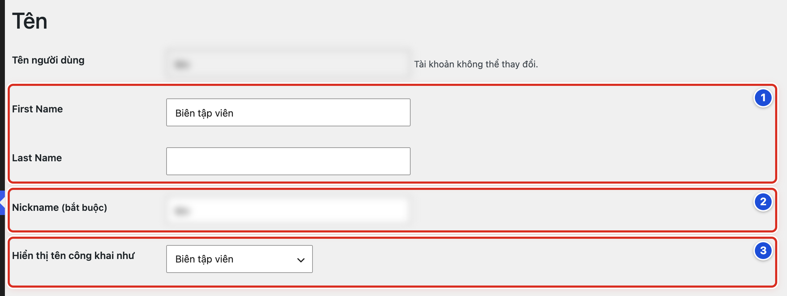
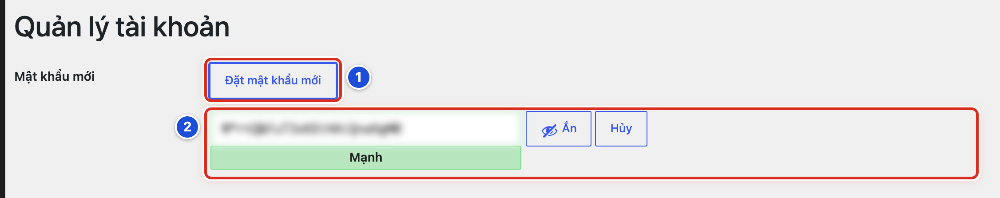
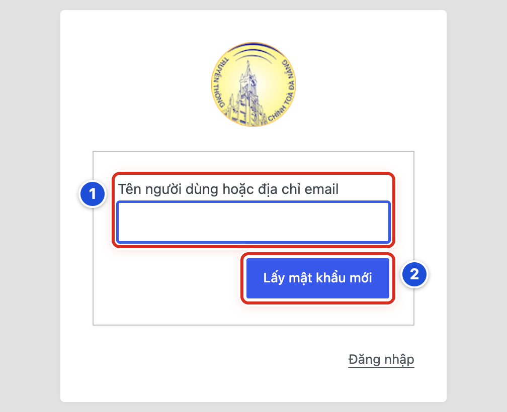
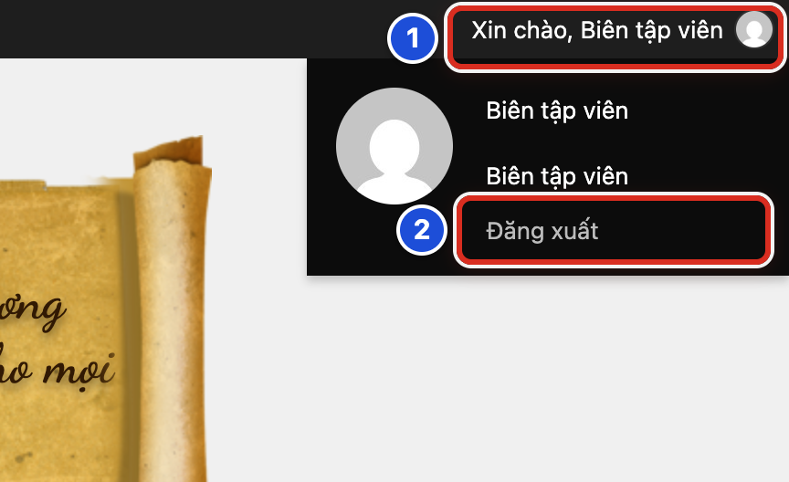

# Phần 9 Tài khoản và quyền sử dụng

## Chương 21 Tài khoản cá nhân

### Bài 21.01 Mở Hồ sơ cá nhân

**Nhãn:** Bắt buộc học · 🟢 An toàn

#### Mục đích

Hồ sơ là trang chứa thông tin tài khoản của bạn: tên, email và mật khẩu. Bạn mở Hồ sơ để xem hoặc sửa thông tin của chính mình.

#### Trước khi bắt đầu

Đăng nhập bằng tài khoản riêng của bạn (Bài 01.03). Mỗi người chỉ xem và sửa hồ sơ của mình.

#### Các bước thực hiện

1. **Bước 1:** Nhìn menu bên trái của trang quản trị.
2. **Bước 2:** Bấm **Hồ sơ**. Nếu bạn là Quản lý, bấm **Tài khoản → Hồ sơ**.
3. **Bước 3:** Tìm nhóm **Tên**. Dòng **Tên người dùng** là tên bạn gõ khi đăng nhập.
4. **Bước 4:** Xem các ô **First Name**, **Last Name**, **Nickname (bắt buộc)** và **Hiển thị tên công khai như**.
5. **Bước 5:** Kéo xuống để xem nhóm **Thông tin liên hệ** (có ô email).
6. **Bước 6:** Kéo tiếp xuống nhóm **Quản lý tài khoản** (nơi đổi mật khẩu).
7. **Bước 7:** Nếu chỉ xem, không bấm nút nào. Bạn có thể rời trang bình thường.

#### Ảnh minh họa

*Hình 21.01 Nhóm Tên trong Hồ sơ. Số 1: First Name và Last Name; số 2: Nickname (bắt buộc); số 3: Hiển thị tên công khai như.*

#### Kết quả

Bạn sẽ thấy trang **Hồ sơ** với tên người dùng của bạn. Cạnh ô tên người dùng có dòng chữ “Tài khoản không thể thay đổi.”

#### Lưu ý

- Tên người dùng (tên đăng nhập) không đổi được. Muốn đổi, phải nhờ Quản lý tạo tài khoản mới.
- Trang Hồ sơ có nhiều nhóm khác như màu trang quản trị, ngôn ngữ. Bạn không cần đổi các nhóm đó.
- Quản lý xem và sửa tài khoản của người khác ở Chương 22.

#### Không nên làm

- Không sửa hồ sơ khi đang đăng nhập bằng tài khoản của người khác.
- Không ghi số điện thoại, địa chỉ nhà vào ô giới thiệu bản thân. Thông tin đó có thể hiện ra ngoài website.

#### Nếu gặp lỗi

- Không thấy mục **Hồ sơ** ở menu trái → menu có thể đang thu gọn chỉ còn biểu tượng. Bấm **Thu gọn Menu** ở cuối menu để mở rộng lại.
- Trang Hồ sơ hiện tên của người khác → bạn đang đăng nhập nhầm tài khoản. Đăng xuất (Bài 21.05) rồi đăng nhập lại bằng tài khoản của mình.
- Bấm **Hồ sơ** nhưng trang báo không có quyền → chụp màn hình và báo Quản lý kiểm tra vai trò của bạn.

### Bài 21.02 Cập nhật tên hiển thị và thông tin cơ bản

**Nhãn:** Nên biết · 🟢 An toàn

#### Mục đích

Đặt tên hiển thị đúng và đẹp, ví dụ “Ban Biên tập” hay “Maria Thu Hà”. Tên này có thể hiện ở phần tác giả của bài viết, thay cho tên đăng nhập.

#### Trước khi bắt đầu

- Mở **Hồ sơ** (Bài 21.01) và tìm nhóm **Tên**.
- Hỏi Quản lý nhóm biên tập dùng quy ước tên nào. Ví dụ: tên thánh và tên gọi, hoặc tên chung của ban.

#### Các bước thực hiện

1. **Bước 1:** Gõ tên của bạn vào ô **First Name** và họ vào ô **Last Name** (số 1). Có thể để trống ô **Last Name**.
2. **Bước 2:** Gõ tên gọi ngắn vào ô **Nickname (bắt buộc)** (số 2). Ô này không được để trống.
3. **Bước 3:** Bấm ô **Hiển thị tên công khai như** (số 3) và chọn cách hiển thị bạn muốn.
4. **Bước 4:** Kéo xuống cuối trang và bấm **Cập nhật hồ sơ**.
5. **Bước 5:** Xem dòng thông báo ở đầu trang.

#### Ảnh minh họa

Xem Hình 21.01. Số 1 là hai ô **First Name** và **Last Name**; số 2 là ô **Nickname (bắt buộc)**; số 3 là ô **Hiển thị tên công khai như**.

#### Kết quả

Bạn sẽ thấy thông báo “Đã cập nhật hồ sơ.” Ô **Hiển thị tên công khai như** giữ đúng tên bạn vừa chọn.

#### Lưu ý

- Ô **Hiển thị tên công khai như** chỉ cho chọn trong các tên bạn đã gõ ở trên. Gõ tên trước, rồi mới chọn.
- Trang chủ của website mẫu không hiện tên tác giả trên thẻ bài. Tên có thể hiện trong trang bài viết khi phần **Tác giả** được bật (Bài 20.04).
- Đổi email ở nhóm **Thông tin liên hệ**: WordPress gửi thư xác nhận đến email mới. Email chỉ đổi sau khi bạn bấm liên kết trong thư đó.

#### Không nên làm

- Không chọn tên đăng nhập làm tên hiển thị công khai. Người lạ biết tên đăng nhập sẽ dễ dò mật khẩu hơn.
- Không dùng địa chỉ email làm tên hiển thị.

#### Nếu gặp lỗi

- Bấm **Cập nhật hồ sơ** thì báo “Lỗi: Vui lòng nhập biệt hiệu.” → ô **Nickname (bắt buộc)** đang trống. Gõ một tên rồi bấm lại.
- Tên mới gõ không có trong ô **Hiển thị tên công khai như** → bấm **Cập nhật hồ sơ** một lần, rồi mở lại ô này để chọn.
- Đổi email nhưng email cũ vẫn còn → mở hộp thư mới (xem cả thư rác) và bấm liên kết xác nhận.

### Bài 21.03 Đổi mật khẩu an toàn

**Nhãn:** Bắt buộc học · 🟡 Cẩn thận

#### Mục đích

Đổi sang mật khẩu mới, dài và khó đoán. Nên làm khi mới nhận tài khoản, hoặc khi nghi người khác biết mật khẩu của bạn.

#### Trước khi bắt đầu

- Mở **Hồ sơ** (Bài 21.01).
- Kéo xuống nhóm **Quản lý tài khoản**.
- Chuẩn bị nơi cất mật khẩu an toàn: trình quản lý mật khẩu, hoặc sổ riêng cất kỹ.

#### Các bước thực hiện

1. **Bước 1:** Bấm nút **Đặt mật khẩu mới** (số 1).
2. **Bước 2:** Xem ô mật khẩu mới hiện ra (số 2). WordPress đã tự tạo sẵn một mật khẩu mạnh. Bạn có thể giữ mật khẩu này hoặc xoá đi và gõ mật khẩu của mình.
3. **Bước 3:** Nhìn thanh màu dưới ô. Chỉ dùng mật khẩu khi thanh hiện chữ **Mạnh**.
4. **Bước 4:** Chép mật khẩu vào nơi cất an toàn đã chuẩn bị.
5. **Bước 5:** Kéo xuống cuối trang và bấm **Cập nhật hồ sơ**.
6. **Bước 6:** Đăng xuất (Bài 21.05), rồi đăng nhập lại bằng mật khẩu mới để thử.

#### Ảnh minh họa

*Hình 21.03 Đổi mật khẩu. Số 1: nút Đặt mật khẩu mới; số 2: ô mật khẩu mới với nút Ẩn, nút Hủy và thanh độ mạnh.*

#### Kết quả

Bạn sẽ thấy thông báo “Đã cập nhật hồ sơ.” Lần đăng nhập sau, bạn dùng mật khẩu mới.

#### Lưu ý

- Mật khẩu tốt dài ít nhất 12 ký tự, có chữ hoa, chữ thường, số và ký hiệu.
- Nút **Ẩn** che mật khẩu khi có người đứng cạnh. Nút **Hủy** bỏ việc đổi mật khẩu.
- Tắt bộ gõ tiếng Việt (Unikey, EVKey…) khi gõ mật khẩu. Bộ gõ có thể đổi chữ “aa” thành “â” mà bạn không để ý.

#### Không nên làm

- Không dùng lại mật khẩu email, Facebook hay ngân hàng.
- Không tích ô **Chấp nhận sử dụng mật khẩu yếu.** nếu ô này hiện ra. Hãy chọn mật khẩu mạnh hơn.
- Không gửi mật khẩu mới cho ai qua Zalo, Messenger hay email.

#### Nếu gặp lỗi

- Bấm **Cập nhật hồ sơ** mà nút bị mờ, không bấm được → mật khẩu đang yếu. Gõ mật khẩu dài hơn cho tới khi thanh hiện **Mạnh**.
- Đăng nhập lại bằng mật khẩu mới bị báo sai → kiểm tra phím Caps Lock và bộ gõ tiếng Việt. Vẫn sai thì làm theo Bài 21.04.
- Lỡ bấm **Hủy** → bấm lại **Đặt mật khẩu mới** và làm lại từ Bước 2.

### Bài 21.04 Xử lý khi quên mật khẩu

**Nhãn:** Bắt buộc học · 🟢 An toàn

#### Mục đích

Tự lấy lại quyền đăng nhập khi quên mật khẩu. WordPress gửi một thư có liên kết để bạn đặt mật khẩu mới.

#### Trước khi bắt đầu

- Bạn cần mở được hộp thư email đã đăng ký cho tài khoản.
- Mở màn hình đăng nhập (Bài 01.02).
- Bấm liên kết **Bạn quên mật khẩu?** dưới nút **Đăng nhập** (Hình 01.02, số 5).

#### Các bước thực hiện

1. **Bước 1:** Gõ tên đăng nhập hoặc email của bạn vào ô **Tên người dùng hoặc địa chỉ email** (số 1).
2. **Bước 2:** Bấm **Lấy mật khẩu mới** (số 2).
3. **Bước 3:** Mở hộp thư email. Tìm thư mới gửi từ website. Xem cả mục thư rác (Spam).
4. **Bước 4:** Bấm liên kết đặt lại mật khẩu trong thư.
5. **Bước 5:** Ở trang mở ra, xem ô **Mật khẩu mới**. Giữ mật khẩu có sẵn hoặc gõ mật khẩu mạnh của bạn.
6. **Bước 6:** Chép mật khẩu vào nơi cất an toàn.
7. **Bước 7:** Bấm **Lưu mật khẩu**.
8. **Bước 8:** Bấm liên kết **Đăng nhập** và đăng nhập bằng mật khẩu mới.

#### Ảnh minh họa

*Hình 21.04 Màn hình lấy mật khẩu mới. Số 1: ô Tên người dùng hoặc địa chỉ email; số 2: nút Lấy mật khẩu mới.*

#### Kết quả

Bạn sẽ thấy dòng “Mật khẩu của bạn đã được đặt lại.” Sau đó bạn đăng nhập được bằng mật khẩu mới.

#### Lưu ý

- Liên kết trong thư chỉ dùng được một thời gian ngắn. Nếu bấm **Lấy mật khẩu mới** nhiều lần, chỉ dùng thư mới nhất.
- Thư có thể đến chậm vài phút. Chờ một chút trước khi bấm lại.

#### Không nên làm

- Không chuyển tiếp thư đặt lại mật khẩu cho người khác. Ai có liên kết đó đều đổi được mật khẩu của bạn.
- Không nhờ người khác cho mượn tài khoản để làm tạm.

#### Nếu gặp lỗi

- Trang báo “Địa chỉ email không xác định” → bạn gõ sai email, hoặc tài khoản dùng email khác. Thử gõ tên đăng nhập thay cho email.
- Chờ 15 phút vẫn không có thư (đã xem cả thư rác) → báo Quản lý. Quản lý có thể đặt mật khẩu mới cho bạn.
- Bấm liên kết trong thư thì báo liên kết không còn hiệu lực → làm lại từ Bước 1 để nhận thư mới.

### Bài 21.05 Đăng xuất khỏi máy dùng chung

**Nhãn:** Bắt buộc học · 🟢 An toàn

#### Mục đích

Thoát hẳn khỏi trang quản trị khi dùng máy ở văn phòng giáo xứ hay máy của người khác. Người dùng sau không thể vào trang quản trị bằng tài khoản của bạn.

#### Trước khi bắt đầu

Lưu xong bài đang viết (**Lưu nháp** hoặc **Lưu thay đổi**). Đóng các tab chứa thông tin riêng.

#### Các bước thực hiện

1. **Bước 1:** Rê chuột vào dòng “Xin chào, <tên của bạn>” ở góc phải thanh đen trên cùng (số 1).
2. **Bước 2:** Bấm **Đăng xuất** trong khung hiện ra (số 2).
3. **Bước 3:** Chờ màn hình đăng nhập hiện ra.
4. **Bước 4:** Đóng cửa sổ trình duyệt.

#### Ảnh minh họa

*Hình 21.05 Đăng xuất. Số 1: dòng Xin chào ở góc phải; số 2: Đăng xuất.*

#### Kết quả

Bạn sẽ thấy màn hình đăng nhập với dòng “Bạn đã đăng xuất thành công.”

#### Lưu ý

- Trên máy dùng chung, không tích **Ghi nhớ đăng nhập** khi đăng nhập.
- Khi trình duyệt hỏi có lưu mật khẩu không, chọn không lưu.
- Lỡ quên đăng xuất ở máy khác: mở **Hồ sơ** trên máy của bạn, kéo xuống cuối trang. Nếu có nút **Đăng xuất khỏi những nơi khác**, bấm nút đó.

#### Không nên làm

- Không chỉ đóng tab rồi bỏ đi. Đóng tab chưa phải là đăng xuất.
- Không lưu mật khẩu trong trình duyệt của máy dùng chung.

#### Nếu gặp lỗi

- Rê chuột vào “Xin chào…” mà không thấy **Đăng xuất** → bạn đang ở ngoài website và thanh đen bị ẩn. Mở trang quản trị rồi làm lại từ Bước 1.
- Đã đăng xuất nhưng mở lại trình duyệt vẫn vào thẳng trang quản trị → có thể trình duyệt đã lưu mật khẩu. Báo Quản lý và đổi mật khẩu theo Bài 21.03.
- Nghi người khác đã dùng tài khoản của bạn → đổi mật khẩu ngay (Bài 21.03) và báo Quản lý.
