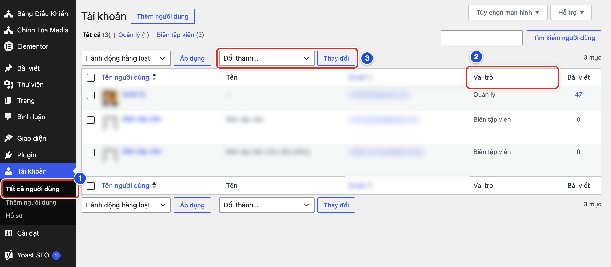
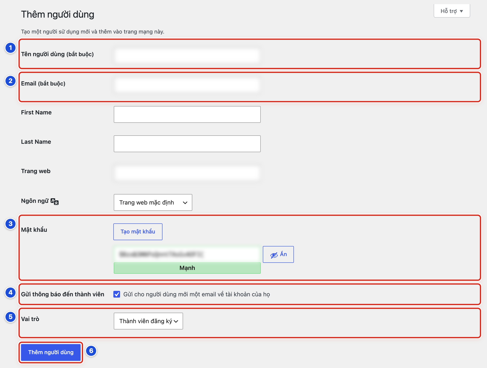

# Phần 9 Tài khoản và quyền sử dụng

## Chương 22 Quản lý người dùng

### Bài 22.01 Hiểu quyền Biên tập viên và Quản lý

**Nhãn:** Kỹ thuật dành cho quản trị viên · 🟡 Cẩn thận

#### Mục đích

Mỗi tài khoản có một vai trò. Vai trò quyết định người đó được làm gì trong trang quản trị. Bài này giúp Quản lý xem ai đang có vai trò gì và chọn vai trò vừa đủ cho từng người.

#### Trước khi bắt đầu

Đăng nhập bằng tài khoản **Quản lý**. Biên tập viên không thấy menu **Tài khoản**, chỉ thấy **Hồ sơ** của mình.

#### Các bước thực hiện

1. **Bước 1:** Bấm **Tài khoản → Tất cả người dùng** ở menu trái (số 1).
2. **Bước 2:** Nhìn cột **Vai trò** (số 2) để biết vai trò của từng người.
3. **Bước 3:** Đọc dòng lọc phía trên bảng, ví dụ “Tất cả (3) | Quản lý (1) | Biên tập viên (2)”, để đếm số người mỗi vai trò.
4. **Bước 4:** Đối chiếu với bảng vai trò bên dưới. Ghi lại người nào đang có vai trò cao hơn công việc cần.

| Vai trò | Được làm | Nên dùng cho |
|---|---|---|
| Quản lý (Quản trị viên) | Mọi việc, kể cả giao diện, menu, widget, người dùng, plugin | Người chịu trách nhiệm website |
| Biên tập viên | Viết, sửa, đăng mọi bài; tải ảnh; danh mục; trang | Người làm nội dung hằng ngày |
| Tác giả | Viết và đăng bài của mình | Người viết bài thường xuyên |
| Cộng tác viên | Viết bài của mình, chờ người khác duyệt | Người gửi bài thỉnh thoảng |
| Thành viên đăng ký | Chỉ đăng nhập và sửa hồ sơ | Hầu như không cần trên website này |

#### Ảnh minh họa

*Hình 22.01 Danh sách tài khoản, tên và email đã làm mờ. Số 1: Tất cả người dùng; số 2: cột Vai trò; số 3: ô Đổi thành… và nút Thay đổi (dùng ở Bài 22.03).*

#### Kết quả

Bạn sẽ thấy rõ ai là Quản lý, ai là Biên tập viên. Bạn biết tài khoản nào cần giữ nguyên, tài khoản nào cần hạ vai trò.

#### Lưu ý

- Website nên có ít nhất **hai Quản lý** để thay nhau khi một người vắng mặt hoặc quên mật khẩu.
- Người làm nội dung hằng ngày chỉ cần vai trò **Biên tập viên**. Vai trò này đã đủ để viết, đăng bài và sửa trang.
- Biên tập viên không thấy **Thiết lập giao diện**, **Giao diện**, **Plugin**. Đây là cài đặt cố ý để tránh lỡ tay làm hỏng website.

#### Không nên làm

- Không cấp vai trò Quản lý chỉ để một người “thấy thêm nút”.
- Không bấm **Đổi thành…** (số 3) khi chỉ đang xem danh sách.

#### Nếu gặp lỗi

- Không thấy menu **Tài khoản** → bạn đang đăng nhập bằng tài khoản Biên tập viên. Nhờ người có tài khoản Quản lý làm việc này.
- Thấy một tài khoản lạ mà không ai nhận → không xoá ngay. Chụp màn hình và báo người phụ trách kỹ thuật (Bài 24.07).
- Cột **Vai trò** của một người để trống → người đó không còn vai trò nào. Báo người phụ trách kỹ thuật trước khi sửa.

### Bài 22.02 Tạo tài khoản Biên tập viên

**Nhãn:** Kỹ thuật dành cho quản trị viên · 🟡 Cẩn thận

#### Mục đích

Tạo tài khoản riêng cho một người mới tham gia ban biên tập. Mỗi người một tài khoản giúp biết ai đã làm gì.

#### Trước khi bắt đầu

- Đăng nhập bằng tài khoản **Quản lý**.
- Có email riêng của người mới, và người đó mở được hộp thư này.
- Bấm **Tài khoản → Thêm người dùng** để mở trang **Thêm người dùng**.

#### Các bước thực hiện

1. **Bước 1:** Gõ tên đăng nhập vào ô **Tên người dùng (bắt buộc)** (số 1). Viết liền, không dấu, ví dụ `mariathuha`.
2. **Bước 2:** Gõ email của người mới vào ô **Email (bắt buộc)** (số 2).
3. **Bước 3:** Ở ô **Mật khẩu** (số 3), giữ mật khẩu WordPress tự tạo. Thanh dưới ô phải hiện **Mạnh**.
4. **Bước 4:** Ở dòng **Gửi thông báo đến thành viên** (số 4), giữ dấu tích ở ô “Gửi cho người dùng mới một email về tài khoản của họ”.
5. **Bước 5:** Ở ô **Vai trò** (số 5), đổi từ **Thành viên đăng ký** sang **Biên tập viên**.
6. **Bước 6:** Bấm nút **Thêm người dùng** (số 6).
7. **Bước 7:** Báo người mới mở email, bấm liên kết trong thư để tự đặt mật khẩu.

#### Ảnh minh họa

*Hình 22.02 Trang Thêm người dùng. Số 1: Tên người dùng; số 2: Email; số 3: Mật khẩu; số 4: Gửi thông báo đến thành viên; số 5: Vai trò; số 6: nút Thêm người dùng.*

#### Kết quả

Bạn sẽ thấy thông báo “Thành viên mới đã được tạo.” Danh sách người dùng có thêm một dòng, cột **Vai trò** ghi **Biên tập viên**.

#### Lưu ý

- Ô **Vai trò** mặc định là **Thành viên đăng ký**. Nếu quên đổi ở Bước 5, người mới không viết bài được. Sửa lại theo Bài 22.03.
- Các ô **First Name**, **Last Name** có thể để trống. Người mới tự điền trong **Hồ sơ** (Bài 21.02).
- Người mới không nhận được thư thì dùng **Bạn quên mật khẩu?** ở màn hình đăng nhập (Bài 21.04).

#### Không nên làm

- Không đặt tên đăng nhập dễ đoán, như tên website hay chữ “quantri”.
- Không tự đặt mật khẩu rồi gửi cho người mới qua Zalo hay Messenger. Để người mới tự đặt qua email.
- Không dùng chung một email cho nhiều tài khoản.

#### Nếu gặp lỗi

- Báo tên người dùng đã có → tên này đã được dùng. Kiểm tra danh sách xem người đó đã có tài khoản chưa, rồi chọn tên khác.
- Báo email đã được dùng → người này đã có tài khoản. Tìm tài khoản cũ trong danh sách thay vì tạo thêm.
- Nút **Thêm người dùng** không bấm được → mật khẩu đang yếu. Bấm **Tạo mật khẩu** để WordPress tạo mật khẩu mạnh.

### Bài 22.03 Đổi vai trò người dùng

**Nhãn:** Kỹ thuật dành cho quản trị viên · 🔴 Không tự thay đổi

#### Mục đích

Đổi vai trò khi công việc của một người thay đổi. Ví dụ: một Biên tập viên thôi làm, cần hạ xuống **Thành viên đăng ký**.

#### Trước khi bắt đầu

- Đăng nhập bằng tài khoản **Quản lý**.
- Có sự đồng ý của người chịu trách nhiệm website. Việc này ảnh hưởng quyền của người khác.
- Biết chắc tên và email của người cần đổi.

#### Các bước thực hiện

1. **Bước 1:** Bấm **Tài khoản → Tất cả người dùng**.
2. **Bước 2:** Tìm đúng người cần đổi. Đối chiếu cả tên người dùng và email.
3. **Bước 3:** Tích vào ô vuông ở đầu dòng của người đó.
4. **Bước 4:** Bấm ô **Đổi thành…** phía trên bảng và chọn vai trò mới.
5. **Bước 5:** Bấm nút **Thay đổi** ngay bên cạnh.
6. **Bước 6:** Xem lại cột **Vai trò** của người đó.

#### Ảnh minh họa

Xem Hình 22.01, số 3 (ô **Đổi thành…** và nút **Thay đổi**). Số 2 là cột **Vai trò** để kiểm tra kết quả.

#### Kết quả

Bạn sẽ thấy thông báo “Đã thay đổi vai trò.” Cột **Vai trò** của người đó ghi vai trò mới.

#### Lưu ý

- Mỗi lần chỉ tích một người để tránh đổi nhầm.
- Người được đổi vai trò cần đăng xuất rồi đăng nhập lại để thấy menu mới.
- Khi một người thôi làm, hạ xuống **Thành viên đăng ký** an toàn hơn xoá tài khoản. Bài viết của họ vẫn giữ nguyên.

#### Không nên làm

- Không hạ vai trò của Quản lý cuối cùng. Website sẽ không còn ai vào được phần thiết lập.
- Không tự đổi vai trò của chính mình.
- Không nâng ai lên Quản lý “tạm thời” rồi quên hạ xuống.

#### Nếu gặp lỗi

- Lỡ đổi nhầm người → làm lại các bước, chọn đúng vai trò cũ cho người đó. Báo người chịu trách nhiệm website.
- Bấm **Thay đổi** mà không có gì xảy ra → bạn chưa tích ô vuông ở đầu dòng, hoặc chưa chọn vai trò ở ô **Đổi thành…**.
- Người được đổi vẫn thấy menu cũ → nhờ họ đăng xuất rồi đăng nhập lại.

### Bài 22.04 Xóa tài khoản và xử lý nội dung của tài khoản

**Nhãn:** Kỹ thuật dành cho quản trị viên · 🔴 Không tự thay đổi

#### Mục đích

Xoá tài khoản của người không còn tham gia, mà **không làm mất bài** người đó đã viết. WordPress cho chuyển toàn bộ bài sang một tài khoản khác.

#### Trước khi bắt đầu

- Đăng nhập bằng tài khoản **Quản lý**.
- Có sự đồng ý của người chịu trách nhiệm website.
- Biết sẽ chuyển bài của người đó cho ai, ví dụ tài khoản của trưởng ban biên tập.
- Cân nhắc cách nhẹ hơn: hạ vai trò xuống **Thành viên đăng ký** (Bài 22.03).

#### Các bước thực hiện

1. **Bước 1:** Bấm **Tài khoản → Tất cả người dùng**.
2. **Bước 2:** Tìm đúng người cần xoá. Xem cột **Bài viết** để biết người đó có bao nhiêu bài.
3. **Bước 3:** Rê chuột vào tên người dùng.
4. **Bước 4:** Bấm **Xóa** trong dòng chữ nhỏ hiện ra.
5. **Bước 5:** Ở trang **Xoá thành viên**, đọc lại tên tài khoản sắp xoá.
6. **Bước 6:** WordPress hỏi phải làm gì với nội dung của tài khoản (câu hỏi có thể hiện tiếng Anh). Chọn ô **Attribute all content to another user.** (chuyển toàn bộ nội dung cho người khác).
7. **Bước 7:** Bấm ô **Chọn 1 thành viên** và chọn người nhận bài.
8. **Bước 8:** Bấm **Xác Nhận Xóa**.
9. **Bước 9:** Mở **Bài viết → Tất cả bài viết** để kiểm tra các bài vẫn còn, cột **Tác giả** ghi tên người nhận.

#### Ảnh minh họa

Xem Hình 22.01. Rê chuột vào tên người dùng trong bảng sẽ thấy liên kết **Xóa**. Cột **Bài viết** ở cuối bảng cho biết người đó có bao nhiêu bài.

#### Kết quả

Bạn sẽ thấy thông báo đã xoá người dùng. Tài khoản biến mất khỏi danh sách. Bài viết của người đó vẫn còn, mang tên người nhận.

#### Lưu ý

- Luôn chọn **chuyển nội dung cho người khác**. Đây là lựa chọn an toàn.
- Tài khoản đã xoá không lấy lại được. Muốn người đó quay lại, phải tạo tài khoản mới.
- Nếu tài khoản không có bài nào, WordPress không hỏi câu ở Bước 6.

#### Không nên làm

- Không chọn ô **Xóa tất cả nội dung.** Toàn bộ bài, trang và ảnh của người đó sẽ bị xoá theo.
- Không xoá tài khoản Quản lý duy nhất của website.
- Không xoá tài khoản lạ khi chưa báo người phụ trách kỹ thuật. Đó có thể là dấu hiệu website bị xâm nhập (Bài 24.07).

#### Nếu gặp lỗi

- Nút **Xác Nhận Xóa** không bấm được → bạn chưa chọn một trong hai ô, hoặc chưa chọn người nhận ở ô **Chọn 1 thành viên**.
- Ô **Chọn 1 thành viên** không có người cần chọn → người nhận chưa có tài khoản. Tạo tài khoản cho họ trước (Bài 22.02).
- Sau khi xoá thấy thiếu bài → dừng mọi thao tác. Xem **Thùng rác** của Bài viết và Trang (Bài 23.08), rồi báo người phụ trách kỹ thuật ngay.

### Bài 22.05 Không chia sẻ tài khoản Quản lý

**Nhãn:** Bắt buộc học · 🔴 Không tự thay đổi

#### Mục đích

Tài khoản Quản lý làm được mọi việc, kể cả xoá website. Giữ tài khoản này cho riêng một người giúp website an toàn và biết rõ ai đã thay đổi gì.

#### Trước khi bắt đầu

Mỗi người cần vào trang quản trị đều phải có tài khoản riêng (Bài 22.02).

#### Các bước thực hiện

1. **Bước 1:** Giữ mật khẩu Quản lý cho riêng mình. Không đọc qua điện thoại, không gửi qua Zalo, Messenger hay email.
2. **Bước 2:** Khi có người mới cần làm nội dung, tạo cho họ tài khoản **Biên tập viên** riêng.
3. **Bước 3:** Khi người hỗ trợ kỹ thuật cần vào website, tạo tài khoản riêng cho họ.
4. **Bước 4:** Khi người hỗ trợ làm xong, hạ vai trò hoặc xoá tài khoản đó (Bài 22.03, Bài 22.04).
5. **Bước 5:** Nếu đã lỡ đưa mật khẩu cho người khác, đổi mật khẩu ngay (Bài 21.03).
6. **Bước 6:** Sau khi đổi mật khẩu, mở **Hồ sơ**. Nếu có nút **Đăng xuất khỏi những nơi khác**, bấm nút đó.
7. **Bước 7:** Mở **Tài khoản → Tất cả người dùng** và kiểm tra không có tài khoản lạ.

#### Ảnh minh họa

Bài này không cần ảnh minh họa.

#### Kết quả

Bạn sẽ thấy mỗi người trong danh sách có tài khoản riêng. Chỉ những người chịu trách nhiệm website có vai trò Quản lý.

#### Lưu ý

- Nên có hai Quản lý, mỗi người một tài khoản. Không dùng chung một tài khoản cho hai người.
- Mật khẩu Quản lý nên dài và chỉ dùng cho website này.

#### Không nên làm

- Không dùng một tài khoản chung cho cả ban.
- Không chụp màn hình có mật khẩu gửi vào nhóm chat.
- Không đăng nhập tài khoản Quản lý trên máy dùng chung rồi để đó.

#### Nếu gặp lỗi

- Nghi có người lạ biết mật khẩu Quản lý → đổi mật khẩu ngay, bấm **Đăng xuất khỏi những nơi khác** và báo người phụ trách kỹ thuật.
- Thấy tài khoản lạ có vai trò Quản lý → không tự xoá. Chụp màn hình và báo người phụ trách kỹ thuật ngay (Bài 24.07).
- Không còn ai nhớ mật khẩu Quản lý → dùng **Bạn quên mật khẩu?** (Bài 21.04). Không nhận được thư thì nhờ người phụ trách kỹ thuật.
