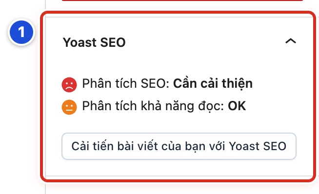

# Phần phụ lục

## Phụ lục B Yoast SEO tùy chọn

Yoast SEO là một plugin (phần mềm gắn thêm) giúp bài viết hiện đẹp hơn trên Google. Plugin này đang bật trên website mẫu. Dùng Yoast là **tùy chọn**: bài vẫn đăng bình thường nếu bạn bỏ qua phần này.

### Bài B.01 Khi nào cần dùng Yoast SEO

**Nhãn:** Nên biết · 🟢 An toàn

#### Mục đích

Biết bảng Yoast SEO nằm ở đâu và khi nào nên dùng. Yoast gợi ý cách viết để bài dễ tìm trên Google, nhưng không thay cho việc biên tập nội dung.

#### Trước khi bắt đầu

Mở một bài viết trong trình soạn bài. Mở cột phải bằng nút **Cài đặt** nếu cột đang đóng (Bài 04.09).

#### Các bước thực hiện

1. **Bước 1:** Ở tab **Bài viết** của cột phải, kéo xuống tìm bảng **Yoast SEO** (số 1).
2. **Bước 2:** Đọc hai dòng đánh giá: **Phân tích SEO** và **Phân tích khả năng đọc**.
3. **Bước 3:** Nếu muốn xem chi tiết, bấm nút **Cải tiến bài viết của bạn với Yoast SEO**. Cột phải chuyển sang bảng riêng của Yoast.
4. **Bước 4:** Chỉ dùng Yoast cho bài quan trọng, cần nhiều người tìm thấy trên Google. Ví dụ: thông báo lớn, bài giáo lý dài.

#### Ảnh minh họa

*Hình B.01 Bảng Yoast SEO ở cột phải (số 1): Phân tích SEO, Phân tích khả năng đọc và nút Cải tiến bài viết của bạn với Yoast SEO.*

#### Kết quả

Bạn sẽ thấy bảng **Yoast SEO** với hai dòng đánh giá có mặt cười hoặc mặt buồn có màu.

#### Lưu ý

- Bài Lời Chúa hằng ngày không cần chỉnh Yoast. Viết đúng tiêu đề và mô tả ngắn là đủ.
- Trên thanh trên cùng của trình soạn bài cũng có biểu tượng chữ **y** của Yoast. Bấm vào đó cũng mở bảng Yoast.

#### Không nên làm

- Không sửa bài chỉ để đổi mặt buồn thành mặt cười.
- Không vào menu **Yoast SEO** ở menu trái để đổi thiết lập chung (Bài B.04).

#### Nếu gặp lỗi

- Không thấy bảng **Yoast SEO** → kéo cột phải xuống cuối. Bảng có thể đang thu gọn; bấm vào tên bảng để mở.
- Vẫn không có bảng Yoast ở mọi bài → plugin có thể đã bị tắt. Báo Quản lý, không tự bật.

### Bài B.02 Nhập cụm từ khóa chính và mô tả

**Nhãn:** Nên biết · 🟡 Cẩn thận

#### Mục đích

Nhập cụm từ chính mà người đọc hay gõ trên Google, và đoạn mô tả ngắn hiện dưới tên bài trong kết quả tìm kiếm.

#### Trước khi bắt đầu

- Mở bài trong trình soạn bài và bấm **Cải tiến bài viết của bạn với Yoast SEO** (Bài B.01).
- Nghĩ trước một cụm từ ngắn, đúng ý bài. Ví dụ: “ý nghĩa Mùa Vọng”.

#### Các bước thực hiện

1. **Bước 1:** Gõ cụm từ vào ô **Cụm từ khóa chính**.
2. **Bước 2:** Bấm mục **Giao diện tìm kiếm** để mở phần xem trước trên Google.
3. **Bước 3:** Chọn xem thử **Kết quả trên di động** hoặc **Kết quả trên máy tính**.
4. **Bước 4:** Gõ hai câu tóm ý bài vào ô **Thẻ mô tả**. Câu tự nhiên, có cụm từ chính.
5. **Bước 5:** Xem thanh màu dưới ô mô tả. Thanh xanh là độ dài vừa đủ.
6. **Bước 6:** Đóng phần xem trước và bấm **Lưu nháp** hoặc **Lưu thay đổi**.

#### Ảnh minh họa

Xem Hình B.01, số 1. Nút **Cải tiến bài viết của bạn với Yoast SEO** ở cuối bảng mở ra các ô dùng trong bài này.

#### Kết quả

Bạn sẽ thấy phần xem trước trên Google hiện đúng tên bài và đoạn mô tả bạn vừa gõ.

#### Lưu ý

- Trong **Giao diện tìm kiếm** còn có ô **Tiêu đề SEO** và **Đường dẫn**. Thường để nguyên.
- Google có thể tự chọn đoạn mô tả khác. Đó là bình thường.
- Mỗi bài một cụm từ chính khác nhau. Hai bài trùng cụm từ sẽ “tranh nhau” trên Google.

#### Không nên làm

- Không sửa ô **Đường dẫn** của bài đã đăng. Địa chỉ bài sẽ đổi, liên kết cũ đã chia sẻ trên Facebook, Zalo sẽ hỏng.
- Không nhồi cụm từ chính lặp đi lặp lại trong mô tả.

#### Nếu gặp lỗi

- Không thấy ô **Thẻ mô tả** → bạn chưa mở mục **Giao diện tìm kiếm**. Bấm vào mục đó.
- Gõ xong mà phần xem trước không đổi → bấm ra ngoài ô vừa gõ, chờ vài giây.
- Lưu xong mở lại thấy mất mô tả → bạn chưa bấm **Lưu nháp** hoặc **Lưu thay đổi**. Gõ lại và lưu.

### Bài B.03 Hiểu màu đánh giá mà không chạy theo điểm số

**Nhãn:** Nên biết · 🟢 An toàn

#### Mục đích

Hiểu ý nghĩa các màu và mặt cười của Yoast. Biết gợi ý nào nên làm, gợi ý nào bỏ qua được.

#### Trước khi bắt đầu

Bài đã có nội dung, tiêu đề và cụm từ khóa chính (Bài B.02).

#### Các bước thực hiện

1. **Bước 1:** Nhìn dòng **Phân tích SEO** trong bảng Yoast. Xanh là **Tốt**, cam là **OK**, đỏ là **Cần cải thiện**.
2. **Bước 2:** Bấm **Cải tiến bài viết của bạn với Yoast SEO** để xem danh sách gợi ý.
3. **Bước 3:** Đọc nhóm **Các vấn đề** (chấm đỏ) trước. Ưu tiên các lỗi rõ ràng: thiếu mô tả, thiếu ảnh, ảnh thiếu văn bản thay thế.
4. **Bước 4:** Đọc nhóm **Các cải tiến** (chấm cam). Chỉ làm khi gợi ý giúp bài dễ đọc hơn.
5. **Bước 5:** Bỏ qua gợi ý không hợp với tiếng Việt hoặc với văn Kinh Thánh.

#### Ảnh minh họa

Xem Hình B.01, số 1. Ví dụ trong hình: **Phân tích SEO: Cần cải thiện** (mặt buồn đỏ) và **Phân tích khả năng đọc: OK** (mặt cam).

#### Kết quả

Bạn sẽ sửa được vài lỗi rõ ràng mà vẫn giữ văn phong tự nhiên của bài.

#### Lưu ý

- Yoast đọc tiếng Việt chưa tốt. Gợi ý về độ dài câu, từ nối thường không chính xác.
- Mặt cam hay đỏ không làm bài bị ẩn. Bài vẫn hiện bình thường trên website.

#### Không nên làm

- Không sửa lời Kinh Thánh hay trích dẫn nguyên văn để được màu xanh.
- Không lặp cụm từ chính vô nghĩa trong bài.

#### Nếu gặp lỗi

- Sửa xong mà màu không đổi → bấm **Lưu nháp**, chờ vài giây rồi xem lại.
- Gợi ý yêu cầu điều trái với nội dung bài → bỏ qua gợi ý đó. Nội dung đúng quan trọng hơn điểm số.

### Bài B.04 Các thiết lập Yoast không tự thay đổi

**Nhãn:** Kỹ thuật dành cho quản trị viên · 🔴 Không tự thay đổi

#### Mục đích

Biết những thiết lập chung của Yoast có thể làm cả website biến mất khỏi Google. Chỉ người phụ trách kỹ thuật được sửa các mục này.

#### Trước khi bắt đầu

Đăng nhập bằng tài khoản **Quản lý**. Bài này chỉ để nhận biết, không để thực hành.

#### Các bước thực hiện

1. **Bước 1:** Nhận biết menu **Yoast SEO** ở menu trái. Mọi mục trong menu này là thiết lập chung cho cả website.
2. **Bước 2:** Không đổi các mục ẩn bài, ẩn trang hay ẩn chuyên mục khỏi kết quả tìm kiếm.
3. **Bước 3:** Không chạy lại trình cài đặt ban đầu của Yoast, không nhập hay xuất dữ liệu.
4. **Bước 4:** Không kết nối Yoast với tài khoản Google hay dịch vụ khác bằng tài khoản cá nhân.
5. **Bước 5:** Không bật thêm tính năng trả phí hoặc tính năng AI.
6. **Bước 6:** Khi cần đổi, chụp màn hình thiết lập cũ và nhờ người phụ trách kỹ thuật làm.

#### Ảnh minh họa

Bài này không cần ảnh minh họa.

#### Kết quả

Bạn sẽ thấy các thiết lập chung của Yoast giữ nguyên. Việc biên tập từng bài không ảnh hưởng tới cả website.

#### Lưu ý

- Ở **Cài đặt → Đọc** có ô “Nếu tích chọn, Trang web sẽ được cài đặt để ẩn khỏi công cụ tìm kiếm”. Ô này phải để trống.
- Số trên menu **Yoast SEO** là thông báo của plugin. Chỉ đọc, không cần bấm làm theo.

#### Không nên làm

- Không bật hay tắt hàng loạt để sửa một cảnh báo của một bài.
- Không cài thêm plugin SEO khác chạy song song với Yoast.

#### Nếu gặp lỗi

- Website bỗng không còn trên Google → báo người phụ trách kỹ thuật ngay. Ghi lại ngày phát hiện.
- Lỡ đổi một thiết lập của Yoast → chụp màn hình hiện tại và báo người phụ trách kỹ thuật. Không thử đổi thêm.
