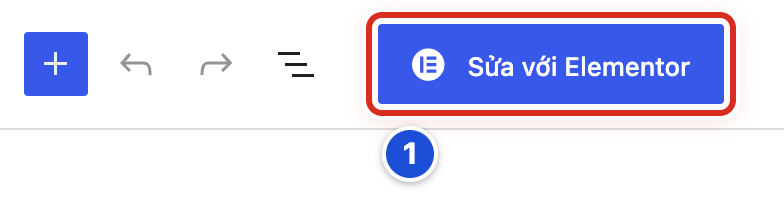

# Phần phụ lục

## Phụ lục C Elementor nâng cao không bắt buộc

Elementor là một plugin dựng trang bằng cách kéo thả. Plugin này đang bật trên website mẫu, nên nút **Sửa với Elementor** hiện ở mọi bài và trang. Tuy vậy, các bài và trang của website mẫu đều viết bằng trình soạn thường (Gutenberg). Công việc hằng ngày **không dùng Elementor**. Chỉ làm Bài C.02–C.04 khi có nhiệm vụ đã được duyệt và có người phụ trách kỹ thuật đi cùng.

### Bài C.01 Nhận biết trang có dùng Elementor hay không

**Nhãn:** Nên biết · 🟡 Cẩn thận

#### Mục đích

Biết một trang đang làm bằng trình soạn thường hay bằng Elementor, để mở đúng công cụ. Mở nhầm có thể làm hỏng bố cục trang.

#### Trước khi bắt đầu

Mở **Trang → Tất cả các trang**. Bài này chỉ xem, không lưu gì.

#### Các bước thực hiện

1. **Bước 1:** Nhìn chữ sau tên từng trang. Trang làm bằng Elementor thường có thêm chữ “— Elementor”.
2. **Bước 2:** Mở trang cần kiểm tra bằng **Chỉnh sửa**.
3. **Bước 3:** Nhìn vùng nội dung. Thấy các khối chữ, ảnh bình thường là trang làm bằng trình soạn thường.
4. **Bước 4:** Nếu vùng nội dung bị thay bằng một khung Elementor và nút **Quay trở lại trình chỉnh sửa trong WordPress**, trang đang làm bằng Elementor. Dừng lại, không sửa.
5. **Bước 5:** Thoát trang mà không bấm lưu.

#### Ảnh minh họa

*Hình C.01 Nút xanh Sửa với Elementor (số 1) trên thanh trên cùng. Nút hiện ở mọi bài và trang, kể cả trang không làm bằng Elementor.*

#### Kết quả

Bạn sẽ biết trang đang dùng trình soạn nào. Với website mẫu, bạn sẽ thấy các trang đều làm bằng trình soạn thường.

#### Lưu ý

- Nút **Sửa với Elementor** có mặt không có nghĩa là trang dùng Elementor. Nút chỉ cho biết plugin đang bật.
- Trang làm bằng Elementor phải sửa bằng Elementor. Trang làm bằng trình soạn thường phải sửa bằng trình soạn thường.

#### Không nên làm

- Không bấm **Sửa với Elementor** để “xem thử”, nhất là ở trang **Trang chủ**.
- Không bấm **Quay trở lại trình chỉnh sửa trong WordPress** trên trang làm bằng Elementor. Bố cục có thể bị mất.

#### Nếu gặp lỗi

- Không chắc trang dùng trình soạn nào → không lưu gì. Gửi tên trang và ảnh chụp màn hình cho người phụ trách kỹ thuật.
- Lỡ bấm **Sửa với Elementor** → không bấm gì trong Elementor. Đóng tab trình duyệt và báo người phụ trách kỹ thuật.

### Bài C.02 Mở bản nháp mẫu khi có nhiệm vụ Elementor đã duyệt

**Nhãn:** Kỹ thuật dành cho quản trị viên · 🟡 Cẩn thận

#### Mục đích

Mở Elementor đúng cách cho một nhiệm vụ thiết kế đã được duyệt. Luôn làm trên một bản nháp riêng, không làm thẳng trên trang đang chạy.

#### Trước khi bắt đầu

- Có nhiệm vụ rõ ràng, đã được người chịu trách nhiệm website đồng ý.
- Người phụ trách kỹ thuật đã tạo sẵn một trang **Bản nháp** riêng cho nhiệm vụ. Trang này không nằm trong menu và không phải trang chủ.
- Đăng nhập bằng tài khoản được giao cho nhiệm vụ.

#### Các bước thực hiện

1. **Bước 1:** Mở **Trang → Tất cả các trang** và tìm bản nháp được giao.
2. **Bước 2:** Kiểm tra sau tên trang có chữ “— Bản nháp”.
3. **Bước 3:** Mở trang bằng **Chỉnh sửa**.
4. **Bước 4:** Ở cột phải, kiểm tra lại **Trạng thái** là **Bản nháp**.
5. **Bước 5:** Bấm nút xanh **Sửa với Elementor** (Hình C.01, số 1).
6. **Bước 6:** Chờ Elementor tải xong: bảng công cụ bên trái, trang đang sửa ở giữa.

#### Ảnh minh họa

Xem Hình C.01, số 1: nút **Sửa với Elementor** trên thanh trên cùng của trình soạn bài.

#### Kết quả

Bạn sẽ thấy bản nháp mở trong Elementor. Trang thật của website không bị ảnh hưởng.

#### Lưu ý

- Lần đầu mở, Elementor có thể hiện cửa sổ giới thiệu. Đọc rồi đóng lại.
- Bên trái là bảng công cụ, có các tab **Nội dung**, **Kiểu hiển thị**, **Nâng cao** khi chọn một phần tử.

#### Không nên làm

- Không mở Elementor trên trang đang có trong menu hoặc đang là trang chủ.
- Không bấm **Xuất bản** trong Elementor khi đang thực hành.

#### Nếu gặp lỗi

- Elementor tải mãi không xong → tải lại trang một lần. Vẫn không được thì đóng tab và báo người phụ trách kỹ thuật.
- Bản nháp được giao không có trong danh sách → hỏi lại người phụ trách kỹ thuật. Không tự tạo trang mới.
- Elementor báo lỗi hoặc hiện trang trắng → không bấm gì thêm. Chụp màn hình và báo người phụ trách kỹ thuật.

### Bài C.03 Sửa chữ và ảnh trong nhiệm vụ nâng cao

**Nhãn:** Kỹ thuật dành cho quản trị viên · 🟡 Cẩn thận

#### Mục đích

Sửa chữ hoặc thay ảnh trong một phần tử của trang Elementor, mà không làm xáo trộn bố cục.

#### Trước khi bắt đầu

Đã mở bản nháp trong Elementor (Bài C.02). Biết rõ phần tử nào cần sửa.

#### Các bước thực hiện

1. **Bước 1:** Bấm vào đoạn chữ hoặc ảnh cần sửa ở vùng giữa. Bảng bên trái chuyển sang cài đặt của phần tử đó.
2. **Bước 2:** Ở tab **Nội dung** của bảng trái, sửa chữ.
3. **Bước 3:** Với ảnh, bấm vào ô ảnh trong tab **Nội dung** và chọn ảnh mới từ **Thư viện**.
4. **Bước 4:** Kiểm tra ảnh mới có mô tả (văn bản thay thế) trong Thư viện (Bài 10.04).
5. **Bước 5:** Nếu sửa nhầm, mở **Lịch sử** để quay lại bước trước.
6. **Bước 6:** Bấm **Lưu nháp** để lưu.

#### Ảnh minh họa

Bài này không cần ảnh minh họa. Nút mở Elementor xem Hình C.01.

#### Kết quả

Bạn sẽ thấy chữ hoặc ảnh mới trong bản nháp. Bố cục các phần khác giữ nguyên.

#### Lưu ý

- Chỉ sửa ở tab **Nội dung**. Hai tab **Kiểu hiển thị** và **Nâng cao** đổi màu, khoảng cách, vị trí.
- Một số cài đặt chỉ áp dụng cho một loại màn hình (máy tính, máy tính bảng, điện thoại). Xem kỹ biểu tượng màn hình trước khi sửa.

#### Không nên làm

- Không xoá các khung bao ngoài phần tử. Cả mảng nội dung có thể mất theo.
- Không kéo thả phần tử sang chỗ khác nếu nhiệm vụ không yêu cầu.

#### Nếu gặp lỗi

- Lỡ xoá một phần tử → mở **Lịch sử** và chọn bước ngay trước khi xoá.
- Chữ hiện đúng ở máy tính nhưng lệch ở điện thoại → không tự chỉnh. Ghi lại và báo người phụ trách kỹ thuật.
- Không chọn được phần tử cần sửa → phần tử có thể bị khung khác che. Hỏi người phụ trách kỹ thuật.

### Bài C.04 Xem trước cập nhật và thoát an toàn

**Nhãn:** Kỹ thuật dành cho quản trị viên · 🟡 Cẩn thận

#### Mục đích

Kiểm tra kết quả trên các cỡ màn hình, lưu đúng trạng thái và thoát Elementor an toàn.

#### Trước khi bắt đầu

Đã sửa xong bản nháp (Bài C.03). Biết trang cần giữ là **Bản nháp** hay đã được duyệt để đăng.

#### Các bước thực hiện

1. **Bước 1:** Bấm biểu tượng chọn màn hình để xem trang ở cỡ máy tính, máy tính bảng và điện thoại.
2. **Bước 2:** Bấm **Xem trước thay đổi** để mở trang trong tab mới.
3. **Bước 3:** Ở tab mới, bấm thử các liên kết và xem ảnh. Xong thì đóng tab.
4. **Bước 4:** Bấm **Lưu nháp**.
5. **Bước 5:** Chỉ bấm **Xuất bản** hoặc **Cập nhật** khi người phụ trách đã duyệt.
6. **Bước 6:** Mở menu Elementor (biểu tượng Elementor góc trên) và chọn **Thoát ra WordPress**.
7. **Bước 7:** Ở danh sách trang, kiểm tra trạng thái của trang đúng như mong muốn.

#### Ảnh minh họa

Bài này không cần ảnh minh họa.

#### Kết quả

Bạn sẽ thấy trang được lưu đúng trạng thái và bạn đã trở lại trang quản trị WordPress.

#### Lưu ý

- Đọc kỹ chữ trên nút lưu trước khi bấm. Nút có thể ghi **Xuất bản** dù trang đang là bản nháp.
- Chờ Elementor lưu xong rồi mới thoát.

#### Không nên làm

- Không đóng tab trình duyệt khi Elementor đang lưu.
- Không bấm **Xuất bản** để “xem cho nhanh”. Dùng **Xem trước thay đổi**.

#### Nếu gặp lỗi

- Lỡ bấm **Xuất bản** trên bản nháp → báo ngay người phụ trách kỹ thuật để đưa trang về bản nháp.
- Trang ngoài website khác với bản xem trước → không lưu thêm. Ghi lại thiết bị đang xem và báo người phụ trách kỹ thuật.
- Không tìm thấy **Thoát ra WordPress** → lưu nháp xong rồi đóng tab và mở lại trang quản trị.

### Bài C.05 Không chuyển trang Gutenberg đang dùng sang Elementor

**Nhãn:** Bắt buộc học · 🔴 Không tự thay đổi

#### Mục đích

Giữ an toàn cho các trang đang làm bằng trình soạn thường. Chuyển một trang sang Elementor có thể làm mất bố cục và khó quay lại như cũ.

#### Trước khi bắt đầu

Biết trang đang dùng trình soạn nào (Bài C.01). Không thực hành trên trang thật.

#### Các bước thực hiện

1. **Bước 1:** Với trang đang chạy như **Trang chủ** hay **Liên hệ**, chỉ sửa bằng trình soạn thường.
2. **Bước 2:** Không bấm **Sửa với Elementor** chỉ để thêm hiệu ứng hay đổi màu.
3. **Bước 3:** Khi muốn làm lại một trang, báo người chịu trách nhiệm website và người phụ trách kỹ thuật.
4. **Bước 4:** Để người phụ trách kỹ thuật tạo bản nháp riêng và làm trên đó (Bài C.02).
5. **Bước 5:** Chỉ thay trang thật sau khi bản nháp đã được duyệt và có kế hoạch quay lại nếu lỗi.

#### Ảnh minh họa

Bài này không cần ảnh minh họa. Nút cần tránh xem Hình C.01.

#### Kết quả

Bạn sẽ thấy các trang đang chạy giữ nguyên bố cục, không bị Elementor ghi đè.

#### Lưu ý

- Trang **Trang chủ** dùng mẫu trang **Trang Chủ** của giao diện. Nội dung trang chủ chỉnh ở **Thiết lập giao diện**, không chỉnh bằng Elementor (Bài 12.02).
- Chuyển qua lại giữa hai trình soạn không phải lúc nào cũng giữ được nội dung.

#### Không nên làm

- Không dùng **Trang chủ** để thử Elementor.
- Không bật hay tắt plugin Elementor (Phụ lục E.02).

#### Nếu gặp lỗi

- Lỡ mở trang thật bằng Elementor và đã bấm lưu → dừng ngay. Ghi lại giờ và báo người phụ trách kỹ thuật.
- Trang bỗng hiện bố cục lạ sau khi ai đó mở Elementor → không sửa thêm ở cả hai trình soạn. Báo người phụ trách kỹ thuật (Bài 24.07).
