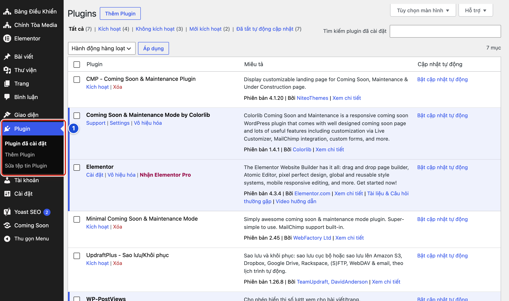
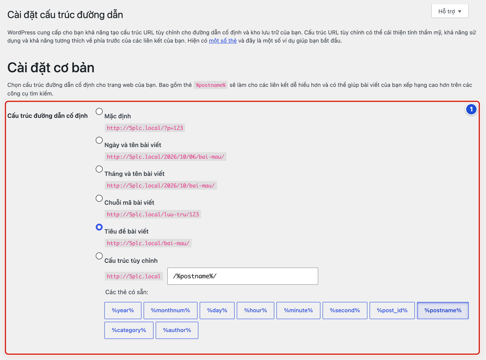

# Phần phụ lục

## Phụ lục E Bảo trì kỹ thuật

### Bài E.01 Kiểm tra cập nhật mà chưa cài

**Nhãn:** Kỹ thuật dành cho quản trị viên · 🟡 Cẩn thận

#### Mục đích

Biết plugin nào đang có phiên bản mới, để báo người phụ trách kỹ thuật. Chỉ xem, không bấm cập nhật.

#### Trước khi bắt đầu

Đăng nhập bằng tài khoản **Quản lý**. Bảng Điều Khiển của giao diện Chính Tòa Media không có mục **Cập nhật**. Bạn xem thông tin cập nhật ở trang Plugin.

#### Các bước thực hiện

1. **Bước 1:** Bấm **Plugin → Plugin đã cài đặt** ở menu trái.
2. **Bước 2:** Nhìn dòng lọc phía trên bảng. Nếu có mục **Có bản cập nhật**, bấm vào đó để chỉ xem các plugin có bản mới.
3. **Bước 3:** Đọc dòng thông báo dưới tên plugin, dạng “Đã có phiên bản mới cho …”.
4. **Bước 4:** Ghi lại tên plugin, phiên bản đang dùng (dòng “Phiên bản …”) và phiên bản mới.
5. **Bước 5:** Gửi danh sách này cho người phụ trách kỹ thuật.

#### Ảnh minh họa

Xem Hình E.02: số 1 là menu **Plugin** với mục **Plugin đã cài đặt**. Mỗi plugin có dòng “Phiên bản …” trong cột **Miêu tả**.

#### Kết quả

Bạn sẽ có danh sách plugin cần cập nhật, gửi người phụ trách kỹ thuật. Website không bị thay đổi gì.

#### Lưu ý

- Ngày 06/10/2026, website mẫu dùng WordPress 7.1, giao diện Chính Tòa Media 1.1.0, Elementor 4.3.4, Yoast SEO 28.6, WP-PostViews 2.0.1.
- Cột **Cập nhật tự động** đang tắt cho mọi plugin. Đây là cài đặt cố ý.
- Giao diện cần plugin WP-PostViews để đếm lượt xem. Cập nhật plugin này cần kiểm tra lại số lượt xem sau đó.

#### Không nên làm

- Không bấm liên kết **nâng cấp ngay** trong dòng thông báo.
- Không bấm **Bật cập nhật tự động**.
- Không cập nhật hàng loạt bằng ô **Hành động hàng loạt**.

#### Nếu gặp lỗi

- Không thấy menu **Plugin** → bạn đang dùng tài khoản Biên tập viên. Việc này dành cho Quản lý.
- Lỡ bấm **nâng cấp ngay** → không bấm thêm gì. Chờ trang chạy xong, mở website kiểm tra và báo người phụ trách kỹ thuật.
- Trang Plugin báo lỗi kết nối hay lỗi bản quyền → chụp màn hình gửi người phụ trách kỹ thuật. Không tải plugin từ nguồn lạ.

### Bài E.02 Plugin theme và trình sửa tệp là khu vực đỏ

**Nhãn:** Kỹ thuật dành cho quản trị viên · 🔴 Không tự thay đổi

#### Mục đích

Nhận biết các khu vực có thể làm website ngừng chạy chỉ sau một cú bấm: trang Plugin, trang Giao diện và hai trình sửa tệp.

#### Trước khi bắt đầu

Đăng nhập bằng tài khoản **Quản lý**. Bài này chỉ để nhận biết. Việc thay đổi do người phụ trách kỹ thuật làm.

#### Các bước thực hiện

1. **Bước 1:** Mở **Plugin → Plugin đã cài đặt** (số 1) và chỉ xem danh sách.
2. **Bước 2:** Nhận biết plugin đang bật: dưới tên có liên kết **Vô hiệu hóa**. Không bấm liên kết này.
3. **Bước 3:** Nhận biết plugin đang tắt: dưới tên có liên kết **Kích hoạt** và **Xóa**. Không bấm hai liên kết này.
4. **Bước 4:** Không mở **Plugin → Sửa tệp tin Plugin** và **Giao diện → Sửa tệp tin giao diện**.
5. **Bước 5:** Không bấm **Thêm Plugin** để cài plugin mới.
6. **Bước 6:** Không đổi sang giao diện khác ở **Giao diện → Giao diện**.
7. **Bước 7:** Khi cần thay đổi bất cứ điều gì ở đây, gửi yêu cầu cho người phụ trách kỹ thuật.

#### Ảnh minh họa

*Hình E.02 Trang Plugin. Số 1: menu Plugin với Plugin đã cài đặt, Thêm Plugin và Sửa tệp tin Plugin.*

#### Kết quả

Bạn sẽ nhận ra các khu vực đỏ và để nguyên chúng. Website tiếp tục chạy ổn định.

#### Lưu ý

- Website mẫu đang bật Elementor, Yoast SEO và WP-PostViews. Newsletter, UpdraftPlus và Web Accessibility đang tắt.
- Không tắt WP-PostViews. Giao diện dùng plugin này để đếm và hiện lượt xem.
- Plugin đang tắt có thể vẫn giữ dữ liệu. Không xoá chỉ vì thấy nó không dùng.

#### Không nên làm

- Không sửa tệp giao diện hay plugin trong trang quản trị. Một lỗi gõ nhỏ có thể làm cả website trắng trang.
- Không bật hay tắt plugin để “thử xem có sửa được lỗi không”.

#### Nếu gặp lỗi

- Lỡ bấm **Vô hiệu hóa** một plugin → báo người phụ trách kỹ thuật, kèm tên plugin và giờ bấm. Không thử bật tắt thêm plugin khác.
- Lỡ mở trình sửa tệp (có bảng cảnh báo với nút **Tôi hiểu**) → đóng trang, không bấm **Cập nhật tập tin**.
- Website trắng trang sau khi đổi gì đó ở đây → dừng mọi thao tác và làm theo Bài 24.07.

### Bài E.03 Cấu trúc đường dẫn và thiết lập hệ thống không tự thay đổi

**Nhãn:** Kỹ thuật dành cho quản trị viên · 🔴 Không tự thay đổi

#### Mục đích

Nhận biết các thiết lập ảnh hưởng tới địa chỉ của mọi bài viết và giờ của cả website. Đổi sai có thể làm hỏng mọi liên kết đã chia sẻ.

#### Trước khi bắt đầu

Đăng nhập bằng tài khoản **Quản lý**. Bài này chỉ xem, không lưu.

#### Các bước thực hiện

1. **Bước 1:** Mở **Cài đặt → Cấu trúc đường dẫn**.
2. **Bước 2:** Xem nhóm **Cài đặt cơ bản**. Ở dòng **Cấu trúc đường dẫn cố định**, ghi lại lựa chọn đang chọn (website mẫu chọn **Tiêu đề bài viết**).
3. **Bước 3:** Rời trang mà không bấm **Lưu thay đổi**.
4. **Bước 4:** Mở **Cài đặt → Tổng quan** và chỉ xem. Không đổi **Địa chỉ WordPress (URL)**, **Địa chỉ trang web (URL)** và **Múi giờ**.
5. **Bước 5:** Ở **Cài đặt → Tổng quan**, không tích ô **Ai cũng có thể đăng ký** và không đổi **Vai trò của thành viên mới**.
6. **Bước 6:** Không đổi **Cài đặt → Đọc** khi chưa có kế hoạch (Bài 12.04).

#### Ảnh minh họa

*Hình E.03 Trang Cài đặt cấu trúc đường dẫn. Số 1: nhóm Cài đặt cơ bản, dòng Cấu trúc đường dẫn cố định đang chọn Tiêu đề bài viết.*

#### Kết quả

Bạn sẽ biết cấu trúc đường dẫn và các thiết lập hệ thống hiện tại. Không có gì bị thay đổi.

#### Lưu ý

- Đổi cấu trúc đường dẫn là đổi địa chỉ của mọi bài. Các liên kết đã chia sẻ trên Facebook, Zalo sẽ hỏng.
- Đổi múi giờ làm sai giờ đăng của mọi bài hẹn giờ, kể cả bài Lời Chúa.
- Đổi **Địa chỉ WordPress (URL)** sai có thể làm không ai đăng nhập được nữa.

#### Không nên làm

- Không bấm **Lưu thay đổi** ở trang **Cấu trúc đường dẫn** chỉ để “làm mới”.
- Không đổi đường dẫn chung để sửa một bài bị lỗi không tìm thấy. Kiểm tra bài đó trước (Bài 23.01).

#### Nếu gặp lỗi

- Lỡ đổi cấu trúc đường dẫn → chọn lại đúng lựa chọn cũ (**Tiêu đề bài viết**), bấm **Lưu thay đổi** một lần và báo người phụ trách kỹ thuật.
- Sau khi ai đó đổi thiết lập, mọi bài đều báo không tìm thấy → dừng lại, ghi giờ phát hiện và báo người phụ trách kỹ thuật (Bài 24.07).
- Giờ đăng của bài bỗng lệch vài tiếng → có thể múi giờ đã bị đổi. Báo người phụ trách kỹ thuật, không tự sửa.

### Bài E.04 Biên bản bàn giao thông tin cho người hỗ trợ kỹ thuật

**Nhãn:** Kỹ thuật dành cho quản trị viên · 🟢 An toàn

#### Mục đích

Ghi đủ thông tin khi báo lỗi, để người hỗ trợ kỹ thuật hiểu nhanh và sửa đúng. Thông tin rõ ràng giúp tiết kiệm nhiều lần hỏi qua hỏi lại.

#### Trước khi bắt đầu

Biết kênh liên lạc với người phụ trách kỹ thuật (điện thoại, email hoặc nhóm chat riêng).

#### Các bước thực hiện

1. **Bước 1:** Ghi tên ngắn của sự cố, ví dụ “Khối Lời Chúa hôm nay không đổi bài”.
2. **Bước 2:** Ghi giờ và ngày phát hiện.
3. **Bước 3:** Chép địa chỉ trang bị lỗi từ thanh địa chỉ của trình duyệt.
4. **Bước 4:** Ghi bạn vừa làm gì trước khi lỗi xảy ra: mở trang nào, bấm nút nào.
5. **Bước 5:** Ghi điều bạn mong thấy và điều thực tế đang thấy.
6. **Bước 6:** Chụp màn hình chỗ lỗi, gồm cả dòng báo lỗi nếu có.
7. **Bước 7:** Ghi máy đang dùng (máy tính hay điện thoại) và trình duyệt (Chrome, Safari, Cốc Cốc…).
8. **Bước 8:** Gửi tất cả cho người phụ trách kỹ thuật theo mẫu bên dưới.

| Mục | Cần ghi | Ví dụ |
|---|---|---|
| Sự cố | Tên ngắn | Ảnh không tải được |
| Thời gian | Giờ, ngày phát hiện | 7:30 sáng 06/10/2026 |
| Địa chỉ trang | Chép từ thanh địa chỉ | tenwebsite.com/wp-admin/media-new.php |
| Đã làm gì | Các bước ngay trước lỗi | Chọn ảnh 3 MB, bấm Chọn tệp tin |
| Mong muốn | Điều đáng lẽ xảy ra | Ảnh vào Thư viện |
| Thực tế | Điều đang thấy | Báo lỗi màu đỏ |
| Máy và trình duyệt | Loại máy, tên trình duyệt | Máy tính Windows, Chrome |
| Đã thử | Các cách đã thử | Tải lại trang, thử Cốc Cốc |

#### Ảnh minh họa

Bài này không cần ảnh minh họa.

#### Kết quả

Bạn sẽ có một tin báo lỗi đủ thông tin. Người hỗ trợ kỹ thuật đọc là hiểu, không cần hỏi lại nhiều.

#### Lưu ý

- Chụp màn hình: Windows bấm **Windows + Shift + S**; Mac bấm **Cmd + Shift + 4**; điện thoại bấm cùng lúc nút nguồn và nút giảm âm lượng.
- Chưa biết hết thông tin thì cứ gửi phần đã có, ghi rõ phần chưa biết.

#### Không nên làm

- Không gửi mật khẩu, mã xác nhận hay liên kết đặt lại mật khẩu trong tin báo lỗi.
- Không chỉ nhắn “website bị lỗi” mà không kèm thông tin gì.

#### Nếu gặp lỗi

- Người hỗ trợ cần vào trang quản trị để kiểm tra → tạo tài khoản riêng cho họ (Bài 22.02), không đưa mật khẩu của bạn.
- Lỗi xảy ra lúc có lúc không → ghi lại từng lần xảy ra, mỗi lần một dòng giờ và việc đang làm.
- Chưa có người phụ trách kỹ thuật → báo người chịu trách nhiệm website để chỉ định người lo việc này.
